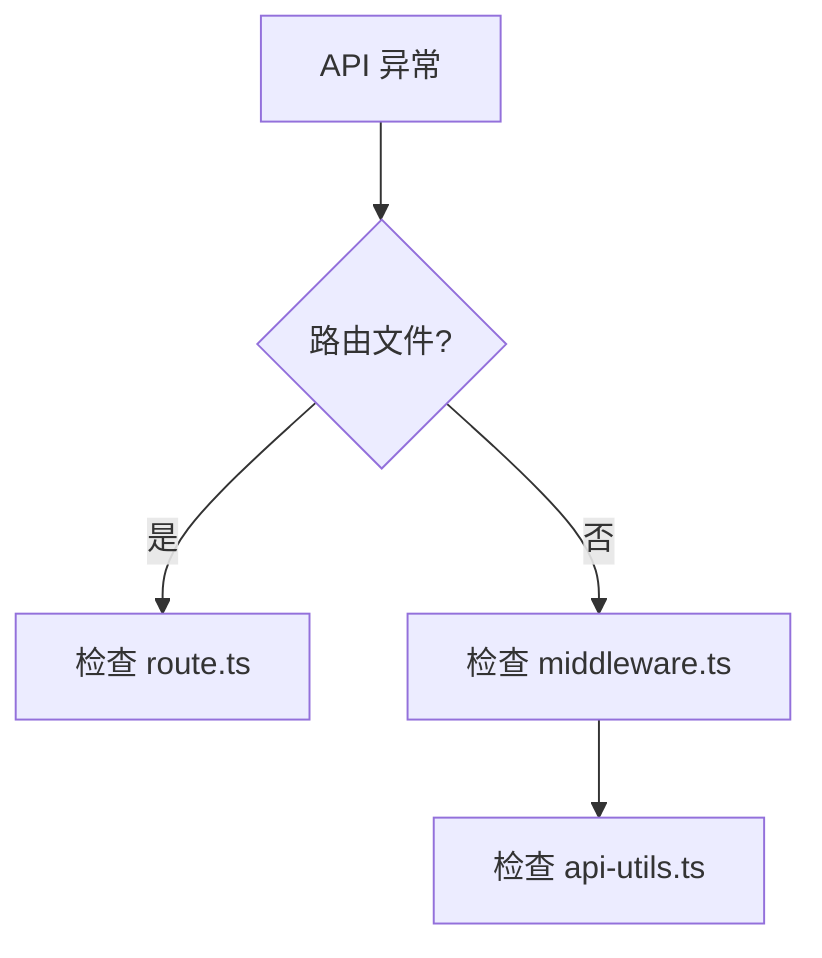

# 单元总览与复盘八：API 路由与中间件（I44—I49）

前七个单元追踪了页面路由、会话管理、消息流式响应、项目级 Agent 生命周期、统计和摘要、Skill 和 Interview、全局样式和布局。这个单元转向 API 路由与中间件。

## 0. 本页先读什么

如果只记住一句话，记住这一句：

> API 路由是 OriginOS 的后端入口，中间件是请求处理的桥梁。

## 1. 本单元覆盖的文件

| 文件 | 路径 | 作用 |
| --- | --- | --- |
| route.ts | `app/api/route.ts` | API 根路由 |
| middleware.ts | `app/middleware.ts` | 全局中间件 |
| api-utils.ts | `app/api/utils.ts` | API 工具函数 |

## 2. API 路由

### 2.1 route.ts

打开 `app/api/route.ts`：

```ts
export async function GET() {
  return Response.json({ message: 'Hello, World!' });
}
```

### 2.2 核心逻辑

1. **HTTP 方法**：`GET`, `POST`, `PUT`, `DELETE` 等。
2. **响应格式**：`Response.json()` 返回 JSON 响应。

## 3. 中间件

### 3.1 middleware.ts

打开 `app/middleware.ts`：

```ts
import { NextResponse } from 'next/server';

export function middleware(request: Request) {
  return NextResponse.next();
}
```

### 3.2 核心逻辑

1. **请求拦截**：在请求到达路由前执行。
2. **响应处理**：在响应返回前执行。

## 4. API 工具函数

### 4.1 api-utils.ts

打开 `app/api/utils.ts`：

```ts
export function createResponse(data: unknown) {
  return Response.json(data);
}
```

### 4.2 核心逻辑

1. **响应封装**：统一响应格式。
2. **错误处理**：统一错误处理。

## 5. 六节课连成一条因果链

I44—I49 不是六个孤立文件介绍。它们按"从路由到中间件到工具"的顺序推进。

| 课次 | 本课解决的判断问题 | 核心源码锚点 | 学完后的判断能力 |
| --- | --- | --- | --- |
| I44 | API 根路由如何处理请求 | `app/api/route.ts` | 能理解 API 路由的基本原理 |
| I45 | 中间件如何拦截请求 | `app/middleware.ts` | 能理解中间件的工作原理 |
| I46 | API 工具函数如何封装 | `app/api/utils.ts` | 能理解 API 工具函数的作用 |
| I47 | 错误处理如何实现 | `app/api/utils.ts` | 能理解错误处理的原理 |
| I48 | 请求验证如何实现 | `app/api/utils.ts` | 能理解请求验证的原理 |
| I49 | 如何验证 API 路由和中间件 | 复用上述文件 | 能根据现象定位 API 问题 |

## 6. 源码覆盖台账

| 课次 | 已直接精读的生产源码 | 配对测试或验证入口 | 本单元只证明什么 |
| --- | --- | --- | --- |
| I44 | `app/api/route.ts` | 无单元测试 | API 路由的基本原理 |
| I45 | `app/middleware.ts` | 无单元测试 | 中间件的工作原理 |
| I46 | `app/api/utils.ts` | 无单元测试 | API 工具函数的作用 |
| I47 | `app/api/utils.ts` | 无单元测试 | 错误处理的原理 |
| I48 | `app/api/utils.ts` | 无单元测试 | 请求验证的原理 |
| I49 | 不新增生产逻辑；复用上述文件 | 纸面推演 + 运行观察 | 把 API 知识转成可验证的排查能力 |

## 7. 异常排查

当小林说"API 请求失败""中间件不生效"时，最稳的排查方式是先确认路由文件，再确认中间件文件。



排查口诀：

1. 先看路由文件，确认请求处理。
2. 再看中间件文件，确认拦截逻辑。
3. 最后检查工具函数，确认封装逻辑。

## 8. 口头验收

学完 I44—I49 后，不看正文也应能回答：

1. API 路由如何处理请求？
2. 中间件如何拦截请求？
3. 如果 API 请求失败，应该按什么顺序排查？

合格回答不要求背诵源码行号，但必须能说出 API 路由和中间件的责任边界。

## 9. 进入下一单元

I44—I49 建立的是 API 路由和中间件的完整链路。下一组课程会继续追踪更高级的 API 模式。

因此，本单元的结论可以压缩成一句话：

> API 路由是 OriginOS 的后端入口，中间件是请求处理的桥梁，先看路由文件，再看中间件文件，最后检查工具函数。
