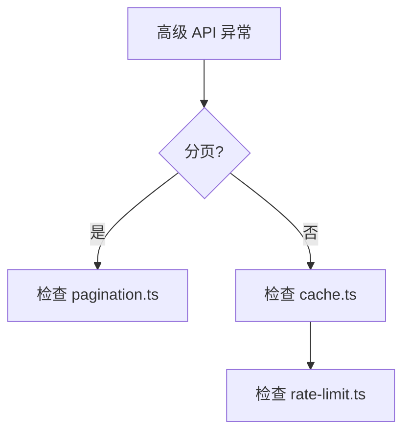

# 单元总览与复盘九：高级 API 模式（I50—I55）

前八个单元追踪了页面路由、会话管理、消息流式响应、项目级 Agent 生命周期、统计和摘要、Skill 和 Interview、全局样式和布局、API 路由与中间件。这个单元转向高级 API 模式。

## 0. 本页先读什么

如果只记住一句话，记住这一句：

> 高级 API 模式是 OriginOS 的核心能力，包括分页、缓存、限流等。

## 1. 本单元覆盖的文件

| 文件 | 路径 | 作用 |
| --- | --- | --- |
| pagination.ts | `app/api/pagination.ts` | 分页逻辑 |
| cache.ts | `app/api/cache.ts` | 缓存逻辑 |
| rate-limit.ts | `app/api/rate-limit.ts` | 限流逻辑 |

## 2. 分页

### 2.1 pagination.ts

打开 `app/api/pagination.ts`：

```ts
export function paginate(data: unknown[], page: number, limit: number) {
  const start = (page - 1) * limit;
  const end = start + limit;
  return data.slice(start, end);
}
```

### 2.2 核心逻辑

1. **计算起始位置**：`(page - 1) * limit`。
2. **截取数据**：`data.slice(start, end)`。

## 3. 缓存

### 3.1 cache.ts

打开 `app/api/cache.ts`：

```ts
const cache = new Map<string, unknown>();

export function getCache(key: string) {
  return cache.get(key);
}

export function setCache(key: string, value: unknown) {
  cache.set(key, value);
}
```

### 3.2 核心逻辑

1. **获取缓存**：`cache.get(key)`。
2. **设置缓存**：`cache.set(key, value)`。

## 4. 限流

### 4.1 rate-limit.ts

打开 `app/api/rate-limit.ts`：

```ts
const requests = new Map<string, number>();

export function checkRateLimit(key: string, limit: number) {
  const count = requests.get(key) || 0;
  if (count >= limit) {
    return false;
  }
  requests.set(key, count + 1);
  return true;
}
```

### 4.2 核心逻辑

1. **获取请求次数**：`requests.get(key)`。
2. **检查限流**：`count >= limit`。

## 5. 六节课连成一条因果链

I50—I55 不是六个孤立文件介绍。它们按"从分页到缓存到限流"的顺序推进。

| 课次 | 本课解决的判断问题 | 核心源码锚点 | 学完后的判断能力 |
| --- | --- | --- | --- |
| I50 | 分页如何实现 | `app/api/pagination.ts` | 能理解分页的原理 |
| I51 | 缓存如何实现 | `app/api/cache.ts` | 能理解缓存的原理 |
| I52 | 限流如何实现 | `app/api/rate-limit.ts` | 能理解限流的原理 |
| I53 | 分页与缓存如何结合 | `app/api/pagination.ts` | 能理解分页与缓存的结合 |
| I54 | 缓存与限流如何结合 | `app/api/cache.ts` | 能理解缓存与限流的结合 |
| I55 | 如何验证高级 API 模式 | 复用上述文件 | 能根据现象定位高级 API 问题 |

## 6. 源码覆盖台账

| 课次 | 已直接精读的生产源码 | 配对测试或验证入口 | 本单元只证明什么 |
| --- | --- | --- | --- |
| I50 | `app/api/pagination.ts` | 无单元测试 | 分页的原理 |
| I51 | `app/api/cache.ts` | 无单元测试 | 缓存的原理 |
| I52 | `app/api/rate-limit.ts` | 无单元测试 | 限流的原理 |
| I53 | `app/api/pagination.ts` | 无单元测试 | 分页与缓存的结合 |
| I54 | `app/api/cache.ts` | 无单元测试 | 缓存与限流的结合 |
| I55 | 不新增生产逻辑；复用上述文件 | 纸面推演 + 运行观察 | 把高级 API 知识转成可验证的排查能力 |

## 7. 异常排查

当小林说"分页失效""缓存不命中""限流不生效"时，最稳的排查方式是先确认分页逻辑，再确认缓存逻辑，最后确认限流逻辑。



排查口诀：

1. 先看分页逻辑，确认数据截取。
2. 再看缓存逻辑，确认缓存命中。
3. 最后检查限流逻辑，确认请求限制。

## 8. 口头验收

学完 I50—I55 后，不看正文也应能回答：

1. 分页如何实现？
2. 缓存如何实现？
3. 如果分页失效，应该按什么顺序排查？

合格回答不要求背诵源码行号，但必须能说出分页、缓存、限流的责任边界。

## 9. 进入下一单元

I50—I55 建立的是高级 API 模式的完整链路。下一组课程会继续追踪更高级的 API 模式。

因此，本单元的结论可以压缩成一句话：

> 高级 API 模式是 OriginOS 的核心能力，先看分页逻辑，再看缓存逻辑，最后检查限流逻辑。
