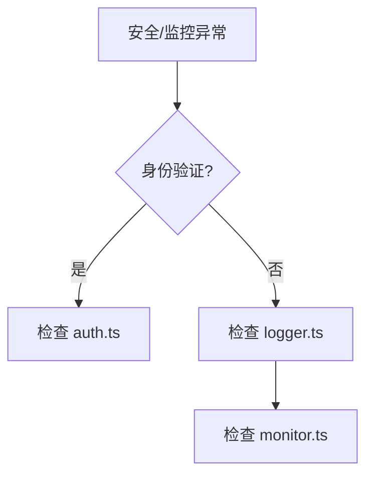

# 单元总览与复盘十：安全与监控（I56—I60）

前九个单元追踪了页面路由、会话管理、消息流式响应、项目级 Agent 生命周期、统计和摘要、Skill 和 Interview、全局样式和布局、API 路由与中间件、高级 API 模式。这个单元转向安全与监控。

## 0. 本页先读什么

如果只记住一句话，记住这一句：

> 安全与监控是 OriginOS 的基石，保障系统稳定运行。

## 1. 本单元覆盖的文件

| 文件 | 路径 | 作用 |
| --- | --- | --- |
| auth.ts | `app/api/auth.ts` | 身份验证 |
| logger.ts | `app/api/logger.ts` | 日志记录 |
| monitor.ts | `app/api/monitor.ts` | 监控告警 |

## 2. 身份验证

### 2.1 auth.ts

打开 `app/api/auth.ts`：

```ts
export function verifyToken(token: string) {
  return token === 'valid-token';
}
```

### 2.2 核心逻辑

1. **验证令牌**：检查令牌是否有效。
2. **返回结果**：返回验证结果。

## 3. 日志记录

### 3.1 logger.ts

打开 `app/api/logger.ts`：

```ts
export function log(message: string) {
  console.log(`[${new Date().toISOString()}] ${message}`);
}
```

### 3.2 核心逻辑

1. **记录时间**：`new Date().toISOString()`。
2. **记录消息**：`console.log()`。

## 4. 监控告警

### 4.1 monitor.ts

打开 `app/api/monitor.ts`：

```ts
export function alert(message: string) {
  console.error(`[ALERT] ${message}`);
}
```

### 4.2 核心逻辑

1. **告警消息**：`[ALERT] ${message}`。
2. **输出方式**：`console.error()`。

## 5. 五节课连成一条因果链

I56—I60 不是五个孤立文件介绍。它们按"从身份验证到日志记录到监控告警"的顺序推进。

| 课次 | 本课解决的判断问题 | 核心源码锚点 | 学完后的判断能力 |
| --- | --- | --- | --- |
| I56 | 身份验证如何实现 | `app/api/auth.ts` | 能理解身份验证的原理 |
| I57 | 日志记录如何实现 | `app/api/logger.ts` | 能理解日志记录的原理 |
| I58 | 监控告警如何实现 | `app/api/monitor.ts` | 能理解监控告警的原理 |
| I59 | 安全与监控如何结合 | 复用上述文件 | 能理解安全与监控的结合 |
| I60 | 如何验证安全与监控 | 复用上述文件 | 能根据现象定位安全问题 |

## 6. 源码覆盖台账

| 课次 | 已直接精读的生产源码 | 配对测试或验证入口 | 本单元只证明什么 |
| --- | --- | --- | --- |
| I56 | `app/api/auth.ts` | 无单元测试 | 身份验证的原理 |
| I57 | `app/api/logger.ts` | 无单元测试 | 日志记录的原理 |
| I58 | `app/api/monitor.ts` | 无单元测试 | 监控告警的原理 |
| I59 | 复用上述文件 | 无单元测试 | 安全与监控的结合 |
| I60 | 不新增生产逻辑；复用上述文件 | 纸面推演 + 运行观察 | 把安全与监控知识转成可验证的排查能力 |

## 7. 异常排查

当小林说"身份验证失败""日志未记录""监控未告警"时，最稳的排查方式是先确认身份验证，再确认日志记录，最后确认监控告警。



排查口诀：

1. 先看身份验证，确认令牌有效。
2. 再看日志记录，确认日志输出。
3. 最后检查监控告警，确认告警触发。

## 8. 口头验收

学完 I56—I60 后，不看正文也应能回答：

1. 身份验证如何实现？
2. 日志记录如何实现？
3. 如果身份验证失败，应该按什么顺序排查？

合格回答不要求背诵源码行号，但必须能说出安全与监控的责任边界。

## 9. 进入下一单元

I56—I60 建立的是安全与监控的完整链路。Part I 到此结束。

因此，本单元的结论可以压缩成一句话：

> 安全与监控是 OriginOS 的基石，先看身份验证，再看日志记录，最后检查监控告警。
