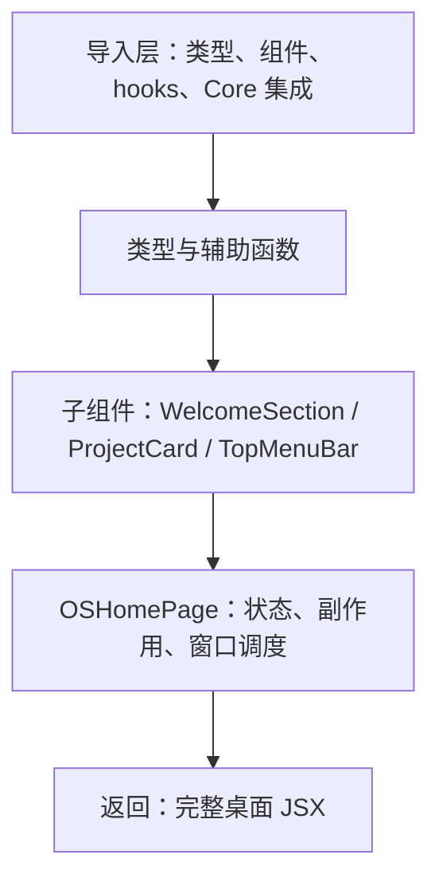

# I01：layout 与 page：桌面从这里开始渲染

小林第一次打开 OriginOS，浏览器里只有一个空标签页。地址栏输入 `http://localhost:3000` 后，标签页标题变成“OriginOS”，然后整个深色桌面铺满了屏幕：顶部菜单栏、项目卡片、应用抽屉、底部 Dock。

这一节课只解决一个问题：从 URL `/` 到屏幕上出现桌面，Next.js App Router 调用了哪些文件？它们各自承担什么责任？

## 1. 一个 URL 不是直接对应一个组件

在传统的多页网站里，一个 URL 通常对应一个 HTML 文件。Next.js App Router 保留了这个直觉，但加了一层约定：**目录结构就是路由结构**。

- `app/layout.tsx` 是根布局，所有页面共享它。
- `app/page.tsx` 是路径 `/` 的页面内容。
- `app/window/page.tsx` 是路径 `/window` 的页面内容。
- `app/dock/page.tsx` 是路径 `/dock` 的页面内容。

所以小林访问 `/` 时，Next.js 会先渲染 `layout.tsx`，再把 `page.tsx` 的内容塞进 `layout.tsx` 的 `children` 位置。这个组合决定了屏幕上最初出现什么。

## 2. 根布局：只负责最外层容器

打开 `app/layout.tsx`：

```tsx
import type { Metadata } from "next";
import "@/styles/globals.css";
import "@xyflow/react/dist/style.css";
import GlobalSpotlight from "@/components/os/GlobalSpotlight";

export const metadata: Metadata = {
  title: "OriginOS",
  description: "AI native operating system",
};

interface RootLayoutProps {
  readonly children: React.ReactNode;
}

export default function RootLayout({ children }: RootLayoutProps) {
  return (
    <html lang="en">
      <body>
        {children}
        <GlobalSpotlight />
      </body>
    </html>
  );
}
```

这段代码的责任非常集中：

1. **引入全局样式**：`@/styles/globals.css` 提供 Tailwind 基础、CSS 变量和深色/浅色主题；`@xyflow/react/dist/style.css` 为后续流程图组件提供默认样式。
2. **设置页面元数据**：浏览器标签页显示“OriginOS”。
3. **挂载全局组件**：`GlobalSpotlight` 是命令面板（Spotlight）的根节点，它需要在所有页面之上，所以放在 layout 里而不是某个页面里。
4. **提供 `children` 插槽**：`page.tsx` 的内容会放在这里。

注意它**没有**做的事情：

- 不加载项目数据。
- 不监听 Dock 事件。
- 不打开任何窗口。
- 不判断 Electron 还是 Web 环境。

这些都在 `page.tsx` 里。根布局越薄，越能说明 App Router 的分层意图。

## 3. 主页：入口、数据、事件、调度的汇合点

`app/page.tsx` 有 1500 多行，但不能把它当成“一个巨大的页面组件”。它的结构可以分为四层：



我们暂时只看顶层结构，不深入每个事件处理函数。先读文件开头的导入与主组件签名：

```tsx
'use client';

import * as React from 'react';
import { Settings, HelpCircle, Trash2, Sparkles, LayoutGrid, Network, Search, FolderOpen, Command, Clock3, Layers, Workflow, Star } from 'lucide-react';
import type { ProjectStatus, ProjectListItem } from '@originos/core/types';

import AgentInitializer from '@/components/os/AgentInitializer';
import { DesktopOnboarding } from '@/components/os/DesktopOnboarding';
// ... 更多组件导入

export default function OSHomePage() {
  const llm = useSettingsStore((state) => state.llm);
  const getEffectiveConfig = useSettingsStore((state) => state.getEffectiveConfig);
  // ...
}
```

两个关键事实立刻出现：

1. `'use client'`：这个页面在客户端运行。它依赖 `window`、React hooks、Zustand store，所以必须是一个 Client Component。
2. 导入大量组件：主页不负责实现这些组件，只负责在正确条件下挂载它们。

再看返回结构的轮廓：

```tsx
return (
  <div className="relative w-screen h-screen overflow-hidden bg-[#050816]">
    {/* 背景渐变与网格 */}
    <TopMenuBar onOpenGuide={...} onOpenSettings={...} />
    {/* 左侧系统概览 */}
    {/* 右侧工作队列 */}
    <div data-tour="main-content" className={...}>
      {/* WelcomeSection（无项目时） */}
      {/* Projects Section */}
      {/* Home Apps Section */}
      {/* User-created Agents */}
      {/* User-created Skills */}
    </div>
    {!isElectronEnv && <Dock forceExpanded={dockGuideHighlight} />}
    <AppWindowContainer />
    <SystemNotificationToastHost onActivate={handleNotificationActivation} />
    <DesktopOnboarding ... />
    <SettingsDialog open={showSettings} onClose={...} />
    <AgentInitializer />
  </div>
);
```

这段 JSX 解释了为什么主页这么大：它把“操作系统桌面”的所有可见区域都放到了一个页面里。但每个区域的具体实现都被拆到了独立组件中。

## 4. 全局样式：不是内联样式

`layout.tsx` 导入的 `@/styles/globals.css` 是 Tailwind 项目的标准入口。它声明了：

```css
@tailwind base;
@tailwind components;
@tailwind utilities;

@import './acrylic.css';
@import './fluent-animations.css';
```

这意味着：

- Tailwind 的 utilities 可用（如 `flex`、`bg-background`）。
- CSS 变量 `--background`、`--primary` 等在 `:root` 中定义，支撑深色/浅色主题。
- 亚克力材质和动画系统通过 `@import` 引入。

注意 `page.tsx` 中虽然出现了 `bg-[#050816]` 这样的任意值，但绝大部分样式使用 Tailwind 预设类。根据项目规约，禁止内联样式和 CSS Modules，必须使用 Tailwind。

## 5. 调用链：从 URL 到 DOM

把一条请求 `/` 追踪到 DOM：

```text
浏览器请求 /
  → Next.js 匹配 app/page.tsx
  → 先渲染 app/layout.tsx
    → 注入 globals.css、xyflow 样式
    → 渲染 <html><body>
    → 在 children 位置渲染 OSHomePage
      → 加载 settings、projects、user agents、user skills
      → 注册事件监听
      → 返回完整桌面 JSX
        → AppWindowContainer 准备接收窗口
        → Dock 在 Web 模式下渲染
```

这条链有两个重要边界：

1. **layout 与 page 的边界**：layout 负责所有页面共享的最外层；page 负责当前路径的完整 UI。
2. **page 与组件的边界**：page 负责“在什么条件下挂载哪个组件”，组件负责“组件内部怎么交互”。

## 6. 失败路径与常见误判

### 6.1 样式没加载

如果 `globals.css` 没有被正确导入，页面会出现纯 HTML 样式（无深色背景、无 Tailwind 布局）。排查时先检查 `layout.tsx` 的导入是否生效，而不是去改 `page.tsx`。

### 6.2 layout 里放太多副作用

如果根布局开始加载项目列表或监听窗口事件，会导致所有页面都执行这些副作用。当前实现把它们留在 `page.tsx`，符合“layout 越薄越好”的原则。

### 6.3 把 `page.tsx` 当成业务逻辑层

`page.tsx` 里有大量调用，但它本身不实现业务规则。例如它调用 `createProject`，但项目创建规则在 Core 的 `projectService` 里；它调用 `AppWindowManager`，但窗口动画在 `AppWindowContainer` 里。读 `page.tsx` 时要识别“调用点”和“实现点”的分工。

## 7. 测试证据

本节课没有直接配对的单元测试。能验证的事实来自运行观察：

| 验证动作 | 能证明 | 不能证明 |
| --- | --- | --- |
| 启动 `pnpm dev` 后访问 `/` | layout 和 page 能组合渲染 | 生产构建后的行为 |
| 检查 Elements 面板 | `GlobalSpotlight` 在 body 末尾，主页内容在 body 中间 | 所有事件监听都已正确注册 |
| 断点到 `OSHomePage` | 组件在客户端执行 | 服务端渲染阶段没有异常 |

没有测试时，要把“未证明”作为明确边界写出来。本单元小结课（I06）会要求用纸质推演弥补自动测试的缺失。

## 8. 小实验

不运行项目，回答下面问题：

1. 如果删除 `layout.tsx` 中的 `import "@/styles/globals.css"`，`/page.tsx` 的哪些样式会最先失效？
2. 如果 `GlobalSpotlight` 被移到 `page.tsx` 内部而不是放在 `layout.tsx`，对 `/window` 路径会有什么影响？
3. 为什么 `layout.tsx` 可以没有 `'use client'`，而 `page.tsx` 必须有？

参考答案：

1. Tailwind utilities 和 CSS 变量会失效，页面失去深色主题和布局类。
2. `/window` 页面不会显示 Spotlight，因为 `layout.tsx` 是所有页面共享的，而 `page.tsx` 只影响 `/`。
3. `layout.tsx` 只做服务端可完成的渲染（HTML 结构、CSS 导入、元数据），而 `page.tsx` 使用客户端 API（`window`、Zustand、事件监听）。

## 9. 章节收束

本节课建立了一个基础判断：`app/layout.tsx` 是全局外壳，`app/page.tsx` 是主桌面入口。主页之所以大，是因为它汇集了数据、事件和窗口调度，但真正的实现都下沉到了组件和 Core。

下一节课会进入 `page.tsx` 内部，追踪一次“创建项目”或“启动 Skill”的点击，如何变成一次窗口打开动作。
