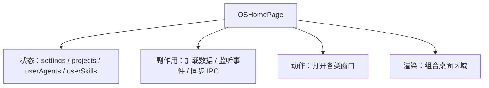

# I02：主页状态与窗口调度：一次点击如何打开窗口

上一节课我们看到，`app/page.tsx` 是 OriginOS 的主桌面入口。这节课要解决的问题是：当小林点击“创建项目”或某个 Skill 时，主页内部经历了哪些状态变化和函数调用，最终才出现一个窗口？

## 1. 主页承担四种责任

读 `page.tsx` 时，不要试图逐行读懂 1500 行代码。先把它的职责分成四类：



这节课重点看 B、C、D 三类。E 类（JSX）在 I01 已经见过轮廓，组件内部细节属于 Part J。

## 2. 状态：主页记住什么

`OSHomePage` 内部使用了多个状态源：

```tsx
export default function OSHomePage() {
  const llm = useSettingsStore((state) => state.llm);
  const getEffectiveConfig = useSettingsStore((state) => state.getEffectiveConfig);
  const llmConfigured = React.useMemo(() => hasConfiguredLLM(llm), [llm]);
  const llmConfig = React.useMemo(
    () => normalizeRuntimeLLMConfig(getEffectiveConfig()),
    [getEffectiveConfig, llm],
  );

  const [isElectronEnv, setIsElectronEnv] = React.useState(false);
  const [showDesktopOnboarding, setShowDesktopOnboarding] = React.useState(false);
  const [showSettings, setShowSettings] = React.useState(false);

  const [userAgents, setUserAgents] = React.useState<UserAgent[]>([]);
  const [userSkills, setUserSkills] = React.useState<Array<{...}>>([]);

  const { projects, isLoading: isLoadingProjects, loadProjects, createProject } = useProjects({
    autoLoad: true,
    query: {},
    refreshInterval: -1,
  });
  // ...
}
```

这些状态可以分为三层：

| 状态 | 来源 | 用途 | 生命周期 |
| --- | --- | --- | --- |
| `llm`、`llmConfig` | `useSettingsStore` | 判断 LLM 是否配置，传给协作窗口 | 全局共享 |
| `isElectronEnv` | 客户端检测 | 决定是否渲染 Web Dock、是否订阅 IPC | 组件挂载后设置 |
| `projects` | `useProjects` hook | 渲染项目卡片、打开工作区 | hook 内部管理 |
| `userAgents`、`userSkills` | 手动 `useState` + 加载函数 | 渲染用户创建的 Agent 和 Skill | 组件挂载后加载 |
| `showDesktopOnboarding`、`showSettings` | 本地 `useState` | 控制对话框显隐 | 组件级 |

注意 `useProjects` 是一个自定义 hook，它把项目列表的加载、创建、刷新封装起来。主页不直接调用 Core 的 project service，而是通过 hook 间接使用。这是 Part J 的内容，本节课只识别这个边界。

## 3. 副作用：数据加载与事件同步

主页挂载后会执行多个 `useEffect`。我们按责任归类：

### 3.1 检测运行环境

```tsx
React.useEffect(() => {
  setIsElectronEnv(isElectron());
}, []);
```

这个 effect 只在客户端执行一次。`isElectron()` 检查 `window.navigator.userAgent` 或全局变量，判断当前是否在 Electron 渲染进程中。注意：**初始值是 `false`**，所以服务端渲染和首次客户端渲染都不会把 Web 环境误判为 Electron。

### 3.2 加载用户配置决定引导页

```tsx
React.useEffect(() => {
  const loadUserConfig = async () => {
    try {
      const response = await fetch('/api/user-config');
      if (response.ok) {
        const result = await response.json();
        const config = result.data || result;
        const showOnboarding = config.preferences?.showOnboarding ?? true;
        if (showOnboarding) {
          const timer = window.setTimeout(() => setShowDesktopOnboarding(true), 650);
          return () => window.clearTimeout(timer);
        }
      }
    } catch (error) {
      // Fallback: show onboarding if config load fails
      const timer = window.setTimeout(() => setShowDesktopOnboarding(true), 650);
      return () => window.clearTimeout(timer);
    }
  };
  void loadUserConfig();
}, []);
```

这里有两个重要事实：

1. 它调用的是 `/api/user-config`，这是 Part I 后续会详细讲的 API。
2. 加载失败时默认显示引导页，这是一种防御性设计。

### 3.3 监听 Dock 动作

这是主页最复杂的 effect 之一：

```tsx
React.useEffect(() => {
  const handleDockAction = (e: Event) => {
    const detail = (e as CustomEvent).detail as DockActionDetail;
    const windowManager = AppWindowManager.getInstance();

    if (detail.action === 'create-project') {
      handleCreateProject();
      return;
    }
    if (detail.action === 'open-workspace') {
      // ...
      return;
    }
    if (detail.action === 'launch-skill' && detail.skillId) {
      handleSkillLaunch(detail.skillId, `技能: ${detail.skillId}`);
      return;
    }
    // ... 更多 action 分支
  };
  window.addEventListener('dock:action', handleDockAction);
  return () => window.removeEventListener('dock:action', handleDockAction);
});
```

注意这个 effect **没有依赖数组**。这意味着每次渲染后都会重新注册。虽然代码里每次都移除旧监听器再添加新监听器，但这种写法容易引入性能问题或闭包陷阱。阅读时要意识到：这里的 `handleDockAction` 捕获的是当前渲染时的函数引用。

Dock 动作通过 `CustomEvent('dock:action')` 分发。它可能来自：

- Web 模式下的 Dock 组件自身。
- Electron 模式下 Dock BrowserWindow 通过 IPC 转发到主进程，主进程再以 `CustomEvent` 形式注入主页。

### 3.4 监听原生窗口关闭

```tsx
React.useEffect(() => {
  if (!isElectron()) return;
  return subscribeToNativeWindowClosed((windowId) => {
    AppWindowManager.getInstance().closeWindow(windowId);
    loadUserAgents();
    loadUserSkills();
  });
}, [loadUserAgents, loadUserSkills]);
```

这个 effect 只在 Electron 环境生效。当用户关闭一个原生窗口时，主页需要同步关闭对应的 CSS 模拟窗口，并刷新用户 Agent/Skill 列表（因为它们可能随窗口关闭而变化）。

## 4. 窗口调度函数：点击的最终去向

主页上有多个函数负责打开窗口。它们的模式非常相似：

1. 准备参数（projectId、skillName、windowId 等）。
2. 调用 `AppWindowManager.getInstance().openComponentWindow(...)`。
3. 传入窗口 ID、标题、组件、props 和位置约束。

### 4.1 创建项目

```tsx
const handleCreateProject = async () => {
  const windowManager = AppWindowManager.getInstance();
  const timestamp = Date.now();
  const sessionId = `project-initialization-${timestamp}`;
  const tempName = `新项目 ${new Date(timestamp).toLocaleString('zh-CN', { ... })}`;

  let projectId: string | undefined;
  try {
    const project = await createProject({
      name: tempName,
      description: '正在进行项目访谈...',
      domain: '待确定',
    });
    projectId = project.id;
  } catch (err) {
    console.error('[HomePage] Failed to create temp project:', err);
  }

  windowManager.openComponentWindow(
    `project-interview-${projectId}`,
    tempName,
    InterviewWindow,
    { projectId, sessionId, projectName: tempName, onComplete: ... },
    {
      position: { width: windowWidth, height: windowHeight },
      constraints: { minWidth: 800, minHeight: 600 },
      metadata: { entryType: 'project', entryId: projectId, sessionId },
    }
  );
};
```

这里有一个关键细节：**即使 `createProject` 失败，`windowManager.openComponentWindow` 仍会被调用**。`projectId` 会是 `undefined`，窗口仍然会打开。这意味着项目创建失败不会阻止窗口弹出，但窗口内部可能因为缺少 `projectId` 而无法正常工作。这是一个真实的边界条件。

### 4.2 启动 Skill

```tsx
const handleSkillLaunch = (skillName: string, name: string, initialMessage?: string) => {
  const windowManager = AppWindowManager.getInstance();
  windowManager.openComponentWindow(
    `skill-${skillName}`,
    name,
    SkillDialog,
    { skillName, initialMessage: initialMessage?.trim() || '你好！...' },
    {
      position: { width: 1200, height: 800 },
      constraints: { minWidth: 600, minHeight: 400 },
      metadata: { entryType: 'skill', entryId: skillName, sessionId: `skill-${skillName}`, projectId: `skill-${skillName}` },
    }
  );
};
```

Skill 窗口的 `projectId` 被设置为 `skill-${skillName}`，这是一个虚拟项目 ID。它的含义是：Skill 对话框虽然使用项目上下文机制，但它不属于真实项目。这个设计在后续 API 边界单元会再次遇到。

### 4.3 打开工作区

```tsx
const handleOpenWorkspace = async (projectId: string) => {
  const project = projects.find(p => p.id === projectId);
  const projectName = project?.name || '项目';
  const ontologyId = (project as any)?.ontologyId;
  const windowManager = AppWindowManager.getInstance();

  windowManager.openComponentWindow(
    `workspace-${projectId}`,
    projectName,
    WorkspaceWindow,
    { projectId, projectName, ontologyId },
    {
      position: { width: 1200, height: 800 },
      constraints: { minWidth: 800, minHeight: 600 },
      metadata: { entryType: 'project', entryId: projectId, sessionId: `workspace-${projectId}`, projectId },
    }
  );
};
```

这里 `sessionId` 被设置为 `workspace-${projectId}`，与 Skill 窗口类似，是工作区的虚拟会话身份。注意同一个真实项目可以打开多个不同类型的窗口（interview、workspace、solution、collaboration），它们的 `sessionId` 不同，避免消息串流。

## 5. 调用链：从点击到窗口出现

把“点击创建项目”追踪到窗口出现：

```text
用户点击“创建项目”按钮
  → 触发 page.tsx 中的某个 onClick
  → 调用 handleCreateProject
    → 生成临时 sessionId 和 tempName
    → 调用 createProject 创建草稿项目
    → 获取 projectId（可能为 undefined）
    → 调用 AppWindowManager.openComponentWindow
      → 生成/复用 windowId
      → 在 appWindowStore 中注册窗口状态
      → AppWindowContainer 渲染 InterviewWindow 组件
        → InterviewWindow 内部加载访谈流程
```

这条链的关键边界：

- 主页只走到 `AppWindowManager.openComponentWindow`。
- `AppWindowManager` 和 `AppWindowContainer` 负责窗口生命周期（Part J）。
- `InterviewWindow` 内部会调用 `/api/interviews` 等接口（Part I 后续单元）。

## 6. 失败路径

### 6.1 项目创建成功但窗口没出现

如果 `createProject` 成功但窗口没出现，问题通常在 `AppWindowManager` 或 `AppWindowContainer`，而不是 Core。

### 6.2 项目创建失败但窗口出现

如 4.1 节所述，`handleCreateProject` 不会阻止窗口打开。窗口内部需要处理 `projectId` 缺失的情况，否则会出现空白或错误。

### 6.3 同一个 Skill 点击两次

窗口 ID 是 `skill-${skillName}`。第二次点击同一个 Skill 时，`AppWindowManager` 通常会聚焦已有窗口而不是打开新窗口。这是窗口管理器的职责，主页本身不处理重复打开。

### 6.4 Electron 与 Web 的 Dock 事件来源不同

Web 模式下 Dock 直接触发自定义事件；Electron 模式下 Dock 通过 IPC 桥接。如果主页没有正确监听 `dock:action`，两种模式的表现会不一致。

## 7. 测试证据

| 验证动作 | 能证明 | 不能证明 |
| --- | --- | --- |
| 点击“创建项目” | 窗口能打开 | Core 项目创建一定成功 |
| 查看 Console | 能发现 `createProject` 失败但窗口仍打开 | 窗口内部行为正确 |
| 在 Electron 中点击 Dock | Dock 动作能到达主页 | IPC 双向通信无竞态 |

本节课涉及的主页逻辑目前没有直接单元测试。核心原因是 `page.tsx` 是一个高度集成的 Client Component，测试它需要大量 mock（Zustand、IPC、window API、Core services）。Part I 后续单元会看那些有测试的 API Route。

## 8. 小实验

在 `page.tsx` 中找到下面三个函数，回答它们传入的 `metadata` 有什么区别：

1. `handleCreateProject`
2. `handleSkillLaunch`
3. `handleOpenWorkspace`

参考答案：

| 函数 | entryType | sessionId 来源 | projectId 来源 |
| --- | --- | --- | --- |
| `handleCreateProject` | `'project'` | `project-initialization-${timestamp}` | 新建项目的 `project.id` |
| `handleSkillLaunch` | `'skill'` | `skill-${skillName}` | `skill-${skillName}`（虚拟） |
| `handleOpenWorkspace` | `'project'` | `workspace-${projectId}` | 真实项目 ID |

这三个 `metadata` 会被 `AppWindowManager` 保存，后续 IPC、Dock 同步、API 请求都会依赖这些字段。`entryType` 和 `sessionId` 不同，意味着同一个真实项目可能对应多个不同身份的窗口。

## 9. 章节收束

本节课把 `page.tsx` 从“一个巨大的页面”还原成“状态 + 副作用 + 窗口调度 + 渲染”四层结构。主页不实现业务规则，只负责在正确条件下挂载正确组件，并把用户动作转发给窗口管理器。

下一节课会离开主页，去看那些不是主桌面但同样重要的入口：Dock、Desktop 测试页、Interview 页和测试页。
