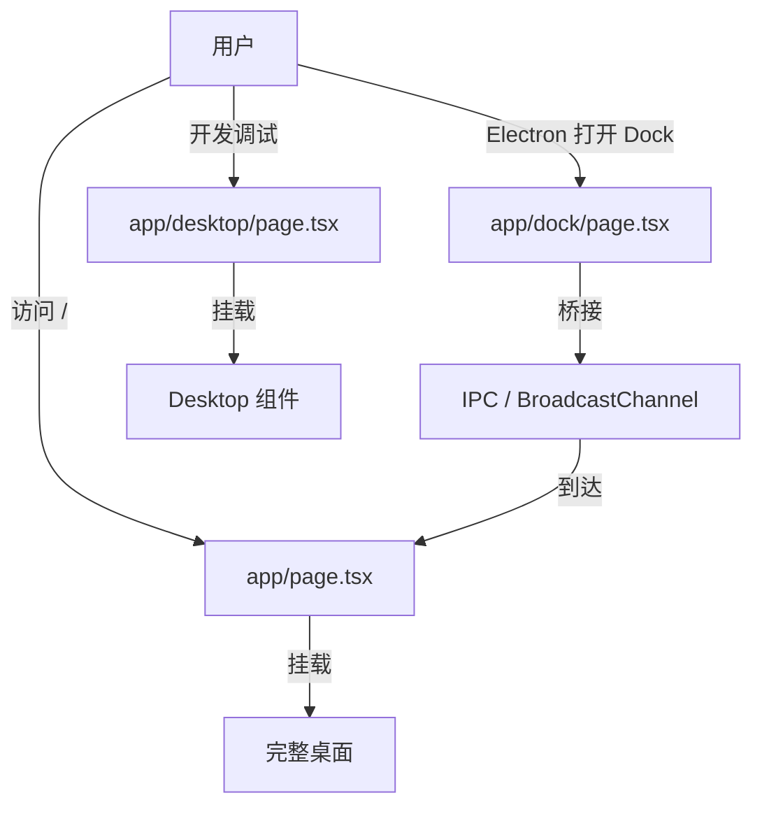

# I03：Dock 与辅助页面：Electron 专用入口与测试入口

主桌面不是 OriginOS 唯一的页面入口。Electron 版本有一个独立的 Dock 窗口，开发阶段还有 `desktop`、`test-interview`、`test-window` 等辅助页面。这节课解决的问题是：这些页面为什么存在？它们与主页的关系是什么？

## 1. 为什么 Dock 是一个独立页面

在 Web 模式下，Dock 是主页底部的一个组件（`!isElectronEnv && <Dock />`）。但在 Electron 模式下，Dock 被放在一个独立的 BrowserWindow 里，加载 `/dock?nativeWindow=1`。

设计原因有两个：

1. **透明叠加层**：Dock 窗口需要无边框、透明背景，浮在其他窗口边缘。
2. **全局可访问**：无论当前焦点在哪个窗口，Dock 都应该可见且可点击。

因此 Dock 不能只是主页内部的一个 div，它必须有自己的页面文件：`app/dock/page.tsx`。

## 2. Dock 布局：几乎为空

`app/dock/layout.tsx` 只有 9 行：

```tsx
import type { Metadata } from "next";

export const metadata: Metadata = {
  title: "OriginOS Dock",
};

export default function DockLayout({ children }: { children: React.ReactNode }) {
  return children;
}
```

这个 layout 故意不做任何事。因为 Dock 页面需要完全透明，任何额外的 HTML 结构（如 `html`/`body` 默认背景）都会破坏透明效果。`layout.tsx` 只设置页面标题，然后把渲染权交给 `page.tsx`。

## 3. Dock 页面：透明窗口 + 事件桥接

`app/dock/page.tsx` 的核心职责不是展示 Dock 组件，而是**把 Dock 动作桥接到主页或主进程**。

### 3.1 透明背景

```tsx
useEffect(() => {
  const prevBg = document.body.style.background;
  const prevColor = document.body.style.color;
  document.body.style.background = 'transparent';
  document.documentElement.style.background = 'transparent';
  return () => {
    document.body.style.background = prevBg;
    document.body.style.color = prevColor;
    document.documentElement.style.background = '';
  };
}, []);
```

这段 effect 把 `body` 和 `html` 的背景设为透明。这是 Electron 独立窗口能够“悬浮”在其他内容上的关键。注意它在卸载时会恢复之前的背景，避免污染其他页面。

### 3.2 应用同步

```tsx
useEffect(() => {
  if (!isElectron()) return;
  const unsubscribe = getIpcRenderer().on(IPC_CHANNELS.DOCK_SYNC_APPS, (incoming: unknown) => {
    if (!Array.isArray(incoming)) return;
    const incomingApps = incoming as DockApp[];
    const { apps, setApps } = useDockStore.getState();
    // ... 合并运行状态、添加新应用、清理已移除应用
  });
  return unsubscribe;
}, []);
```

Electron 主进程会把当前运行的应用列表同步给 Dock。Dock 页面据此更新每个图标的运行状态（是否运行、是否最小化）。这里的关键是：**Dock 只接收状态，不主动查询主进程**。

### 3.3 动作桥接

```tsx
useEffect(() => {
  const handleDockAction = (event: Event) => {
    const detail = (event as CustomEvent<Record<string, unknown>>).detail;
    if (!detail) return;

    if (isElectron()) {
      void getIpcRenderer().invoke(IPC_CHANNELS.DOCK_ACTION, detail);
    } else {
      const channel = new BroadcastChannel('originos-dock-actions');
      channel.postMessage(detail);
      channel.close();
    }
  };
  window.addEventListener('dock:action', handleDockAction);
  // ...
}, [dockSide]);
```

这是 Dock 页面最重要的逻辑：

- **Electron 模式**：把 `dock:action` 自定义事件转发给主进程的 `IPC_CHANNELS.DOCK_ACTION`。
- **Web 模式**：通过 `BroadcastChannel('originos-dock-actions')` 广播动作，主页在 I02 中监听这个 channel。

两种模式使用同一份 `detail` 数据，但传输方式不同。这意味着 Dock 组件本身不需要知道自己在哪种模式下运行，它只触发 `dock:action` 事件。

### 3.4 悬停控制窗口大小

```tsx
const handleDockHover = (event: Event) => {
  const { expanded, side } = (event as CustomEvent<{ expanded: boolean; side?: typeof dockSide }>).detail;
  if (isElectron()) {
    void getIpcRenderer().invoke(
      expanded ? IPC_CHANNELS.DOCK_SHOW : IPC_CHANNELS.DOCK_HIDE,
      { side: side ?? dockSide }
    );
  }
};
window.addEventListener('dock:hover', handleDockHover);
```

当用户悬停在 Dock 上时，Electron 窗口需要展开；离开时收起。这个 effect 把 UI 层的 `dock:hover` 事件转成 IPC 调用，由主进程控制 BrowserWindow 尺寸。

## 4. Desktop 测试页：最小挂载点

`app/desktop/page.tsx` 只有 15 行：

```tsx
'use client';

import Desktop from '@/components/os/Desktop';

export default function DesktopPage() {
  return (
    <main className="relative w-screen h-screen overflow-hidden">
      <Desktop />
    </main>
  );
}
```

文件注释明确说明这是“Desktop Demo Page - 用于测试 OS.1 Desktop 组件”。它的价值在于：

- 提供一个不依赖主页复杂状态的纯净环境，单独测试 `Desktop` 组件。
- 不承担任何业务逻辑，只负责挂载。

阅读代码时要立刻识别：这是测试入口，不是生产入口。如果把它当成用户会访问的页面，会误解系统结构。

## 5. 调用链对比

把三个入口的调用链放在一起比较：



Dock 页面不是用户直接访问的“功能页”，而是 Electron 多窗口架构中的**事件中继站**。Desktop 测试页则是**组件隔离测试入口**。

## 6. 失败路径

### 6.1 Dock 背景不透明

如果 `document.body.style.background = 'transparent'` 没有生效，可能的原因：

- CSS 选择器优先级更高，覆盖了 inline 样式。
- Electron BrowserWindow 的 `transparent: false`。
- `nativeWindow=1` 参数缺失，页面按普通页面渲染。

### 6.2 Web 模式下 Dock 动作丢失

Web 模式下 Dock 动作通过 `BroadcastChannel` 广播。如果主页没有正确监听（I02 中的 IPC effect），或者浏览器不支持 `BroadcastChannel`，动作会丢失。

### 6.3 测试页暴露到生产

`desktop`、`test-interview`、`test-window` 这些页面没有访问控制。如果生产构建包含了这些文件，用户可以直接访问。Next.js 默认会构建所有 `app/` 下的页面，所以这类页面通常通过环境判断或部署策略限制访问。

## 7. 测试证据

| 验证动作 | 能证明 | 不能证明 |
| --- | --- | --- |
| Electron 中观察 Dock 窗口 | 透明窗口和 IPC 桥接生效 | Web 模式下 BroadcastChannel 同样工作 |
| Web 中打开 `/dock` | Dock 组件能渲染 | Electron 专用逻辑不会执行 |
| 访问 `/desktop` | Desktop 组件能独立挂载 | 主页功能正常 |

这些入口大多没有单元测试，因为它们高度依赖浏览器环境和 Electron API。验证主要靠运行观察和手动测试。

## 8. 小实验

不运行项目，回答：

1. 为什么 `dock/layout.tsx` 几乎什么都不做？如果它像 `layout.tsx` 一样包裹 `html`/`body`，会产生什么问题？
2. `dock/page.tsx` 中的 `handleDockAction` 为什么要区分 `isElectron()`？
3. `desktop/page.tsx` 与 `page.tsx` 的主要区别是什么？

参考答案：

1. Dock 窗口需要透明背景。额外的 `html`/`body` 结构可能引入默认背景色，破坏透明效果。
2. Electron 模式下需要把动作发到主进程，由主进程决定打开哪个原生窗口；Web 模式下用 BroadcastChannel 把动作广播给主页。
3. `desktop/page.tsx` 是测试入口，只挂载 `Desktop` 组件；`page.tsx` 是生产主桌面，汇集数据、事件和所有窗口调度。

## 9. 章节收束

本节课看了两类非主桌面入口：

- **Electron 专用入口**（`/dock`）：负责透明窗口和事件桥接。
- **开发测试入口**（`/desktop`、`/test-interview`、`/test-window`）：负责独立测试组件。

它们不是系统的主流程，但理解它们能避免把测试代码或 Electron 专用代码当成通用逻辑。

下一节课会专门看 Interview 相关的页面入口，以及测试页与真实流程的区别。
