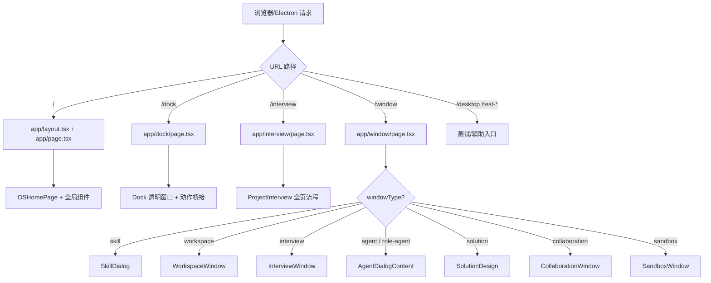
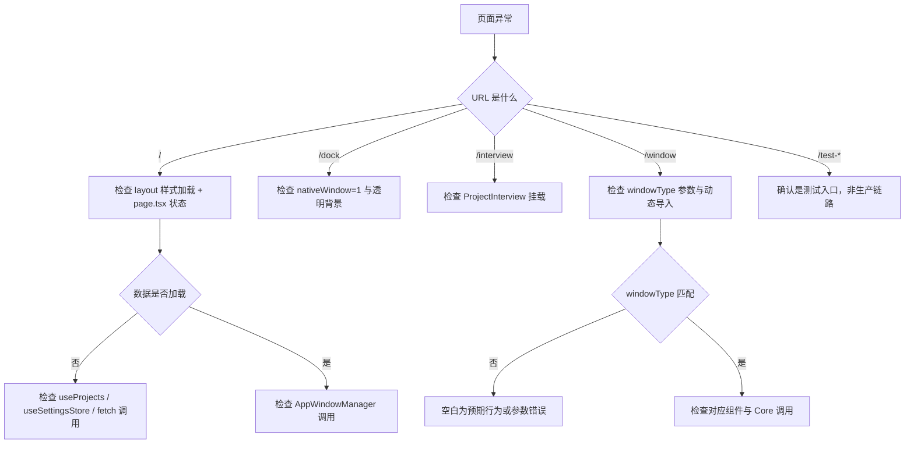

# I06：综合工作坊：给你一组 URL，能预测 OriginOS 渲染什么吗？

前四节课分别看了根布局、主页、`/dock`、`/interview`、测试页和 `/window`。它们若只分别记住，仍不足以解释真实系统。一个合格的理解应当能够回答：小林访问不同 URL 时，哪个文件会渲染、会挂载哪个组件、哪些全局副作用会执行、哪些不会发生。

本工作坊不要求修改仓库源码。所有操作都围绕 `app/` 目录下的页面入口设计，使注意力集中在“入口责任”而非组件内部实现。

## 1. 实验边界与预期成果

本实验不依赖真实模型或 Core 服务。它能够验证页面路由与组件挂载的局部事实，却不能证明生产构建、Electron 多窗口或所有组件内部行为都正确。

完成本课后，应能形成一份简短的“入口预测表”，至少包含：

| 项目 | 应能写出的结论 | 对应的源码依据 |
| --- | --- | --- |
| URL 到文件 | `/` → `app/page.tsx`，`/window` → `app/window/page.tsx` | App Router 目录约定 |
| Layout 共享 | 所有页面共享 `app/layout.tsx` | `app/layout.tsx` 的 `children` 插槽 |
| 主页职责 | 数据加载、事件监听、窗口调度 | `app/page.tsx` 中的 hooks 和 `handle*` 函数 |
| Dock 特殊性 | 透明窗口、IPC/BroadcastChannel 桥接 | `app/dock/page.tsx` |
| /window 分发 | query 参数决定动态导入的组件 | `app/window/page.tsx` 的 `windowType` 分支 |
| 测试入口 | `/desktop`、`/test-interview`、`/test-window` 不是生产入口 | 文件名与注释 |

## 2. 总体认知图：一张入口地图



这张图只回答一个问题：一个请求进入 OriginOS Web 端，最先被哪个文件处理？

读图时分三层：

1. **最外层是 URL 路由**：由 App Router 按目录约定匹配。
2. **中间层是页面文件**：决定布局、透明处理、参数分发。
3. **最内层是内容组件**：真正实现用户可见的交互，属于 Part J 的范畴。

本单元只要求掌握外层和中层。内层组件在后续课程展开。

## 3. 核心区分：三种入口类型

本单元最容易混淆的是三种入口类型。下面用对照表固定边界。

### 3.1 生产入口 vs 测试入口

| 生产入口 | 测试/辅助入口 | 区分依据 |
| --- | --- | --- |
| `/` | `/desktop` | 注释说明是 Demo Page |
| `/dock` | `/test-interview` | 文件名含 test |
| `/interview` | `/test-window` | 文件名含 test |
| `/window` | — | 通用窗口容器 |

### 3.2 主页内窗口 vs 独立窗口页

| 维度 | 主页内窗口 | 独立 /window 页 |
| --- | --- | --- |
| 触发 | `AppWindowManager.openComponentWindow` | Electron BrowserWindow 加载 URL |
| URL 变化 | 不变 | 变为 `/window?...` |
| DOM 位置 | 在主页 `AppWindowContainer` 内 | 在新页面的 DOM 中 |
| 组件来源 | 相同 | 相同 |

### 3.3 页面责任 vs 组件责任

| 页面责任 | 组件责任 |
| --- | --- |
| 选择渲染哪个组件 | 组件内部状态与交互 |
| 处理 URL query / 事件桥接 | 调用 Core Service |
| 设置透明背景等环境 | 实现业务 UI |

## 4. 章节因果链

I01—I06 不是六个孤立文件介绍。它们按“从 URL 到组件挂载”的顺序，逐步补全判断能力。

| 课次 | 补上的判断能力 | 关键源码锚点 |
| --- | --- | --- |
| I01 | 能区分 layout、page、全局样式的职责 | `app/layout.tsx`、`app/page.tsx` 顶层 |
| I02 | 能追踪主页数据加载、事件监听、窗口调度 | `page.tsx` 的 hooks 与 `handle*` 函数 |
| I03 | 能识别 Dock 透明窗口和测试入口 | `app/dock/page.tsx`、`app/desktop/page.tsx` |
| I04 | 能区分访谈全页入口、弹窗组件、测试入口 | `app/interview/page.tsx`、`app/test-interview/page.tsx` |
| I05 | 能根据 URL 预测 `/window` 渲染的组件 | `app/window/page.tsx`、`app/window/CollaborationWindow.tsx` |
| I06 | 能把所有入口知识转成可验证的预测能力 | 复用上述文件 |

## 5. 源码覆盖台账

| 课次 | 已直接精读的生产源码 | 配对测试或验证入口 | 本单元只证明什么 |
| --- | --- | --- | --- |
| I01 | `app/layout.tsx`、`app/page.tsx` 顶层结构 | 无单元测试；运行观察 | 页面挂载、全局样式、根布局责任 |
| I02 | `app/page.tsx` 数据加载、事件桥接、窗口调度 | 无单元测试；运行观察 | 主页状态组织与窗口打开入口 |
| I03 | `app/dock/page.tsx`、`app/dock/layout.tsx`、`app/desktop/page.tsx` | 无单元测试；运行观察 | Dock 透明窗口、IPC/BroadcastChannel 桥接、测试页 |
| I04 | `app/interview/page.tsx`、`app/test-interview/page.tsx`、`app/test-window/page.tsx` | 无单元测试；运行观察 | 访谈全页入口与两个测试入口 |
| I05 | `app/window/page.tsx`、`app/window/CollaborationWindow.tsx` | 无单元测试；运行观察 | query 参数分发、动态导入、协作窗口 |
| I06 | 不新增生产逻辑；复用上述入口文件 | 纸面推演 + 运行观察 | 将入口知识转成可验证的预测能力 |

相邻但未在本单元精读的文件：`components/os/**`、`components/framework/**`、`store/appWindowStore.ts`、`services/AppWindowManager.ts` 属于 Part J；`lib/features/**`、`lib/integrations/**` 属于 Part E/F/G。`styles/globals.css` 只说明消费关系。

## 6. 排查地图：看到异常时先看哪一层



排查口诀：

1. 先确认 URL 走到了哪个 `page.tsx`。
2. 再确认全局样式和 layout 是否生效。
3. 再看页面参数或事件是否传递正确。
4. 最后才进入组件或 Core 逻辑。

## 7. 综合实验：入口预测

下面给出几个 URL，要求不查代码也能预测渲染结果和关键副作用。

```text
URL A: /
URL B: /window?windowType=skill&skillName=trip-planner&title=旅行助手
URL C: /dock?nativeWindow=1
URL D: /interview
URL E: /test-window
URL F: /window?windowType=collaboration&projectId=p1
URL G: /desktop
```

合格推演应包含：

| URL | 渲染文件 | 渲染组件/内容 | 关键副作用 | 不应得出的结论 |
| --- | --- | --- | --- | --- |
| A | `app/page.tsx` | 完整桌面 | 加载项目、Agent、Skill、配置 | 所有窗口都在主页内打开 |
| B | `app/window/page.tsx` | `SkillDialog` | dynamic 导入 Skill 组件 | 会同时加载 Workspace 代码 |
| C | `app/dock/page.tsx` | `Dock` | 透明背景、IPC/BroadcastChannel | 主桌面内容也会渲染 |
| D | `app/interview/page.tsx` | `ProjectInterview` | 全页访谈流程 | 使用 InterviewWindow 组件 |
| E | `app/test-window/page.tsx` | 窗口系统测试 UI | 直接操作 AppWindowManager | 真实业务数据会加载 |
| F | `app/window/page.tsx` | `CollaborationWindow` | 先加载设置再渲染 MultiAgentLauncher | 一打开就连接协作后端 |
| G | `app/desktop/page.tsx` | `Desktop` 组件 | 仅组件挂载 | 这是生产主入口 |

## 8. 测试证据范围与缺口

| 证据类型 | 已验证 | 未验证 |
| --- | --- | --- |
| 运行观察 | 各页面能渲染 | 生产构建一致性 |
| 代码阅读 | 路由分发逻辑清晰 | 所有错误分支都有处理 |
| 纸面推演 | 能根据 URL 预测组件 | Electron 原生窗口实际行为 |

本单元没有自动化测试。这是因为页面入口高度依赖浏览器环境和 Electron API，单元测试成本较高。后续 API Route 单元会补充有测试的代码。

## 9. 口头验收

学完 I01—I06 后，不看正文也应能回答下面六个问题：

1. `app/layout.tsx` 和 `app/page.tsx` 分别承担什么责任？
2. 主页为什么把数据加载、事件监听、窗口调度放在一起，却不直接管理窗口动画？
3. `/dock?nativeWindow=1` 和 `/` 在渲染目标上有什么区别？
4. `/window?windowType=skill` 与主页内弹出的 Skill 窗口，最终挂载的组件是否相同？入口责任是否相同？
5. `test-interview/page.tsx` 和 `interview/page.tsx` 为什么不能互相替代？
6. 看到空白页时，为什么要先确认 URL 和 `windowType` 参数，再检查组件内部？

## 10. I01—I06 单元结论

OriginOS 的 Web 端不是一个单页应用，而是一组由 Next.js App Router 按约定路由的入口集合：

- `app/layout.tsx` 提供全局外壳和样式。
- `app/page.tsx` 是主桌面，负责数据、事件和窗口调度。
- `app/dock/page.tsx` 是 Electron 透明 Dock 窗口，负责动作桥接。
- `app/interview/page.tsx` 是访谈全页入口。
- `app/window/page.tsx` 是通用窗口容器，通过 query 参数分发多种内容。
- `desktop`、`test-interview`、`test-window` 是开发辅助入口。

这一单元还没有解释 HTTP 请求如何进入 API Route Handler、Core Service 如何被调用。现在具备入口地图后，下一单元才能准确分析 Agent 会话 API，而不会把“路由没走到正确页面”当成“Core 有 bug”。

因此，本单元可以压缩成一句话：

> 先确认 URL 走到了哪个页面，再确认页面挂载了哪个组件，最后才进入组件或 Core 内部。
