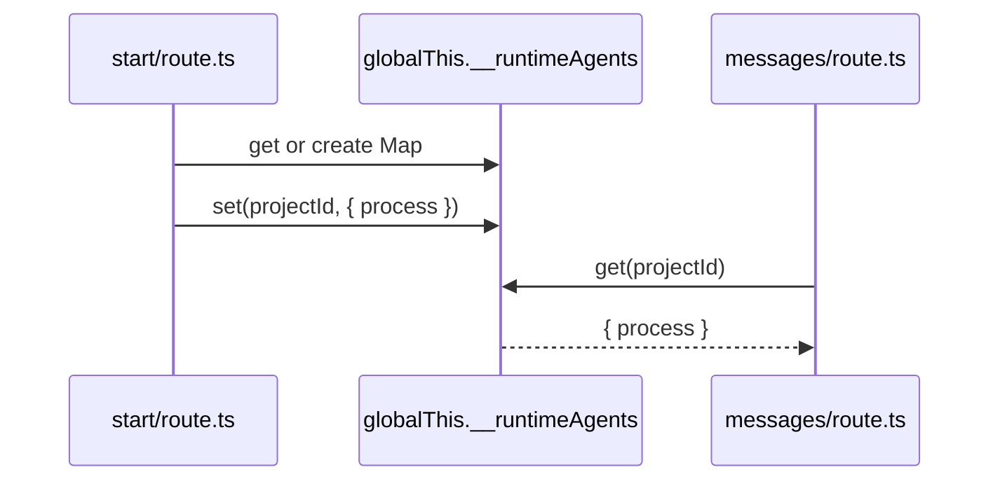

# I07：Runtime Agent 注册表：为什么用 globalThis

当 `USE_COLLABORATION_RUNTIME=true` 时，OriginOS 的 Agent 运行在独立子进程中。`start/route.ts` 创建一个子进程，`messages/route.ts` 向它发送消息，`stop/route.ts` 终止它。这些操作必须在多次 HTTP 请求之间共享同一个进程引用。这节课解决的问题是：这个共享引用放在哪里？为什么放在 `globalThis` 上？

## 1. 问题背景：HTTP 请求之间没有天然共享状态

Next.js Route Handler 是无状态的。每个 HTTP 请求都会重新执行 `route.ts` 文件，文件顶层的局部变量在请求结束后可能被回收。如果 `start` 路由把子进程存在局部变量里，那么 `messages` 路由就找不到它。

常见解决方案有三种：

| 方案 | 优点 | 缺点 |
| --- | --- | --- |
| 数据库/文件 | 持久化 | 进程对象无法序列化 |
| 外部服务（Redis 等） | 跨进程共享 | 项目规约 MVP 阶段禁止数据库 |
| globalThis | 同进程内共享，无需序列化 | 只在本 Node 进程内有效 |

OriginOS 选择了 `globalThis`，因为它最简单，且满足当前架构需求：所有 Route Handler 运行在同一个 Next.js 进程中。

## 2. 注册表的结构

打开 `api/agent/_runtime-agent-registry.ts`：

```ts
import { AgentProcess } from '@originos/core/modules/collaboration-runtime/sandbox/agent-spawner';

export interface ProjectRuntimeAgent {
  process: AgentProcess;
  projectId: string;
}

declare global {
  var __runtimeAgents: Map<string, ProjectRuntimeAgent> | undefined;
}

const runtimeAgents = globalThis.__runtimeAgents ?? new Map<string, ProjectRuntimeAgent>();
globalThis.__runtimeAgents = runtimeAgents;

export function getRuntimeAgent(projectId: string): ProjectRuntimeAgent | undefined {
  return runtimeAgents.get(projectId);
}

export function setRuntimeAgent(projectId: string, entry: ProjectRuntimeAgent): void {
  runtimeAgents.set(projectId, entry);
}

export function removeRuntimeAgent(projectId: string): void {
  runtimeAgents.delete(projectId);
}

export function listRuntimeAgents(): string[] {
  return Array.from(runtimeAgents.keys());
}
```

这段代码的关键点：

1. **类型声明**：`declare global { var __runtimeAgents: ... }` 让 TypeScript 知道 `globalThis` 上可能有这个属性。
2. **懒初始化**：`const runtimeAgents = globalThis.__runtimeAgents ?? new Map()`。如果已经存在就复用，不存在就新建。
3. **立即挂载**：`globalThis.__runtimeAgents = runtimeAgents`。这一步保证后续 import 同一个模块时拿到同一个 Map。
4. **只存 process 和 projectId**：不存 spawner 本身，避免模块间传递过多能力。

## 3. 为什么能避免 HMR 问题

Next.js 开发模式下，修改 `route.ts` 会触发 Hot Module Replacement（HMR），模块会被重新加载。如果子进程引用存在模块级局部变量里，HMR 后这个变量会被重置，导致旧的子进程丢失。

`globalThis` 不属于任何模块，HMR 不会清空它。因此即使 `route.ts` 被重新加载，`globalThis.__runtimeAgents` 仍然指向同一个 Map，子进程引用不会丢失。



## 4. 调用链：从创建到使用

```text
start/route.ts 启动子进程
  → 调用 spawner.spawn(...)
  → 得到 AgentProcess 实例
  → 调用 setRuntimeAgent(projectId, { process, projectId })
    → 写入 globalThis.__runtimeAgents

messages/route.ts 发送消息
  → 调用 getRuntimeAgent(projectId)
    → 从 globalThis.__runtimeAgents 读取
  → 调用 process.prompt(content)

stop/route.ts 停止子进程
  → 调用 getRuntimeAgent(projectId)
  → 调用 process.shutdown() 或 spawner.destroy(agentId)
  → 调用 removeRuntimeAgent(projectId)
```

## 5. 失败路径

### 5.1 globalThis 被意外覆盖

如果有其他代码执行 `globalThis.__runtimeAgents = new Map()` 而不做 `??` 判断，会清空已有注册表。当前实现通过 `??` 避免这个问题，但外部代码仍可能破坏它。

### 5.2 多进程部署失效

`globalThis` 只在当前 Node 进程内有效。如果未来把 Next.js 部署到多进程服务器，不同请求可能落到不同进程，导致 `getRuntimeAgent` 找不到子进程。MVP 阶段不考虑这种部署，但这是该方案的根本限制。

### 5.3 内存泄漏

如果子进程崩溃或未被正确销毁，注册表中会一直保留引用。`stop` 和 `destroy` 路由有责任清理，但如果调用失败，残留条目无法自动回收。

## 6. 测试证据

| 验证方式 | 能证明 | 不能证明 |
| --- | --- | --- |
| 代码阅读 | 注册表使用 globalThis 共享 Map | HMR 场景下一定不丢失 |
| 调用 start 后再调用 messages | 子进程能在两次请求间被找到 | 所有错误分支都正确处理 |
| 调用 stop 后再调用 messages | removeRuntimeAgent 生效 | 子进程系统资源已释放 |

## 7. 小实验

不运行项目，回答：

1. 如果 `start/route.ts` 和 `messages/route.ts` 分别用 `new Map()` 存储子进程，会出现什么问题？
2. 为什么 `setRuntimeAgent` 不直接存 `AgentProcess`，而是包装成 `{ process, projectId }`？
3. `listRuntimeAgents()` 返回的是什么？能用来做什么调试？

参考答案：

1. messages 路由找不到 start 路由创建的子进程，因为两个 Map 不是同一个实例。
2. 包装对象明确记录了 projectId，方便调试和反向查找；也避免未来扩展时只传 process 导致接口不稳定。
3. 返回所有已注册 projectId 的数组。可用于日志输出或检查哪些项目还有运行中的子进程。

## 8. 章节收束

本节课解释了 `_runtime-agent-registry.ts` 的设计原因：在 Next.js HMR 和无状态请求之间，需要一个跨模块、跨请求的生存空间来保存子进程引用。`globalThis` 是当前方案的最小可行实现。

下一节课会看会话创建的起点：`POST /api/agent/sessions`。
