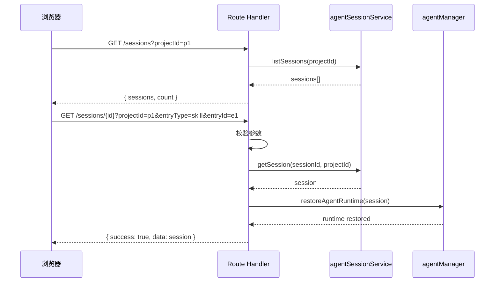

# I09：GET /api/agent/sessions：列表查询与单条恢复

上一节课追踪了 `POST /api/agent/sessions` 如何创建会话。这节课看两个读取接口：`GET /api/agent/sessions` 列表查询，以及 `GET /api/agent/sessions/{sessionId}` 单条恢复。前者用于窗口打开时加载历史，后者用于窗口关闭后重新打开时恢复上下文。

## 1. 列表查询：GET /api/agent/sessions

打开 `app/api/agent/sessions/route.ts` 的 GET 处理函数（第 14–48 行）：

```ts
export async function GET(request: NextRequest) {
  try {
    const searchParams = request.nextUrl.searchParams;
    const projectId = searchParams.get('projectId');

    const sessions = await agentSessionService.listSessions(
      projectId ?? undefined,
    );

    return NextResponse.json<ApiResponse>(
      {
        success: true,
        data: {
          sessions,
          count: sessions.length,
        },
        timestamp: new Date().toISOString(),
      },
    );
  } catch (error) {
    // ... 500 处理
  }
}
```

关键点：

1. **可选过滤**：`projectId` 查询参数是可选的。不传则返回所有会话，传了则只返回该项目的会话。
2. **返回结构**：`{ sessions, count }` 而不是直接返回 `sessions` 数组。这为未来分页预留了空间。
3. **没有分页参数**：当前实现一次性返回全部结果。如果项目会话很多，响应体会很大。

## 2. 单条恢复：GET /api/agent/sessions/{sessionId}

打开 `app/api/agent/sessions/[sessionId]/route.ts` 的 GET 处理函数（第 25–76 行）：

```ts
export async function GET(
  _request: NextRequest,
  { params }: { params: Promise<{ sessionId: string }> },
) {
  try {
    const { sessionId } = await params;

    const { searchParams } = new URL(_request.url);
    const projectId = searchParams.get('projectId') || undefined;
    const entryTypeValue = searchParams.get('entryType') || undefined;
    const entryId = searchParams.get('entryId') || undefined;
    const entryType = entryTypeValue && RESTORE_ENTRY_TYPES.has(entryTypeValue as RestoreAgentEntryType)
      ? entryTypeValue as RestoreAgentEntryType
      : undefined;

    if (!projectId || !entryType || !entryId) {
      return NextResponse.json<ApiResponse<unknown>>(
        {
          success: false,
          error: {
            code: 'RESTORE_FAILED',
            message: 'A valid projectId, entryType, and entryId are required',
          },
          timestamp: new Date().toISOString(),
        },
        { status: 400 }
      );
    }

    const restoreRequest = {
      sessionId,
      projectId,
      entryType,
      entryId,
    };
    const session = await restoreSessionAtBoundary(restoreRequest, {
      getSession: (requestedSessionId, requestedProjectId) =>
        agentSessionService.getSession(requestedSessionId, requestedProjectId),
      hydrateRuntime: async (storedSession) => {
        await agentManager.restoreAgentRuntime(storedSession);
      },
    });

    return NextResponse.json<ApiResponse>(
      {
        success: true,
        data: session,
        timestamp: new Date().toISOString(),
      },
    );
  } catch (error) {
    // ... 错误处理
  }
}
```

这段代码比列表查询复杂得多，因为它不只是"读取"，而是"恢复"。

### 2.1 恢复 vs 读取的区别

| 维度 | 列表查询 (GET /sessions) | 单条恢复 (GET /sessions/{id}) |
| --- | --- | --- |
| 目的 | 展示历史会话列表 | 恢复某个会话的完整上下文 |
| 参数 | 可选 `projectId` | 必须 `projectId`, `entryType`, `entryId` |
| Core 调用 | `listSessions` | `restoreSessionAtBoundary` |
| 副作用 | 无 | 可能恢复 Agent 运行时 |
| 返回 | `{ sessions, count }` | 完整会话对象 |

### 2.2 为什么恢复需要三个参数

`restoreSessionAtBoundary` 的设计意图是：**验证会话的归属权**。`entryType` 和 `entryId` 告诉系统"谁"在尝试恢复这个会话：

- `entryType`: `'skill' | 'agent' | 'role-agent'` — 恢复入口的类型
- `entryId`: 具体的入口标识（如技能名、Agent ID）

这是为了防止一个窗口的会话被另一个窗口意外恢复。例如，Skill A 的会话不应该被 Skill B 恢复。

### 2.3 恢复的两个阶段

```text
GET /sessions/{sessionId}
  → 校验 projectId + entryType + entryId
  → restoreSessionAtBoundary(restoreRequest, { getSession, hydrateRuntime })
    → 阶段 1：getSession 从磁盘读取 session.json
    → 阶段 2：hydrateRuntime 恢复 Agent 运行时（如果需要）
  → 返回恢复后的会话对象
```

`hydrateRuntime` 回调是关键：它让 Route Handler 决定如何恢复运行时。这里委托给 `agentManager.restoreAgentRuntime`，属于 Part E/F 的范畴。

## 3. 错误处理与状态码

单条恢复的 GET 有四种错误状态码：

| 状态码 | 触发条件 | 含义 |
| --- | --- | --- |
| 400 | 缺少 projectId/entryType/entryId | 请求参数不完整 |
| 404 | 会话不存在 (`NOT_FOUND`) | 会话文件被删除或从未创建 |
| 403 | 归属权不匹配 (`OWNERSHIP_MISMATCH`) | 当前入口无权恢复此会话 |
| 422 | 会话数据损坏 (`CORRUPT_SESSION`) | session.json 格式错误 |
| 500 | 其他内部错误 | 运行时异常 |

注意 403 和 422 的区分：403 是权限问题，422 是数据问题。

## 4. 调用链对比



## 5. 失败路径

### 5.1 列表查询返回空数组

如果 `projectId` 没有对应会话，`listSessions` 返回空数组。这不是错误，而是正常结果。客户端需要处理空数组的情况。

### 5.2 恢复时缺少 entryType/entryId

这是最常见的客户端错误。例如，直接访问 `GET /api/agent/sessions/abc-123?projectId=p1`（缺少 entryType 和 entryId）会返回 400。

### 5.3 恢复后运行时未正确恢复

`restoreAgentRuntime` 可能失败，但会话数据仍然返回。这会导致客户端以为恢复成功了，但后续消息发送失败。

## 6. 测试证据

| 验证方式 | 能证明 | 不能证明 |
| --- | --- | --- |
| `curl` 列表查询 | 能返回会话数组 | 数组内容一定正确 |
| `curl` 单条恢复 | 能返回会话对象 | 运行时一定恢复成功 |
| `curl` 缺少参数 | 返回 400 | 所有参数组合都校验 |

## 7. 小实验

不运行项目，回答：

1. 为什么列表查询不需要 `entryType` 和 `entryId`，而单条恢复需要？
2. 如果 `restoreSessionAtBoundary` 的 `hydrateRuntime` 回调抛异常，会返回什么状态码？
3. `GET /sessions/{sessionId}` 和 `POST /sessions`（带 sessionId）都能拿到会话，有什么区别？

参考答案：

1. 列表查询只读数据，不涉及归属权验证。单条恢复需要确认"谁"在恢复，防止跨窗口恢复。
2. 500。因为 `restoreSessionAtBoundary` 的 catch 块会把所有非 RestoreAgentSessionError 的异常转成 500。
3. GET 是读取/恢复，可能触发运行时恢复。POST 是创建/复用，会更新字段。前者是读取语义，后者是写入语义。

## 8. 章节收束

本节课看了两个读取接口：列表查询和单条恢复。列表查询简单直接，单条恢复则涉及归属权验证和运行时恢复。恢复不是简单的读取，而是"读取 + 重建运行时上下文"的组合操作。

下一节课会看更新、删除和销毁：如何修改会话数据，以及如何区分"删除数据"和"销毁运行时实例"。
