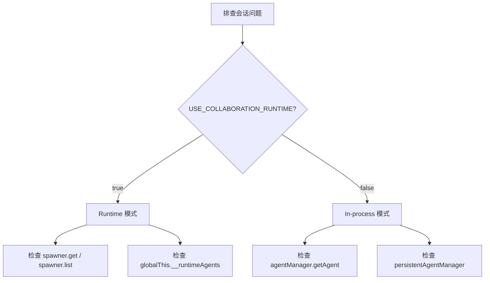

# I11：综合工作坊：Agent 会话管理排查地图

前四节课（I07–I10）分别看了 runtime 注册表、会话创建、列表/恢复、更新/删除/销毁。它们若只分别记住，仍不足以解释真实系统。一个合格的理解应当能够回答：当小林说"会话找不到了""窗口关了 Agent 还在跑""恢复会话后没有上下文"时，应该按什么顺序排查。

本工作坊围绕 `api/agent/sessions/**` 和 `api/agent/_runtime-agent-registry.ts` 设计，使注意力集中在"HTTP 边界到 Core Service"的责任划分上。

## 1. 实验边界与预期成果

本实验不依赖真实模型或 LLM 服务。它能够验证会话管理 API 的局部事实，却不能证明 Core Service 内部实现、Agent 运行时行为或 Electron 多窗口通信都正确。

完成本课后，应能形成一份简短的"会话管理排查地图"，至少包含：

| 项目 | 应能写出的结论 | 对应的源码依据 |
| --- | --- | --- |
| 创建失败 | 先检查 400/500，再看请求体 | `api/agent/sessions/route.ts` POST |
| 会话找不到 | 区分是数据不存在还是运行时未恢复 | `api/agent/sessions/[sessionId]/route.ts` GET |
| 窗口关了 Agent 还在 | 检查 destroy 路由和 USE_COLLABORATION_RUNTIME | `api/agent/sessions/[sessionId]/destroy/route.ts` |
| 恢复后无上下文 | 检查 entryType/entryId 参数 | `api/agent/sessions/[sessionId]/route.ts` GET |
| 运行时模式混淆 | 检查环境变量和双分支逻辑 | 多个路由顶部的 `USE_RUNTIME_MODE` |

## 2. 总体认知图：一张会话管理地图

```mermaid
flowchart TD
    A[HTTP 请求] --> B{方法 + 路径}
    B -->|POST /sessions| C[创建/复用]
    B -->|GET /sessions| D[列表查询]
    B -->|GET /sessions/{id}| E[单条恢复]
    B -->|PUT /sessions/{id}| F[更新字段]
    B -->|DELETE /sessions/{id}| G[删除数据]
    B -->|POST /sessions/{id}/destroy| H[销毁运行时]
    B -->|POST /sessions/destroy| I[通用销毁]
    C --> J[agentSessionService.createSession]
    E --> K[restoreSessionAtBoundary]
    K --> L[hydrateRuntime]
    H --> M[spawner.destroy / agentManager.finalizeAndRemoveAgent]
    G --> N[agentSessionService.deleteSession]
```

这张图只回答一个问题：一个 HTTP 请求进入 OriginOS 的 Agent 会话 API，会被哪个文件处理、调用哪个 Core 函数、产生什么副作用？

读图时分三层：

1. **最外层是 HTTP 路由**：由 Next.js App Router 按文件约定匹配。
2. **中间层是 Route Handler**：校验参数、选择模式（runtime/in-process）、调用 Core。
3. **最内层是 Core Service**：真正实现业务逻辑，属于 Part E/F 的范畴。

本单元只要求掌握外层和中层。内层 Core Service 在后续课程展开。

## 3. 核心区分：三种容易混淆的场景

### 3.1 会话数据 vs 运行时实例

| 问题 | 检查数据 | 检查运行时 |
| --- | --- | --- |
| "会话找不到了" | `GET /sessions/{id}` 返回 404？ | 无关 |
| "恢复后不能发消息" | 会话数据存在 | `hydrateRuntime` 是否成功？ |
| "窗口关了 Agent 还在" | 无关 | `destroy` 是否被调用？ |
| "删除后还能发消息" | `DELETE` 只删数据 | 运行时未停止 |

### 3.2 Runtime 模式 vs In-process 模式



排查口诀：

1. 先看环境变量，确认 runtime 还是 in-process。
2. Runtime 模式问题看 spawner 和注册表。
3. In-process 模式问题看 agentManager 和 persistentAgentManager。
4. 不要混用两种模式的排查方法。

### 3.3 创建、恢复、更新、删除、销毁

| 操作 | HTTP | 数据变化 | 运行时变化 | 常见误解 |
| --- | --- | --- | --- | --- |
| 创建 | POST /sessions | 新增 session.json | 可能创建运行时 | 复用时不创建新数据 |
| 恢复 | GET /sessions/{id} | 读取 session.json | 恢复运行时 | 不是简单读取 |
| 更新 | PUT /sessions/{id} | 修改 session.json | 无 | 不会重新创建运行时 |
| 删除 | DELETE /sessions/{id} | 删除 session.json | 无 | 运行时仍在运行 |
| 销毁 | POST /.../destroy | 无 | 停止运行时 | 数据仍然保留 |

## 4. 章节因果链

I07–I11 不是五个孤立文件介绍。它们按"从注册表到会话创建、恢复、修改、销毁"的顺序，逐步补全判断能力。

| 课次 | 补上的判断能力 | 关键源码锚点 |
| --- | --- | --- |
| I07 | 能解释 globalThis 挂载的用途 | `api/agent/_runtime-agent-registry.ts` |
| I08 | 能追踪请求体到 session.json 的变形 | `api/agent/sessions/route.ts` POST |
| I09 | 能区分列表、读取、恢复三种语义 | `api/agent/sessions/route.ts` GET、`api/agent/sessions/[sessionId]/route.ts` GET |
| I10 | 能区分删除数据与销毁实例 | `api/agent/sessions/[sessionId]/route.ts` PUT/DELETE、`api/agent/sessions/[sessionId]/destroy/route.ts`、`api/agent/sessions/destroy/route.ts` |
| I11 | 能把会话管理知识转成可验证的排查能力 | 复用上述文件 |

## 5. 源码覆盖台账

| 课次 | 已直接精读的生产源码 | 配对测试或验证入口 | 本单元只证明什么 |
| --- | --- | --- | --- |
| I07 | `api/agent/_runtime-agent-registry.ts` | 无单元测试 | runtime 子进程注册表的边界与生命周期 |
| I08 | `api/agent/sessions/route.ts` 的 POST | 无单元测试 | 会话创建、配置合并、目录创建、复用逻辑 |
| I09 | `api/agent/sessions/route.ts` 的 GET、`api/agent/sessions/[sessionId]/route.ts` 的 GET | 无单元测试 | 列表查询与带恢复的单条读取 |
| I10 | `api/agent/sessions/[sessionId]/route.ts` 的 PUT/DELETE、`api/agent/sessions/[sessionId]/destroy/route.ts`、`api/agent/sessions/destroy/route.ts` | 无单元测试 | 更新、删除、销毁的语义差异与双模式分支 |
| I11 | 不新增生产逻辑；复用上述文件 | 纸面推演 + 运行观察 | 把会话管理知识转成可验证的排查能力 |

相邻但尚未精读的文件：`api/agent/sessions/[sessionId]/messages/route.ts`（消息发送与 SSE，U3）、`api/agent/projects/[projectId]/**`（项目级 Agent，U4）、`api/agent/abort/route.ts`（中断，U3）。

## 6. 排查地图：看到异常时先看哪一层

```mermaid
flowchart TD
    A[会话异常] --> B{HTTP 路径}
    B -->|POST /sessions| C[创建失败]
    B -->|GET /sessions/{id}| D[恢复失败]
    B -->|PUT /sessions/{id}| E[更新失败]
    B -->|DELETE /sessions/{id}| F[删除失败]
    B -->|POST /.../destroy| G[销毁失败]
    C --> H{状态码}
    H -->|400| I[检查请求体]
    H -->|500| J[检查 Core 异常]
    D --> K{状态码}
    K -->|400| L[检查 entryType/entryId]
    K -->|404| M[检查 sessionId]
    K -->|403| N[检查归属权]
    G --> O{USE_RUNTIME_MODE}
    O -->|true| P[检查 spawner / registry]
    O -->|false| Q[检查 agentManager]
```

排查口诀：

1. 先确认 HTTP 路径和方法。
2. 再看状态码，区分客户端错误（400）和服务器错误（500）。
3. 恢复问题先看参数完整性（projectId/entryType/entryId）。
4. 销毁问题先看 runtime 模式，再看对应管理器。
5. 数据问题先看文件系统，再看 Core Service。

## 7. 综合实验：纸面推演

下面给出几个场景，要求不查代码也能推断系统行为和排查方向。

### 场景 A：创建会话返回 400

```text
POST /api/agent/sessions
Body: { "projectName": "测试项目" }
```

合格推演：
- 原因：缺少 `projectId` 字段。
- 排查：检查请求体是否包含 `projectId` 和 `projectName`。
- 修复：补充 `projectId` 字段。

### 场景 B：恢复会话返回 403

```text
GET /api/agent/sessions/abc-123?projectId=p1&entryType=skill&entryId=skill-a
```

合格推演：
- 原因：`entryType` 或 `entryId` 与会话创建时不匹配，归属权验证失败。
- 排查：检查会话创建时使用的 `entryType` 和 `entryId`。
- 修复：使用正确的 `entryType` 和 `entryId`，或重新创建会话。

### 场景 C：窗口关闭后 Agent 仍在运行

```text
1. 打开 SkillDialog，创建会话
2. 关闭窗口
3. 发现 Agent 仍在响应
```

合格推演：
- 原因：窗口关闭时没有调用 destroy，或 destroy 失败。
- 排查：
  1. 检查窗口关闭事件是否调用了 `POST /sessions/{id}/destroy`。
  2. 检查 destroy 路由的日志，看是否找到并销毁了实例。
  3. 检查 `USE_COLLABORATION_RUNTIME` 是否配置正确。
- 修复：确保窗口关闭时调用 destroy，或手动调用 `POST /sessions/destroy` 兜底。

### 场景 D：删除会话后还能恢复

```text
1. DELETE /api/agent/sessions/abc-123
2. GET /api/agent/sessions/abc-123?projectId=p1&entryType=skill&entryId=e1
```

合格推演：
- 预期：第二次 GET 返回 404。
- 如果返回 200：说明 DELETE 没有真正删除文件，或 `agentSessionService.deleteSession` 实现有缓存。
- 排查：检查文件系统上 `session.json` 是否被删除。

## 8. 测试证据范围与缺口

| 证据类型 | 已验证 | 未验证 |
| --- | --- | --- |
| 运行观察 | 各 API 能响应 | 所有错误分支都正确处理 |
| 代码阅读 | 路由分发逻辑清晰 | Core Service 内部实现 |
| 纸面推演 | 能根据场景推断行为 | 多并发场景 |

本单元没有自动化测试。这是因为会话管理高度依赖 Core Service 和文件系统，单元测试成本较高。后续 Core Service 单元会补充有测试的代码。

## 9. 口头验收

学完 I07–I11 后，不看正文也应能回答下面六个问题：

1. `_runtime-agent-registry.ts` 为什么要用 `globalThis` 挂载注册表？
2. `POST /api/agent/sessions` 在什么条件下会复用已有会话而不是创建新会话？
3. `GET /api/agent/sessions/{sessionId}` 为什么需要 `projectId`、`entryType`、`entryId` 三个参数？
4. `PUT /sessions/{id}` 和 `DELETE /sessions/{id}` 分别修改什么？
5. `POST /sessions/{id}/destroy` 和 `DELETE /sessions/{id}` 有什么区别？
6. 为什么很多 Agent 路由都有 `USE_COLLABORATION_RUNTIME` 双分支？

合格回答不要求背诵源码行号，但必须能说出调用顺序、责任边界和状态码含义。能说清"哪个对象被修改"，比只说清"调用了哪个 API"更重要。

## 10. I07–I11 单元结论

OriginOS 的 Agent 会话 API 是 Web 边界与 Core 运行时的第一个握手点。它通过 Next.js Route Handler 把 HTTP 请求翻译成 Core Service 能理解的形状，同时处理 runtime/in-process 双模式的差异：

- `POST /sessions` 创建或复用会话，返回 201 或 200。
- `GET /sessions` 列表查询，可选按项目过滤。
- `GET /sessions/{id}` 恢复会话，需要归属权验证。
- `PUT /sessions/{id}` 更新会话字段。
- `DELETE /sessions/{id}` 删除会话数据。
- `POST /.../destroy` 销毁运行时实例，保留数据。

这一单元还没有解释消息如何发送、SSE 流如何组织、项目级 Agent 如何启动与停止。现在具备会话管理地图后，下一单元才能准确分析消息与流式响应，而不会把"会话创建失败"当成"LLM 有 bug"。

因此，本单元可以压缩成一句话：

> 先分清是创建、恢复、更新、删除还是销毁，再分清是 runtime 模式还是 in-process 模式，最后才进入 Core 内部。

这句话会在后续消息与流式响应单元里继续使用。
