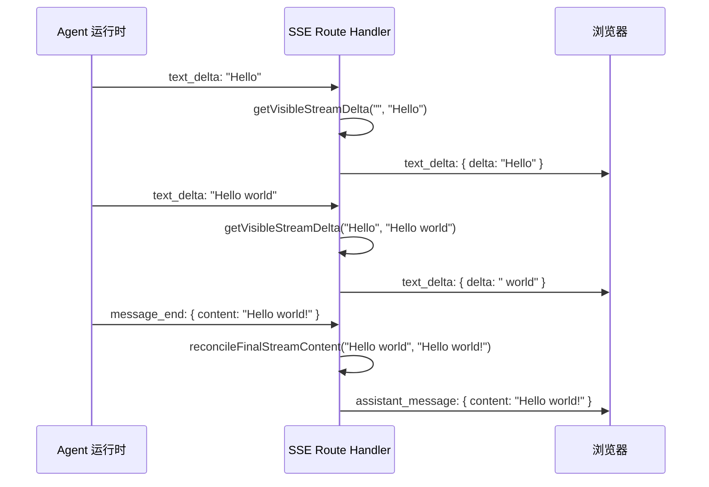

# I15：流式去重与 Content 合并：为什么需要 getVisibleStreamDelta

前两节课分别看了 In-process 和 Runtime 模式的 SSE 实现。它们都使用了 `getVisibleStreamDelta` 和 `reconcileFinalStreamContent` 两个函数。这节课专门解决一个问题：为什么需要这两个函数？流式去重和 content 合并要解决什么问题？

## 1. 问题背景：流式响应中的重复和冲突

当 LLM 生成回复时，Agent 库可能以不同方式推送文本：

1. **增量推送**：每次推送新增的文本片段（delta）。
2. **累积推送**：每次推送到目前为止的全部文本。
3. **混合推送**：有时推送 delta，有时推送完整内容。

不同的事件类型（`text_delta`、`message_update`、`message_end`、`ASSISTANT_MESSAGE`）可能携带相同或重叠的内容。如果不处理，客户端会看到重复文本。

## 2. getVisibleStreamDelta：只推送真正的增量

打开 `lib/integrations/pi-agent/stream-dedupe.ts`（假设路径）：

```ts
interface StreamDeltaResult {
  content: string;  // 累积后的完整内容
  delta: string | null;  // 真正的增量，如果没有则 null
}

export function getVisibleStreamDelta(
  currentContent: string,
  newContent: string
): StreamDeltaResult {
  // 如果 newContent 是 currentContent 的前缀，说明没有新内容
  if (newContent.startsWith(currentContent)) {
    const delta = newContent.slice(currentContent.length);
    return {
      content: newContent,
      delta: delta || null,
    };
  }

  // 如果 currentContent 是 newContent 的前缀，说明 newContent 更短（不应该发生）
  if (currentContent.startsWith(newContent)) {
    return {
      content: currentContent,
      delta: null,
    };
  }

  // 寻找最长公共前缀
  let commonLength = 0;
  const minLength = Math.min(currentContent.length, newContent.length);
  for (let i = 0; i < minLength; i++) {
    if (currentContent[i] === newContent[i]) {
      commonLength++;
    } else {
      break;
    }
  }

  // 如果公共前缀足够长（超过阈值），认为是累积推送，只取增量
  if (commonLength > currentContent.length * 0.8) {
    const delta = newContent.slice(commonLength);
    return {
      content: newContent,
      delta: delta || null,
    };
  }

  // 否则，认为 newContent 是全新的内容
  return {
    content: newContent,
    delta: newContent,
  };
}
```

### 2.1 三种情况的处理

| 情况 | 示例 | 结果 |
| --- | --- | --- |
| `newContent` 是 `currentContent` 的扩展 | `current="Hello"`, `new="Hello world"` | `delta=" world"` |
| `currentContent` 是 `newContent` 的前缀（不应该） | `current="Hello world"`, `new="Hello"` | `delta=null` |
| 部分重叠 | `current="Hello wor"`, `new="Hello world"` | `delta="ld"` |
| 完全不同 | `current="Hello"`, `new="Hi there"` | `delta="Hi there"` |

### 2.2 阈值设计

`commonLength > currentContent.length * 0.8` 这个阈值的意思是：如果两个字符串有 80% 以上的公共前缀，就认为是累积推送，只取增量。

这个阈值是经验值，不是严格的数学推导。它的假设是：LLM 的流式输出通常是连续的，不太可能在中间大幅跳跃。

## 3. reconcileFinalStreamContent：合并流式内容和最终消息

```ts
export function reconcileFinalStreamContent(
  streamContent: string,
  finalContent: string
): string {
  // 如果 finalContent 是 streamContent 的扩展，直接返回 finalContent
  if (finalContent.startsWith(streamContent)) {
    return finalContent;
  }

  // 如果 streamContent 是 finalContent 的扩展（不应该）
  if (streamContent.startsWith(finalContent)) {
    return streamContent;
  }

  // 寻找最长公共前缀
  let commonLength = 0;
  const minLength = Math.min(streamContent.length, finalContent.length);
  for (let i = 0; i < minLength; i++) {
    if (streamContent[i] === finalContent[i]) {
      commonLength++;
    } else {
      break;
    }
  }

  // 如果公共前缀足够长，认为 finalContent 更完整
  if (commonLength > streamContent.length * 0.5) {
    return finalContent;
  }

  // 否则，拼接两者
  return streamContent + finalContent;
}
```

### 3.1 使用场景

`reconcileFinalStreamContent` 在以下场景使用：

1. **`message_end` 事件**：流式输出结束后，Agent 库可能发送一个包含完整消息的事件。
2. **`agent_end` 事件**：非流式模型在任务结束时发送完整消息。
3. **`ASSISTANT_MESSAGE` RuntimeEvent**：子进程发送的完整消息。

### 3.2 与 getVisibleStreamDelta 的区别

| 函数 | 用途 | 输入 | 输出 |
| --- | --- | --- | --- |
| `getVisibleStreamDelta` | 流式去重 | 当前累积内容 + 新内容 | 增量 + 更新后的累积内容 |
| `reconcileFinalStreamContent` | 最终合并 | 流式累积内容 + 最终消息 | 合并后的完整内容 |

## 4. sanitizeAgentDisplayContent：过滤不可见内容

```ts
export function sanitizeAgentDisplayContent(content: unknown): string {
  if (typeof content === 'string') {
    return content;
  }
  if (Array.isArray(content)) {
    return content
      .filter((item): item is { type: string; text?: string } =>
        typeof item === 'object' && item !== null && 'type' in item
      )
      .map(item => item.text || '')
      .join('');
  }
  if (content && typeof content === 'object') {
    return JSON.stringify(content);
  }
  return String(content);
}
```

这个函数的作用：

1. **字符串直接返回**：最常见的输入。
2. **数组提取 text**：LLM 返回的 content 可能是数组（如 Anthropic 的 message content）。
3. **对象 JSON 化**：其他类型的 content 转为字符串。
4. **null/undefined 处理**：转为空字符串。

## 5. 完整流程：一条消息如何被去重和合并



## 6. 失败路径

### 6.1 去重失败导致重复文本

如果 `getVisibleStreamDelta` 的阈值设置不当（如 80% 太高），可能把完全不同的文本当成累积推送，导致内容丢失。

### 6.2 合并失败导致内容截断

如果 `reconcileFinalStreamContent` 的阈值设置不当（如 50% 太低），可能把应该合并的内容当成全新内容，导致重复。

### 6.3 特殊字符导致匹配失败

如果 LLM 输出包含特殊字符（如 emoji、中文），字符串比较的 `startsWith` 可能失败，导致去重失效。

## 7. 测试证据

| 验证方式 | 能证明 | 不能证明 |
| --- | --- | --- |
| 单元测试 | 函数逻辑正确 | 所有 LLM 输出都能正确处理 |
| 运行观察 | 流式输出不重复 | 极端情况不重复 |
| 代码阅读 | 去重逻辑清晰 | 阈值设置最优 |

## 8. 小实验

不运行项目，回答：

1. `getVisibleStreamDelta("Hello", "Hello world")` 和 `getVisibleStreamDelta("Hello world", "Hello")` 分别返回什么？
2. 为什么 `reconcileFinalStreamContent` 的阈值是 50%，而 `getVisibleStreamDelta` 的是 80%？
3. 如果 LLM 输出 `"Hello"` 后突然变成 `"Hi there"`，`getVisibleStreamDelta` 会怎么处理？

参考答案：

1. 前者返回 `{ content: "Hello world", delta: " world" }`，后者返回 `{ content: "Hello world", delta: null }`。
2. `getVisibleStreamDelta` 处理的是流式增量，需要更严格的匹配（80%）来避免误判。`reconcileFinalStreamContent` 处理的是最终合并，允许更大的差异（50%），因为流式内容和最终消息可能有较大差异。
3. 由于 `"Hello"` 和 `"Hi there"` 没有公共前缀（或很短），`getVisibleStreamDelta` 会返回 `{ content: "Hi there", delta: "Hi there" }`，即把新内容当成全新内容推送。

## 9. 章节收束

本节课深入流式去重和 content 合并的实现：`getVisibleStreamDelta` 通过比较当前累积内容和新内容，只推送真正的增量；`reconcileFinalStreamContent` 通过合并流式内容和最终消息，确保内容一致性。`sanitizeAgentDisplayContent` 负责统一 content 格式。

下一节课会看 Abort 接口：`POST /api/agent/abort` 如何中断正在进行的 Agent 操作。
