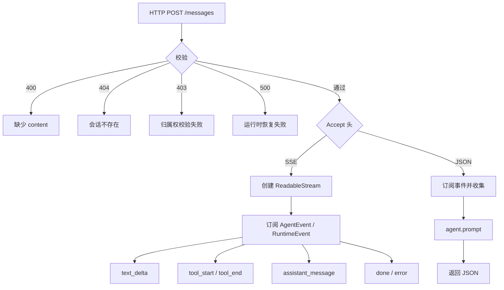
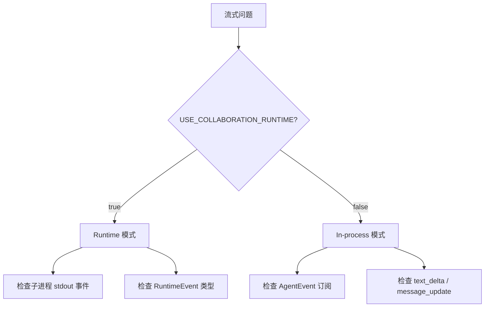
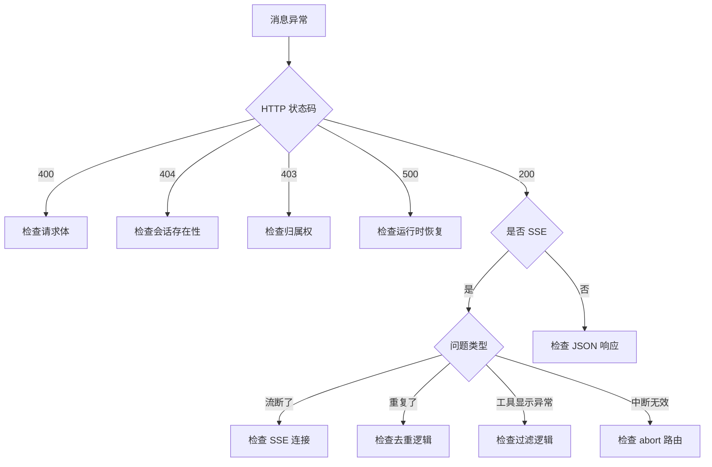

# I17：综合工作坊：消息发送与流式响应排查地图

前五节课（I12–I16）分别看了消息发送、In-process SSE、Runtime SSE、流式去重、Abort 接口。它们若只分别记住，仍不足以解释真实系统。一个合格的理解应当能够回答：当小林说"消息发不出去""流式响应断了""回复重复了"时，应该按什么顺序排查。

本工作坊围绕 `api/agent/sessions/[sessionId]/messages/route.ts` 和 `api/agent/abort/route.ts` 设计，使注意力集中在"消息发送到 SSE 流"的责任划分上。

## 1. 实验边界与预期成果

本实验不依赖真实模型或 LLM 服务。它能够验证消息发送 API 的局部事实，却不能证明 Core Service 内部实现、Agent 运行时行为或 LLM 回复质量都正确。

完成本课后，应能形成一份简短的"消息发送排查地图"，至少包含：

| 项目 | 应能写出的结论 | 对应的源码依据 |
| --- | --- | --- |
| 消息发不出去 | 先检查 400/404/500，再看请求体 | `api/agent/sessions/[sessionId]/messages/route.ts` POST |
| 流式响应断了 | 检查 SSE 连接和 Accept 头 | `api/agent/sessions/[sessionId]/messages/route.ts` 的 `wantsStreaming` |
| 回复重复了 | 检查 `getVisibleStreamDelta` 和 `lastSentDelta` | `createInProcessEventStream` / `createRuntimeEventStream` |
| 工具调用显示异常 | 检查 `sanitizeAgentDisplayContent` 和 `stripToolCodeBlocks` | 同上 |
| 中断无效 | 检查 abort 路由和 USE_COLLABORATION_RUNTIME | `api/agent/abort/route.ts` |

## 2. 总体认知图：一张消息发送地图



这张图只回答一个问题：一条消息进入 OriginOS 的 Agent 消息 API，会经历哪些阶段？

读图时分三层：

1. **最外层是 HTTP 请求**：校验、恢复、分支。
2. **中间层是 SSE 流**：事件订阅、去重、推送。
3. **最内层是 Core Service**：Agent 运行时、LLM 调用，属于 Part E/F 的范畴。

本单元只要求掌握外层和中层。内层 Core Service 在后续课程展开。

## 3. 核心区分：三种容易混淆的场景

### 3.1 消息发送失败 vs 流式响应失败

| 问题 | 检查点 | 状态码 |
| --- | --- | --- |
| "消息发不出去" | 请求体、会话存在性、归属权 | 400/404/403 |
| "流式响应断了" | SSE 连接、事件类型 | — |
| "回复重复了" | 去重逻辑、事件顺序 | — |
| "工具调用显示异常" | 过滤逻辑、content 格式 | — |

### 3.2 In-process 模式 vs Runtime 模式



排查口诀：

1. 先看环境变量，确认 runtime 还是 in-process。
2. Runtime 模式问题看子进程事件和 RuntimeEvent。
3. In-process 模式问题看 AgentEvent 订阅和去重。
4. 内容重复问题先去重逻辑。
5. 工具调用显示问题先看过滤逻辑。

### 3.3 Abort vs Destroy

| 操作 | 作用对象 | 实例保留？ | 典型场景 |
| --- | --- | --- | --- |
| Abort | 当前操作 | 是 | 用户点击"停止" |
| Destroy | 实例本身 | 否 | 窗口关闭 |

## 4. 章节因果链

I12—I17 不是六个孤立文件介绍。它们按"从消息发送到 SSE 流式响应"的顺序，逐步补全判断能力。

| 课次 | 补上的判断能力 | 关键源码锚点 |
| --- | --- | --- |
| I12 | 能追踪消息从 HTTP 到 SSE 的完整链路 | `api/agent/sessions/[sessionId]/messages/route.ts` 的 POST |
| I13 | 能理解 In-process 模式的 SSE 事件订阅和推送 | `createInProcessEventStream` |
| I14 | 能理解 Runtime 模式的 RuntimeEvent 拦截和推送 | `createRuntimeEventStream` |
| I15 | 能理解流式去重和 content 合并 | `getVisibleStreamDelta`、`reconcileFinalStreamContent` |
| I16 | 能区分 abort 和 destroy 的语义 | `api/agent/abort/route.ts` |
| I17 | 能把消息和流式响应知识转成可验证的排查能力 | 复用上述文件 |

## 5. 源码覆盖台账

| 课次 | 已直接精读的生产源码 | 配对测试或验证入口 | 本单元只证明什么 |
| --- | --- | --- | --- |
| I12 | `api/agent/sessions/[sessionId]/messages/route.ts` 的 POST | 无单元测试 | 消息发送、归属权校验、SSE 分支选择 |
| I13 | `createInProcessEventStream` 函数 | 无单元测试 | In-process 模式的 SSE 事件订阅和推送 |
| I14 | `createRuntimeEventStream` 函数 | 无单元测试 | Runtime 模式的 RuntimeEvent 拦截和推送 |
| I15 | `getVisibleStreamDelta`、`reconcileFinalStreamContent`、`sanitizeAgentDisplayContent` | 无单元测试 | 流式去重、content 合并、工具调用过滤 |
| I16 | `api/agent/abort/route.ts` | 无单元测试 | Abort 的双模式实现和三层兜底 |
| I17 | 不新增生产逻辑；复用上述文件 | 纸面推演 + 运行观察 | 把消息和流式响应知识转成可验证的排查能力 |

相邻但尚未精读的文件：`api/agent/projects/[projectId]/messages/route.ts`（项目级消息，U4）、`api/agent/projects/[projectId]/start/route.ts`、`api/agent/projects/[projectId]/stop/route.ts`（项目级 Agent 生命周期，U4）。

## 6. 排查地图：看到异常时先看哪一层



排查口诀：

1. 先看 HTTP 状态码，区分客户端错误和服务器错误。
2. 消息发送问题先看请求体和归属权校验。
3. 流式问题先看 SSE 连接是否建立。
4. 内容重复问题先去重逻辑。
5. 工具调用显示问题先看过滤逻辑。
6. 中断无效问题先看 abort 路由和 runtime 模式。

## 7. 综合实验：纸面推演

下面给出几个场景，要求不查代码也能推断系统行为和排查方向。

### 场景 A：消息发送返回 404

```text
POST /api/agent/sessions/s1/messages
Body: { content: "Hello", projectId: "p1" }
```

合格推演：
- 原因：会话 `s1` 不存在。
- 排查：检查 `s1` 是否通过 `POST /sessions` 创建。
- 修复：先创建会话，再发送消息。

### 场景 B：SSE 流没有收到任何事件

```text
POST /api/agent/sessions/s1/messages
Headers: Accept: text/event-stream
Body: { content: "Hello", projectId: "p1" }
```

合格推演：
- 可能原因 1：SSE 连接未建立（网络问题）。
- 可能原因 2：Agent 运行时未恢复，导致没有事件产生。
- 可能原因 3：Runtime 模式下子进程未启动。
- 排查：
  1. 检查浏览器 Network 面板，确认 SSE 连接已建立。
  2. 检查 `agentManager.getOrRestoreAgentRuntime` 是否成功。
  3. 检查 `USE_COLLABORATION_RUNTIME` 和子进程状态。

### 场景 C：回复内容重复

```text
SSE 流中收到多个相同的 text_delta
```

合格推演：
- 原因：`getVisibleStreamDelta` 去重失败，或 `lastSentDelta` 检查失效。
- 排查：
  1. 检查 `text_delta` 和 `message_update` 是否同时推送了相同内容。
  2. 检查 `getVisibleStreamDelta` 的阈值设置。
  3. 检查 `lastSentDelta` 是否在正确时机更新。

### 场景 D：Abort 后 Agent 仍在运行

```text
POST /api/agent/abort
Body: { agentId: "project-p1" }
```

合格推演：
- 可能原因 1：Agent 未找到（三层兜底都未命中）。
- 可能原因 2：Abort 后 LLM 调用仍在继续。
- 排查：
  1. 检查 abort 路由的日志，确认是否找到 Agent。
  2. 检查 `proc.abort()` 是否成功执行。
  3. 检查 LLM 调用是否可中断。

## 8. 测试证据范围与缺口

| 证据类型 | 已验证 | 未验证 |
| --- | --- | --- |
| 运行观察 | 各 API 能响应 | 所有错误分支都正确处理 |
| 代码阅读 | 事件订阅和推送逻辑清晰 | Core Service 内部实现 |
| 纸面推演 | 能根据场景推断行为 | 多并发场景 |

本单元没有自动化测试。这是因为消息发送高度依赖 Core Service 和 LLM，单元测试成本较高。后续 Core Service 单元会补充有测试的代码。

## 9. 口头验收

学完 I12—I17 后，不看正文也应能回答下面六个问题：

1. `POST /sessions/{id}/messages` 在什么条件下返回 SSE 流，什么条件下返回 JSON？
2. In-process 模式的 SSE 和 Runtime 模式的 SSE 有什么区别？
3. `text_delta` 和 `assistant_message` 事件有什么区别？
4. 为什么需要 `getVisibleStreamDelta` 和 `reconcileFinalStreamContent`？
5. `POST /api/agent/abort` 和 `POST /sessions/{id}/destroy` 有什么区别？
6. 如果 SSE 流中断了，应该按什么顺序排查？

合格回答不要求背诵源码行号，但必须能说出事件类型、责任边界和排查顺序。能说清"哪个阶段出问题了"，比只说清"调用了哪个 API"更重要。

## 10. I12—I17 单元结论

OriginOS 的 Agent 消息 API 不是简单的请求-响应，而是"请求 → 订阅 → 流式推送"的长连接模式：

- `POST /sessions/{id}/messages` 发送消息，根据 Accept 头返回 SSE 或 JSON。
- In-process 模式通过 `agent.subscribe` 订阅 AgentEvent。
- Runtime 模式通过拦截子进程 stdout 的 RuntimeEvent。
- `getVisibleStreamDelta` 和 `reconcileFinalStreamContent` 处理流式去重和 content 合并。
- `POST /api/agent/abort` 中断正在进行的操作，保留实例。

这一单元还没有解释项目级 Agent 如何启动、停止、发送消息。现在具备消息发送地图后，下一单元才能准确分析项目级 Agent 的生命周期，而不会把"消息发送失败"当成"项目级 Agent 有 bug"。

因此，本单元可以压缩成一句话：

> 消息发送不是请求-响应，而是订阅-推送；先确认 SSE 连接建立成功，再确认事件类型正确，最后才检查内容去重和过滤。

这句话会在后续项目级 Agent 和多 Agent 协作单元里继续使用。
