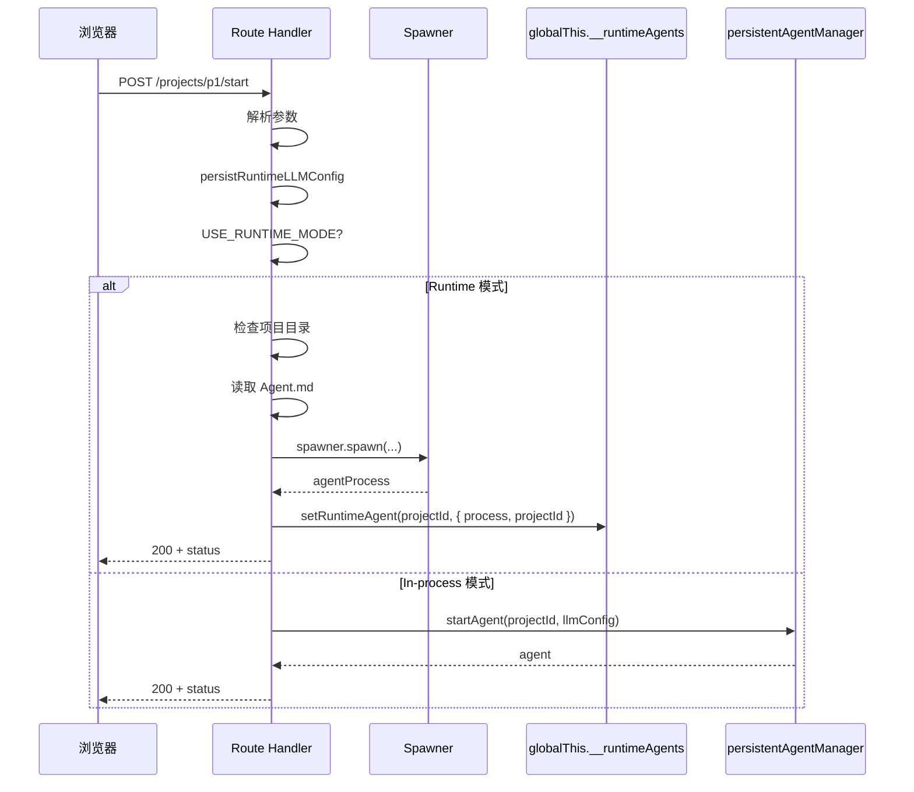

# I18：POST /api/agent/projects/{projectId}/start：项目级 Agent 如何启动

上一单元追踪了会话级 Agent 的消息发送与流式响应。这节课回到项目级 Agent 的生命周期起点：`POST /api/agent/projects/{projectId}/start`。当小林点击"启动项目 Agent"时，浏览器会调用这个接口。这节课解决的问题是：项目级 Agent 从 HTTP POST 到运行时实例，经历了哪些阶段？

## 1. 请求体包含什么

典型的请求体：

```json
{
  "sessionId": "project-p1",
  "llmConfig": {
    "provider": "openai",
    "model": "gpt-4"
  }
}
```

`sessionId` 默认为 `"project-{projectId}"`，用于标识项目级 Agent 的会话。

## 2. Route Handler 的实现

打开 `app/api/agent/projects/[projectId]/start/route.ts`（第 24–74 行）：

```ts
export async function POST(
	request: NextRequest,
	{ params }: { params: Promise<{ projectId: string }> }
) {
	try {
		const { projectId } = await params;
		const body = await request.json();
		const sessionId: string = body?.sessionId ?? `project-${projectId}`;
		const llmConfig = body?.llmConfig as RuntimeLLMConfig | undefined;
		persistRuntimeLLMConfig(llmConfig);

		console.log(`[API] Starting agent for project: ${projectId}`, {
			runtimeMode: USE_RUNTIME_MODE,
		});

		let status: any;

		if (USE_RUNTIME_MODE) {
			status = await startAgentViaRuntime(projectId, sessionId);
		} else {
			// In-process 模式（原有逻辑）
			const agent = await persistentAgentManager.startAgent(projectId, llmConfig);
			status = agent.getStatus();
		}

		return NextResponse.json<ApiResponse<{ status: any }>>(
			{
				success: true,
				data: {
					status,
				},
				timestamp: new Date().toISOString(),
			},
			{ status: 200 }
		);
	} catch (error) {
		// ... 500 处理
	}
}
```

核心逻辑：

1. **解析参数**：`projectId` 从 URL 路径获取，`sessionId` 和 `llmConfig` 从 body 获取。
2. **持久化 LLM 配置**：`persistRuntimeLLMConfig` 把配置写到运行时。
3. **双分支**：Runtime 模式调用 `startAgentViaRuntime`，In-process 模式调用 `persistentAgentManager.startAgent`。

## 3. Runtime 模式：startAgentViaRuntime

```ts
async function startAgentViaRuntime(projectId: string, sessionId: string): Promise<any> {
	const projectDir = path.join(getDataRoot(), 'projects', projectId);

	// 检查项目目录是否存在
	try {
		await fs.access(projectDir);
	} catch {
		throw new Error(`Project directory not found: ${projectDir}`);
	}

	// 根据 Agent.md frontmatter 中的 agentType 决定运行时类型
	let agentType: 'persistent' | 'originos' = 'persistent';
	let systemPrompt: string | undefined;
	try {
		const agentMd = await fs.readFile(path.join(projectDir, 'Agent.md'), 'utf-8');
		systemPrompt = agentMd;
		const fmMatch = agentMd.match(/^---\n([\s\S]*?)\n---/);
		if (fmMatch?.[1]) {
			const agentTypeMatch = fmMatch[1].match(/^agentType:\s*(.+)$/m);
			if (agentTypeMatch?.[1]) {
				const rawType = agentTypeMatch[1].trim().toLowerCase();
				agentType = rawType === 'interview' ? 'persistent' : 'originos';
			}
		}
	} catch {
		console.warn(`[API] Agent.md not found for project ${projectId}, using default prompt`);
		systemPrompt = 'You are a helpful project assistant.';
	}
```

关键步骤：

1. **检查项目目录**：如果项目目录不存在，直接抛异常。
2. **读取 Agent.md**：解析 frontmatter 中的 `agentType`。
3. **决定运行时类型**：`interview` → `persistent`，其他 → `originos`。

### 3.1 Spawner 启动子进程

```ts
	const agentId = sessionId;
	const spawner = getGlobalSpawner();

	console.log(`[API] Runtime mode: Spawning agent worker for project ${projectId}`, {
		projectId,
		workingDirectory: projectDir,
		agentType,
	});

	const agentProcess = await spawner.spawn(
		{
			projectId,
			agentId,
			workingDirectory: projectDir,
			agentType,
			systemPrompt,
		},
		(event: RuntimeEvent) => {
			console.log(`[API] Runtime event from project ${projectId}: ${event.type}`);
		}
	);

	// 注册到共享注册表，仅存 process，不存 spawner
	setRuntimeAgent(projectId, { process: agentProcess, projectId });

	console.log(`[API] Runtime mode: Agent worker started for project ${projectId}, status: ${agentProcess.getStatus()}`);

	return agentProcess.getStatus();
}
```

关键点：

1. **`spawner.spawn`**：创建子进程，传入项目 ID、Agent ID、工作目录、类型、系统提示词。
2. **事件回调**：子进程的事件通过这个回调输出日志。
3. **注册到 globalThis**：`setRuntimeAgent` 把子进程引用保存到全局注册表。
4. **返回状态**：`agentProcess.getStatus()` 返回子进程的初始状态。

## 4. In-process 模式：persistentAgentManager.startAgent

In-process 模式相对简单：

```ts
const agent = await persistentAgentManager.startAgent(projectId, llmConfig);
status = agent.getStatus();
```

`persistentAgentManager.startAgent` 的职责：

1. 检查项目目录是否存在。
2. 读取 `Agent.md` 和 `Role.md`。
3. 创建 `ProjectAgent` 实例。
4. 返回 Agent 包装器。

具体实现属于 Part E/F。

## 5. 调用链对比



## 6. 失败路径

### 6.1 项目目录不存在

Runtime 模式下，`fs.access(projectDir)` 失败会抛异常，返回 500。In-process 模式下，`persistentAgentManager.startAgent` 内部处理。

### 6.2 Agent.md 不存在

Runtime 模式下，如果 `Agent.md` 不存在，使用默认提示词：`'You are a helpful project assistant.'`。In-process 模式下，具体处理属于 Part E/F。

### 6.3 Spawner 启动失败

`spawner.spawn` 可能失败（如端口占用、内存不足）。失败会抛异常，返回 500。

### 6.4 重复启动

如果项目级 Agent 已经启动，`spawner.spawn` 可能返回已有实例或创建新实例。具体行为取决于 Spawner 的实现。

## 7. 测试证据

| 验证方式 | 能证明 | 不能证明 |
| --- | --- | --- |
| `curl` 调用 start | 能启动 Agent | Core Service 所有分支都正确 |
| `curl` 重复调用 start | 能处理重复启动 | 重复启动的行为一定正确 |
| 检查 globalThis.__runtimeAgents | 子进程被注册 | 子进程一定在运行 |

## 8. 小实验

不运行项目，回答：

1. 为什么 Runtime 模式下需要读取 `Agent.md`，而 In-process 模式下不需要？
2. 如果 `Agent.md` 的 frontmatter 中 `agentType` 是 `interview`，实际使用什么运行时类型？
3. `setRuntimeAgent` 和 `spawner.spawn` 的 `agentId` 有什么关系？

参考答案：

1. Runtime 模式下，Route Handler 需要把 `agentType` 和 `systemPrompt` 传给子进程。In-process 模式下，`persistentAgentManager` 内部读取 `Agent.md`。
2. `interview` → `persistent`。这是硬编码的映射。
3. `spawner.spawn` 的 `agentId` 用于子进程标识，`setRuntimeAgent` 的 `projectId` 用于全局注册表查找。两者通常相同（`project-{projectId}`）。

## 9. 章节收束

本节课追踪了 `POST /api/agent/projects/{projectId}/start` 的完整变形：从 HTTP 请求体到参数解析、LLM 配置持久化、Agent.md 解析、子进程启动，最终到状态返回。Route Handler 的核心责任是边界适配和模式选择，而不是业务语义生成。

下一节课会看项目级 Agent 的消息发送：`POST /api/agent/projects/{projectId}/messages`。
