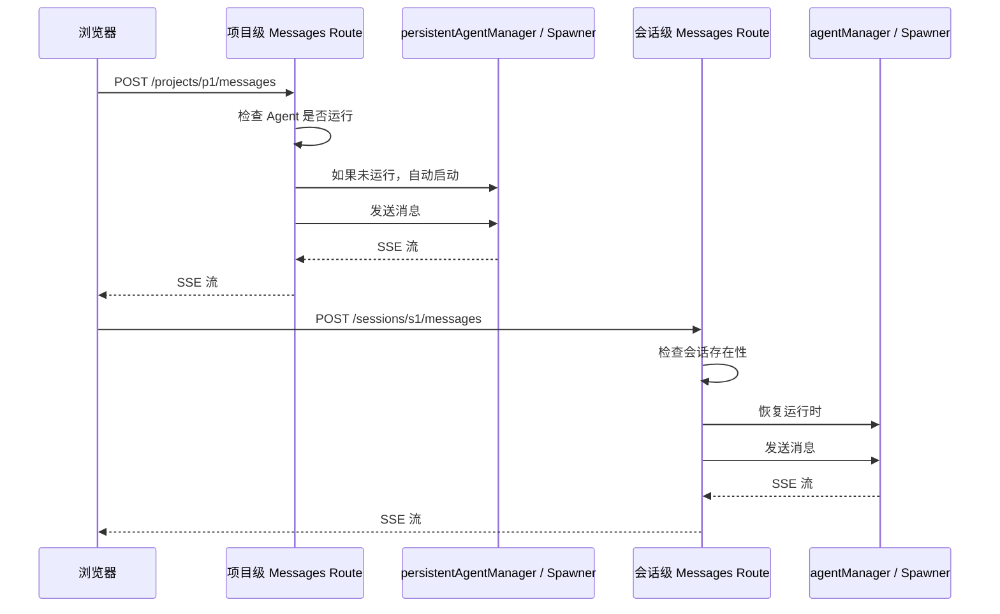

# I19：POST /api/agent/projects/{projectId}/messages：项目级消息如何发送

上一节课追踪了项目级 Agent 的启动。这节课看消息发送：`POST /api/agent/projects/{projectId}/messages`。当小林在项目窗口里输入消息并点击发送时，浏览器会调用这个接口。这节课解决的问题是：项目级消息与会话级消息有什么区别？

## 1. 请求体包含什么

典型的请求体：

```json
{
  "content": "帮我分析一下这个项目",
  "sessionId": "project-p1",
  "llmConfig": {
    "provider": "openai",
    "model": "gpt-4"
  }
}
```

与会话级消息的区别：

| 维度 | 项目级消息 | 会话级消息 |
| --- | --- | --- |
| HTTP 路径 | `/api/agent/projects/{projectId}/messages` | `/api/agent/sessions/{sessionId}/messages` |
| 标识 | `projectId` | `sessionId` |
| 管理器 | `persistentAgentManager` / `spawner` | `agentManager` / `spawner` |
| 自动启动 | 是（如果未运行） | 否（需要预先创建会话） |
| 系统触发消息 | 支持 `__SYSTEM_TRIGGER_GREETING__` | 不支持 |

## 2. Route Handler 的实现

打开 `app/api/agent/projects/[projectId]/messages/route.ts` 的 POST 处理函数（第 91–199 行）：

```ts
export async function POST(
  request: NextRequest,
  { params }: { params: Promise<{ projectId: string }> }
) {
  try {
    const { projectId } = await params;
    const body = await request.json();

    if (!body.content) {
      return NextResponse.json<ApiResponse<unknown>>(
        {
          success: false,
          error: {
            code: 'INVALID_REQUEST',
            message: 'content is required',
          },
          timestamp: new Date().toISOString(),
        },
        { status: 400 }
      );
    }

    // 系统触发消息处理：替换为隐藏指令，不暴露给用户
    const actualContent = body.content === SYSTEM_TRIGGER_GREETING
      ? SYSTEM_GREETING_PROMPT
      : body.content;
    const isSystemTriggered = body.content === SYSTEM_TRIGGER_GREETING;
    const llmConfig = body?.llmConfig as RuntimeLLMConfig | undefined;
    persistRuntimeLLMConfig(llmConfig);
```

核心逻辑：

1. **content 必填**：与会话级消息相同。
2. **系统触发消息**：`__SYSTEM_TRIGGER_GREETING__` 是特殊值，替换为系统提示词。
3. **LLM 配置持久化**：`persistRuntimeLLMConfig` 把配置写到运行时。

### 2.1 系统触发消息

```ts
const SYSTEM_TRIGGER_GREETING = '__SYSTEM_TRIGGER_GREETING__';
const SYSTEM_GREETING_PROMPT = `系统启动触发: 请按照你的工作模式中的"启动时状态判断"流程，先列出 output 目录；仅当 business-model.json 存在时才读取它。文件不存在是正常的全新项目状态，请直接开始 Phase 1 访谈；文件存在时按内容判断后续阶段并生成相应问候语。`;
```

这是项目级 Agent 的特殊机制：启动时自动发送一条隐藏的系统消息，触发 Agent 执行初始化流程。用户看不到这条消息，但 Agent 会按系统提示词执行。

## 3. 自动启动机制

```ts
    if (USE_RUNTIME_MODE) {
      return await sendRuntimeMessage(projectId, actualContent, body.sessionId, isSystemTriggered, wantsStreaming);
    }

    // 获取运行中的 Agent（如果未启动则自动启动）
    let agent = persistentAgentManager.getAgent(projectId);
    if (!agent) {
      console.log(`[API] Agent not running for ${projectId}, attempting auto-start...`);
      try {
        agent = await persistentAgentManager.startAgent(projectId, llmConfig);
      } catch (startError) {
        console.error('[API] Auto-start failed:', startError);
        return NextResponse.json<ApiResponse<unknown>>(
          {
            success: false,
            error: {
              code: 'AGENT_NOT_RUNNING',
              message: 'Agent is not running. Please start the agent first.',
            },
            timestamp: new Date().toISOString(),
          },
          { status: 400 }
        );
      }
    }
```

关键区别：

1. **Runtime 模式**：直接调用 `sendRuntimeMessage`，如果 Agent 未启动会尝试自动启动。
2. **In-process 模式**：`persistentAgentManager.getAgent` 获取 Agent，如果不存在则自动启动。
3. **自动启动失败**：如果启动失败，返回 400（不是 500，因为这是客户端可以修复的——先调用 start）。

## 4. SSE 流式响应

### 4.1 In-process 模式的 SSE

```ts
    if (wantsStreaming) {
      // 返回 SSE 流
      const stream = createEventStream(agent, actualContent, body.sessionId, isSystemTriggered);
      return new Response(stream, {
        headers: {
          'Content-Type': 'text/event-stream',
          'Cache-Control': 'no-cache',
          'Connection': 'keep-alive',
        },
      });
    }
```

`createEventStream` 的实现与会话级消息类似，但有一些区别：

1. **系统触发消息不发送 user_message**：`if (!isSystemTriggered) { send(...) }`。
2. **工具调用过滤**：`stripToolCodeBlocks` 过滤工具调用描述。
3. **completionFailure 处理**：如果 `message_end` 的 `completionFailure` 为 true，发送 error 事件。

### 4.2 Runtime 模式的 SSE

Runtime 模式下，`sendRuntimeMessage` 和 `createRuntimeEventStream` 的实现与会话级消息类似，但有一些区别：

1. **自动启动**：如果 Agent 未启动，自动调用 `startProjectAgentViaRuntime`。
2. **项目目录检查**：启动前检查项目目录是否存在。
3. **Agent.md 解析**：启动时读取 `Agent.md` 的 frontmatter。

## 5. 工具调用过滤

```ts
function stripToolCodeBlocks(content: string): string {
  // 1. 移除 code block（如果是工具调用或纯 JSON 结果）
  let result = content.replace(/```(?:json)?\s*\n([\s\S]*?)```/g, (match) => {
    return isToolCallOnlyContent(match) ? '' : match;
  });
  // 2. 逐行过滤：移除工具调用描述行
  result = result.split('\n').filter(line => {
    const trimmed = line.trim();
    if (trimmed === '') return false;
    if (/[*`]\s*[\(（]\s*(调用工具|Calling|Tool call)\s*[:：\s]/i.test(trimmed)) return false;
    if (/\*\*工具\s*[:：\s]/i.test(trimmed)) return false;
    if (/^\{?\s*"status"\s*:/i.test(trimmed)) return false;
    if (isToolCallOnlyContent(trimmed)) return false;
    return true;
  }).join('\n');
  // 3. 移除行内的 functionName(...) 模式
  result = result.replace(/[a-z_]+\s*\([^)]{0,200}\)/gi, '').trim();
  // 4. 清理空行
  result = result.replace(/\n{3,}/g, '\n\n').trim();
  return result;
}
```

工具调用过滤的作用：

1. **移除 code block**：如果 code block 包含工具调用，直接移除。
2. **逐行过滤**：移除包含"调用工具"、"Tool call"等描述的行。
3. **移除函数调用语法**：`funcName(...)` 模式。
4. **清理空行**：把多个空行合并为两个。

这是为了防止 LLM 的工具调用描述显示给用户，只显示实际的回复内容。

## 6. 与会话级消息的对比



## 7. 失败路径

### 7.1 Agent 未启动且自动启动失败

返回 400。客户端需要先调用 `POST /projects/{id}/start` 手动启动。

### 7.2 系统触发消息被用户看到

如果前端没有正确处理 `isSystemTriggered`，系统触发消息可能显示给用户。这是前端的问题，不是 Route Handler 的问题。

### 7.3 工具调用过滤过度

`stripToolCodeBlocks` 可能误删正常内容。例如，如果回复中包含合法的 JSON code block，也会被移除。

## 8. 测试证据

| 验证方式 | 能证明 | 不能证明 |
| --- | --- | --- |
| `curl` 发送消息 | 能返回 SSE 流 | 工具调用过滤一定正确 |
| `curl` 发送系统触发消息 | 能触发隐藏消息 | 系统提示词一定正确 |
| `curl` 未启动时发送消息 | 能自动启动 | 自动启动一定成功 |

## 9. 小实验

不运行项目，回答：

1. 为什么项目级消息支持自动启动，而会话级消息不支持？
2. `__SYSTEM_TRIGGER_GREETING__` 的作用是什么？为什么需要隐藏？
3. `stripToolCodeBlocks` 可能有什么副作用？

参考答案：

1. 项目级 Agent 的生命周期与项目绑定，通常需要长期运行。会话级 Agent 的生命周期与会话绑定，通常需要显式创建。
2. `__SYSTEM_TRIGGER_GREETING__` 是系统触发消息，用于启动时自动执行初始化流程。隐藏是为了不干扰用户，让用户感觉 Agent 是"主动"问候的。
3. 可能误删包含工具调用描述的正常内容，或合法的 JSON code block。

## 10. 章节收束

本节课追踪了 `POST /api/agent/projects/{projectId}/messages` 的实现：从请求体解析、系统触发消息处理、自动启动、SSE 流式响应，到工具调用过滤。项目级消息与会话级消息的核心区别在于自动启动和系统触发消息。

下一节课会看项目级 Agent 的状态查询：`GET /api/agent/projects/{projectId}/messages`。
