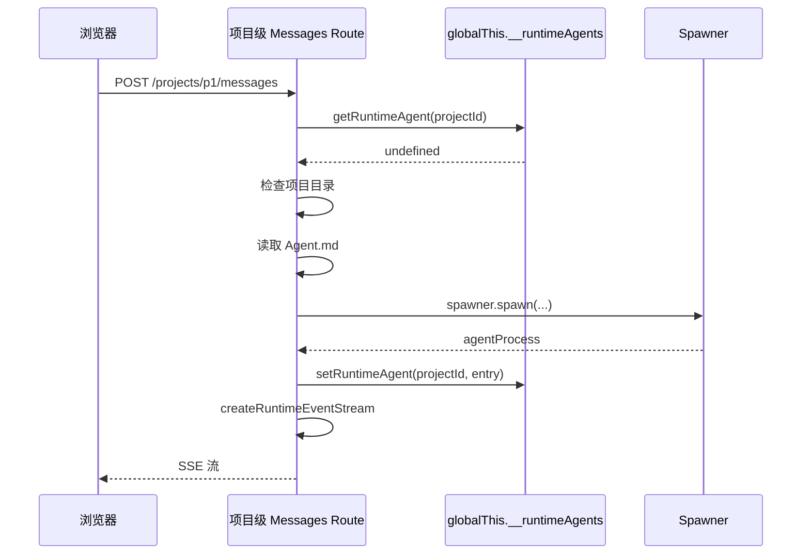

# I23：Runtime 模式下的项目级消息发送

I19 课看了项目级消息发送的 In-process 模式。这节课深入 Runtime 模式：`sendRuntimeMessage` 和 `createRuntimeEventStream` 的项目级版本。它们与会话级 Runtime 消息发送类似，但有一些关键区别。

## 1. sendRuntimeMessage 的实现

打开 `app/api/agent/projects/[projectId]/messages/route.ts` 的 `sendRuntimeMessage` 函数（第 329–389 行）：

```ts
async function sendRuntimeMessage(
  projectId: string,
  content: string,
  _sessionId: string,
  isSystemTriggered: boolean,
  wantsStreaming: boolean
): Promise<NextResponse | Response> {
  // 从共享注册表获取 runtime agent
  let runtimeEntry = getRuntimeAgent(projectId);
  if (!runtimeEntry) {
    console.log(`[API] Runtime mode: No agent in registry for ${projectId}, attempting auto-start...`);
    runtimeEntry = await startProjectAgentViaRuntime(projectId, _sessionId);
  }

  if (!runtimeEntry || runtimeEntry.process.getStatus() !== 'running') {
    console.error(`[API] Runtime mode: Agent not running for ${projectId}, status=${runtimeEntry?.process.getStatus()}`);
    return NextResponse.json<ApiResponse<unknown>>(
      {
        success: false,
        error: {
          code: 'AGENT_NOT_RUNNING',
          message: 'Agent is not running',
        },
        timestamp: new Date().toISOString(),
      },
      { status: 400 }
    );
  }

  console.log(`[API] Runtime mode: Sending message to agent ${projectId}, streaming=${wantsStreaming}`);

  if (wantsStreaming) {
    return createRuntimeEventStream(runtimeEntry, content, isSystemTriggered);
  }

  // 非流式：发送 prompt 并等待完成
  try {
    await runtimeEntry.process.prompt(content);
  } catch (error) {
    return NextResponse.json<ApiResponse<unknown>>(
      {
        success: false,
        error: {
          code: 'MESSAGE_SEND_FAILED',
          message: error instanceof Error ? error.message : 'Unknown error',
        },
        timestamp: new Date().toISOString(),
      },
      { status: 500 }
    );
  }

  return NextResponse.json<ApiResponse<{ message: string }>>(
    {
      success: true,
      data: { message: 'Message sent successfully' },
      timestamp: new Date().toISOString(),
    },
    { status: 200 }
  );
}
```

核心逻辑：

1. **获取 runtime agent**：从全局注册表获取。
2. **自动启动**：如果未找到，自动启动。
3. **检查状态**：如果 Agent 未运行，返回 400。
4. **SSE 或非 SSE**：根据 `wantsStreaming` 决定。

## 2. 自动启动：startProjectAgentViaRuntime

```ts
async function startProjectAgentViaRuntime(projectId: string, sessionId?: string): Promise<ProjectRuntimeAgent> {
  const existing = getRuntimeAgent(projectId);
  if (existing) return existing;

  const projectDir = path.join(getDataRoot(), 'projects', projectId);
  try {
    await fs.access(projectDir);
  } catch {
    throw new Error(`Project directory not found: ${projectDir}`);
  }

  // 根据 Agent.md frontmatter 中的 agentType 决定运行时类型
  let agentType: 'persistent' | 'originos' = 'persistent';
  let systemPrompt: string | undefined;
  try {
    const agentMd = await fs.readFile(path.join(projectDir, 'Agent.md'), 'utf-8');
    systemPrompt = agentMd;
    const fmMatch = agentMd.match(/^---\n([\s\S]*?)\n---/);
    if (fmMatch?.[1]) {
      const agentTypeMatch = fmMatch[1].match(/^agentType:\s*(.+)$/m);
      if (agentTypeMatch?.[1]) {
        const rawType = agentTypeMatch[1].trim().toLowerCase();
        agentType = rawType === 'interview' ? 'persistent' : 'originos';
      }
    }
  } catch {
    console.warn(`[API] Agent.md not found for project ${projectId}`);
    systemPrompt = 'You are a helpful project assistant.';
  }

  console.log(`[API] Runtime mode: Spawning project agent for ${projectId}, agentType=${agentType}`);

  const spawner = getGlobalSpawner();
  const agentId = sessionId ?? `project-${projectId}`;
  const agentProcess = await spawner.spawn(
    {
      projectId,
      agentId,
      workingDirectory: projectDir,
      agentType,
      systemPrompt,
    },
    (event: RuntimeEvent) => {
      console.log(`[API] Runtime event from project ${projectId}: ${event.type}`);
    }
  );

  const entry: ProjectRuntimeAgent = { process: agentProcess, projectId };
  setRuntimeAgent(projectId, entry);
  console.log(`[API] Runtime mode: Project agent started for ${projectId}`);
  return entry;
}
```

与会话级自动启动的区别：

| 维度 | 项目级 | 会话级 |
| --- | --- | --- |
| 触发时机 | 消息发送时自动启动 | 需要显式调用 start |
| 项目目录检查 | 是 | 否 |
| Agent.md 解析 | 是 | 否 |
| 注册表 | `setRuntimeAgent(projectId, entry)` | 类似 |

## 3. createRuntimeEventStream 的项目级版本

项目级的 `createRuntimeEventStream` 与会话级类似，但有一些区别：

### 3.1 系统触发消息处理

```ts
        if (!isSystemTriggered) {
          send({
            type: 'user_message',
            data: { content: userContent, timestamp: Date.now() },
          });
        }
```

系统触发消息不发送 `user_message` 事件，避免前端显示隐藏消息。

### 3.2 工具调用事件

```ts
            case 'TOOL_CALL':
              enqueueEvent({
                type: 'tool_start',
                data: {
                  toolName: event.payload?.['toolName'],
                  args: event.payload?.['args'],
                },
              });
              break;
            case 'TOOL_RESULT':
              enqueueEvent({
                type: 'tool_end',
                data: {
                  toolName: event.payload?.['toolName'],
                  result: event.payload?.['result'],
                  isError: event.payload?.['isError'],
                },
              });
              break;
```

与会话级的区别：项目级版本不发送 `toolCallId`，因为项目级 Agent 的工具调用不需要唯一标识。

### 3.3 MESSAGE_SENT 的处理

```ts
            case 'MESSAGE_SENT': {
              const delta = event.payload?.['delta'];
              const text = event.payload?.['text'];
              const newText = typeof delta === 'string'
                ? sanitizeAgentDisplayContent(delta)
                : typeof text === 'string'
                  ? sanitizeAgentDisplayContent(text)
                  : null;
              if (newText) {
                const merged = getVisibleStreamDelta(sentTextAccumulator, newText);
                sentTextAccumulator = merged.content;
                if (merged.delta) {
                  enqueueEvent({ type: 'text_delta', data: { delta: merged.delta } });
                }
              }
              break;
            }
```

与会话级相同，使用 `getVisibleStreamDelta` 去重。

## 4. 与会话级 Runtime 消息发送的对比



## 5. 失败路径

### 5.1 自动启动失败

如果项目目录不存在或 Agent.md 解析失败，自动启动会抛异常，返回 500。

### 5.2 状态检查失败

如果 Agent 启动后状态不是 `running`，返回 400。这可能是因为子进程启动失败或初始化超时。

### 5.3 非流式发送失败

`runtimeEntry.process.prompt(content)` 可能失败，返回 500。

## 6. 测试证据

| 验证方式 | 能证明 | 不能证明 |
| --- | --- | --- |
| `curl` 发送消息（未启动） | 能自动启动 | 自动启动一定成功 |
| `curl` 发送消息（已启动） | 能返回 SSE | 所有事件类型都正确 |
| 检查注册表 | 子进程被注册 | 子进程一定在运行 |

## 7. 小实验

不运行项目，回答：

1. 为什么项目级消息发送支持自动启动，而会话级不支持？
2. 如果 `Agent.md` 不存在，自动启动会使用什么提示词？
3. 项目级和会话级的 `createRuntimeEventStream` 有什么区别？

参考答案：

1. 项目级 Agent 的生命周期与项目绑定，通常需要长期运行。会话级 Agent 的生命周期与会话绑定，通常需要显式创建。
2. `'You are a helpful project assistant.'`。
3. 项目级版本不发送 `toolCallId`，系统触发消息不发送 `user_message`。

## 8. 章节收束

本节课深入 Runtime 模式下的项目级消息发送：`sendRuntimeMessage` 自动启动 Agent、`startProjectAgentViaRuntime` 读取 Agent.md 并启动子进程、`createRuntimeEventStream` 拦截 RuntimeEvent 并推送到 SSE。

下一节课会看工具调用过滤和 content 处理：`stripToolCodeBlocks` 和 `isToolCallOnlyContent`。
