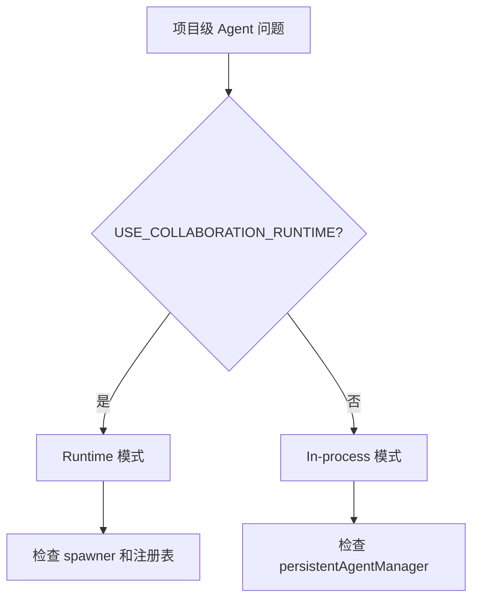
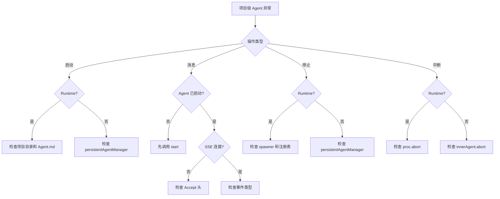

# I25：综合工作坊：项目级 Agent 生命周期排查地图

前七节课（I18–I24）分别看了项目级 Agent 的启动、消息发送、状态查询、停止、中断、Runtime 消息发送、工具调用过滤。它们若只分别记住，仍不足以解释真实系统。一个合格的理解应当能够回答：当小林说"项目 Agent 启动失败""消息发不出去""Agent 停不掉"时，应该按什么顺序排查。

本工作坊围绕 `api/agent/projects/[projectId]/**` 设计，使注意力集中在"项目级 Agent 生命周期"的责任划分上。

## 1. 实验边界与预期成果

本实验不依赖真实模型或 LLM 服务。它能够验证项目级 Agent API 的局部事实，却不能证明 Core Service 内部实现、Agent 运行时行为或 LLM 回复质量都正确。

完成本课后，应能形成一份简短的"项目级 Agent 排查地图"，至少包含：

| 项目 | 应能写出的结论 | 对应的源码依据 |
| --- | --- | --- |
| 启动失败 | 先检查项目目录和 Agent.md，再看 USE_COLLABORATION_RUNTIME | `api/agent/projects/[projectId]/start/route.ts` |
| 消息发不出去 | 检查 Agent 是否已启动，再看 SSE 连接 | `api/agent/projects/[projectId]/messages/route.ts` |
| 状态查询返回 404 | 检查 Agent 是否已启动 | `api/agent/projects/[projectId]/messages/route.ts` 的 GET |
| Agent 停不掉 | 检查 spawner 和注册表 | `api/agent/projects/[projectId]/stop/route.ts` |
| 中断无效 | 检查 abort 路由和运行时模式 | `api/agent/projects/[projectId]/abort/route.ts` |
| 工具调用显示异常 | 检查 stripToolCodeBlocks | `api/agent/projects/[projectId]/messages/route.ts` |

## 2. 总体认知图：一张项目级 Agent 地图

```mermaid
flowchart TD
    A[项目级 Agent 操作] --> B{操作类型}
    B -->|启动| C[POST /projects/{id}/start]
    B -->|消息| D[POST /projects/{id}/messages]
    B -->|状态| E[GET /projects/{id}/messages]
    B -->|停止| F[POST /projects/{id}/stop]
    B -->|中断| G[POST /projects/{id}/abort]
    C --> H{Runtime?}
    H -->|是| I[spawner.spawn]
    H -->|否| J[persistentAgentManager.startAgent]
    D --> K{Runtime?}
    K -->|是| L[sendRuntimeMessage]
    K -->|否| M[agent.handleMessage]
    E --> N[persistentAgentManager.getAgent / getRuntimeAgent]
    F --> O{Runtime?}
    O -->|是| P[spawner.destroy]
    O -->|否| Q[persistentAgentManager.stopAgent]
    G --> R{Runtime?}
    R -->|是| S[proc.abort]
    R -->|否| T[innerAgent.abort]
```

这张图只回答一个问题：一个项目级 Agent 操作进入 OriginOS 的 API，会被哪个文件处理、调用哪个 Core 函数、产生什么副作用？

读图时分三层：

1. **最外层是 HTTP 路由**：由 Next.js App Router 按文件约定匹配。
2. **中间层是 Route Handler**：校验参数、选择模式（runtime/in-process）、调用 Core。
3. **最内层是 Core Service**：真正实现业务逻辑，属于 Part E/F 的范畴。

本单元只要求掌握外层和中层。内层 Core Service 在后续课程展开。

## 3. 核心区分：三种容易混淆的场景

### 3.1 启动失败 vs 消息发送失败

| 问题 | 检查点 | 状态码 |
| --- | --- | --- |
| "启动失败" | 项目目录、Agent.md、USE_COLLABORATION_RUNTIME | 500 |
| "消息发不出去" | Agent 是否已启动、SSE 连接 | 400/500 |
| "状态查询返回 404" | Agent 是否已启动 | 404 |

### 3.2 Stop vs Abort

| 维度 | Stop | Abort |
| --- | --- | --- |
| 作用对象 | 实例本身 | 当前操作 |
| 实例保留 | 否 | 是 |
| 能否继续发消息 | 不能（需要重新 start） | 能 |
| 典型场景 | 项目窗口关闭 | 用户点击停止 |

### 3.3 Runtime 模式 vs In-process 模式



排查口诀：

1. 先看环境变量，区分 runtime 还是 in-process。
2. 启动问题先看项目目录和 Agent.md。
3. 消息问题先看 Agent 是否已启动。
4. 停止问题先看 spawner 和注册表。
5. 中断问题先看 abort 路由和运行时模式。

## 4. 章节因果链

I18—I25 不是八个孤立文件介绍。它们按"从启动到消息到停止"的顺序，逐步补全判断能力。

| 课次 | 补上的判断能力 | 关键源码锚点 |
| --- | --- | --- |
| I18 | 能追踪启动请求到子进程/实例的完整链路 | `api/agent/projects/[projectId]/start/route.ts` |
| I19 | 能区分项目级与会话级消息发送 | `api/agent/projects/[projectId]/messages/route.ts` 的 POST |
| I20 | 能理解项目级 Agent 的状态查询 | `api/agent/projects/[projectId]/messages/route.ts` 的 GET |
| I21 | 能区分 Runtime 和 In-process 的停止逻辑 | `api/agent/projects/[projectId]/stop/route.ts` |
| I22 | 能区分 abort 和 stop 的语义 | `api/agent/projects/[projectId]/abort/route.ts` |
| I23 | 能理解项目级 Runtime 消息发送 | `sendRuntimeMessage`、`createRuntimeEventStream`（项目级版本） |
| I24 | 能理解工具调用过滤和 content 处理 | `stripToolCodeBlocks`、`isToolCallOnlyContent` |
| I25 | 能把项目级 Agent 知识转成可验证的排查能力 | 复用上述文件 |

## 5. 源码覆盖台账

| 课次 | 已直接精读的生产源码 | 配对测试或验证入口 | 本单元只证明什么 |
| --- | --- | --- | --- |
| I18 | `api/agent/projects/[projectId]/start/route.ts` | 无单元测试 | 启动请求到子进程/实例的链路 |
| I19 | `api/agent/projects/[projectId]/messages/route.ts` 的 POST | 无单元测试 | 项目级消息发送、SSE 流式响应 |
| I20 | `api/agent/projects/[projectId]/messages/route.ts` 的 GET | 无单元测试 | 项目级 Agent 状态查询 |
| I21 | `api/agent/projects/[projectId]/stop/route.ts` | 无单元测试 | Runtime 和 In-process 的停止逻辑 |
| I22 | `api/agent/projects/[projectId]/abort/route.ts` | 无单元测试 | 中断的双模式实现 |
| I23 | `sendRuntimeMessage`、`createRuntimeEventStream`（项目级版本） | 无单元测试 | 项目级 Runtime 消息发送 |
| I24 | `stripToolCodeBlocks`、`isToolCallOnlyContent` | 无单元测试 | 工具调用过滤和 content 处理 |
| I25 | 不新增生产逻辑；复用上述文件 | 纸面推演 + 运行观察 | 把项目级 Agent 知识转成可验证的排查能力 |

相邻但尚未精读的文件：`api/agent/sessions/**`（U2-U3，已讲过）。

## 6. 排查地图：看到异常时先看哪一层



排查口诀：

1. 先看操作类型（启动、消息、停止、中断）。
2. 再看 runtime 模式。
3. 启动问题先看项目目录和 Agent.md。
4. 消息问题先看 Agent 是否已启动。
5. 停止/中断问题先看 spawner 和注册表。

## 7. 综合实验：纸面推演

下面给出几个场景，要求不查代码也能推断系统行为和排查方向。

### 场景 A：启动失败

```text
POST /api/agent/projects/p1/start
Body: { "sessionId": "project-p1" }
```

合格推演：
- 可能原因 1：项目目录不存在。
- 可能原因 2：Agent.md 不存在或解析失败。
- 可能原因 3：Spawner 启动失败。
- 排查：
  1. 检查 `data/web/projects/p1/` 是否存在。
  2. 检查 `Agent.md` 是否存在。
  3. 检查 `USE_COLLABORATION_RUNTIME` 是否配置正确。
  4. 检查 Spawner 日志。

### 场景 B：消息发不出去

```text
POST /api/agent/projects/p1/messages
Headers: Accept: text/event-stream
Body: { "content": "Hello" }
```

合格推演：
- 可能原因 1：Agent 未启动。
- 可能原因 2：SSE 连接未建立。
- 可能原因 3：Runtime 模式下子进程未启动。
- 排查：
  1. 检查 Agent 是否已启动（GET /projects/p1/messages）。
  2. 检查 Accept 头是否正确。
  3. 检查 `USE_COLLABORATION_RUNTIME` 和子进程状态。

### 场景 C：Agent 停不掉

```text
POST /api/agent/projects/p1/stop
Body: { "sessionId": "project-p1" }
```

合格推演：
- 可能原因 1：子进程已不存在，但注册表中有残留。
- 可能原因 2：Spawner 销毁失败。
- 排查：
  1. 检查 `spawner.get("project-p1")` 是否返回实例。
  2. 检查 `getRuntimeAgent("p1")` 是否返回实例。
  3. 检查 globalThis.__runtimeAgents 是否有残留。

## 8. 测试证据范围与缺口

| 证据类型 | 已验证 | 未验证 |
| --- | --- | --- |
| 运行观察 | 各 API 能响应 | 所有错误分支都正确处理 |
| 代码阅读 | 路由分发逻辑清晰 | Core Service 内部实现 |
| 纸面推演 | 能根据场景推断行为 | 多并发场景 |

本单元没有自动化测试。这是因为项目级 Agent 高度依赖 Core Service 和 LLM，单元测试成本较高。后续 Core Service 单元会补充有测试的代码。

## 9. 口头验收

学完 I18—I25 后，不看正文也应能回答下面六个问题：

1. `POST /api/agent/projects/{id}/start` 在什么条件下使用 Runtime 模式，什么条件下使用 In-process 模式？
2. `Agent.md` 的 frontmatter 如何影响 Agent 的运行时类型？
3. `POST /api/agent/projects/{id}/messages` 和 `POST /api/agent/sessions/{id}/messages` 有什么区别？
4. `POST /api/agent/projects/{id}/stop` 和 `POST /api/agent/projects/{id}/abort` 有什么区别？
5. Runtime 模式下，项目级 Agent 的消息如何发送到子进程？
6. 如果项目级 Agent 启动失败，应该按什么顺序排查？

合格回答不要求背诵源码行号，但必须能说出调用顺序、责任边界和状态码含义。能说清"哪个对象被启动/停止"，比只说清"调用了哪个 API"更重要。

## 10. I18—I25 单元结论

OriginOS 的项目级 Agent 生命周期是"启动 → 发送消息 → 停止"，每个阶段都有 Runtime 和 In-process 两种实现：

- `POST /projects/{id}/start` 启动 Agent，读取 Agent.md 决定运行时类型。
- `POST /projects/{id}/messages` 发送消息，支持自动启动和 SSE 流式响应。
- `GET /projects/{id}/messages` 查询状态，双模式查询。
- `POST /projects/{id}/stop` 停止 Agent，清理子进程或实例。
- `POST /projects/{id}/abort` 中断当前操作，保留实例。

这一单元还没有解释多 Agent 协作运行时的消息路由、Agent 内部的工具调用机制、项目访谈的具体流程。现在具备项目级 Agent 地图后，下一单元才能准确分析多 Agent 协作，而不会把"消息发送失败"当成"协作运行时有 bug"。

因此，本单元可以压缩成一句话：

> 先确认 Runtime 模式还是 In-process 模式，再确认是启动、消息、停止还是中断，最后才进入 Core 内部。

这句话会在后续多 Agent 协作单元里继续使用。
