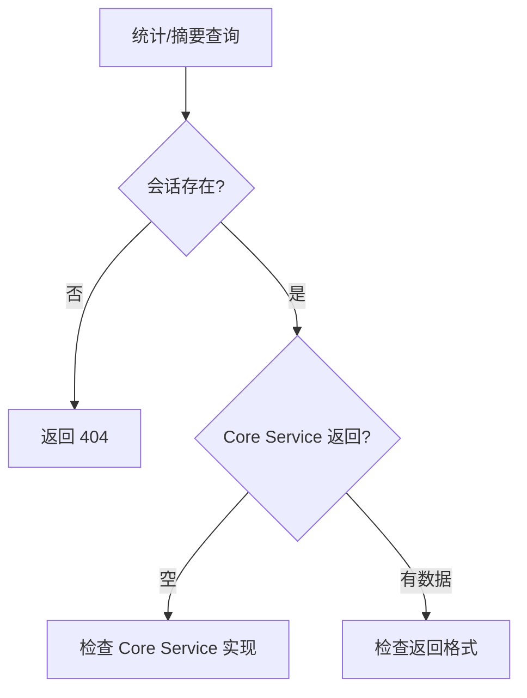

# I31：综合工作坊：统计与会话摘要排查地图

前六节课（I26–I30）分别看了统计查询、摘要查询、数据来源、计算方式、用途和限制。它们若只分别记住，仍不足以解释真实系统。一个合格的理解应当能够回答：当小林说"统计查询返回空""摘要找不到"时，应该按什么顺序排查。

## 1. 实验边界与预期成果

本实验不依赖真实模型或 LLM 服务。它能够验证统计和摘要 API 的局部事实，却不能证明 Core Service 内部实现、Agent 运行时行为或数据一致性都正确。

完成本课后，应能形成一份简短的"统计和摘要排查地图"。

## 2. 总体认知图



## 3. 核心区分

### 3.1 统计查询 vs 摘要查询

| 维度 | 统计查询 | 摘要查询 |
| --- | --- | --- |
| 路径 | `/sessions/{id}/statistics` | `/sessions/{id}/summary` |
| 返回 | 项目统计信息 | 会话摘要 |
| 需要 projectId | 是 | 否 |
| 用途 | 监控、调试 | 快速了解 |

### 3.2 常见错误

| 错误 | 原因 | 排查 |
| --- | --- | --- |
| 404 | 会话不存在 | 检查 sessionId |
| 空数据 | Core Service 返回空 | 检查 Core Service 实现 |
| 数据不一致 | 没有事务保护 | 检查数据一致性 |

## 4. 排查口诀

1. 先确认会话存在。
2. 再确认 Core Service 返回数据。
3. 最后检查返回格式。

## 5. 综合实验

### 场景 A：统计查询返回空

```text
GET /api/agent/sessions/s1/statistics
```

合格推演：
- 可能原因 1：会话不存在。
- 可能原因 2：Core Service 返回空。
- 排查：
  1. 检查 `s1` 是否存在。
  2. 检查 `getProjectStatistics` 实现。

### 场景 B：摘要查询返回 404

```text
GET /api/agent/sessions/s1/summary
```

合格推演：
- 原因：会话 `s1` 不存在。
- 排查：检查 `s1` 是否通过 `POST /sessions` 创建。

## 6. 口头验收

学完 I26—I31 后，不看正文也应能回答：

1. `GET /api/agent/sessions/{id}/statistics` 和 `GET /api/agent/sessions/{id}/summary` 有什么区别？
2. 统计查询为什么需要先从 session 中提取 projectId？
3. 如果统计查询返回空，应该按什么顺序排查？

## 7. I26—I31 单元结论

统计和摘要接口是调试和监控的窗口，不是业务逻辑的核心。先确认会话存在，再确认 Core Service 返回数据。

因此，本单元可以压缩成一句话：

> 统计和摘要接口是调试和监控的窗口，先确认会话存在，再确认 Core Service 返回数据。
