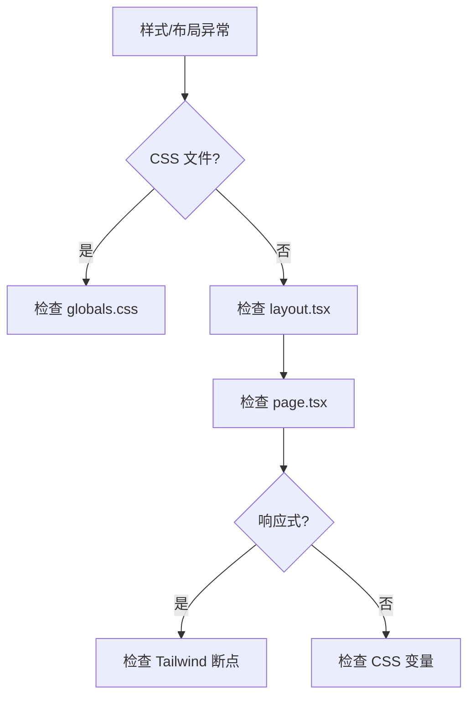

# I43：综合工作坊：全局样式与布局排查地图

前六节课（I37–I42）分别看了全局样式、根布局、主页、Tailwind CSS、CSS 变量、响应式设计。它们若只分别记住，仍不足以解释真实系统。一个合格的理解应当能够回答：当小林说"页面样式不对""布局错乱""响应式失效"时，应该按什么顺序排查。

## 1. 实验边界与预期成果

本实验不依赖真实模型或 LLM 服务。它能够验证全局样式和布局的局部事实，却不能证明所有浏览器兼容性或所有设备适配都正确。

完成本课后，应能形成一份简短的"全局样式与布局排查地图"。

## 2. 总体认知图



## 3. 核心区分

### 3.1 全局样式 vs 局部样式

| 维度 | 全局样式 | 局部样式 |
| --- | --- | --- |
| 作用范围 | 所有页面 | 单个组件 |
| 定义位置 | globals.css | 组件内 |
| 优先级 | 低 | 高 |

### 3.2 常见错误

| 错误 | 原因 | 排查 |
| --- | --- | --- |
| 样式不生效 | 类名错误 | 检查类名拼写 |
| 布局错乱 | 结构错误 | 检查 HTML 结构 |
| 响应式失效 | 断点错误 | 检查 Tailwind 配置 |

## 4. 排查口诀

1. 先看 CSS 文件，确认全局样式。
2. 再看布局文件，确认结构。
3. 最后检查页面文件，确认内容。
4. 如果响应式失效，检查 Tailwind 断点。

## 5. 综合实验

### 场景 A：页面样式不生效

```text
页面显示默认样式，自定义样式不生效
```

合格推演：
- 可能原因 1：类名拼写错误。
- 可能原因 2：Tailwind CSS 未配置。
- 排查：
  1. 检查类名拼写。
  2. 检查 `tailwind.config.ts` 配置。

### 场景 B：布局错乱

```text
页面布局与预期不符
```

合格推演：
- 可能原因 1：HTML 结构错误。
- 可能原因 2：CSS 样式冲突。
- 排查：
  1. 检查 HTML 结构。
  2. 检查 CSS 样式优先级。

## 6. 口头验收

学完 I37—I43 后，不看正文也应能回答：

1. `globals.css` 定义了哪些全局样式？
2. `layout.tsx` 和 `page.tsx` 有什么区别？
3. 如果页面样式不对，应该按什么顺序排查？

## 7. I37—I43 单元结论

全局样式和布局是 OriginOS 的视觉基础。先看 CSS 文件，再看布局文件，最后检查页面文件。

因此，本单元可以压缩成一句话：

> 全局样式和布局是 OriginOS 的视觉基础，先看 CSS 文件，再看布局文件，最后检查页面文件。
