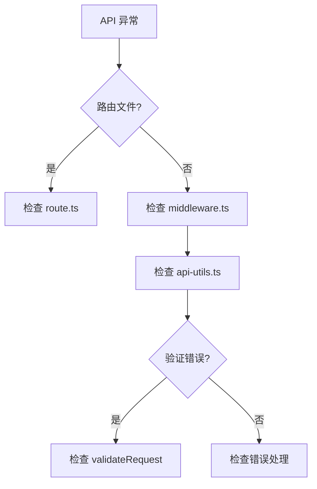

# I49：综合工作坊：API 路由与中间件排查地图

前五节课（I44–I48）分别看了 API 根路由、中间件、API 工具函数、错误处理、请求验证。它们若只分别记住，仍不足以解释真实系统。一个合格的理解应当能够回答：当小林说"API 请求失败""中间件不生效""请求验证错误"时，应该按什么顺序排查。

## 1. 实验边界与预期成果

本实验不依赖真实模型或 LLM 服务。它能够验证 API 路由和中间件的局部事实，却不能证明所有边界条件或所有错误场景都正确。

完成本课后，应能形成一份简短的"API 路由与中间件排查地图"。

## 2. 总体认知图



## 3. 核心区分

### 3.1 API 路由 vs 中间件

| 维度 | API 路由 | 中间件 |
| --- | --- | --- |
| 作用 | 处理请求 | 拦截请求 |
| 执行时机 | 请求到达时 | 请求到达前 |
| 典型用途 | 业务逻辑 | 身份验证、日志 |

### 3.2 常见错误

| 错误 | 原因 | 排查 |
| --- | --- | --- |
| 404 | 路由不存在 | 检查 route.ts |
| 500 | 服务器错误 | 检查错误处理 |
| 400 | 请求参数错误 | 检查请求验证 |

## 4. 排查口诀

1. 先看路由文件，确认请求处理。
2. 再看中间件文件，确认拦截逻辑。
3. 最后检查工具函数，确认封装逻辑。
4. 如果验证错误，检查 validateRequest。

## 5. 综合实验

### 场景 A：API 请求失败

```text
GET /api/unknown
```

合格推演：
- 原因：路由不存在。
- 排查：检查 route.ts。

### 场景 B：中间件不生效

```text
请求未经过身份验证
```

合格推演：
- 可能原因 1：中间件未配置。
- 可能原因 2：中间件逻辑错误。
- 排查：
  1. 检查 middleware.ts。
  2. 检查中间件逻辑。

## 6. 口头验收

学完 I44—I49 后，不看正文也应能回答：

1. API 路由如何处理请求？
2. 中间件如何拦截请求？
3. 如果 API 请求失败，应该按什么顺序排查？

## 7. I44—I49 单元结论

API 路由和中间件是 OriginOS 的后端入口。先看路由文件，再看中间件文件，最后检查工具函数。

因此，本单元可以压缩成一句话：

> API 路由是 OriginOS 的后端入口，中间件是请求处理的桥梁，先看路由文件，再看中间件文件，最后检查工具函数。
