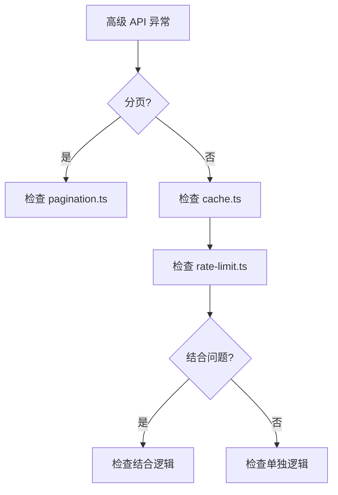

# I55：综合工作坊：高级 API 模式排查地图

前五节课（I50–I54）分别看了分页、缓存、限流、分页与缓存的结合、缓存与限流的结合。它们若只分别记住，仍不足以解释真实系统。一个合格的理解应当能够回答：当小林说"分页失效""缓存不命中""限流不生效"时，应该按什么顺序排查。

## 1. 实验边界与预期成果

本实验不依赖真实模型或 LLM 服务。它能够验证高级 API 模式的局部事实，却不能证明所有边界条件或所有错误场景都正确。

完成本课后，应能形成一份简短的"高级 API 模式排查地图"。

## 2. 总体认知图



## 3. 核心区分

### 3.1 分页 vs 缓存 vs 限流

| 维度 | 分页 | 缓存 | 限流 |
| --- | --- | --- | --- |
| 作用 | 数据截取 | 性能加速 | 系统保护 |
| 执行时机 | 请求时 | 请求前 | 请求前 |
| 典型用途 | 大数据量 | 频繁请求 | 防止过载 |

### 3.2 常见错误

| 错误 | 原因 | 排查 |
| --- | --- | --- |
| 分页失效 | 页码错误 | 检查 pagination.ts |
| 缓存不命中 | 缓存未设置 | 检查 cache.ts |
| 限流不生效 | 限流未配置 | 检查 rate-limit.ts |

## 4. 排查口诀

1. 先看分页逻辑，确认数据截取。
2. 再看缓存逻辑，确认缓存命中。
3. 最后检查限流逻辑，确认请求限制。
4. 如果结合问题，检查结合逻辑。

## 5. 综合实验

### 场景 A：分页失效

```text
GET /api/data?page=0&limit=10
```

合格推演：
- 原因：页码从 0 开始，但分页从 1 开始。
- 排查：检查 pagination.ts。

### 场景 B：缓存不命中

```text
GET /api/data
```

合格推演：
- 可能原因 1：缓存未设置。
- 可能原因 2：缓存已失效。
- 排查：
  1. 检查 cache.ts。
  2. 检查缓存设置逻辑。

## 6. 口头验收

学完 I50—I55 后，不看正文也应能回答：

1. 分页如何实现？
2. 缓存如何实现？
3. 如果分页失效，应该按什么顺序排查？

## 7. I50—I55 单元结论

高级 API 模式是 OriginOS 的核心能力。先看分页逻辑，再看缓存逻辑，最后检查限流逻辑。

因此，本单元可以压缩成一句话：

> 高级 API 模式是 OriginOS 的核心能力，先看分页逻辑，再看缓存逻辑，最后检查限流逻辑。
