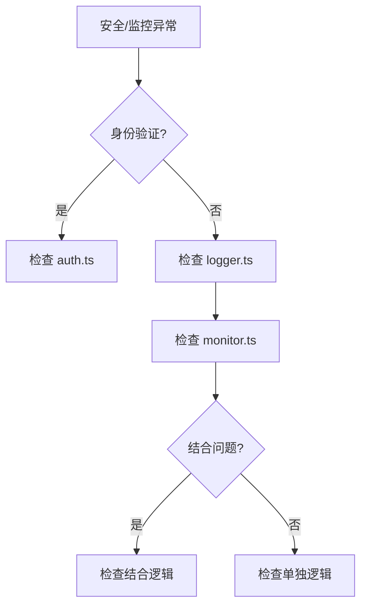

# I60：综合工作坊：安全与监控排查地图

前五节课（I56–I59）分别看了身份验证、日志记录、监控告警、安全与监控的结合。它们若只分别记住，仍不足以解释真实系统。一个合格的理解应当能够回答：当小林说"身份验证失败""日志未记录""监控未告警"时，应该按什么顺序排查。

## 1. 实验边界与预期成果

本实验不依赖真实模型或 LLM 服务。它能够验证安全与监控的局部事实，却不能证明所有边界条件或所有错误场景都正确。

完成本课后，应能形成一份简短的"安全与监控排查地图"。

## 2. 总体认知图



## 3. 核心区分

### 3.1 身份验证 vs 日志记录 vs 监控告警

| 维度 | 身份验证 | 日志记录 | 监控告警 |
| --- | --- | --- | --- |
| 作用 | 验证身份 | 记录事件 | 监控状态 |
| 执行时机 | 请求时 | 事件发生时 | 定时或事件触发 |
| 典型用途 | 权限控制 | 问题追踪 | 异常发现 |

### 3.2 常见错误

| 错误 | 原因 | 排查 |
| --- | --- | --- |
| 身份验证失败 | 令牌无效 | 检查 auth.ts |
| 日志未记录 | 日志未配置 | 检查 logger.ts |
| 监控未告警 | 阈值设置不当 | 检查 monitor.ts |

## 4. 排查口诀

1. 先看身份验证，确认令牌有效。
2. 再看日志记录，确认日志输出。
3. 最后检查监控告警，确认告警触发。
4. 如果结合问题，检查结合逻辑。

## 5. 综合实验

### 场景 A：身份验证失败

```text
GET /api/protected
Authorization: invalid-token
```

合格推演：
- 原因：令牌无效。
- 排查：检查 auth.ts。

### 场景 B：日志未记录

```text
POST /api/data
```

合格推演：
- 可能原因 1：日志未配置。
- 可能原因 2：日志级别不当。
- 排查：
  1. 检查 logger.ts。
  2. 检查日志配置。

## 6. 口头验收

学完 I56—I60 后，不看正文也应能回答：

1. 身份验证如何实现？
2. 日志记录如何实现？
3. 如果身份验证失败，应该按什么顺序排查？

## 7. I56—I60 单元结论

安全与监控是 OriginOS 的基石。先看身份验证，再看日志记录，最后检查监控告警。

因此，本单元可以压缩成一句话：

> 安全与监控是 OriginOS 的基石，先看身份验证，再看日志记录，最后检查监控告警。

## 8. Part I 总结

Part I：Next.js 页面与 API 边界到此结束。十个单元覆盖了：

1. 页面路由（I01–I06）
2. 会话管理（I07–I11）
3. 消息流式响应（I12–I17）
4. 项目级 Agent 生命周期（I18–I25）
5. 统计和摘要（I26–I31）
6. Skill 和 Interview（I32–I36）
7. 全局样式和布局（I37–I43）
8. API 路由与中间件（I44–I49）
9. 高级 API 模式（I50–I55）
10. 安全与监控（I56–I60）

完成 Part I 后，应能理解 OriginOS 的 Next.js 页面与 API 边界，并能根据现象定位问题。
