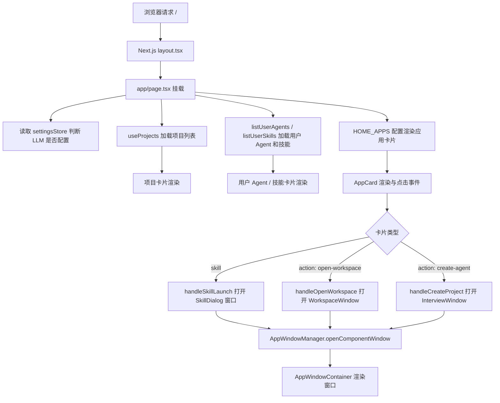
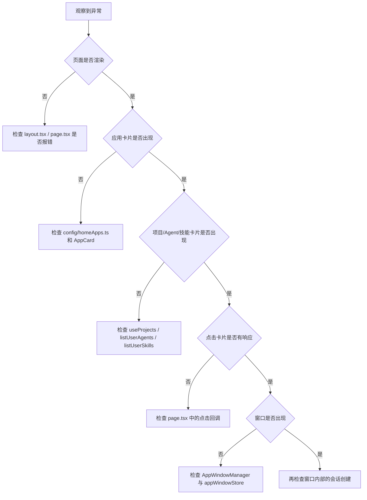

# 单元导读与复盘一：OriginOS 首页桌面由哪些层组成（J01—J09）

小林第一次打开 OriginOS，屏幕上出现深色桌面、顶部状态栏、项目卡片、应用卡片和底部 Dock。小林点击“创建 Agent”卡片，一个会话窗口弹了出来；点击“工作区”，系统提示先创建一个项目。

从用户视角看，这只是“点哪里就开哪里”。但从系统视角看，首页同时是：

- 一个 Next.js 页面（`app/page.tsx`）；
- 一套配置驱动的应用入口（`config/homeApps.ts`）；
- 一组由状态决定显示与否的容器（项目列表、用户 Agent、用户技能）；
- 一个把“点击”翻译成“打开窗口或启动会话”的调度层（`AppWindowManager`）。

本单元小结要解决一个问题：读者如何把这些对象放进同一张清晰的认知地图，并在首页出现“点了没反应”“卡片没出现”“数据没刷新”时知道从哪一层开始排查。


## 0. 本页先读什么

如果只记住一句话，记住这一句：

> OriginOS 首页不是一张静态壁纸，而是“页面组件 + 应用配置 + 状态数据 + 窗口调度”共同组成的四层结构。

这句话拆开看，有三层含义：

1. 页面组件负责渲染和交互；配置决定有什么卡片；状态决定卡片里有什么数据。
2. 点击卡片可能打开窗口，也可能启动会话，取决于卡片的 `type` 和 `action`。
3. 同一套视觉元素（顶部栏、侧边栏、Dock）在不同页面可能由不同组件实现，不能因为它们长得像就认为是同一个对象。

阅读本页可以按下面的顺序：

| 阅读阶段 | 重点问题 | 对应章节 |
| --- | --- | --- |
| 建立总图 | 从打开浏览器到出现桌面，中间经过哪些层？ | 第 1、2 节 |
| 分清对象 | `page.tsx`、`OSFramework`、`Desktop`、卡片组件之间是什么关系？ | 第 3 节 |
| 对回课程 | 九节课分别补上链路中的哪一段？ | 第 4 节 |
| 查证源码 | 哪些源码已经在本单元直接讲过，哪些留到后面？ | 第 5 节 |
| 练习排查 | 看到“点了没反应”“数据没刷新”时，应按什么顺序判断？ | 第 6—9 节 |

这不是为了让读者背目录，而是为了形成一个稳定的判断顺序：先判断配置，再判断状态，再判断页面调度，最后才判断窗口管理器。

## 1. 同一层桌面可能停在不同系统对象

小林看到“应用启动器”里出现 6 张卡片时，初学者最容易犯的错误，是把“卡片在屏幕上”理解成“卡片对应的功能已经可用”。更准确的说法是：同一层视觉可能停在不同系统对象，每一层能证明的事情都不同。

| 看到的现象 | 所在层 | 它能证明什么 | 它不能证明什么 |
| --- | --- | --- | --- |
| 首页背景、渐变、网格出现 | 页面渲染层 | `page.tsx` 已经挂载并渲染 | 后端数据已经加载完成 |
| 6 张应用卡片出现 | 配置层 | `HOME_APPS` 配置被正确读取 | 每张卡片对应的 Skill 或 Action 一定能成功执行 |
| 项目卡片列表出现 | 状态层 | `useProjects` 已经拿到数据 | 项目数据是最新的，或点击一定能打开工作区 |
| 用户 Agent / 用户技能出现 | 状态层 | `listUserAgents` / `listUserSkills` 已返回 | 这些 Agent 的会话运行时已经准备好 |
| 点击卡片后窗口弹出 | 窗口调度层 | `AppWindowManager` 收到了 `openComponentWindow` 调用 | 窗口内部的会话已经被服务端成功创建 |

这张表的关键不是字段名，而是“能证明什么”和“不能证明什么”的分界。技术排查经常出错，不是因为看不到现象，而是因为从一个现象推出了它无法证明的结论。

例如，`HOME_APPS` 里配了“头脑风暴”卡片，只能说明系统打算把它显示出来。它不能证明 `bmad-brainstorming` 这个 Skill 的文件一定存在、API 一定能加载它的内容、LLM 一定能正常回复。中间任一环节都可能让小林点击后没有反应。

## 2. 首页到窗口的主路径

下面这张图只回答一个问题：从小林打开浏览器访问 `/`，到点击卡片后一个窗口出现，中间经过哪些对象？



可以把它分成四段读。

第一段是入口：浏览器访问 `/`，Next.js 先渲染 `layout.tsx`，再渲染 `page.tsx`。`layout.tsx` 只负责全局样式和 `GlobalSpotlight`；真正决定首页长什么样的是 `page.tsx`。

第二段是状态：`page.tsx` 内部同时管理多个状态源：LLM 配置（`settingsStore`）、项目列表（`useProjects`）、用户 Agent（`listUserAgents`）、用户技能（`listUserSkills`）。这些状态决定页面上出现哪些卡片、哪些按钮可用。

第三段是配置：`HOME_APPS` 是一个纯数组配置，不依赖后端数据。它决定“应用启动器”里固定出现哪些卡片。`system-apps.ts` 则负责识别哪些 Skill 属于系统应用，与产物输出路径有关。

第四段是调度：点击卡片后，`page.tsx` 里的 `handleSkillLaunch`、`handleOpenWorkspace`、`handleCreateProject` 等回调，最终都会调用 `AppWindowManager.getInstance().openComponentWindow`。同一个调度入口，根据卡片类型传入不同的组件和元数据，于是屏幕上出现不同内容的窗口。

这张图建立了本单元最重要的底层判断：页面、配置、状态、调度是连续关系，但不是同一个对象。

## 3. 三组最容易混淆的对象

本单元的主要难点，不在于某个 API 名字，而在于几组对象长得相似、都出现在“首页”附近，却承担完全不同的责任。


### 3.1 `page.tsx`、`OSFramework`、`Desktop`

这一组回答“首页到底由哪个组件做主”。

| 对象 | 负责什么 | 当前生产状态 | 常见误解 |
| --- | --- | --- | --- |
| `app/page.tsx` | 当前真正的首页：全屏桌面、项目卡片、应用卡片、Dock、窗口容器 | 已作为默认首页使用 | 把它和 `OSFramework` 当成同一个东西 |
| `components/framework/OSFramework.tsx` | 旧版 OS 框架：StatusBar + Sidebar + Taskbar + 主工作区 | 当前 `page.tsx` 已不再使用它，但文件仍存在 | 以为它是首页的顶层容器 |
| `components/os/Desktop.tsx` | 另一套桌面容器：Background + StatusBar + DesktopGrid + Dock + Spotlight + AgentDialog | 在 `app/desktop/page.tsx` 等测试/演示页面使用 | 以为它和 `page.tsx` 是同一套实现 |

源码中也能看到这种分工。`page.tsx` 在 [packages/web/src/app/page.tsx 第 474 行](../../../../packages/web/src/app/page.tsx#L474) 定义了 `OSHomePage`，内部自己组合了 `TopMenuBar`、`Dock`、`AppWindowContainer` 等组件，没有引用 `OSFramework`。`OSFramework` 在 [packages/web/src/components/framework/OSFramework.tsx 第 35 行](../../../../packages/web/src/components/framework/OSFramework.tsx#L35) 提供的是 `StatusBar + Sidebar + Taskbar` 的旧布局，当前生产路径已经不再经过它。

这意味着：如果读者想修改首页顶部栏，应该改 `page.tsx` 里的 `TopMenuBar`，而不是 `OSFramework` 里的 `StatusBar`。

### 3.2 应用配置、系统应用、用户应用

这一组回答“首页卡片从哪里来”。

| 对象 | 来源 | 谁维护 | 是否持久化 |
| --- | --- | --- | --- |
| `HOME_APPS` | `config/homeApps.ts` 中的硬编码数组 | 开发者 | 不持久化 |
| `SYSTEM_APPS` | `config/system-apps.ts` 中的硬编码数组 | 开发者 | 不持久化 |
| 用户 Agent | `listUserAgents()` 从 Core/Electron 服务读取 | 用户创建 | 持久化在数据目录 |
| 用户技能 | `listUserSkills()` 从 Core/Electron 服务读取 | 用户创建 | 持久化在数据目录 |

`HOME_APPS` 中的 `type: 'skill'` 卡片会打开 `SkillDialog`；`type: 'action'` 卡片会执行 `action` 字段指定的逻辑。`SYSTEM_APPS` 不直接参与首页渲染，它用于识别某些 Skill 是否属于系统内置，从而影响产物输出目录等规则。

### 3.3 页面状态、窗口状态、会话状态

这一组回答“点击卡片后，系统里哪些东西会变化”。

| 状态 | 存储位置 | 重启后是否保留 | 与点击的关系 |
| --- | --- | --- | --- |
| 页面状态 | `page.tsx` 内部 `useState` / `useProjects` / `settingsStore` | `settingsStore` 持久化；其余不保留 | 决定首页显示什么 |
| 窗口状态 | `appWindowStore`（Zustand） | 不保留 | 决定窗口是否可见、位置、层级 |
| 会话状态 | Core 的 `SessionStore` / Agent 运行时 | 持久化 | 决定窗口内的 Agent 能否继续对话 |

点击卡片首先影响页面状态（如果有 loading 或选中效果），然后调用 `AppWindowManager` 影响窗口状态，最后窗口内的组件自己创建会话。这三者不能混为一谈。

## 4. 九节课连成一条因果链

J01—J09 不是九个孤立知识点。它们按“从页面入口到点击调度”的顺序，一层一层补上判断能力。

| 课次 | 本课解决的判断问题 | 核心源码锚点 | 学完后的判断能力 |
| --- | --- | --- | --- |
| J01 | 首页作为应用总入口，内部由哪些状态和数据源驱动 | [packages/web/src/app/page.tsx](../../../../packages/web/src/app/page.tsx) | 能区分页面组件、状态 Hook、配置数组和窗口调度 |
| J02 | 应用卡片如何由配置驱动 | [packages/web/src/config/homeApps.ts](../../../../packages/web/src/config/homeApps.ts)、[packages/web/src/config/system-apps.ts](../../../../packages/web/src/config/system-apps.ts) | 能区分 `skill` 与 `action`、系统应用识别 |
| J03 | `AppCard` 组件如何处理点击、固定、删除 | [packages/web/src/components/framework/AppCard.tsx](../../../../packages/web/src/components/framework/AppCard.tsx) | 能说出卡片内部状态与回调责任 |
| J04 | `OSFramework`、`Sidebar`、`Taskbar`、`StatusBar` 是什么关系 | [packages/web/src/components/framework/OSFramework.tsx](../../../../packages/web/src/components/framework/OSFramework.tsx)、[Sidebar.tsx](../../../../packages/web/src/components/framework/Sidebar.tsx)、[Taskbar.tsx](../../../../packages/web/src/components/framework/Taskbar.tsx)、[StatusBar.tsx](../../../../packages/web/src/components/framework/StatusBar.tsx) | 能识别旧版框架与当前 `page.tsx` 的分离 |
| J05 | 当前首页的顶部菜单栏与状态栏由谁实现 | [packages/web/src/app/page.tsx](../../../../packages/web/src/app/page.tsx) 中 `TopMenuBar` | 能定位生产路径中的顶部栏实现 |
| J06 | 新用户引导和 Onboarding 如何与设置联动 | [packages/web/src/components/os/DesktopOnboarding.tsx](../../../../packages/web/src/components/os/DesktopOnboarding.tsx)、[packages/web/src/store/settingsStore.ts](../../../../packages/web/src/store/settingsStore.ts) | 能解释 `showOnboarding` 的加载与保存 |
| J07 | 背景、Acrylic、视觉层如何渲染 | [packages/web/src/components/os/Background/index.tsx](../../../../packages/web/src/components/os/Background/index.tsx)、[packages/web/src/styles/globals.css](../../../../packages/web/src/styles/globals.css) | 能区分背景类型与 Tailwind 主题变量 |
| J08 | 首页状态联动：项目 / Agent / 技能列表的加载与刷新 | [packages/web/src/app/page.tsx](../../../../packages/web/src/app/page.tsx) 中 `useProjects`、`loadUserAgents`、`loadUserSkills` | 能追踪数据加载、事件监听、删除刷新 |
| J09 | **单元小结课：首页与应用启动 Workshop** | 复用 J01–J08 | 把分散知识组织成可排查的认知地图 |

这条链的停止边界也要清楚。J01—J09 还没有详细讲窗口管理器内部如何实现打开/关闭/聚焦（进入 Unit 2），也没有讲 Dock / Spotlight 的状态同步（进入 Unit 3），更没有讲 SkillDialog 内部的会话 UI（进入 Unit 4）。

当前单元先把首页入口和配置层打牢。边界清楚以后，再看窗口、Dock、会话，读者才不会把所有问题都混成“首页坏了”。

## 5. 源码覆盖台账

源码台账的作用，是防止“概念讲过”被误写成“源码已经覆盖”。阅读这张表时，只看三件事：哪个文件已直接精读，证据来自哪里，还有哪些边界没有被证明。

| 课次 | 已直接精读的生产源码 | 配对测试或验证入口 | 本单元只证明什么 |
| --- | --- | --- | --- |
| J01 | [packages/web/src/app/page.tsx](../../../../packages/web/src/app/page.tsx) | 无直接单元测试；通过运行 `pnpm dev` 手动验证 | 首页状态组织与窗口调度入口 |
| J02 | [packages/web/src/config/homeApps.ts](../../../../packages/web/src/config/homeApps.ts)、[packages/web/src/config/system-apps.ts](../../../../packages/web/src/config/system-apps.ts) | 无 | 配置结构与系统应用识别 |
| J03 | [packages/web/src/components/framework/AppCard.tsx](../../../../packages/web/src/components/framework/AppCard.tsx) | 无直接测试 | 卡片渲染、点击、固定、删除交互 |
| J04 | [packages/web/src/components/framework/OSFramework.tsx](../../../../packages/web/src/components/framework/OSFramework.tsx)、[Sidebar.tsx](../../../../packages/web/src/components/framework/Sidebar.tsx)、[Taskbar.tsx](../../../../packages/web/src/components/framework/Taskbar.tsx)、[StatusBar.tsx](../../../../packages/web/src/components/framework/StatusBar.tsx) | 无 | 旧版框架结构，与当前生产路径分离 |
| J05 | [packages/web/src/app/page.tsx](../../../../packages/web/src/app/page.tsx) 中 `TopMenuBar` | 无 | 当前生产路径中的顶部栏实现 |
| J06 | [packages/web/src/components/os/DesktopOnboarding.tsx](../../../../packages/web/src/components/os/DesktopOnboarding.tsx)、[packages/web/src/store/settingsStore.ts](../../../../packages/web/src/store/settingsStore.ts) | 无 | Onboarding 显示条件与设置持久化 |
| J07 | [packages/web/src/components/os/Background/index.tsx](../../../../packages/web/src/components/os/Background/index.tsx)、[packages/web/src/styles/globals.css](../../../../packages/web/src/styles/globals.css) | `components/os/__tests__/Background.test.tsx` | 背景类型切换与全局样式变量 |
| J08 | [packages/web/src/app/page.tsx](../../../../packages/web/src/app/page.tsx) 中 `useProjects`、`loadUserAgents`、`loadUserSkills` | `lib/hooks/use-projects.ts` 暂无直接测试 | 数据加载、事件监听、删除刷新 |
| J09 | 不新增生产逻辑；复用上述边界 | 复用上述验证 | 把已读源码转成可验证的首页链路 |

本单元相邻但尚未精读的文件也要明说。`AppWindowManager`、`appWindowStore`、`useAppWindowManager` 属于 Unit 2；`Dock`、`dockStore`、`Spotlight`、`spotlightStore` 属于 Unit 3；`SkillDialog`、`AgentDialogContent` 属于 Unit 4；`InterviewWindow`、`ProjectWorkspace` 属于 Unit 5；`settingsStore` 的完整实现会在 Unit 6 再精读。

这不是遗漏，而是边界管理。一个单元必须知道自己讲到哪里，也必须知道哪里还没有讲。

## 6. 异常排查：先定位层，再定位文件

当小林说“首页不对劲”时，最稳的排查方式不是直接检查窗口管理器，而是沿着层级逐步确认。




这张图可以变成实际排查口诀：

1. 页面没出来，先看 `layout.tsx` 和 `page.tsx` 是否编译/报错。
2. 应用卡片没出来，先看 `HOME_APPS` 和 `AppCard`。
3. 项目/Agent/技能没出来，先看数据加载 Hook 和服务调用。
4. 点击没反应，先看 `page.tsx` 里的回调函数。
5. 窗口没出现，再看 `AppWindowManager` 和 `appWindowStore`。
6. 窗口出来了但内容不对，才看窗口内部的会话/UI 组件。

这套顺序能避免一个常见误判：只要点了卡片没反应，就把问题归到窗口管理器。实际上，很多问题在调度之前已经发生。

## 7. 纸面复盘实验

下面这个实验不需要连接真实模型。它的目标是让读者用一组材料，重建一次首页点击的事实链。

```text
当前环境 = Web 版本（非 Electron）
HOME_APPS 包含 { id: 'app-brainstorming', type: 'skill', skillName: 'bmad-brainstorming' }
useProjects 返回 2 个项目，其中 1 个 status = 'draft'
listUserAgents 返回 1 个 role-agent
listUserSkills 返回 0 个
用户点击了“头脑风暴”卡片
```

合格推演应包含下面五个判断：

| 材料 | 应得出的判断 |
| --- | --- |
| `type: 'skill'` | 点击会调用 `handleSkillLaunch`，打开 `SkillDialog` 窗口 |
| `skillName: 'bmad-brainstorming'` | 窗口元数据中的 `entryType='skill'`、`entryId='bmad-brainstorming'` |
| Web 环境 | `AppWindowManager` 不会走 `createNativeWindow` 分支，窗口由 Web DOM 渲染 |
| 2 个项目 | 页面会渲染项目卡片区，draft 项目显示“访谈中”徽章 |
| 1 个 role-agent | 页面会渲染“角色助手”区域，使用 🎭 图标 |

如果能把每一行都说清楚，并且能补一句“它不能证明什么”，就说明本单元的核心框架已经建立。

## 8. 测试证据的读法

本单元的测试证据整体偏弱。首页作为一个大型页面组件，目前没有直接单元测试，多数边界需要通过手动运行验证。

| 测试入口 | 已经证明 | 没有证明 |
| --- | --- | --- |
| [packages/web/src/components/os/__tests__/Background.test.tsx](../../../../packages/web/src/components/os/__tests__/Background.test.tsx) | `Background` 能按 `type` 渲染不同子组件 | 真实桌面背景切换的端到端行为 |
| [packages/web/src/components/os/__tests__/Background-subcomponents.test.tsx](../../../../packages/web/src/components/os/__tests__/Background-subcomponents.test.tsx) | `SolidColor`、`Image`、`Particles` 子组件可独立渲染 | 与 `desktopStore` 的联动 |
| 无 | — | `page.tsx` 的交互路径、卡片点击、窗口打开 |
| 无 | — | `HOME_APPS` 配置变更后的渲染 |

读测试时保持三个问题：

1. Given：测试先准备了什么数据？
2. When：测试触发了什么动作？
3. Then：测试最后断言了什么结果？

只要测试没有跨过某条边界，就不能据此承诺那条边界已经可靠。

## 9. 口头验收

学完 J01—J09 后，不看正文也应能回答下面八个问题：

1. 为什么 `app/page.tsx` 是当前首页，而不是 `OSFramework` 或 `Desktop.tsx`？
2. `HOME_APPS` 和 `SYSTEM_APPS` 分别决定什么？
3. `skill` 类型卡片和 `action` 类型卡片在点击后走的是不是同一条路径？
4. 用户 Agent、用户技能、内置应用卡片的数据来源有什么不同？
5. 为什么“卡片显示”不等于“点击后一定能成功打开会话”？
6. 当前生产路径中的顶部状态栏是在哪个文件里实现的？
7. Onboarding 的显示与关闭依赖哪个状态？
8. 首页出现“点击卡片没反应”时，应该按什么顺序排查？

合格回答不要求背诵源码行号，但必须能说出字段名、对象责任和边界。能说清“不能证明什么”，比只说清“是什么”更重要。

## 10. 进入下一单元

J01—J09 建立的是首页入口和配置层的基本地图。下一组课程会继续追踪：卡片点击后，`AppWindowManager` 如何创建窗口，`appWindowStore` 如何管理窗口状态，以及 Web 与 Native 窗口如何切换。

因此，本单元的结论可以压缩成一句话：

> 先看配置有没有，再看状态到没到，最后才看调度响没响。

这句话会在后续窗口管理、Dock、Spotlight 和会话 UI 单元里继续使用。
