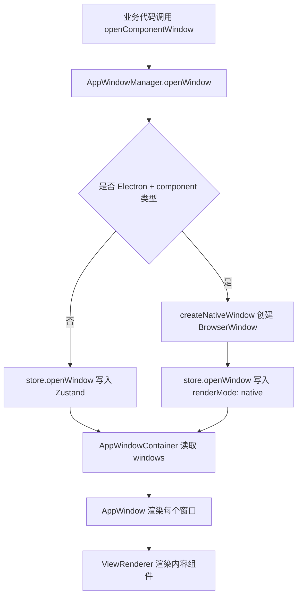
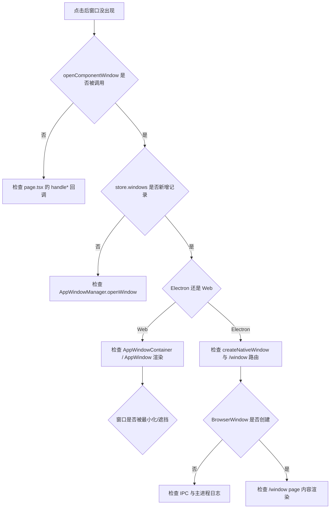

# 单元导读与复盘二：OriginOS 的窗体系统与窗口状态（J10—J19）

小林点击“头脑风暴”卡片后，屏幕上弹出一个可拖拽、可缩放、可最小化的窗口。这个窗口不是浏览器弹窗，也不是原生 `window.open`，而是由 OriginOS 自己维护的“虚拟窗体”。它有一套独立的状态、层级、生命周期，还要在 Web 和 Electron Native 两种模式下表现一致。

本单元要回答的问题是：

- 窗口的位置、大小、层级、聚焦状态存在哪里？
- `AppWindowManager`、`appWindowStore`、`useAppWindowManager`、`AppWindowContainer`、`AppWindow` 之间如何分工？
- 为什么 Electron 模式下窗口会交给原生 BrowserWindow，而 Web 模式下用 React Portal 渲染？
- 关闭窗口时，为什么还会触发 `destroyAgentSession` 和 `consolidateMemory`？

## 0. 本页先读什么

如果只记住一句话：

> OriginOS 的窗口是“状态驱动的虚拟窗体”，Web 模式下由 React 渲染，Electron 模式下由 BrowserWindow 承载，两者共享同一份 Zustand 状态。

这句话包含三层含义：

1. 窗口不是 DOM 元素的副产品，而是先写入 `appWindowStore`，再被渲染出来。
2. `AppWindowManager` 是业务代码打开窗口的入口，`appWindowStore` 是状态真相来源。
3. Web 和 Electron 的渲染路径不同，但状态层统一。

## 1. 窗口系统的五个核心对象

| 对象 | 职责 | 生产路径中的位置 | 关键判断 |
| --- | --- | --- | --- |
| `appWindowStore` | 窗口状态真相来源 | `store/appWindowStore.ts` | `windows`、`windowOrder`、`focusedWindowId`、`maxZIndex` |
| `AppWindowManager` | 单例服务，业务代码 opening 入口 | `services/AppWindowManager.ts` | 注入生命周期回调、分发到 store/原生窗口 |
| `useAppWindowManager` | React Hook 封装 | `hooks/useAppWindowManager.ts` | 在组件内订阅和操作窗口 |
| `AppWindowContainer` | Web 模式下渲染所有窗口 | `components/os/window/AppWindowContainer.tsx` | 从 store 读取窗口并按 z-index 排序 |
| `AppWindow` | 单个窗口的 UI 行为 | `components/os/window/AppWindow.tsx` | 拖拽、聚焦、最小化、关闭、Resize |

不要把 `AppWindowManager` 和 `appWindowStore` 当成同一个东西。Manager 是“做什么”的门面，Store 是“是什么”的真相。`AppWindowContainer` 只读 Store，`AppWindow` 只负责单个窗口的交互。

## 2. 打开一个窗口的主路径



在 Electron 模式下，真正的窗口是 BrowserWindow，但 store 里仍然保留一条记录，用于 Dock 同步和状态管理。Web 模式下，store 的记录直接驱动 React Portal 渲染。

## 3. 窗口状态的数据结构

`appWindowStore` 里的单条窗口记录大致包含：

```ts
interface AppWindowData {
  id: string;
  type: 'app' | 'view';
  title: string;
  icon?: string;
  state: 'normal' | 'minimized' | 'maximized';
  position: { x; y; width; height; zIndex };
  constraints: { minWidth; minHeight; maxWidth; maxHeight; allowResize; keepInBounds };
  content: ComponentContent | IframeContent | MicroAppContent;
  isFocused: boolean;
  isDragging: boolean;
  isResizing: boolean;
  metadata: Record<string, unknown>;
  onClose?: () => void;
}
```

其中 `metadata` 是本单元最重要的扩展点。`entryType`、`entryId`、`sessionId`、`projectId`、`renderMode` 都通过 metadata 传递。

## 4. 生命周期注入：关闭窗口时为什么还要清理会话

`AppWindowManager.openWindow` 会在 `entryType` 属于 `MEMORY_ENTRY_TYPES` 时，给窗口注入 `onClose`：

```ts
onClose: () => {
  originalOnClose?.();
  destroyAgentSession({ sessionId, projectId }).catch(...);
  consolidateMemory(entryType, entryId).catch(...);
}
```

这意味着关闭一个 Skill/Agent/Project/Solution 窗口，不只是从 store 移除记录，还要：

1. 销毁对应的 Agent 会话；
2. 触发记忆整理（Memory Consolidation）。

这是 OriginOS 把“窗口生命周期”和“Agent 生命周期”绑定的地方。如果窗口关闭但会话没清理，后台可能继续运行 Agent，造成资源泄漏。

## 5. 十节课连成一条因果链

| 课次 | 本课解决的判断问题 | 核心源码锚点 | 学完后的判断能力 |
| --- | --- | --- | --- |
| J10 | 窗口状态存在哪里，长什么样 | `store/appWindowStore.ts` | 能描述 `windows`、`windowOrder`、`focusedWindowId` 的用途 |
| J11 | 业务代码如何打开窗口，生命周期回调如何注入 | `services/AppWindowManager.ts` | 能说清单例模式、metadata 识别、onClose 注入 |
| J12 | React 组件如何订阅和操作窗口 | `hooks/useAppWindowManager.ts` | 能区分 Manager 与 Hook 的职责 |
| J13 | Web 模式下窗口如何被渲染到 DOM | `components/os/window/AppWindowContainer.tsx` | 能理解 z-index 排序、native 窗口过滤 |
| J14 | 单个窗口的拖拽、聚焦、关闭行为 | `components/os/window/AppWindow.tsx` | 能追踪拖拽事件、Portal 渲染、标题栏隐藏逻辑 |
| J15 | `/window` 路由是做什么的 | `app/window/page.tsx` | 能理解 Electron 原生窗口如何加载 React 内容 |
| J16 | Electron 原生窗口如何创建和通信 | `hooks/useElectronWindow.ts`、`@originos/core/lib/integrations/electron/window` | 能区分 Web DOM 窗口与 Native BrowserWindow |
| J17 | 窗口位置、层级、最小化/最大化的约束 | `store/appWindowStore.ts` 中的 `updateWindowPosition`、`minimizeWindow`、`maximizeWindow` | 能解释 z-index 递增、约束检查、最大化恢复 |
| J18 | 窗口关闭与会话清理的完整链路 | `AppWindowManager.ts` + `appWindowStore.closeWindow` + Core 服务 | 能追踪关闭窗口 → onClose → destroyAgentSession → consolidateMemory |
| J19 | **单元小结课：窗体系统 Workshop** | 复用 J10–J18 | 把窗口状态、渲染、生命周期连成排查地图 |

## 6. 源码覆盖台账

| 课次 | 已直接精读的生产源码 | 配对测试或验证入口 | 本单元只证明什么 |
| --- | --- | --- | --- |
| J10 | `store/appWindowStore.ts` | 无直接单元测试 | Zustand 窗口状态结构与基本操作 |
| J11 | `services/AppWindowManager.ts` | 无 | 单例服务、metadata 识别、生命周期注入、Dock 同步 |
| J12 | `hooks/useAppWindowManager.ts` | 无 | React Hook 对 Store 的封装与 Native 窗口桥接 |
| J13 | `components/os/window/AppWindowContainer.tsx` | 无 | 从 store 到 DOM 的渲染映射 |
| J14 | `components/os/window/AppWindow.tsx` | 无 | 单窗口交互行为与 Portal 渲染 |
| J15 | `app/window/page.tsx` | 无 | Electron 原生窗口的内容路由 |
| J16 | `hooks/useElectronWindow.ts`、Core Electron window 集成 | 无 | Native 窗口创建/关闭/聚焦/最小化/最大化 |
| J17 | `store/appWindowStore.ts` 中位置与状态操作 | 无 | 位置约束、层级、最小化/最大化 |
| J18 | `AppWindowManager.ts`、`appWindowStore.ts`、Core agent-session 服务 | 无 | 窗口关闭与会话清理链路 |
| J19 | 不新增生产逻辑 | 复用上述验证 | 窗口系统整体认知地图 |

本单元相邻但尚未精读的文件：`WindowTitleBar.tsx`、`WindowResizer.tsx`、`ViewRenderer.tsx`、`AcrylicPanel.tsx`、`components/framework/AppWindow.tsx`（旧版）、`components/os/acrylic/`。它们会在后续课程或相关单元中补充。

## 7. 异常排查：窗口问题从哪开始查



## 8. 纸面实验

1. 画出 `openComponentWindow` 调用后，数据从 `AppWindowManager` 到 `appWindowStore` 再到 `AppWindowContainer` 的完整路径。
2. 如果 Electron 模式下窗口出现在 Dock 但屏幕上看不到，列出 3 个最可能的原因。
3. 说明为什么关闭 Skill 窗口会触发 `consolidateMemory`，而关闭一个纯 iframe 窗口不会。

## 9. 口头验收

能用自己的话回答以下问题，说明本单元已经过关：

1. `appWindowStore` 为什么是“状态真相来源”？
2. `AppWindowManager` 和 `useAppWindowManager` 分别适合在什么场景使用？
3. Electron 模式下，`AppWindowContainer` 为什么不渲染 native 窗口？
4. 窗口的 `metadata` 里有哪些关键字段，分别影响什么？
5. 关闭一个 Role Agent 窗口，系统会做哪些清理？
6. `maxZIndex` 和 `WINDOW_ZINDEX_STEP` 解决了什么问题？
