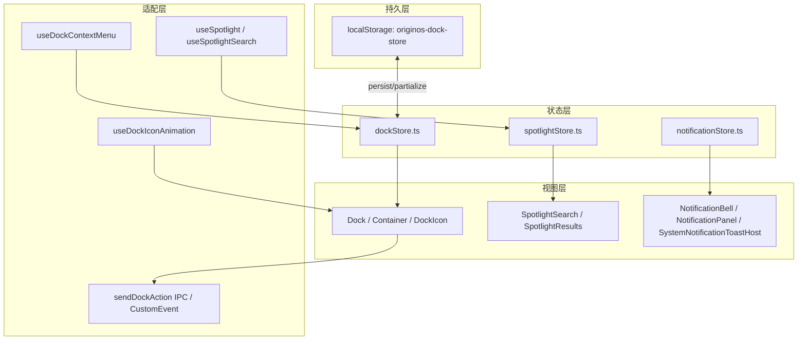

# 单元导读三：Dock、Spotlight 与全局导航

## 本单元总问题

当首页被窗口遮住、用户想快速启动另一个应用时，系统靠什么提供“全局导航”？OriginOS 的答案主要是 Dock 和 Spotlight。本单元要回答：

1. Dock 中的应用列表是持久配置还是运行时状态？
2. 窗口打开、最小化、关闭时，Dock 上的运行指示灯如何同步？
3. Electron 下 Dock 可能在独立窗口，主窗口和 Dock 窗口如何通信？
4. Spotlight 如何索引项目、技能、Agent 并接收全局快捷键？
5. 通知、右键菜单这些全局浮层如何与 Dock/窗口状态联动？

## 本单元层模型

## 核心词汇

- **DockApp**：Dock 上的一个应用条目，含 `id`、`name`、`icon`、`iconType`、`isRunning`、`isPinned`、`appType`、`skillName`、`index`。
- **DockSide**：`left` / `bottom` / `right`，影响布局方向。
- **`sendDockAction`**：跨窗口通信函数，Electron 下走 IPC，Web 下派发自定义事件。
- **Spotlight**：全局命令面板，支持项目、技能、Agent 搜索与快速启动。
- **Notification Store**：管理通知列表、未读数、Toast 宿主。
- **Context Menu**：Dock 图标的右键菜单，支持打开/固定/卸载。

## 常见混淆

| 容易混淆的点 | 正确理解 |
| --- | --- |
| Dock 只在底部 | 实际上 Web 默认底部，Electron 可配置为 `left` / `right` / `bottom` |
| `isRunning` 由 AppCard 设置 | 主要由 `Dock` 组件监听 `appWindowStore.windows` 后自动同步 |
| Dock 上每个 app 都有独立窗口 | 不一定；固定项如“创建项目”只是快捷入口，点击才打开窗口 |
| `removeApp` 就是卸载应用 | 对固定项调用 `unpin` 后 `removeApp`；对非固定运行项则是从 Dock 移除 |
| Spotlight 只搜索本地文件 | 当前实现主要搜索项目、技能、Agent，不是通用文件搜索 |
| 通知和 Dock 无关 | 通知铃铛通常在 TopMenuBar 或状态栏，但通知状态由独立 store 维护 |

## 因果链（J20–J27）

| 课号 | 标题 | 回答的核心问题 | 源码入口 |
| --- | --- | --- | --- |
| J20 | Dock 状态结构与持久化 | Dock 存哪些字段？哪些会持久化？ | `packages/web/src/store/dockStore.ts` |
| J21 | Dock 组件如何监听窗口 | 窗口打开/关闭/最小化如何同步到 Dock？ | `packages/web/src/components/os/dock/index.tsx` |
| J22 | DockIcon 的点击、拖拽、长按 | 点击图标如何聚焦已有窗口或启动新入口？ | `packages/web/src/components/os/dock/DockIcon.tsx` |
| J23 | Dock 右键菜单与动画 | 右键菜单项如何生成？图标悬停动画如何封装？ | `packages/web/src/hooks/useDockContextMenu.ts`、`useDockIconAnimation.ts` |
| J24 | Spotlight 状态与索引 | Spotlight 如何管理搜索词、结果、选中项？ | `packages/web/src/store/spotlightStore.ts` |
| J25 | Spotlight 搜索与快捷键 | 全局快捷键如何打开/关闭 Spotlight？结果如何启动窗口？ | `packages/web/src/hooks/useSpotlight.ts`、`useSpotlightSearch.ts` |
| J26 | 通知中心与全局浮层 | 通知如何产生、展示、清除？Toast 宿主如何挂载？ | `packages/web/src/store/notificationStore.ts`、`components/os/notification/*` |
| J27 | Dock/Spotlight 单元 Workshop | 把 Dock、Spotlight、通知串成全局导航排查地图 | 本单元小结 |

## 源码覆盖台账

| 文件 | 行数 | 课号 | 覆盖说明 |
| --- | --- | --- | --- |
| `packages/web/src/store/dockStore.ts` | ~260 | J20 | 全部字段、actions、持久化 merge |
| `packages/web/src/components/os/dock/index.tsx` | ~178 | J21 | 窗口监听、图标点击、sendDockAction |
| `packages/web/src/components/os/dock/Container.tsx` | ~98 | J21 | 桌面/Web 布局差异、展开/收起 |
| `packages/web/src/components/os/dock/DockIcon.tsx` | ~235 | J22 | 拖拽、长按删除、点击分发 |
| `packages/web/src/components/os/dock/Indicator.tsx` | ~16 | J22 | 运行指示灯 |
| `packages/web/src/components/os/dock/Tooltip.tsx` | ~43 | J22 | 工具提示定位 |
| `packages/web/src/hooks/useDockContextMenu.ts` | ~119 | J23 | 右键菜单项生成 |
| `packages/web/src/hooks/useDockIconAnimation.ts` | ~110 | J23 | Fluent 动画系统封装 |
| `packages/web/src/components/os/ContextMenu.tsx` | ~67 | J23 | 通用右键菜单组件 |
| `packages/web/src/store/spotlightStore.ts` | 58 | J24 | 状态字段与 actions |
| `packages/web/src/components/os/spotlight/index.tsx` | 57 | J25 | Spotlight 面板入口 |
| `packages/web/src/components/os/spotlight/SpotlightSearch.tsx` | 36 | J25 | 搜索输入框 |
| `packages/web/src/components/os/spotlight/SpotlightResults.tsx` | 66 | J25 | 结果项渲染与启动 |
| `packages/web/src/hooks/useSpotlight.ts` | 49 | J25 | 全局快捷键与键盘导航 |
| `packages/web/src/hooks/useSpotlightSearch.ts` | 39 | J25 | 防抖过滤 |
| `packages/web/src/store/notificationStore.ts` | 125 | J26 | 通知状态与 actions |
| `packages/web/src/components/os/notification/NotificationBell.tsx` | 79 | J26 | 通知铃铛与轮询 |
| `packages/web/src/components/os/notification/NotificationPanel.tsx` | 235 | J26 | 通知面板与激活目标 |
| `packages/web/src/components/os/notification/SystemNotificationToastHost.tsx` | 116 | J26 | Toast 宿主 |

> 注：带 `~?` 的行数将在对应课正式撰写时补测。本导读先给出范围，便于阅读前建立预期。

## 调试路径

如果 Dock 上某个图标行为异常，按以下顺序排查：

1. **状态层**：`dockStore.apps` 中该条目是否存在？`isPinned` / `isRunning` / `skillName` 是否正确？
2. **监听层**：`Dock` 组件的 `useEffect([windows])` 是否触发？是否把窗口 ID 直接当成 appId？
3. **交互层**：`DockIcon` 的 `handleClick` 是否进入正确分支？（已有窗口 / 运行中 / 快捷入口 / Skill / Sandbox / Agent）
4. **通信层**：Electron 下是否通过 `sendDockAction` 把动作广播给主窗口？Web 下是否有对应的 `CustomEvent` 监听？
5. **持久化层**：localStorage 中 `originos-dock-store` 是否被旧数据污染？清除后刷新是否恢复默认固定项？

如果 Spotlight 打不开或搜索无结果：

1. `spotlightStore.isOpen` 是否为 true？
2. `useGlobalShortcut` 是否正确绑定快捷键？
3. `useSpotlightSearch` 的索引是否包含目标项目/技能/Agent？
4. 结果项的 `onSelect` 是否调用了正确的打开函数？

## 纸面实验

1. 画出从用户打开一个 Skill 窗口，到 Dock 上出现对应图标并点亮指示灯的完整数据流。
2. 如果 Electron 下 Dock 是独立窗口，说明主窗口如何知道 Dock 上点击了哪个图标。
3. 比较 `dockStore` 的 `partialize` 和 `merge`：为什么只持久化固定项？合并时又为什么要补回缺失的默认固定项？
4. 设计一个方案：当用户通过 Spotlight 打开项目工作区时，如何同时更新 Dock 和 `appWindowStore`。

## 测试证据（本单元边界内）

- `packages/web/src/store/__tests__/dockStore.test.ts`：验证 `addApp` 去重、`moveApp` 重排、`pinApp` 固定、`unpinApp` 移除。
- `packages/web/src/store/__tests__/spotlightStore.test.ts`：验证搜索过滤、选中索引、打开/关闭状态。
- `packages/web/src/components/os/__tests__/Dock.integration.test.tsx`：验证 Dock 渲染与窗口同步。
- `packages/web/src/components/os/spotlight/__tests__/Spotlight.test.tsx`：验证 Spotlight 搜索交互。

## 口头验收

读完本单元后，应能用自己的话回答：

1. Dock 的固定项和运行时项分别如何进入列表？
2. 窗口关闭后，为什么非固定项会从 Dock 消失，而固定项不会？
3. `sendDockAction` 在 Web 和 Electron 下有什么不同实现？
4. Spotlight 的结果索引通常从哪里来？结果选中后如何打开窗口？
5. 通知 Toast 为什么要用独立的 `SystemNotificationToastHost` 组件挂载？

## 进入正式课

读完本导读后，按 J20 → J21 → J22 → J23 → J24 → J25 → J26 → J27 的顺序阅读。每节课聚焦一个源码窗口，不要跳读。
