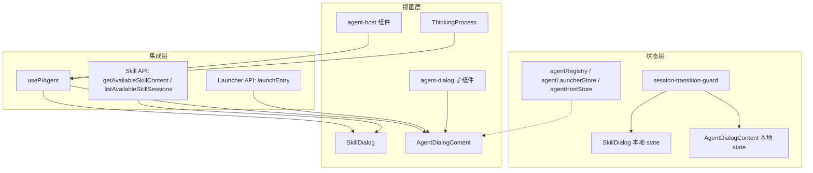

# 单元导读四：Agent / Skill 会话界面

## 本单元总问题

当用户点击首页的 Skill 或 Agent 卡片后，窗口里真正出现的是一个会话界面。这个界面要完成哪些事？

1. 技能内容（SKILL.md）从哪里加载？如何变成 Agent 的 system prompt？
2. Skill 与 Agent 的会话初始化流程有什么相同和不同？
3. 历史会话怎么列出、怎么切换、怎么防止并发切换导致的竞态？
4. 消息列表、输入框、思考状态、工具执行结果各自负责什么？
5. `agent-dialog` 与 `agent-host` 两套组件并存，分别服务于什么场景？
6. Agent 注册表、启动器、宿主 store 之间如何协作？

## 本单元层模型

## 核心词汇

- **SkillDialog**：Web 包中 Skill 会话的主组件，负责加载技能内容、构建 system prompt、管理会话历史。
- **AgentDialogContent**：Web 包中 Agent 会话的主组件，通过 Launcher API 初始化 Agent，支持角色 Agent 与普通 Agent。
- **buildSkillSystemPrompt**：把 SKILL.md 内容和元数据（工作目录、输出目录、技能源目录）组装成 Agent system prompt 的函数。
- **session-transition-guard**：用 epoch + target 实现的轻量竞态守卫，防止快速切换/重复初始化时旧结果覆盖新状态。
- **usePiAgent**：Core 包提供的 Hook，封装 Agent 初始化、流式发送、历史消息、UI 状态。
- **agent-dialog**：Web 包中用于窗口内 Agent 会话的组件集合。
- **agent-host**：Web 包中用于独立宿主式 Agent 会话的组件集合。
- **ThinkingProcess**：展示 Agent 思考过程的 UI 组件。

## 常见混淆

| 容易混淆的点 | 正确理解 |
| --- | --- |
| SkillDialog 与 AgentDialogContent 都能启动会话 | 是的，但 SkillDialog 直接加载 SKILL.md 构建 prompt；AgentDialogContent 通过 Launcher API 取 systemPrompt 和 baseDir |
| `agentBaseDir` 和 `outputDir` 是同一个东西 | 不一定；`agentBaseDir` 是 CWD + 认知文件目录；`outputDir` 是产物输出目录，可能相同也可能不同 |
| `session-transition-guard` 防止什么 | 防止用户快速点击历史会话或反复切换技能时，旧 initialize/restore 的结果覆盖当前会话 |
| `SkillDialog` 的 `stableSessionId` 为什么用 `uuidv4()` | 让组件在 StrictMode 双挂载和重新渲染之间保持同一个会话 ID，避免重复初始化 |
| `agent-dialog` 和 `agent-host` 是同一套代码 | 不是；`agent-dialog` 用于窗口内嵌，`agent-host` 用于独立宿主页面 |
| 工具执行结果在消息列表里显示 | 部分组件用 `ToolExecutionFrame`，部分用 `MessageList` 的 `toolExecutions` prop，取决于宿主 |

## 因果链（J28–J39）

| 课号 | 标题 | 回答的核心问题 | 源码入口 |
| --- | --- | --- | --- |
| J28 | SkillDialog 内容加载与 Prompt 构建 | SKILL.md 怎么加载？system prompt 里为什么有工作目录、输出目录、技能源目录？ | `packages/web/src/components/skills/SkillDialog.tsx` 第 59–221 行 |
| J29 | SkillDialog 会话初始化与切换 | 技能切换、新建会话、恢复历史会话如何防止竞态？ | `packages/web/src/components/skills/SkillDialog.tsx` 第 265–535 行 |
| J30 | SkillDialog 消息发送、附件与 UI | 初始消息怎么自动发送？附件怎么拼接？技能目录怎么打开？ | `packages/web/src/components/skills/SkillDialog.tsx` 第 537–970 行 |
| J31 | AgentDialogContent 结构与 Launcher 初始化 | Agent 会话如何通过 Launcher API 初始化？baseDir 从哪来？ | `packages/web/src/components/os/agent-dialog/AgentDialogContent.tsx` 第 1–330 行 |
| J32 | AgentDialogContent 历史、发送与 UI | Agent 历史会话如何切换？自动欢迎语怎么触发？工作区按钮做什么？ | `packages/web/src/components/os/agent-dialog/AgentDialogContent.tsx` 第 331–652 行 |
| J33 | agent-dialog 子组件 | ChatInput、MessageList、StatusIndicator、ToolExecutionFrame 如何分工？ | `packages/web/src/components/os/agent-dialog/*` |
| J34 | agent-host 组件 | 独立宿主页面的 AgentDialog、MessageInput、MessageList 与窗口版有什么不同？ | `packages/web/src/components/os/agent-host/*` |
| J35 | ThinkingProcess 思考过程 UI | “思考中”状态如何分段展示？useThinkingProcess 怎么解析流式文本？ | `packages/web/src/components/os/cui/thinking/*`、`useThinkingProcess.ts` |
| J36 | Agent 生命周期 Hooks | useAgent、useAgentLifecycle 如何封装初始化、清理、状态订阅？ | `packages/web/src/hooks/useAgent.ts`、`useAgentLifecycle.ts` |
| J37 | Agent 注册表与启动 Store | agentRegistry、agentLauncherStore、agentHostStore 分别管什么？ | `packages/web/src/store/agentRegistry.ts`、`agentLauncherStore.ts`、`agentHostStore.ts` |
| J38 | 技能执行与技能浏览 | SkillExecution 展示执行步骤，SkillBrowser 展示技能列表，导出策略如何判断？ | `packages/web/src/components/skills/SkillExecution.tsx`、`SkillBrowser.tsx`、`skill-export-policy.ts` |
| J39 | Agent / Skill 会话 Workshop | 把 Skill 与 Agent 会话链路串成排查地图 | 本单元小结 |

## 源码覆盖台账

| 文件 | 行数 | 课号 | 覆盖说明 |
| --- | --- | --- | --- |
| `packages/web/src/components/skills/SkillDialog.tsx` | ~970 | J28–J30 | 技能内容加载、prompt 构建、会话初始化/切换/发送、附件、UI |
| `packages/web/src/components/os/agent-dialog/AgentDialogContent.tsx` | ~652 | J31–J32 | Agent Launcher 初始化、历史会话、自动消息、工作区 |
| `packages/web/src/components/os/agent-dialog/session-transition-guard.ts` | ~48 | J29、J31 | 竞态守卫与自动启动条件 |
| `packages/web/src/components/os/agent-dialog/ChatInput.tsx` | ~90 | J33 | 旧版输入框（若仍在使用） |
| `packages/web/src/components/os/agent-dialog/MessageList.tsx` | ~260 | J33 | 消息列表、工具指示器、头像 |
| `packages/web/src/components/os/agent-dialog/StatusIndicator.tsx` | ~80 | J33 | 状态指示 |
| `packages/web/src/components/os/agent-dialog/ToolExecutionFrame.tsx` | ~200 | J33 | 工具执行结果展示 |
| `packages/web/src/components/os/agent-host/AgentDialog.tsx` | ~300 | J34 | 独立宿主入口 |
| `packages/web/src/components/os/agent-host/MessageInput.tsx` | ~150 | J34 | 宿主版输入框 |
| `packages/web/src/components/os/agent-host/MessageList.tsx` | ~220 | J34 | 宿主版消息列表 |
| `packages/web/src/components/os/cui/thinking/ThinkingProcess.tsx` | ~120 | J35 | 思考过程容器 |
| `packages/web/src/components/os/cui/thinking/ThinkingHeader.tsx` | ~60 | J35 | 思考标题栏 |
| `packages/web/src/components/os/cui/thinking/ThinkingContent.tsx` | ~140 | J35 | 思考内容解析与渲染 |
| `packages/web/src/hooks/useThinkingProcess.ts` | ~80 | J35 | 思考文本状态 Hook |
| `packages/web/src/hooks/useAgent.ts` | ~120 | J36 | Agent 实例管理 Hook |
| `packages/web/src/hooks/useAgentLifecycle.ts` | ~100 | J36 | 生命周期封装 Hook |
| `packages/web/src/store/agentRegistry.ts` | ~150 | J37 | Agent 注册表 |
| `packages/web/src/store/agentLauncherStore.ts` | ~180 | J37 | Agent 启动器状态 |
| `packages/web/src/store/agentHostStore.ts` | ~120 | J37 | Agent 宿主状态 |
| `packages/web/src/components/skills/SkillExecution.tsx` | ~224 | J38 | 技能执行进度展示 |
| `packages/web/src/components/skills/SkillBrowser.tsx` | ~206 | J38 | 技能列表浏览器 |
| `packages/web/src/components/skills/skill-export-policy.ts` | ~3 | J38 | 导出策略判断 |
| `packages/web/src/components/molecules/ChatInput.tsx` | ~258 | J33 / 参考 | 通用分子 ChatInput |
| `packages/web/src/components/molecules/MessageList.tsx` | ~364 | J33 / 参考 | 通用分子 MessageList |

> 注：带 `~?` 的行数将在对应课正式撰写时补测。本导读先给出范围，便于阅读前建立预期。

## 调试路径

如果 Skill 会话初始化失败或没有回复：

1. **内容层**：`loadSkillContent` 是否成功返回 `content`？是否回退到 Agent API？
2. **Prompt 层**：`buildSkillSystemPrompt` 是否正确拼接工作目录、输出目录、技能源目录？`agentBaseDir` 是否传给 `initialize`？
3. **会话层**：`lastInitRef` 是否记录了当前 skill/session？`transitionGuard` 的 token 是否被后续切换 invalidate？
4. **自动启动层**：`shouldAutoStartSession` 的 6 个条件是否全部满足？`hasAutoStartedRef` 是否被提前置为 true？
5. **发送层**：`handleSendMessage` 是否被调用？`isInitialized` 是否为 true？`isThinking` 是否未置位？

如果 Agent 会话初始化失败：

1. **注册表层**：`useAgentRegistryStore` 中是否能找到对应 `agentId`？
2. **Launcher 层**：`launchEntry({ entryType, entryId })` 是否成功返回 `systemPrompt` 和 `baseDir`？
3. **初始化层**：`initialize(sessionId, ..., { agentType, systemPrompt, agentBaseDir })` 是否完成？
4. **历史切换层**：`selectSession` 是否用 `transitionGuard.begin` 保护？`restoreSession` 后 token 是否仍有效？

如果思考状态或工具结果不显示：

1. `usePiAgent` 返回的 `isThinking` / `uiState` 是否正确？
2. `ThinkingProcess` 是否正确订阅/接收思考文本？
3. 工具执行事件是否通过 `subscribe` 被捕获？事件类型是 `tool_execution_start` / `tool_execution_end` 吗？
4. 不同宿主组件使用的 MessageList 是否支持 `toolExecutions` prop？

## 纸面实验

1. 列出 `SkillDialog` 从 `skillName` prop 到 `initialize()` 被调用的完整数据流，标注每一步使用的 API 和 ref。
2. 比较 `SkillDialog` 和 `AgentDialogContent` 的会话 ID 生成方式：为什么一个用 `uuidv4()`，另一个用 `agent-${agentId}-${Date.now()}`？
3. 解释 `session-transition-guard` 的 `epoch` 机制：如果用户在 `restoreSession` 还没返回时又点击了另一个历史会话，系统如何避免旧结果覆盖新状态？
4. `buildSkillSystemPrompt` 里同时注入 `skillDir`、`agentWorkDir`、`outputDir`，分别对应文件系统的哪些目录？Agent 应该往哪个目录写产物？
5. 设计一个最小复现：让 Skill 窗口打开时自动发送一条初始消息，说明需要满足 `shouldAutoStartSession` 的哪些条件。

## 测试证据（本单元边界内）

- `packages/web/src/components/skills/__tests__/SkillDialog.test.tsx`：验证技能内容加载、prompt 构建、消息发送。
- `packages/web/src/components/os/agent-dialog/__tests__/AgentDialogContent.test.tsx`：验证 Launcher 调用、会话初始化、历史切换。
- `packages/web/src/components/os/agent-dialog/__tests__/session-transition-guard.test.ts`：验证 `createSessionTransitionGuard` 和 `shouldAutoStartSession`。
- `packages/web/src/components/os/cui/thinking/__tests__/ThinkingProcess.test.tsx`：验证思考文本解析与渲染。
- `packages/web/src/store/__tests__/agentRegistry.test.ts`：验证注册表增删改查。

## 口头验收

读完本单元后，应能用自己的话回答：

1. `SkillDialog` 和 `AgentDialogContent` 分别是如何拿到 system prompt 的？
2. 为什么 `SkillDialog` 需要缓存技能内容？缓存命中和未命中分别走什么逻辑？
3. `session-transition-guard` 解决的核心问题是什么？
4. `shouldAutoStartSession` 的 6 个条件是什么？为什么要同时检查 `messageCount === 0` 和 `!isThinking`？
5. `agent-dialog` 和 `agent-host` 两套组件的主要使用场景区别是什么？
6. `agentRegistry`、`agentLauncherStore`、`agentHostStore` 各管什么状态？

## 进入正式课

读完本导读后，按 J28 → J29 → J30 → J31 → J32 → J33 → J34 → J35 → J36 → J37 → J38 → J39 的顺序阅读。每节课聚焦一个源码窗口，不要跳读。
