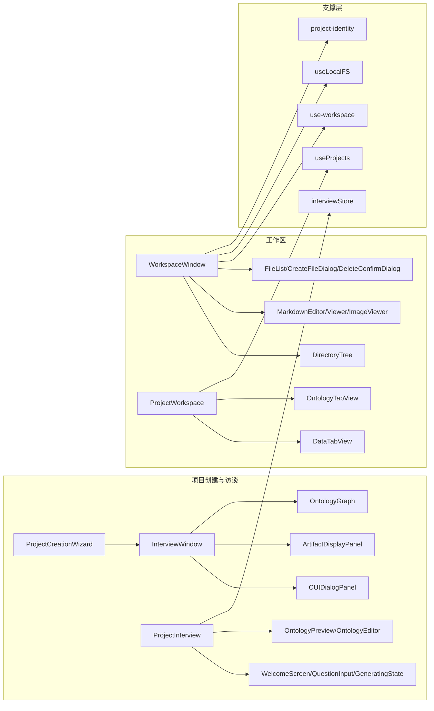

# 单元五导读：项目、访谈与工作区界面

## 总问题

项目创建、访谈、工作区文件管理、本体数据编辑如何在同一窗口框架下挂载不同内容？

Part J 前四个单元已经讲完首页、窗体、Dock/Spotlight、Agent/Skill 会话。单元五进入 OriginOS 中最具“业务重量”的两块界面：

1. **项目创建与访谈**：从 `ProjectCreationWizard` 的分步表单，到 `InterviewWindow` 的左右分栏 AI 访谈，再到旧版 `ProjectInterview` 的状态机流程。
2. **工作区**：从 `WorkspaceWindow` 的文件树与 Markdown 编辑器，到 `ProjectWorkspace` 的数据/本体/方案标签页。

这两块界面共享同一个底层规律：**窗口框架由 Part J 前几个单元已经讲过的 `AppWindowManager` 提供，窗口内部的内容区则根据业务类型挂载不同的 React 组件。** 读懂单元五的关键，就是看清“业务组件 → 通用 UI 组件 → Core 服务/API”这条分层链。

## 本单元学习地图

## 关键概念预习

| 概念 | 一句话解释 |
| --- | --- |
| `ProjectCreationWizard` | 分步表单向导，收集项目背景、优先级、工作模式，最后调用 Core 服务完成创建。 |
| `InterviewWindow` | 基于 Skill/Agent 的新版项目访谈窗口，左侧对话、右侧业务模型实时预览。 |
| `CUIDialogPanel` | 访谈窗口的左侧对话面板，封装 `ChatMessageList` + `ChatInputBar` + 附件上传。 |
| `ArtifactDisplayPanel` | 访谈窗口的右侧产物面板，按 `empty/collecting/generating/preview` 四种阶段展示业务模型。 |
| `ProjectInterview` | 旧版独立页面访谈流程，包含欢迎、问题、生成、预览、编辑、完成六个状态。 |
| `interviewStore` | 旧版访谈的 Zustand 状态层。 |
| `OntologyGraph` | 用 Canvas 手写的力导向本体图谱，把 `business-model.json` 转成节点和边。 |
| `WorkspaceWindow` | 文件工作区窗口，左侧目录树、右侧文件查看/编辑，支持文件监听和沙箱打开。 |
| `ProjectWorkspace` | 项目管理工作区，含数据/本体/方案三个标签页。 |
| `useProjects` | Web 包的项目列表 Hook，封装 list/create/update/delete/import/export API。 |
| `use-workspace` | Core 提供的文件工作区 Hook，管理文件树、打开文件、保存、删除。 |
| `project-identity` | `projectId` / `ontologyId` 的规范化函数，处理 `project-`、`ontology-` 等前缀。 |

## 源码覆盖台账

| 文件 | 状态 | 主讲章节 | 代码窗口/责任 | 备注 |
| --- | --- | --- | --- | --- |
| `packages/web/src/components/project/ProjectCreationWizard.tsx` | 精读 | J40 | 分步向导、session 管理、complete 56–192 行、renderStepContent 244–326 行 | 含 6 个子步骤组件 |
| `packages/web/src/components/project/wizard/StepBackground.tsx` | 精读 | J40 | 第一步背景输入 17–78 行 | — |
| `packages/web/src/components/project/wizard/StepPriorities.tsx` | 精读 | J40 | 第二步优先级选择 19–174 行 | — |
| `packages/web/src/components/project/wizard/StepWorkMode.tsx` | 精读 | J40 | 第三步工作模式 19–167 行 | — |
| `packages/web/src/components/project/wizard/StepConfirm.tsx` | 精读 | J40 | 第四步确认 21–208 行 | — |
| `packages/web/src/components/project/wizard/CreatingState.tsx` | 精读 | J40 | 创建中状态 7–67 行 | — |
| `packages/web/src/components/project/wizard/SuccessState.tsx` | 精读 | J40 | 成功状态 17–81 行 | — |
| `packages/web/src/components/interview/InterviewWindow.tsx` | 精读 | J41 | 主窗口 390–703 行、model 加载/转换 140–382 行、auto-start/refresh 492–637 行 | 新版访谈主入口 |
| `packages/web/src/components/interview/CUIDialogPanel.tsx` | 精读 | J42 | 对话面板 37–187 行 | 使用 ChatMessageList/ChatInputBar |
| `packages/web/src/components/interview/ArtifactDisplayPanel.tsx` | 精读 | J42 | 产物面板 66–369 行 | 分阶段展示 + Tabs |
| `packages/web/src/components/interview/ResizableLayout.tsx` | 精读 | J42 | 可拖拽分栏 19–95 行 | — |
| `packages/web/src/components/interview/ProjectInterview.tsx` | 精读 | J43 | 旧版访谈状态机 34–373 行 | 六状态流程 |
| `packages/web/src/store/interviewStore.ts` | 精读 | J43 | Zustand store 9–116 行 | — |
| `packages/web/src/components/interview/SkillInterview.tsx` | 精读 | J43 | Skill 版访谈 25–227 行 | 直接使用 agent-session API |
| `packages/web/src/hooks/useProjectInitialization.ts` | 精读 | J43 | 项目初始化 Hook 16–108 行 | 动态导入 skill |
| `packages/web/src/components/interview/WelcomeScreen.tsx` | 精读 | J44 | 欢迎弹窗 29–197 行 | — |
| `packages/web/src/components/interview/QuestionInput.tsx` | 精读 | J44 | 问题输入面板 48–253 行 | — |
| `packages/web/src/components/interview/GeneratingState.tsx` | 精读 | J44 | 生成中面板 27–145 行 | — |
| `packages/web/src/components/interview/OntologyPreview.tsx` | 精读 | J44 | 本体预览 52–100 行 | — |
| `packages/web/src/components/interview/OntologyEditor.tsx` | 精读 | J44 | 本体编辑 166–338 行 | 递归节点编辑 |
| `packages/web/src/components/interview/OntologyGraph.tsx` | 精读 | J45 | Canvas 力导向图 54–476 行 | — |
| `packages/web/src/components/os/workspace/WorkspaceWindow.tsx` | 精读 | J46 | 工作区主窗口 38–322 行 | 项目/数据标签、文件监听 |
| `packages/web/src/components/os/workspace/ProjectWorkspace.tsx` | 精读 | J46 | 项目管理区 15–62 行 | 数据/本体/方案标签 |
| `packages/web/src/components/os/workspace/ProjectSidebar.tsx` | 精读 | J46 | 项目侧边栏 15–95 行 | 使用 useProjects |
| `packages/web/src/components/os/workspace/project-identity.ts` | 精读 | J46 | ID 规范化 1–35 行 | — |
| `packages/web/src/lib/hooks/use-projects.ts` | 精读 | J46 | 项目列表 Hook 58–311 行 | — |
| `packages/web/src/hooks/useLocalFS.ts` | 精读 | J46 | 本地文件 Hook 17–62 行 | — |
| `packages/web/src/components/os/workspace/DirectoryTree.tsx` | 精读 | J47 | 目录树 18–213 行 | normalizeFilesForTree |
| `packages/web/src/components/os/workspace/FileList.tsx` | 精读 | J47 | 文件列表 17–278 行 | — |
| `packages/web/src/components/os/workspace/CreateFileDialog.tsx` | 精读 | J47 | 新建文件 14–111 行 | — |
| `packages/web/src/components/os/workspace/DeleteConfirmDialog.tsx` | 精读 | J47 | 删除确认 13–88 行 | — |
| `packages/web/src/hooks/use-workspace.ts` | 精读 | J47 | 仅 re-export 1 行；实际实现位于 `@originos/core/lib/hooks/use-workspace` | Web 包通过 Core hook 访问工作区 |
| `packages/web/src/components/os/workspace/MarkdownEditor.tsx` | 精读 | J48 | Markdown 编辑器 18–206 行 | 实时预览 |
| `packages/web/src/components/os/workspace/MarkdownViewer.tsx` | 精读 | J48 | Markdown 查看器 17–98 行 | — |
| `packages/web/src/components/os/workspace/ImageViewer.tsx` | 精读 | J48 | 图片查看器 13–91 行 | 缩放/平移 |
| `packages/web/src/components/os/workspace/DataTabView.tsx` | 精读 | J48 | 数据标签页 25–632 行 | 本体实例图谱/表格 |
| `packages/web/src/components/os/workspace/OntologyTabView.tsx` | 精读 | J48 | 本体标签页 24–208 行 | Schema/结构编辑 |

## 常见混淆提前澄清

| 对象 A | 对象 B | 关键区分 |
| --- | --- | --- |
| `ProjectCreationWizard` | `InterviewWindow` | 前者是分步表单直接创建项目；后者是 AI 访谈，边聊边生成本体。 |
| `InterviewWindow` | `ProjectInterview` | 前者是新版窗口组件，基于 `usePersistentAgent`；后者是旧版页面级状态机。 |
| `InterviewWindow` | `SkillInterview` | 前者左右分栏 + 实时模型预览；后者是简单对话式 Skill 访谈。 |
| `WorkspaceWindow` | `ProjectWorkspace` | 前者是文件工作区（目录树 + 编辑器）；后者是项目管理区（数据/本体/方案标签）。 |
| `DataTabView` | `OntologyTabView` | 前者管“实例数据”（图谱/表格）；后者管“本体结构”（Schema/概念关系）。 |
| `DirectoryTree` | `FileList` | 前者是层级目录树（侧边栏）；后者是表格文件列表（带删除）。 |
| `useProjects` | `use-workspace` | 前者管项目元数据 CRUD；后者管单个项目内的文件读写。 |
| `project-identity` | 普通 ID | 专门处理 `project-`、`ontology-`、`proj-` 等前缀转换，避免 ID 不一致导致数据找不到。 |

## 典型异常排查路径

### 现象：项目创建后没有进入工作区

1. 检查 `ProjectCreationWizard` 的 `handleComplete` 是否返回 `project.path`。
2. 检查 `handleEnterProject` 是否用 `window.location.href` 跳转。
3. 检查 Core 服务 `completeProjectCreation` 是否成功。

### 现象：访谈窗口右侧业务模型不更新

1. 检查 `toolExecutions` 或 `artifactVersion` 是否有变化。
2. 检查 `loadLatestModel` 是否能读到 `business-model.json`。
3. 检查 `businessModelToOntology` 转换后 `nodes` 是否非空。
4. 检查 `displayModeRef` 与 `setDisplayModeSync` 是否同步。

### 现象：工作区文件树空白

1. 检查 `WorkspaceWindow` 是否解析出 `resolvedBasePath`。
2. 检查 `setActiveProject` 是否被调用。
3. 检查 `use-workspace.loadFiles` 是否返回数据。
4. 检查 `DirectoryTree.normalizeFilesForTree` 是否过滤掉空路径。

### 现象：项目 ID 不一致导致数据错误

1. 检查传入 `WorkspaceWindow` 的 `projectId` 是否带 `project-` 前缀。
2. 检查 `normalizeProjectEntryId` 的输出是否符合预期。
3. 检查 `normalizeOntologyId` 是否把 `ontology_` 转成 `ontology-`。

## 纸面实验

1. 画出 `ProjectCreationWizard` 的四步状态转换图，标出哪一步会调用后端 API。
2. 对比 `InterviewWindow` 和 `ProjectInterview` 的初始触发消息差异：前者如何决定发送“开始项目访谈”还是 `triggerGreeting()`？
3. 在 `OntologyGraph` 的力导向模拟中，如果把 `damping` 从 0.9 改成 0.5，图会怎样？
4. 说明 `WorkspaceWindow` 如何同时支持相对路径 `data/projects/abc` 和绝对路径 `/abs/path/data/skills/x` 的沙箱检测。
5. 如果要让 `ProjectWorkspace` 的“方案”标签真正可用，需要改哪些文件、对接哪些 Core 服务？

## 口头验收

能用自己的话回答以下问题，说明本单元可以开始：

1. `ProjectCreationWizard` 和 `InterviewWindow` 分别是如何创建/初始化项目的？
2. `InterviewWindow` 右侧的 `ArtifactDisplayPanel` 有哪四种阶段？
3. `ProjectInterview` 的六个状态是什么？
4. `OntologyGraph` 的节点和边分别从哪里来？
5. `WorkspaceWindow` 如何监听文件变化并刷新文件树？
6. `useProjects` 和 `use-workspace` 分别管什么？
7. `DataTabView` 和 `OntologyTabView` 的边界在哪里？

## 配图占位

本单元小结课 J48 需要一张配图：

- `assets/00-05-project-workspace-ui-guide-illustrations/00-project-workspace-ui-overview.png`：小黑坐在两个窗口之间，左边是访谈窗口的左右分栏，右边是工作区的目录树和本体标签页。

先读下面的正式课，再回来看这张总图，会更有感觉。
