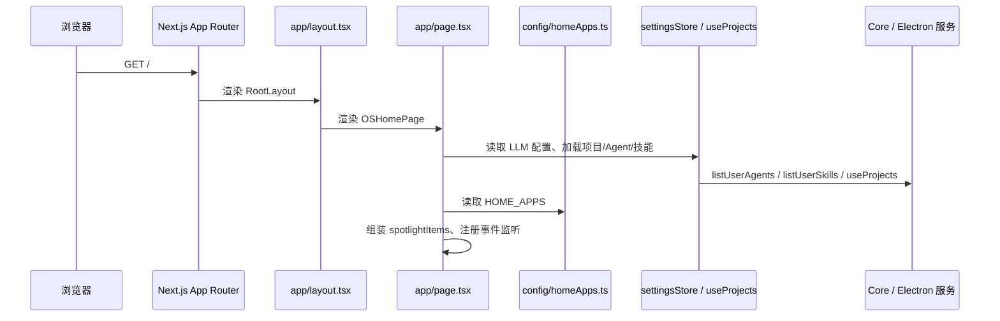

# J01：首页作为应用总入口

## 小林第一次打开 OriginOS

小林在浏览器里输入 `http://localhost:3000`，屏幕上出现深色桌面、顶部状态栏、项目卡片、应用启动器和底部 Dock。此时小林还没有点击任何东西，但系统已经做了很多事情：

1. Next.js 渲染了 `layout.tsx` 和 `page.tsx`；
2. `page.tsx` 检查了当前是不是 Electron 环境；
3. 它尝试从 `/api/user-config` 读取用户配置，判断要不要显示新用户引导；
4. 它同时发起项目列表、用户 Agent、用户技能的加载；
5. 它把项目、Agent、技能、静态命令组合成 Spotlight 搜索项；
6. 它监听了 Dock 动作、原生窗口关闭、项目更新等事件。

本章讨论这个“首页”究竟承担了多少责任，以及为什么它不是一个普通 Next.js 页面。我们不进入窗口管理器内部，也不进入 SkillDialog 的会话逻辑——那些留给后续单元。

## 页面入口的形成路径



这张图说明首页不是“接收数据然后显示”那么简单。它同时是：

- 一个 Next.js 页面组件；
- 一个桌面级状态协调器；
- 一个窗口调度入口；
- 一个全局事件订阅者。

## 概念阶梯：首页里四样东西分别是什么

把首页想成一个机场航站楼：

| 名称 | 通俗解释 | 小林的例子 | 不能把它误认为 |
| --- | --- | --- | --- |
| 页面组件 | 航站楼的建筑结构 | `app/page.tsx` | 某个具体航班的服务台 |
| 应用配置 | 固定航线牌 | `HOME_APPS` | 实时航班动态 |
| 状态数据 | 实时航班动态 | `projects`、`userAgents`、`userSkills` | 建筑结构本身 |
| 窗口调度 | 把乘客带到登机口的摆渡车 | `AppWindowManager.openComponentWindow` | 飞机本身 |

四者不是可任选的组合。没有页面组件，其他东西无处渲染；没有配置，固定入口不会出现；没有状态数据，项目/Agent/技能卡片为空；没有窗口调度，点击卡片不会打开窗口。

## 第一段源码：首页依赖了哪些外部能力

[packages/web/src/app/page.tsx 第 28—68 行](../../../../packages/web/src/app/page.tsx#L28) 是首页的导入区。只看导入就能大致判断首页的范围：

```ts
import AgentInitializer from '@/components/os/AgentInitializer';
import { DesktopOnboarding } from '@/components/os/DesktopOnboarding';
import { SettingsDialog } from '@/components/os/settings/SettingsDialog';
import AgentDialogContent from '@/components/os/agent-dialog/AgentDialogContent';
import Dock from '@/components/os/dock';
import NotificationBell from '@/components/os/notification/NotificationBell';
import { SystemNotificationToastHost } from '@/components/os/notification/SystemNotificationToastHost';
import { ScheduleButton } from '@/components/os/schedules';
import { AppWindowContainer } from '@/components/os/window/AppWindowContainer';
import { WorkspaceWindow } from '@/components/os/workspace';
import { AppCard } from '@/components/framework/AppCard';
import { InterviewWindow } from '@/components/interview';
import { SandboxWindow } from '@/components/sandbox';
import { SkillDialog } from '@/components/skills';
import { SolutionDesign } from '@/components/solution/SolutionDesign';
import { HOME_APPS } from '@/config/homeApps';
import { useProjects } from '@/lib/hooks/use-projects';
import { AppWindowManager } from '@/services/AppWindowManager';
import useSandboxStore from '@/store/sandboxStore';
import { useSpotlightStore } from '@/store/spotlightStore';
import { hasConfiguredLLM, useSettingsStore } from '@/store/settingsStore';
```

这些导入可以分成四类：

1. **OS 级容器与全局组件**：`Dock`、`AppWindowContainer`、`NotificationBell`、`AgentInitializer` 等。它们不是普通业务组件，而是贯穿整个桌面的基础设施。
2. **窗口内容组件**：`WorkspaceWindow`、`InterviewWindow`、`SkillDialog`、`SandboxWindow`、`AgentDialogContent`、`SolutionDesign`。它们不会直接出现在首页 JSX 中，而是作为 `openComponentWindow` 的参数被动态挂载到窗口容器里。
3. **配置与 Hooks**：`HOME_APPS`、`useProjects`、`useSettingsStore`、`useSpotlightStore`。它们决定首页显示什么、能否正常工作。
4. **服务**：`AppWindowManager`。它是首页与窗口系统的唯一正式耦合点。

注意一个细节：首页没有导入 `OSFramework`。这说明当前生产路径已经不再使用 `components/framework/OSFramework.tsx` 作为顶层容器。如果你以后想修改首页布局，不要从 `OSFramework` 开始，而要从 `page.tsx` 开始。

## 第二段源码：首页维护了多少状态

[packages/web/src/app/page.tsx 第 474—528 行](../../../../packages/web/src/app/page.tsx#L474) 定义了 `OSHomePage` 主组件，开头就是一连串状态声明：

```ts
export default function OSHomePage() {
  const llm = useSettingsStore((state) => state.llm);
  const getEffectiveConfig = useSettingsStore((state) => state.getEffectiveConfig);
  const llmConfigured = React.useMemo(() => hasConfiguredLLM(llm), [llm]);
  const llmConfig = React.useMemo(
    () => normalizeRuntimeLLMConfig(getEffectiveConfig()),
    [getEffectiveConfig, llm],
  );

  const [isElectronEnv, setIsElectronEnv] = React.useState(false);
  const [showDesktopOnboarding, setShowDesktopOnboarding] = React.useState(false);
  const [showSettings, setShowSettings] = React.useState(false);
  const [dockGuideHighlight, setDockGuideHighlight] = React.useState(false);
```

这里有三组状态需要区分：

| 状态 | 来源 | 用途 | 是否持久化 |
| --- | --- | --- | --- |
| `llm` / `llmConfigured` / `llmConfig` | `useSettingsStore` | 判断 LLM 是否可用，为多 Agent 协作等提供运行时配置 | `settingsStore` 持久化 |
| `isElectronEnv` | `useState` + `useEffect` | 服务端渲染时为 `false`，客户端挂载后根据 `isElectron()` 更新 | 不持久化 |
| `showDesktopOnboarding` / `showSettings` / `dockGuideHighlight` | `useState` | 控制当前显示的 UI 层 | 不持久化，`showOnboarding` 由用户配置持久化 |

`isElectronEnv` 的处理方式很重要。Next.js 会先服务端渲染，此时 `window` 不存在，`isElectron()` 会报错或返回错误结果。所以代码先用 `useState(false)`，再在 `useEffect` 中调用 `setIsElectronEnv(isElectron())`。这是 React SSR 中常见的“hydration-safe”模式。

`llmConfig` 通过 `normalizeRuntimeLLMConfig` 归一化。这一步在 Part E 已经讲过：它清理 provider 别名、空白字符串、无效 `maxTokens` 等，但不验证 API Key 是否有效。因此，“首页显示 LLM 已配置”不等于“模型一定能连上”。

## 第三段源码：新用户引导的加载与保存

[packages/web/src/app/page.tsx 第 493—547 行](../../../../packages/web/src/app/page.tsx#L493) 处理 `DesktopOnboarding` 的显示逻辑：

```ts
React.useEffect(() => {
  const loadUserConfig = async () => {
    try {
      const response = await fetch('/api/user-config');
      if (response.ok) {
        const result = await response.json();
        const config = result.data || result;
        const showOnboarding = config.preferences?.showOnboarding ?? true;
        if (showOnboarding) {
          const timer = window.setTimeout(() => setShowDesktopOnboarding(true), 650);
          return () => window.clearTimeout(timer);
        }
      }
    } catch (error) {
      console.error('[DesktopOnboarding] Failed to load user config:', error);
      const timer = window.setTimeout(() => setShowDesktopOnboarding(true), 650);
      return () => window.clearTimeout(timer);
    }
    return undefined;
  };

  void loadUserConfig();
}, []);
```

这段代码说明三个事实：

1. Onboarding 是否显示由 `/api/user-config` 决定，默认值是 `true`。
2. 请求失败时也会显示 Onboarding（fail-open），避免因为配置接口异常导致新用户看不到引导。
3. 显示有 650ms 延迟，给页面渲染留出时间。

[packages/web/src/app/page.tsx 第 530—547 行](../../../../packages/web/src/app/page.tsx#L530) 的 `handleDismissOnboarding` 负责保存关闭状态：

```ts
const handleDismissOnboarding = React.useCallback(async () => {
  try {
    const response = await fetch('/api/user-config', {
      method: 'POST',
      headers: { 'Content-Type': 'application/json' },
      body: JSON.stringify({
        preferences: { showOnboarding: false }
      }),
    });
    if (!response.ok) {
      console.error('[DesktopOnboarding] Failed to save onboarding status');
    }
  } catch (error) {
    console.error('[DesktopOnboarding] Error saving onboarding status:', error);
  }
}, []);
```

注意：Onboarding 关闭后，本地状态 `showDesktopOnboarding` 被设为 `false` 是在 `DesktopOnboarding` 组件内部处理的（通过 `onClose`），而持久化是在这里通过 `POST /api/user-config` 完成的。本地状态与持久化状态由两个回调分别负责，不要混为一谈。

## 第四段源码：用户 Agent 和用户技能如何加载

[packages/web/src/app/page.tsx 第 559—614 行](../../../../packages/web/src/app/page.tsx#L559) 管理用户创建的 Agent 和技能：

```ts
const [userAgents, setUserAgents] = React.useState<UserAgent[]>([]);
const [userSkills, setUserSkills] = React.useState<Array<{
  id: string;
  name: string;
  description: string;
  icon: string;
  color: string;
  skillName: string;
}>>([]);

const loadUserAgents = React.useCallback(() => {
  listUserAgents()
    .then(result => {
      if (result.success) setUserAgents(result.data as UserAgent[]);
    })
    .catch(() => {});
}, []);

const loadUserSkills = React.useCallback(() => {
  listUserSkills()
    .then(result => {
      if (result.success) {
        const skills = (result.data || []) as Array<{ id: string; name: string; description: string }>;
        setUserSkills(skills.map((s) => ({
          id: `user-skill-${s.id}`,
          name: s.name,
          description: s.description,
          icon: '⚡',
          color: 'from-amber-500',
          skillName: s.id,
        })));
      }
    })
    .catch(() => {});
}, []);
```

这里有两个设计细节：

1. **用户技能做了 ID 前缀改造**：原始 `s.id` 被加上 `user-skill-` 前缀，避免与内置应用卡片的 ID 冲突。这是渲染层的安全措施，不改变持久化数据。
2. **错误处理是静默的**：`.catch(() => {})` 没有向用户显示错误。这意味着如果 `listUserAgents` 失败，页面上只是不出现用户 Agent 区域，而不会弹错。

[packages/web/src/app/page.tsx 第 728—741 行](../../../../packages/web/src/app/page.tsx#L728) 还在多个 effect 中重复调用这两个加载函数：

```ts
React.useEffect(() => {
  loadUserAgents();
  loadUserSkills();
}, [loadUserAgents, loadUserSkills]);
```

以及监听 `skill:session-close` 事件后刷新：

```ts
React.useEffect(() => {
  const handleSessionClose = () => {
    loadUserAgents();
    loadUserSkills();
  };
  window.addEventListener('skill:session-close', handleSessionClose);
  return () => window.removeEventListener('skill:session-close', handleSessionClose);
}, [loadUserAgents, loadUserSkills]);
```

这说明首页是用户 Agent 和技能列表的“展示中心”，但数据权威在 Core / Electron 服务中。首页只负责拉取、转换和刷新时机。

## 第五段源码：点击卡片后走哪条路

[packages/web/src/app/page.tsx 第 845—899 行](../../../../packages/web/src/app/page.tsx#L845) 定义了两个最重要的调度函数：

```ts
const handleSkillLaunch = (skillName: string, name: string, initialMessage?: string) => {
  console.log('[HomePage] Opening skill:', skillName);
  const windowManager = AppWindowManager.getInstance();

  windowManager.openComponentWindow(
    `skill-${skillName}`,
    name,
    SkillDialog,
    {
      skillName,
      initialMessage: initialMessage?.trim() || '你好！我是' + name.split(' ')[0] + '助手，有什么可以帮助你的吗？',
    },
    {
      position: { width: 1200, height: 800 },
      constraints: { minWidth: 600, minHeight: 400 },
      metadata: { entryType: 'skill', entryId: skillName, sessionId: `skill-${skillName}`, projectId: `skill-${skillName}` },
    }
  );
};

const handleOpenWorkspace = async (projectId: string) => {
  const project = projects.find(p => p.id === projectId);
  const projectName = project?.name || '项目';
  const ontologyId = (project as any)?.ontologyId;

  const windowManager = AppWindowManager.getInstance();

  windowManager.openComponentWindow(
    `workspace-${projectId}`,
    projectName,
    WorkspaceWindow,
    {
      projectId,
      projectName,
      ontologyId,
    },
    {
      position: { width: 1200, height: 800 },
      constraints: { minWidth: 800, minHeight: 600 },
      metadata: { entryType: 'project', entryId: projectId, sessionId: `workspace-${projectId}`, projectId },
    }
  );
};
```

这两个函数展示了首页作为“调度中心”的核心模式：

1. 构造一个稳定的窗口 ID（`skill-${skillName}` 或 `workspace-${projectId}`）；
2. 传入窗口标题；
3. 传入窗口内容组件（`SkillDialog` 或 `WorkspaceWindow`）；
4. 传入组件 props；
5. 传入位置、约束和 `metadata`。

`metadata` 特别重要。它不是给组件 props 用的，而是给 `AppWindowManager` 做生命周期决策用的。例如 `entryType: 'skill'` 会让 `AppWindowManager` 在窗口关闭时触发 `destroyAgentSession` 和 `consolidateMemory`。

注意 `handleOpenWorkspace` 是 `async` 函数，但内部没有 `await`。它标记为 `async` 是因为调用方 `handleOpenProjectInterview` 等其他函数可能使用 `void handleOpenWorkspace(...)` 的写法，但这并不影响函数本身同步执行。这是一个容易误导阅读者的细节。

## 第六段源码：Spotlight 搜索项如何组装

[packages/web/src/app/page.tsx 第 1136—1268 行](../../../../packages/web/src/app/page.tsx#L1136) 把项目、Agent、技能、静态命令组装成 Spotlight 可搜索列表：

```ts
const spotlightItems = React.useMemo<SpotlightItem[]>(() => {
  const staticItems: SpotlightItem[] = [
    {
      id: 'spotlight-create-project',
      type: SpotlightItemType.COMMAND,
      title: '创建项目',
      subtitle: '打开项目访谈窗口并开始初始化',
      icon: '➕',
      shortcut: 'Enter',
      action: () => handleCreateProject(),
      keywords: ['create', 'project', '项目', '新建', '访谈'],
    },
    // ... 其他静态项
  ];

  const appItems: SpotlightItem[] = HOME_APPS.map((app) => ({
    id: `spotlight-app-${app.id}`,
    type: SpotlightItemType.APP,
    title: app.name,
    subtitle: app.description,
    icon: app.icon,
    action: () => {
      if (app.type === 'skill' && isNonEmptyString(app.skillName)) {
        handleSkillLaunch(app.skillName, app.name);
      }
      // ...
    },
    keywords: [app.id, app.name, app.description, app.type],
  }));

  const projectItems: SpotlightItem[] = projects.map((project) => ({
    id: `spotlight-project-${project.id}`,
    type: SpotlightItemType.COMMAND,
    title: project.name,
    subtitle: `${project.description} · ${project.status === ('draft' as ProjectStatus) ? '继续访谈' : '打开工作区'}`,
    icon: project.status === ('draft' as ProjectStatus) ? '📝' : '📁',
    action: () => {
      if (project.status === ('draft' as ProjectStatus)) {
        void handleOpenProjectInterview(project.id);
        return;
      }
      void handleOpenWorkspace(project.id);
    },
    keywords: [project.domain, project.description, '项目', 'project'],
  }));

  // agentItems / skillItems ...

  return [...staticItems, ...appItems, ...projectItems, ...agentItems, ...skillItems];
}, [projects, userAgents, userSkills]);
```

这里的关键是：

1. `spotlightItems` 用 `useMemo` 缓存，依赖 `projects`、`userAgents`、`userSkills`。
2. 同一个项目或 Agent 可能在页面上同时以卡片和 Spotlight 项两种形式出现，但数据源相同。
3. 不同 `type` 的 Spotlight 项决定图标和默认操作，但具体 `action` 还是回调到 `handleSkillLaunch`、`handleOpenWorkspace` 等函数。

[packages/web/src/app/page.tsx 第 1270—1273 行](../../../../packages/web/src/app/page.tsx#L1270) 再把 items 同步到 `spotlightStore`：

```ts
const { setItems } = useSpotlightStore();
React.useEffect(() => {
  setItems(spotlightItems);
}, [spotlightItems, setItems]);
```

这说明 `spotlightStore` 本身不生产数据，只接收 `page.tsx` 组装好的列表。数据权威在首页组件中。

## 真实调用链：从页面挂载到窗口调度

把上面的源码窗口串起来，可以得到一条完整的调用链：

```text
浏览器 GET /
  → Next.js 渲染 layout.tsx
    → 渲染 page.tsx 的 OSHomePage
      → useSettingsStore 读取 LLM 配置
      → useEffect 检测 isElectron 环境
      → useEffect 加载 /api/user-config 判断 Onboarding
      → useProjects 加载项目列表
      → useEffect 加载 userAgents / userSkills
      → useMemo 组装 spotlightItems
      → useEffect 把 spotlightItems 写入 spotlightStore
      → 用户点击 AppCard
        → page.tsx 中的 onClick 回调
          → handleSkillLaunch / handleOpenWorkspace / handleCreateProject
            → AppWindowManager.getInstance().openComponentWindow(...)
              → （进入 Unit 2 的窗口管理逻辑）
```

这条链的停止边界很清楚：本课只讲到 `AppWindowManager` 的调用入口。窗口如何被创建、如何渲染、如何管理状态，是 Unit 2 的内容。

## 关键类型与数据示例

首页中最重要的类型不是页面自己的 props，而是它传递给窗口调度器的 `metadata`：

```ts
metadata: {
  entryType: 'skill' | 'project' | 'role-agent' | 'agent' | 'solution' | 'collaboration' | 'sandbox',
  entryId: string,
  sessionId: string,
  projectId: string,
}
```

`entryType` 决定窗口关闭时是否触发 Agent 销毁和记忆整理；`entryId` 标识具体对象；`sessionId` 用于会话恢复；`projectId` 用于运行时 Agent 的键值。这四者不一定相同，不能混用。

例如一个技能窗口：

```ts
{
  entryType: 'skill',
  entryId: 'bmad-brainstorming',
  sessionId: 'skill-bmad-brainstorming',
  projectId: 'skill-bmad-brainstorming',
}
```

而一个项目工作区窗口：

```ts
{
  entryType: 'project',
  entryId: 'project-123',
  sessionId: 'workspace-project-123',
  projectId: 'project-123',
}
```

`entryId` 和 `projectId` 在这里相同，但 `sessionId` 不同，因为同一个项目可以打开多个窗口（例如工作区和访谈）。

## 失败路径与边界条件

首页是一个大型组件，有几个常见失败路径：

1. **SSR 期间访问 `window`**：代码通过 `useState(false)` + `useEffect` 避免了这个问题。如果你在某处直接读取 `window.innerWidth`，服务端渲染会报错。
2. **`/api/user-config` 失败**：Onboarding 会 fail-open 显示，但用户关闭后可能无法持久化。这会导致每次刷新都重新显示引导。
3. **`listUserAgents` / `listUserSkills` 失败**：错误被静默捕获，页面上只是不出现对应区域。用户可能误以为没有创建过 Agent。
4. **`projects` 为空**：`page.tsx` 会渲染 `WelcomeSection`，而不是项目列表。这是正常分支，不是错误。
5. **Spotlight items 未同步**：如果 `useMemo` 依赖写错，`spotlightItems` 不会更新，但 `spotlightStore` 里的旧数据仍会显示。

## 测试证据：它究竟证明什么

`app/page.tsx` 目前没有直接单元测试。这带来两个教学结论：

1. 本课所讲的行为主要通过阅读源码和手动运行项目验证。
2. 不能从“页面能渲染”推导出“每个调度分支都正确”。

相关但属于其他边界的测试：

| 测试入口 | 已经证明 | 没有证明 |
| --- | --- | --- |
| [packages/web/src/components/os/__tests__/Desktop.integration.test.tsx](../../../../packages/web/src/components/os/__tests__/Desktop.integration.test.tsx) | `Desktop` 组件能渲染背景、网格、Dock | `page.tsx` 的首页路径 |
| [packages/web/src/components/os/__tests__/Dock.integration.test.tsx](../../../../packages/web/src/components/os/__tests__/Dock.integration.test.tsx) | Dock 图标点击能触发动作 | `page.tsx` 对 Dock action 的处理 |
| 无 | — | `handleSkillLaunch`、`handleOpenWorkspace`、`handleCreateProject` 的正确性 |
| 无 | — | `spotlightItems` 组装逻辑 |

缺少直接测试是首页当前的重要测试缺口。后续如果要修改首页调度逻辑，应该优先补充集成测试。

## 小实验

**实验 1：观察首页加载了哪些请求**

1. 启动项目：`pnpm dev`
2. 打开浏览器开发者工具，切换到 Network 面板。
3. 刷新首页，观察 `/api/user-config` 和项目列表相关请求。
4. 在 `page.tsx` 中搜索 `fetch('/api/user-config')`，确认它是在哪个 `useEffect` 中发起的。

**实验 2：修改一个应用卡片的默认文案**

1. 打开 `config/homeApps.ts`。
2. 把 `app-brainstorming` 的 `name` 改成其他文字。
3. 刷新首页，观察应用启动器中的卡片文案是否变化。
4. 思考：如果修改 `system-apps.ts` 中的名称，首页卡片会变化吗？为什么？

**实验 3：追踪一次点击的调用链**

1. 在 `page.tsx` 的 `handleSkillLaunch` 第一行加一个 `console.log`。
2. 在 `AppWindowManager.openComponentWindow` 第一行加一个 `console.log`。
3. 点击“头脑风暴”卡片，观察控制台输出顺序。
4. 确认：是 `page.tsx` 先处理点击，再调用 `AppWindowManager`。

## 口头验收

学完本节后，不看正文也应能回答：

1. 为什么 `app/page.tsx` 被称为“应用总入口”？它承担了哪些职责？
2. `isElectronEnv` 为什么要用 `useState(false)` + `useEffect` 初始化？
3. Onboarding 的显示和关闭分别依赖什么？
4. 用户技能的 ID 为什么要加 `user-skill-` 前缀？
5. `handleSkillLaunch` 和 `handleOpenWorkspace` 有哪些共同参数模式？
6. `metadata` 中的 `entryType`、`entryId`、`sessionId`、`projectId` 分别有什么用？
7. 首页目前缺少哪些直接测试？
8. 如果首页打开后项目卡片没有显示，应该按什么顺序排查？

## 章节收束

首页不是普通页面，而是 OriginOS Web 层的“桌面入口”。它把配置、状态、事件监听和窗口调度集中在一个组件里。理解它的关键是：

- 区分“配置驱动的固定入口”和“状态驱动的动态卡片”；
- 区分“本地 UI 状态”和“持久化用户配置”；
- 区分“页面组件”和“窗口调度器”。

下一节课，我们将进入 `config/homeApps.ts` 和 `config/system-apps.ts`，看看首页的固定应用卡片是如何由配置驱动的。
