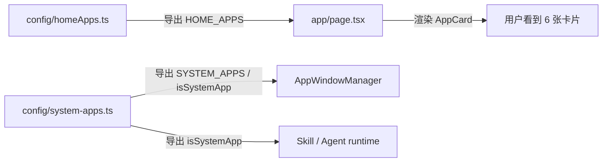

# J02：首页应用卡片由配置驱动

## 小林看到 6 张卡片，但卡片不是“写死”在页面里的

J01 读完 `app/page.tsx` 后，小林已经知道首页是一个状态协调器。但首页中间那 6 张应用卡片——创建 Agent、创建角色、技能市场、工作区、头脑风暴、工作流构建——到底从哪里来？

它们不是 `page.tsx` 里一行一行写出来的 JSX，而是来自一个纯配置数组：`HOME_APPS`。这节课要回答三个问题：

1. `HOME_APPS` 里的一张卡片需要哪些字段？
2. `type: 'skill'` 和 `type: 'action'` 有什么本质区别？
3. `system-apps.ts` 里的 `SYSTEM_APPS` 为什么不参与首页渲染，却依然重要？

## 配置层的位置



这张图把两个配置文件的职责分开：`homeApps.ts` 面向“首页有什么入口”，`system-apps.ts` 面向“系统如何识别内置应用”。两者都硬编码在仓库里，但服务的对象不同。

## 第一段源码：HomeAppConfig 接口

[packages/web/src/config/homeApps.ts 第 8—21 行](../../../../packages/web/src/config/homeApps.ts#L8) 定义了单张卡片的类型合同：

```ts
export type AppCardType = 'skill' | 'action';

export interface HomeAppConfig {
  id: string;
  name: string;
  description: string;
  icon: string;
  color: string;
  type: AppCardType;
  // 用于 skill 类型：打开 SkillDialog 的技能名
  skillName?: string;
  // 用于 action 类型：点击触发的操作
  action?: string;
}
```

这个接口虽然短，但已经规定了卡片的所有行为分支。`type` 是分发器：`skill` 走 SkillDialog，`action` 走 `page.tsx` 里的 `handle*` 回调。`skillName` 和 `action` 不会同时生效，但接口允许它们同时存在，因为 TypeScript 在这个阶段只检查结构，不检查语义互斥。

注意 `icon` 和 `color` 都是字符串。`icon` 直接用于 `AppCard` 的 Emoji 渲染，`color` 用于渐变背景类名。这里没有图标组件引用，也没有颜色常量枚举，因此新增一张卡片只需要改配置文件，不需要新增组件文件。

## 第二段源码：HOME_APPS 数组

[packages/web/src/config/homeApps.ts 第 27—111 行](../../../../packages/web/src/config/homeApps.ts#L27) 是实际配置：

```ts
export const HOME_APPS: HomeAppConfig[] = [
  // --- 创建入口 ---
  {
    id: 'app-create-agent',
    name: '创建 Agent',
    description: '创建智能 Agent，通过对话定义能力和行为',
    icon: '🤖',
    color: 'from-primary',
    type: 'skill',
    skillName: 'agent-creator',
  },
  {
    id: 'app-create-role',
    name: '创建角色',
    description: '从角色模板创建专属的角色 Agent',
    icon: '👤',
    color: 'from-violet-500',
    color: 'from-violet-500',
    type: 'skill',
    skillName: 'role-agent-creator',
  },
  ...
  {
    id: 'app-workspace',
    name: '工作区',
    description: '管理项目文件，编辑 Markdown 文档',
    icon: '📝',
    color: 'from-yellow-500',
    type: 'action',
    action: 'open-workspace',
  },
  ...
];
```

数组顺序就是首页渲染顺序。当前配置可以分成两类：

| 分组 | 卡片 | type | 后续行为 |
| --- | --- | --- | --- |
| 创建入口 | 创建 Agent、创建角色、技能市场 | skill | 打开 `SkillDialog`，加载对应 `skillName` |
| 系统内置 Skill | 头脑风暴、工作流构建 | skill | 同上 |
| 操作入口 | 工作区 | action | 执行 `handleOpenWorkspace` |

为什么“创建 Agent”和“头脑风暴”都是 `skill`，却要分在不同组？因为“创建入口”面向系统级能力（创建 Agent、创建角色、安装技能），而“系统内置 Skill”面向具体业务 Skill（创意、工作流）。分组是注释级别的语义，不影响代码运行，但影响读者理解产品意图。

## 第三段源码：system-apps.ts 的识别逻辑

[packages/web/src/config/system-apps.ts 第 10—31 行](../../../../packages/web/src/config/system-apps.ts#L10) 定义了系统应用注册表：

```ts
export interface SystemAppConfig {
  code: string;
  name: string;
}

export const SYSTEM_APPS: SystemAppConfig[] = [
  { code: 'role-agent-creator', name: '角色 Agent 创建助手' },
  { code: 'skill-creator-app', name: 'Skill 技能创建助手' },
  { code: 'agent-creator', name: 'Agent 创建助手' },
  { code: 'search-and-install-skill', name: '搜索并安装市场技能' },
  { code: 'bmad-brainstorming', name: '头脑风暴' },
  { code: 'sandbox', name: '代码沙箱' },
  { code: 'bmad-workflow-builder', name: '工作流构建' },
];

export function isSystemApp(code: string): boolean {
  return SYSTEM_APPS.some(a => a.code === code);
}

export function getSystemApp(code: string): SystemAppConfig | undefined {
  return SYSTEM_APPS.find(a => a.code === code);
}
```

`SYSTEM_APPS` 的字段只有 `code` 和 `name`，比 `HomeAppConfig` 简单得多。它不渲染卡片，只做识别。识别结果会影响运行时的产物目录和行为策略。

例如，当 `AppWindowManager` 发现某个 Skill 属于系统应用时，它知道这个 Skill 的产物应该输出到 `data/web/skills/{skillName}/` 或 `data/desktop/skills/{skillName}/`，而不是某个项目目录。`isSystemApp` 在这里充当了一个轻量级白名单。

## 概念阶梯：skill 与 action 不是同一种“点击”

初学者容易把 `skill` 和 `action` 都理解成“点击后打开一个窗口”。但它们的分发路径完全不同：

| 维度 | skill | action |
| --- | --- | --- |
| 配置字段 | `skillName` | `action` |
| 点击处理 | `handleSkillLaunch(skillName)` | `handle*` 系列回调（如 `handleOpenWorkspace`） |
| 打开内容 | `SkillDialog` 组件 | 任意组件，由 `action` 字符串决定 |
| 是否需要 LLM | 是，Skill 依赖 LLM | 不一定，工作区不依赖 LLM |
| 产物目录 | `data/web/skills/{skillName}/` 或项目目录 | 通常无独立产物目录 |

`skill` 是一个“会话的入口”：它打开 `SkillDialog`，由 `SkillDialog` 内部再创建 Agent 会话、加载 Skill 内容、流式返回结果。`action` 是一个“命令的入口”：它直接执行 `page.tsx` 里的某个函数，逻辑完全由页面层控制。

这个区分很重要，因为它决定了出错时的排查方向。如果一张 `skill` 卡片点了没反应，应该先看 `SkillDialog` 是否挂载、API 是否能加载 Skill 内容、Agent 会话是否创建成功；如果一张 `action` 卡片点了没反应，应该先看 `page.tsx` 里对应的回调函数是否被调用。

## 一个常被忽略的细节：被注释掉的卡片

`HOME_APPS` 里有几行被注释掉的配置：

```ts
// {
//   id: 'skill-task-manager',
//   name: '任务助手',
//   ...
// }
```

这说明首页卡片不是“有什么就显示什么”，而是“配置里有什么才显示什么”。注释掉一行，卡片就从首页消失，不需要改页面代码。这是配置驱动 UI 的典型特征。但也要注意，注释掉的 Skill 文件可能仍然存在于仓库中，只是没有被首页引用。如果把注释取消但 Skill 文件缺失，点击后就会报错。

## 测试与验证

当前 `homeApps.ts` 和 `system-apps.ts` 没有直接单元测试。验证方式有两种：

1. **运行 `pnpm dev`**，观察首页是否出现 6 张卡片，顺序是否与数组一致。
2. **临时修改 `HOME_APPS`**，例如把 `app-workspace` 的 `name` 改成 “我的工作区”，刷新页面后立即生效，证明卡片确实由配置驱动。

## 本节小结

- `HOME_APPS` 是纯数组配置，决定首页固定出现哪些卡片。
- `AppCardType = 'skill' | 'action'` 是行为分发器，不是装饰字段。
- `skill` 卡片打开 `SkillDialog` 并创建 Agent 会话；`action` 卡片执行 `page.tsx` 中的具体回调。
- `SYSTEM_APPS` 不渲染卡片，只提供系统应用识别能力，影响产物目录和行为策略。
- 配置驱动的 UI 让新增/隐藏卡片变得简单，但也意味着配置与后端 Skill 文件必须同步。

下一节课，我们将进入 `components/framework/AppCard.tsx`，看看一张配置对象如何变成可点击、可固定、可删除的 UI 卡片。
