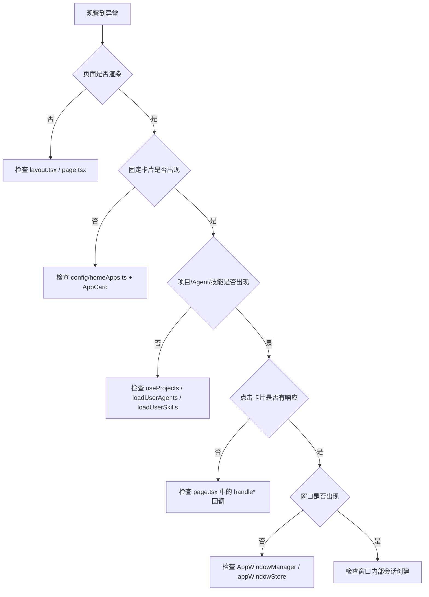

# J09：单元小结课 —— 首页与应用启动 Workshop

## 把八节课的碎片连成一张地图

J01–J08 读了很多源码，但源码是散的。这节课不新增文件，而是把已经读过的源码串成一张“首页出现问题时该从哪查”的认知地图。

## 第一层：页面层

**核心问题**：浏览器访问 `/` 后，有没有渲染出 `page.tsx`？

| 检查点 | 文件 | 判断标准 |
| --- | --- | --- |
| `layout.tsx` 是否挂载 | `app/layout.tsx` | 全局样式和 `GlobalSpotlight` 是否出现 |
| `page.tsx` 是否渲染 | `app/page.tsx` | 深蓝背景、顶部栏、系统概览是否出现 |
| 是否有报错 | 浏览器控制台 | 红色错误堆栈是否指向 `page.tsx` 或其子组件 |

如果页面层都没渲染，先检查 Next.js 编译是否成功、路由是否正确、`layout.tsx` 是否报错。不要直接跳到窗口管理器。

## 第二层：配置层

**核心问题**：首页应该出现哪些固定卡片？这些卡片是否由 `HOME_APPS` 正确配置？

| 检查点 | 文件 | 判断标准 |
| --- | --- | --- |
| 固定卡片数量 | `config/homeApps.ts` | `HOME_APPS.length` 与屏幕上卡片数量是否一致 |
| 卡片类型 | `config/homeApps.ts` | `type` 是 `'skill'` 还是 `'action'` |
| 系统应用识别 | `config/system-apps.ts` | `isSystemApp(skillName)` 是否返回 true |

如果固定卡片没出现，先检查 `HOME_APPS` 数组。如果卡片出现但点击没反应，检查 `AppCard` 是否正确接收了 `onClick`。

## 第三层：状态层

**核心问题**：项目、Agent、技能列表的数据是否加载成功？

| 检查点 | 文件/Hook | 判断标准 |
| --- | --- | --- |
| 项目列表 | `useProjects` / `lib/hooks/use-projects.ts` | `projects` 是否非空，`isLoadingProjects` 是否完成 |
| Agent 列表 | `page.tsx` 中 `loadUserAgents` | `userAgents` 是否非空 |
| 技能列表 | `page.tsx` 中 `loadUserSkills` | `userSkills` 是否非空 |
| LLM 配置 | `store/settingsStore.ts` | `hasConfiguredLLM` 是否返回 true |

项目列表为空可能是没有项目，也可能是 `useProjects` 加载失败。Agent/技能为空同理。注意 `loadUserAgents`/`loadUserSkills` 静默吞掉错误，所以控制台没有报错不等于加载成功。可以临时在 `.then` 里加 `console.log` 确认数据返回。

## 第四层：调度层

**核心问题**：点击卡片后，有没有调用 `AppWindowManager.openComponentWindow`？

| 检查点 | 文件 | 判断标准 |
| --- | --- | --- |
| skill 卡片点击 | `page.tsx` 中 `handleSkillLaunch` | 是否传入 `SkillDialog` 和 `skillName` |
| action 卡片点击 | `page.tsx` 中 `handleOpenWorkspace` 等 | 是否执行对应逻辑 |
| 窗口元数据 | `page.tsx` / `AppWindowManager.ts` | `entryType`、`entryId`、`sessionId`、`projectId` 是否正确 |

如果点击后窗口没出现，先确认 `onClick` 是否被调用，再确认 `AppWindowManager` 是否收到调用。这是两个独立的检查点。

## 排查地图：从现象到文件

把四层串起来，就是一条稳定的排查路径：

这条路径的关键是“一次只判断一层”。比如，不要从“点击没反应”直接跳到“窗口管理器坏了”，中间还有“点击回调是否被调用”这一层。

## 容易混淆的三组对象再确认

| 对象 A | 对象 B | 关键区分 |
| --- | --- | --- |
| `page.tsx` | `OSFramework.tsx` | `page.tsx` 是当前生产路径，`OSFramework` 是旧版框架 |
| `TopMenuBar`（局部组件） | `StatusBar.tsx` | `TopMenuBar` 在 `page.tsx` 内部，`StatusBar` 是旧版 |
| `HOME_APPS` | `SYSTEM_APPS` | `HOME_APPS` 渲染卡片，`SYSTEM_APPS` 识别系统应用 |

如果读者只记得一张表，就记这张。它是本单元最核心的判断依据。

## 纸面实验

不需要运行代码，用纸和笔完成即可：

1. 画出从小林打开浏览器到点击“创建 Agent”卡片，中间经过的 6 个关键对象。
2. 如果屏幕上出现 6 张固定卡片，但点击“头脑风暴”后没有窗口弹出，按四层模型写出你最优先检查的 3 个文件。
3. 如果项目卡片列表为空，列出 3 种可能原因（提示：不只有“没有项目”）。

## 口头验收

能用自己的话回答以下问题，说明本单元已经过关：

1. 为什么 `page.tsx` 被称为“状态协调器”而不是普通页面？
2. `skill` 类型卡片和 `action` 类型卡片的点击路径有什么不同？
3. `SYSTEM_APPS` 为什么不直接参与首页渲染？
4. 为什么修改 `StatusBar.tsx` 不会影响当前首页顶部栏？
5. `DesktopOnboarding` 的显示状态保存在哪里？关闭时如何持久化？
6. Agent/技能加载失败时，当前实现有什么弱点？

## 本单元边界回顾

J01–J09 已经覆盖：

- `app/page.tsx` 的入口、状态、调度
- `config/homeApps.ts` 和 `config/system-apps.ts`
- `components/framework/AppCard.tsx`
- `OSFramework` / `Sidebar` / `Taskbar` / `StatusBar` 的旧版框架
- `TopMenuBar` 的真实实现
- `DesktopOnboarding` 与设置状态
- `Background` / `globals.css` 视觉层
- 项目 / Agent / 技能列表加载与刷新

还没有覆盖（后续单元）：

- `AppWindowManager` 和 `appWindowStore` 的窗口状态机（Unit 2）
- `Dock`、`Spotlight`、通知、右键菜单（Unit 3）
- `SkillDialog`、Agent 会话 UI（Unit 4）
- 项目访谈、工作区 UI（Unit 5）
- Web 状态层、Hooks、服务适配器完整实现（Unit 6）

边界清楚后，就可以进入 Unit 2：窗体系统与窗口状态。
