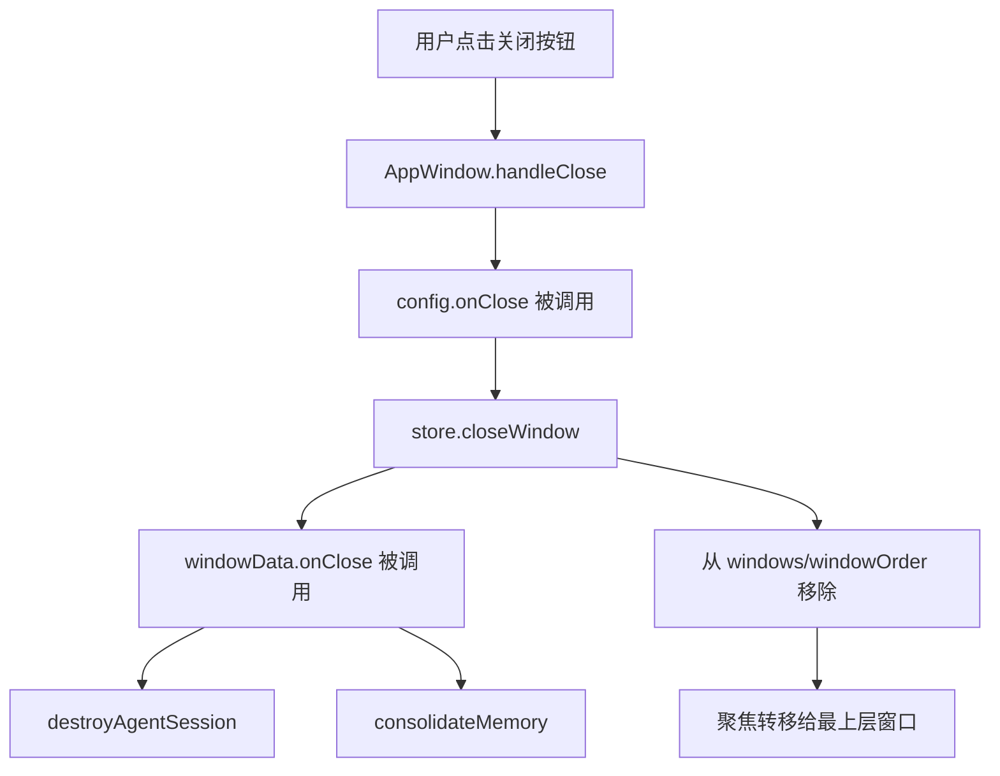

# J18：窗口关闭与会话清理的完整链路

## 关闭一个窗口不只是让它消失

在 OriginOS 里，窗口通常对应一个 Agent 会话、一个项目工作区或一个 Skill 执行现场。关闭窗口时，系统需要做的不仅是移除视觉元素，还要清理后台运行的会话并整理记忆。

这节课把“用户点击关闭按钮”到“会话销毁、记忆整理”的完整链路串起来。

## 链路总览



注意这个链路中有两个 `onClose`：一个是 `AppWindow` 组件接收的 `config.onClose`，另一个是 `appWindowStore` 窗口数据里的 `windowData.onClose`。它们通常指向同一个函数（由 `AppWindowManager` 注入）。

## 第一段源码：AppWindowManager 注入生命周期

[packages/web/src/services/AppWindowManager.ts 第 35—53 行](../../../../packages/web/src/services/AppWindowManager.ts#L35)：

```ts
if (entryType && entryId && MEMORY_ENTRY_TYPES.has(entryType)) {
  const originalOnClose = config.onClose;
  config = {
    ...config,
    onClose: () => {
      originalOnClose?.();
      destroyAgentSession({ sessionId, projectId }).catch((err) =>
        console.error('[AppWindowManager] agent destroy failed:', err)
      );
      consolidateMemory(entryType, entryId).catch((err) =>
        console.error('[AppWindowManager] memory consolidation failed:', err)
      );
    },
  };
}
```

注入发生在打开窗口时。`onClose` 被保存到 `AppWindowConfig` 中，随后进入 `appWindowStore` 的 `windowData.onClose`。

关键点：

- `destroyAgentSession` 需要 `sessionId` 和 `projectId`。`sessionId` 是会话标识，`projectId` 用于 runtime 模式下按 UUID 查找 Agent。
- `consolidateMemory` 需要 `entryType` 和 `entryId`，用于确定要整理哪类实体的记忆。
- 两者都是 fire-and-forget：触发后不等待结果，失败只打印日志。

## 第二段源码：用户点击关闭按钮

[packages/web/src/components/os/window/AppWindow.tsx 第 58—61 行](../../../../packages/web/src/components/os/window/AppWindow.tsx#L58)：

```ts
const handleClose = useCallback(() => {
  config.onClose?.();
  close();
}, [config, close]);
```

`WindowTitleBar` 的关闭按钮绑定到 `handleClose`。它先调用 `config.onClose`，再调用 `close()`。

`close()` 来自 `useAppWindow`，最终调用 `appWindowStore.closeWindow(windowId)`。

## 第三段源码：store.closeWindow 再次触发 onClose

[packages/web/src/store/appWindowStore.ts 第 125—145 行](../../../../packages/web/src/store/appWindowStore.ts#L125)：

```ts
closeWindow: (windowId: string) => {
  const closingWindow = get().windows[windowId];
  console.log('[appWindowStore] closeWindow:', windowId, 'hasOnClose:', !!closingWindow?.onClose);
  closingWindow?.onClose?.();
  set((state) => {
    const { [windowId]: closed, ...remaining } = state.windows;
    const newOrder = state.windowOrder.filter((id) => id !== windowId);
    const newFocusedId = newOrder.length > 0 ? newOrder[newOrder.length - 1] : null;
    return {
      windows: remaining,
      windowOrder: newOrder,
      focusedWindowId: newFocusedId,
    };
  });
},
```

`store.closeWindow` 在移除记录之前，也会调用 `closingWindow?.onClose?.()`。

这意味着同一个 `onClose` 回调可能被调用两次：一次在 `AppWindow.handleClose`，一次在 `store.closeWindow`。

## 重复调用的问题

两次调用 `onClose` 会导致：

- `destroyAgentSession` 被调用两次；
- `consolidateMemory` 被调用两次。

幸运的是：

- `destroyAgentSession` 通常是幂等的（按 sessionId 销毁，不存在时报错被 catch）。
- `consolidateMemory` 通常会检查时间戳或版本，重复调用不会破坏数据一致性。

但这不是理想设计。更清晰的写法是：只在一个地方调用 `onClose`。例如：

- 方案 A：`AppWindow.handleClose` 不调用 `config.onClose`，只调用 `close()`，由 store 统一触发。
- 方案 B：`store.closeWindow` 不调用 `onClose`，由调用方保证触发。

当前实现同时触发，是一个已知的代码异味，阅读时需要特别留意。

## 第四段源码：Electron 原生窗口的关闭链路

Electron 模式下，用户可能点击原生窗口的关闭按钮，而不是 Web 的 `WindowTitleBar` 关闭按钮。这时链路不同：

1. 用户点击原生窗口关闭按钮；
2. Electron 主进程销毁 BrowserWindow；
3. 主进程发送 `WINDOW_CLOSED` IPC 给渲染进程；
4. `useAppWindowManager` 订阅该事件，调用 `store.closeWindow(windowId)`；
5. `store.closeWindow` 触发 `windowData.onClose`，执行清理。

```ts
useEffect(() => {
  return electronWindow.subscribeToClosed((windowId) => {
    const current = useAppWindowStore.getState().windows[windowId];
    if (current) {
      useAppWindowStore.getState().closeWindow(windowId);
    }
  });
}, [electronWindow]);
```

这个链路绕过了 `AppWindow.handleClose`，所以不会出现重复调用 `onClose` 的问题。这是原生窗口关闭更“干净”的路径。

## 第五段源码：关闭后的状态转移

无论是 Web 还是 Native，关闭后都会执行：

```ts
const newOrder = state.windowOrder.filter((id) => id !== windowId);
const newFocusedId = newOrder.length > 0 ? newOrder[newOrder.length - 1] : null;
```

窗口从 `windowOrder` 中移除，焦点转移给最上层窗口。如果没有其他窗口，`focusedWindowId` 设为 `null`。

## 为什么一定要清理会话

如果关闭窗口时不调用 `destroyAgentSession`，可能出现：

- 后台继续运行 Agent，消耗计算资源和 LLM token；
- 用户再次打开同一 Skill/Agent 时，旧会话仍在运行，产生冲突；
- 会话状态泄漏，导致数据不一致。

`consolidateMemory` 则负责把运行期间的临时记忆整理成持久记忆。如果跳过，Agent 的 Memory.md / Knowledge.md / Patterns.md 不会更新，长期记忆能力受损。

## 本节小结

- 关闭窗口的链路：`AppWindow.handleClose` → `config.onClose` → `store.closeWindow` → `windowData.onClose` → 清理。
- `AppWindowManager` 在打开窗口时注入 `destroyAgentSession` 和 `consolidateMemory`。
- 当前 Web 关闭路径可能重复调用 `onClose`，原生窗口关闭路径只调用一次。
- 清理会话是为了防止资源泄漏和状态冲突；整理记忆是为了持久化 Agent 经验。
- 关闭后焦点自动转移给 `windowOrder` 中最上层窗口。

下一节课是 Unit 2 小结课，我们将把窗口状态、渲染、生命周期连成一张排查地图。
