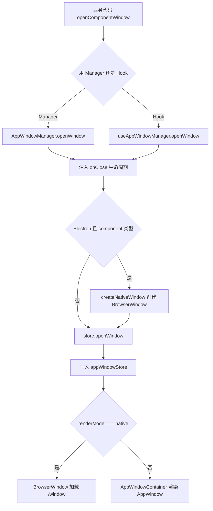
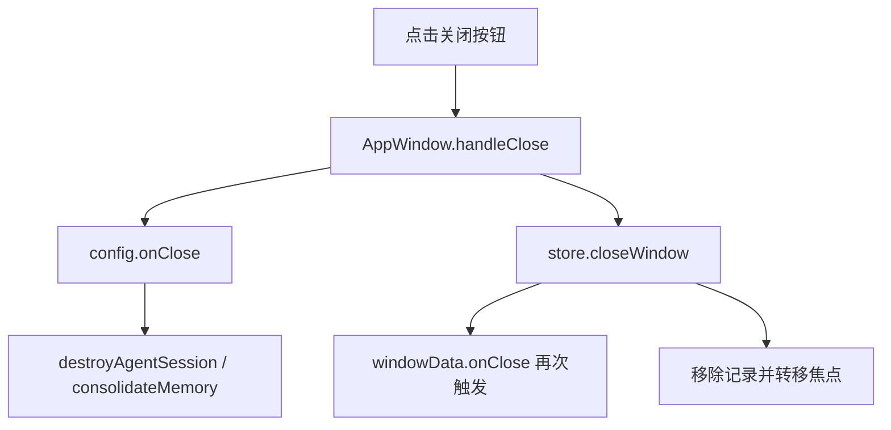
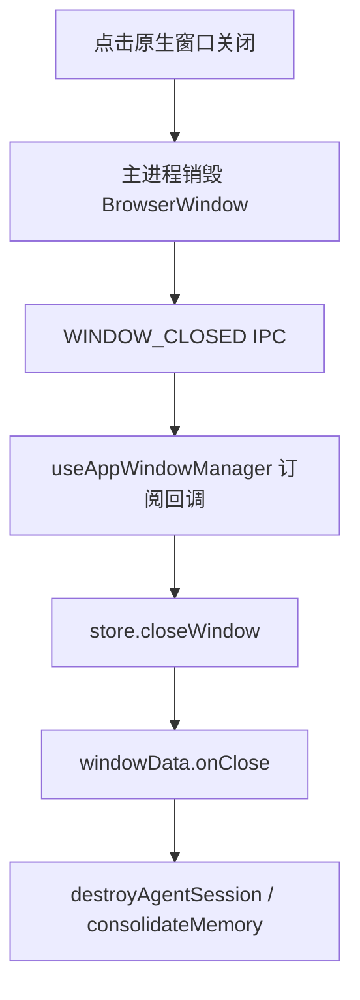

# J19：单元小结课 —— 窗体系统 Workshop

## 把十节课的窗口知识串成一张地图

J10–J18 读完了 OriginOS 的窗口状态、管理器、渲染、原生适配和生命周期。这节课不新增源码，而是把这些对象和链路整理成可排查的认知地图。

## 窗口系统的三层结构

| 层级 | 核心对象 | 回答的问题 |
| --- | --- | --- |
| 状态层 | `appWindowStore` | 窗口存在吗？位置、大小、层级、状态是什么？ |
| 管理层 | `AppWindowManager` / `useAppWindowManager` | 如何打开、关闭、聚焦窗口？生命周期回调如何注入？ |
| 渲染层 | `AppWindowContainer` / `AppWindow` / `/window` | Web 模式下窗口如何显示？Electron 原生窗口如何加载内容？ |

排查窗口问题时，先确定问题发生在哪一层，再进入对应源码。

## 打开窗口的完整链路

这条链路说明：

- `AppWindowManager` 和 `useAppWindowManager` 都能打开窗口，但逻辑平行实现。
- Electron 原生窗口也要写 store，只是不经过 React DOM 渲染。
- `/window` 路由只服务于原生窗口，Web 模式不经过它。

## 关闭窗口的完整链路

Web 模式：

Electron 原生模式：

原生模式更干净，不会重复触发 `onClose`。Web 模式当前存在 `AppWindow` 和 `store` 都调用 `onClose` 的重复问题。

## 常见异常排查路径

### 现象：点击卡片后窗口没出现

1. 确认 `openComponentWindow` / `openWindow` 是否被调用。
2. 确认 `appWindowStore.windows` 是否新增记录。
3. 确认是 Web 还是 Electron：
   - Web：检查 `AppWindowContainer` 是否渲染、`AppWindow` 是否返回 null。
   - Electron：检查 `createNativeWindow` 是否成功、BrowserWindow 是否创建。

### 现象：窗口在 Web 模式下被遮挡

1. 检查 `position.zIndex` 是否递增。
2. 检查 `AppWindowContainer` 是否按 z-index 升序渲染。
3. 检查是否有其他全局元素（如 Spotlight、Onboarding）z-index 更高。

### 现象：Electron 窗口出现在 Dock 但屏幕上看不到

1. 检查 BrowserWindow 是否实际创建（主进程日志）。
2. 检查 `/window` 路由是否加载成功。
3. 检查窗口位置是否超出屏幕（x/y 可能是负数或超大值）。
4. 检查透明背景设置是否正确（`nativeWindow=1` 时 `html/body/root` 是否透明）。

### 现象：关闭窗口后 Agent 还在运行

1. 确认 `metadata.entryType` 属于 `MEMORY_ENTRY_TYPES`。
2. 确认 `sessionId` 和 `projectId` 已正确传入。
3. 确认 `destroyAgentSession` 被调用（可在 Core 服务加日志）。
4. 检查是否有异常吞掉了 Promise 错误。

## 容易混淆的对象再确认

| 对象 A | 对象 B | 关键区分 |
| --- | --- | --- |
| `AppWindowManager` | `useAppWindowManager` | 单例服务 vs React Hook；逻辑平行实现 |
| `appWindowStore` | `useAppWindowStore` | store 是状态本身，Hook 是订阅入口 |
| `AppWindow`（`components/os/window`） | `AppWindow`（`components/framework`） | 当前生产路径 vs 旧版窗口组件 |
| `renderMode: 'native'` | Web 模式 | 是否由 BrowserWindow 渲染 |
| `/window` 路由 | `/` 首页 | 原生窗口内容入口 vs 主桌面入口 |

## 纸面实验

1. 画出 Electron 模式下，从点击卡片到 BrowserWindow 显示内容的完整数据流。
2. 如果 Web 模式下新打开的窗口总是在最底层，列出 3 个可能原因。
3. 说明为什么 `appWindowStore` 需要保留 native 窗口记录，即使 DOM 不渲染它。
4. 当前 Web 关闭路径存在 `onClose` 重复调用问题。设计一个修复方案，只在一个地方触发 `onClose`。

## 口头验收

能用自己的话回答以下问题，说明本单元已经过关：

1. `appWindowStore` 的四个核心字段是什么？分别有什么用？
2. `AppWindowManager` 在什么情况下会注入 `destroyAgentSession` 和 `consolidateMemory`？
3. Electron 模式下，`AppWindowContainer` 为什么不渲染 native 窗口？
4. `/window` 页面根据什么参数决定渲染哪个内容组件？
5. 原生窗口关闭和 Web 窗口关闭的链路有什么不同？
6. `maxZIndex` 持续递增可能带来什么问题？当前代码如何处理？

## 本单元边界回顾

J10–J19 已经覆盖：

- `appWindowStore` 状态结构与基本操作
- `AppWindowManager` 单例、生命周期注入、Dock 同步
- `useAppWindowManager` Hook 与 native 桥接
- `AppWindowContainer` 列表渲染
- `AppWindow` 单窗口交互与 Portal 渲染
- `/window` 原生窗口内容路由
- Electron 原生窗口创建与 IPC 通信
- 窗口位置、层级、最小化/最大化约束
- 窗口关闭与会话清理链路

还没有覆盖（后续单元或课程）：

- `WindowTitleBar`、`WindowResizer`、`ViewRenderer`、`AcrylicPanel` 的具体实现
- Dock、Spotlight 的状态同步（Unit 3）
- SkillDialog、AgentDialogContent 等窗口内容组件（Unit 4）
- `components/framework/AppWindow.tsx` 旧版窗口组件

边界清楚后，就可以进入 Unit 3：Dock、Spotlight 与全局导航。
