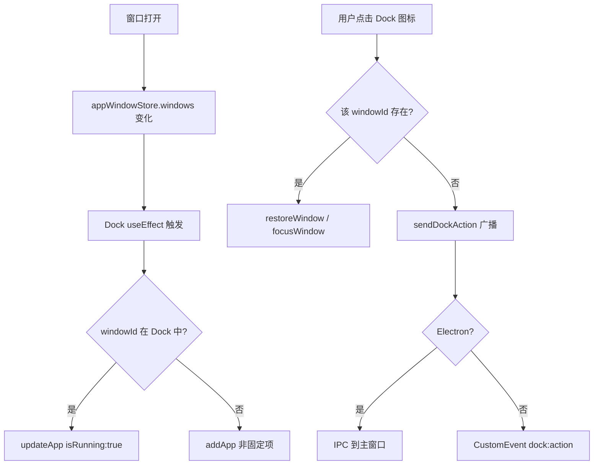
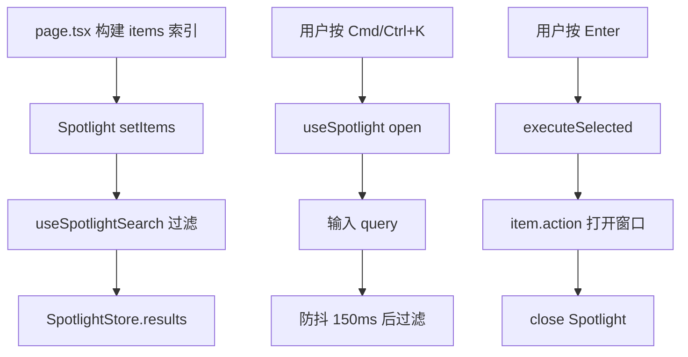
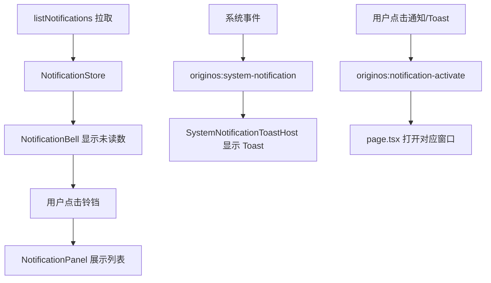

# J27：单元小结课 —— Dock、Spotlight 与全局导航 Workshop

## 把全局导航拆成三条独立链路

Unit 3 读完了 Dock、Spotlight 和通知中心。这节课不新增源码，而是把这三条全局导航链路整理成可排查的地图。

## 三条全局导航链路

### 链路一：Dock

Dock 的核心是：**窗口状态驱动 Dock，Dock 点击动作通过 `sendDockAction` 发回主窗口处理**。

### 链路二：Spotlight

Spotlight 的核心是：**索引由调用方注入，搜索与执行由 store 统一调度**。

### 链路三：通知

通知的核心是：**持久通知走轮询，临时通知走事件；激活目标统一通过自定义事件派发**。

## 常见异常排查路径

### 现象：Dock 上没有出现正在运行的窗口图标

1. 检查 `appWindowStore.windows` 是否包含该窗口。
2. 检查窗口 `id` 是否等于 Dock app 的 `id`。
3. 检查 `Dock` 组件的 `useEffect([windows])` 是否执行。
4. 检查 `updateApp` / `addApp` 是否被去重逻辑拦截。

### 现象：Dock 图标点击没反应

1. 检查 `handleIconClick` 进入哪个分支。
2. 如果是已有窗口分支，检查 `restoreWindow` / `focusWindow` 是否正常。
3. 如果是 `sendDockAction` 分支，检查 Electron 下 IPC 是否注册，Web 下是否有 `dock:action` 监听。
4. 检查 `app-open` 事件是否有对应处理。

### 现象：Spotlight 打不开

1. 检查 `Spotlight` 组件是否被挂载（即使关闭也渲染隐藏占位符）。
2. 检查 `useGlobalShortcutForKey('k', open, { meta/ctrl: true })` 是否生效。
3. 检查当前焦点是否在可编辑元素内（可编辑元素会跳过快捷键）。
4. 检查是否有其他组件也捕获了 `Cmd+K` / `Ctrl+K`。

### 现象：Spotlight 搜索无结果

1. 检查 `items` 是否被正确传入并写入 store。
2. 检查 `useSpotlightSearch` 的 `debouncedQuery` 是否有值。
3. 检查过滤逻辑：标题、副标题、关键词是否任一匹配。
4. 检查 `SpotlightResults` 是否正确读取 `results`。

### 现象：通知铃铛没有未读数

1. 检查 `fetchNotifications` 是否成功调用。
2. 检查返回数据中 `status === 'pending'` 的条目是否存在。
3. 检查 `listNotifications` 在 Electron / Web 下是否正确实现。
4. 检查 30 秒轮询是否被清理。

### 现象：点击通知没有打开窗口

1. 检查 `getNotificationActivationTarget` 是否从 `payload` 解析出目标。
2. 检查 `originos:notification-activate` 事件是否被 `page.tsx` 监听。
3. 检查监听函数是否调用 `AppWindowManager.openComponentWindow`。

## 容易混淆的对象再确认

| 对象 A | 对象 B | 关键区分 |
| --- | --- | --- |
| `dockStore.apps` 持久化 | `appWindowStore.windows` 运行时 | 持久配置 vs 运行时窗口 |
| `sendDockAction` | `originos:notification-activate` | Dock 动作 vs 通知激活 |
| `SpotlightItem.action` | `dock:action` | 命令面板执行函数 vs Dock 广播动作 |
| `NotificationPanel` | `SystemNotificationToastHost` | 持久通知列表 vs 临时 Toast |
| `useGlobalShortcutForKey` | `useGlobalShortcut` | capture 阶段 vs bubble 阶段 |

## 纸面实验

1. 设计一个场景：用户通过 Spotlight 打开一个项目工作区。列出 `spotlightStore`、`appWindowStore`、`dockStore` 中会发生变化的所有字段。
2. 如果 Electron 下 Dock 是独立窗口，主窗口和 Dock 窗口的 `appWindowStore` 为什么不一致？这种设计带来什么好处？
3. 通知的 `activationTarget` 和 Toast 的 `activationTarget` 有什么共同点和不同点？
4. `dockStore` 的 `partialize` 为什么不持久化 `isRunning`？如果持久化了会出现什么问题？

## 口头验收

能用自己的话回答以下问题，说明本单元已经过关：

1. Dock 上的应用列表由哪些来源组成？
2. 窗口 ID 和 Dock app ID 之间是什么关系？
3. `sendDockAction` 在 Electron 和 Web 下分别如何传递消息？
4. Spotlight 的 `items` 和 `results` 有什么区别？
5. 通知中心和 Toast 宿主分别监听什么事件？
6. 点击通知后，系统如何打开对应窗口？

## 本单元边界回顾

J20–J27 已经覆盖：

- `dockStore` 状态、actions、持久化策略
- `Dock` 组件监听 `appWindowStore` 同步运行状态
- `DockIcon` 的点击、拖拽、长按删除、动画、工具提示
- `useDockContextMenu` 和通用 `ContextMenu`
- `spotlightStore` 状态与执行模型
- `useSpotlight` / `useSpotlightSearch` 快捷键与过滤
- `Spotlight` 面板、搜索输入、结果列表
- `notificationStore` 与通知轮询
- `NotificationBell` / `NotificationPanel` 通知中心
- `SystemNotificationToastHost` 全局 Toast

还没有覆盖（后续单元）：

- Agent / Skill 会话界面的具体内容组件
- 项目工作区、访谈窗口的 UI
- Web 状态层、Hooks、服务适配器的其他部分

边界清楚后，就可以进入 Unit 4：Agent / Skill 会话界面。
