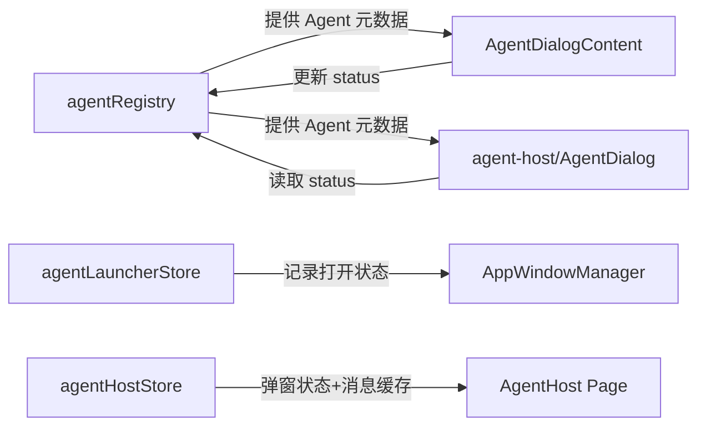

# J37：Agent 注册表与启动 Store

## 三个 Store 各司其职

Agent 相关状态在 Web 包被拆成三个 Zustand store：

- `agentRegistry`：所有 Agent 的元数据注册表；
- `agentLauncherStore`：哪些 Agent 窗口当前被打开；
- `agentHostStore`：独立宿主页面里的 Agent 弹窗状态和消息缓存。

## 第一段源码：agentRegistry

[packages/web/src/store/agentRegistry.ts 第 19–88 行](../../../../packages/web/src/store/agentRegistry.ts#L19)：

```ts
export const useAgentRegistryStore = create<AgentRegistryState>((set, _get) => ({
  agents: {},
  activeAgentId: null,
  isLoading: false,

  setAgent: (id: string, agent: AgentObject) =>
    set((state) => ({
      agents: { ...state.agents, [id]: agent },
    })),

  removeAgent: (id: string) =>
    set((state) => {
      const { [id]: removed, ...rest } = state.agents;
      return { agents: rest };
    }),

  updateAgent: (id: string, updates: Partial<AgentObject>) =>
    set((state: AgentRegistryState) => ({
      agents: {
        ...state.agents,
        [id]: state.agents[id] ? { ...state.agents[id]!, ...updates } : undefined,
      } as Record<string, AgentObject>,
    }) as Partial<AgentRegistryState>),

  setActiveAgent: (id: string | null) => set({ activeAgentId: id }),

  setAgentStatus: (id: string, status: AgentStatus) =>
    set((state: AgentRegistryState) => ({
      agents: {
        ...state.agents,
        [id]: state.agents[id]
          ? { ...state.agents[id]!, status, lastActivatedAt: Date.now() }
          : undefined,
      } as Record<string, AgentObject>,
    }) as Partial<AgentRegistryState>),

  bulkSetAgents: (agents: AgentObject[]) =>
    set(() => ({
      agents: agents.reduce(
        (acc, agent) => ({ ...acc, [agent.id]: agent }),
        {}
      ),
    })),

  clearAll: () => set({ agents: {}, activeAgentId: null }),
}));
```

`agentRegistry` 是 Agent 的“户籍系统”：

- `agents` 用 `Record<string, AgentObject>` 存储，支持 O(1) 按 ID 查找；
- `setAgent` 注册或替换；
- `removeAgent` 删除；
- `updateAgent` 局部更新；
- `setAgentStatus` 更新状态并记录 `lastActivatedAt`；
- `bulkSetAgents` 批量加载（例如启动时从文件系统读取）。

底部还提供了 selector 函数：`selectAgents`、`selectAgent(id)`、`selectAgentsByStatus`、`selectAgentsByType`，方便非组件代码直接按状态切片。

## 第二段源码：agentLauncherStore

[packages/web/src/store/agentLauncherStore.ts 第 27–63 行](../../../../packages/web/src/store/agentLauncherStore.ts#L27)：

```ts
export const useAgentLauncherStore = create<AgentLauncherState>((set, get) => ({
  openAgentIds: [],

  openAgent: (agentId: string) => {
    set((state) => {
      if (state.openAgentIds.includes(agentId)) {
        return state;
      }
      return { openAgentIds: [...state.openAgentIds, agentId] };
    });
  },

  closeAgent: (agentId: string) => {
    set((state) => ({
      openAgentIds: state.openAgentIds.filter((id) => id !== agentId),
    }));
  },

  toggleAgent: (agentId: string) => {
    const currentIds = get().openAgentIds;
    if (currentIds.includes(agentId)) {
      get().closeAgent(agentId);
    } else {
      get().openAgent(agentId);
    }
  },

  closeAllAgents: () => {
    set({ openAgentIds: [] });
  },

  setAgentRunning: (_agentId: string, _isRunning: boolean) => {
    // This is a placeholder - actual status is managed by agentRegistryStore
    // This method exists for API compatibility
  },
}));
```

`agentLauncherStore` 只关心“哪些 Agent 窗口当前打开”：

- `openAgentIds`：字符串数组；
- `openAgent` / `closeAgent` / `toggleAgent` / `closeAllAgents`：基本窗口管理。
- `setAgentRunning` 是占位方法，注释说明实际状态由 `agentRegistryStore` 管理。

这个 store 通常与窗口管理器配合使用：当用户点击 Dock 或 Spotlight 打开 Agent 时，先更新 `openAgentIds`，再由窗口管理器渲染对应窗口。

## 第三段源码：agentHostStore

[packages/web/src/store/agentHostStore.ts 第 21–49 行](../../../../packages/web/src/store/agentHostStore.ts#L21)：

```ts
export const useAgentHostStore = create<AgentHostState>((set) => ({
  agents: [],
  dialogStates: {},
  messageCache: {},
  activeAgentId: null,

  openDialog: (agentId) =>
    set((state) => ({
      dialogStates: { ...state.dialogStates, [agentId]: true },
      activeAgentId: agentId,
    })),

  closeDialog: (agentId) =>
    set((state) => ({
      dialogStates: { ...state.dialogStates, [agentId]: false },
    })),

  setActiveAgent: (agentId) => set({ activeAgentId: agentId }),

  addMessageToCache: (agentId, message) =>
    set((state) => ({
      messageCache: {
        ...state.messageCache,
        [agentId]: [...(state.messageCache[agentId] || []), message],
      },
    })),

  setAgents: (agents) => set({ agents }),
}));
```

`agentHostStore` 服务于 `agent-host` 独立宿主页面：

- `agents`：当前宿主页面加载的 Agent 列表；
- `dialogStates`：每个 Agent 弹窗的打开状态；
- `messageCache`：每个 Agent 的消息缓存；
- `activeAgentId`：当前活跃的 Agent。

这个 store 与 `agentLauncherStore` 是互补的：

- `agentLauncherStore` 管“窗口级”打开；
- `agentHostStore` 管“弹窗/宿主页面级”打开和消息缓存。

## 三个 Store 的关系



## 本节小结

- `agentRegistry`：Agent 元数据注册表，用 Record 实现 O(1) 查找，支持状态和时间戳更新。
- `agentLauncherStore`：记录当前打开的 Agent 窗口 ID 列表，是窗口管理器的信号源。
- `agentHostStore`：独立宿主页面的 Agent 弹窗状态和消息缓存。
- 三者边界清晰：注册表管“谁是什么”，启动器管“谁被打开”，宿主 store 管“宿主页面内状态”。

下一节课看技能执行展示和技能浏览器：`SkillExecution`、`SkillBrowser`、`skill-export-policy`。
