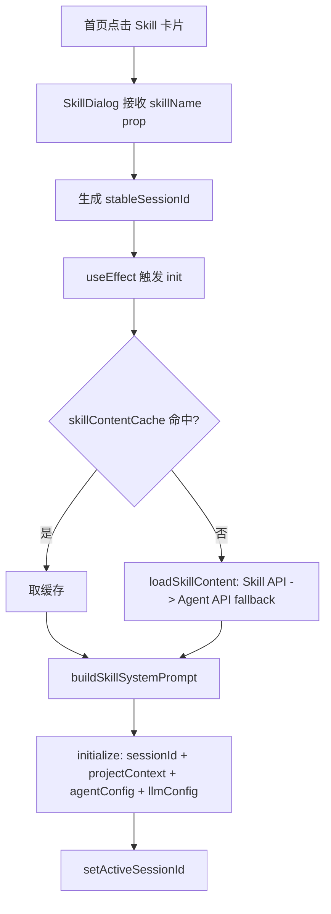
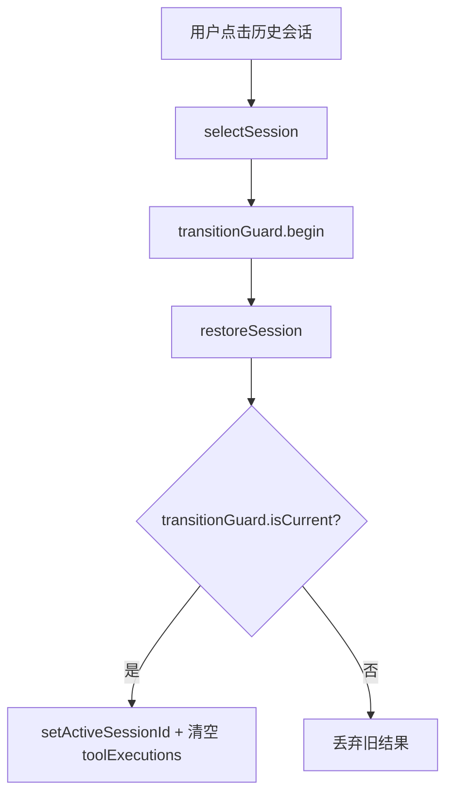
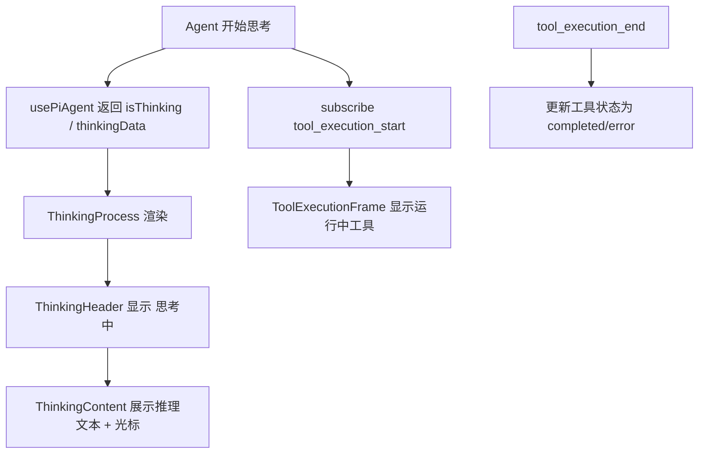

# J39：单元小结课 —— Agent / Skill 会话 UI Workshop

## 把 Skill 与 Agent 会话拆成四条链路

Unit 4 读完了 SkillDialog、AgentDialogContent、两套子组件、思考过程 UI、Agent Hooks 和 Stores。这节课不新增源码，而是把会话链路整理成可排查的地图。


## 四条会话链路

### 链路一：Skill 会话初始化



Skill 会话的核心是：**内容自己加载，prompt 自己构建，目录自己注入**。

### 链路二：Agent 会话初始化

```mermaid
flowchart TD
    A[首页点击 Agent 卡片] --> B[AgentDialogContent 接收 agentId]
    B --> C[生成 fallbackSessionId]
    C --> D[useEffect 触发 initAgent]
    D --> E[launchEntry: entryType + entryId]
    E --> F{Launcher 返回 systemPrompt/baseDir?}
    F -->|成功| G[initialize: sessionId + projectContext + {agentType, systemPrompt, agentBaseDir} + llmConfig]
    F -->|失败| H[setAgentStatus ERROR]
    G --> I[setActiveSessionId]
```

Agent 会话的核心是：**Launcher 负责生成 prompt 和 baseDir，AgentDialogContent 负责启动会话**。

### 链路三：历史会话切换



切换会话时必须用 `transitionGuard` 保护，否则快速点击会导致旧恢复结果覆盖新选择。

### 链路四：思考与工具执行展示



思考过程和工具执行都依赖 `usePiAgent` 提供的状态和事件订阅。

## 常见异常排查路径

### 现象：Skill 窗口一直显示“正在初始化技能...”

1. 检查 `loadSkillContent` 是否成功返回 `content`。
2. 检查 `buildSkillSystemPrompt` 是否生成了非空 prompt。
3. 检查 `initialize` 是否被调用，参数是否正确。
4. 检查 `transitionGuard` 是否把初始化 token invalidate 了。
5. 检查 `usePiAgent` 返回的 `isInitialized` 是否变为 true。

### 现象：Agent 窗口提示“Agent not found”

1. 检查 `useAgentRegistryStore` 中是否存在该 `agentId`。
2. 检查 `resolvedAgentType` 是否正确。
3. 检查 `launchEntry` 是否成功返回数据。

### 现象：切换历史会话后消息没有更新

1. 检查 `selectSession` 是否调用了 `restoreSession`。
2. 检查 `transitionGuard.begin` 的 token 在恢复后是否仍有效。
3. 检查 `setActiveSessionId` 是否被调用。
4. 检查 `usePiAgent` 的 `messages` 是否同步更新。

### 现象：初始消息没有自动发送

1. 检查 `initialMessage` 是否有值。
2. 检查 `shouldAutoStartSession` 的 6 个条件是否全部满足：
   - `isInitialized` true
   - `isRestoring` false
   - `switchingSessionId` null
   - `hasAutoStarted` false
   - `messageCount === 0`
   - `isThinking` false
3. 检查是否有其他 effect 提前把 `hasAutoStartedRef` 置为 true。

### 现象：工具执行状态不显示

1. 检查 `usePiAgent.subscribe` 是否正确绑定。
2. 检查事件类型是否为 `tool_execution_start` / `tool_execution_end`。
3. 检查 `ToolExecutionFrame` 是否被传入 `toolExecutions`。
4. 检查 `MessageList` 是否把 `toolExecutions` 透传给 `ChatMessageList`。

### 现象：思考过程不显示

1. 检查 `thinking` 数据是否传入 `ThinkingProcess`。
2. 检查 `thinking.status` 是否为 `in-progress` / `completed` / `error`。
3. 检查偏好 `displayMode` 是否为 `always-hide`。
4. 检查 `ThinkingContent` 是否正确渲染内容。

## 容易混淆的对象再确认

| 对象 A | 对象 B | 关键区分 |
| --- | --- | --- |
| `SkillDialog` | `AgentDialogContent` | Skill 自己加载 SKILL.md；Agent 通过 Launcher API 初始化 |
| `agentBaseDir` | `outputDir` | 前者是 CWD + 认知目录；后者是产物输出目录 |
| `usePiAgent` | `useAgentLifecycle` | 前者是 Core 提供的 React Hook；后者是 Web 包封装的启动/停止 Hook |
| `agent-dialog` | `agent-host` | 窗口内嵌 vs 独立宿主页面 |
| `agentRegistry` | `agentLauncherStore` | Agent 元数据 vs 当前打开的 Agent 窗口列表 |
| `agentLauncherStore` | `agentHostStore` | 窗口级打开状态 vs 弹窗/宿主页面状态 |
| `session-transition-guard` | `shouldAutoStartSession` | 前者防并发切换；后者决定能否自动发消息 |

## 纸面实验

1. 画出 Skill 会话从 `skillName` 到 `initialize()` 被调用的完整时序图，标注每个 ref 和缓存的作用。
2. 比较 Skill 和 Agent 的 prompt 来源差异：如果要在 Agent 中也使用 SKILL.md 内容，应该改哪段代码？
3. 设计一个测试用例，验证 `transitionGuard` 能否拦截“快速点击两个历史会话”产生的竞态。
4. 如果 `useAgentLifecycle` 和 `AgentDialogContent` 同时调用 `piAgentStore.initialize` 会发生什么？如何避免冲突？
5. 说明 `SkillBrowser` 当前的分类筛选逻辑有什么局限性，如果要按 SKILL.md 的 `tags` frontmatter 筛选应该怎么改。

## 口头验收

能用自己的话回答以下问题，说明本单元已经过关：

1. `SkillDialog` 和 `AgentDialogContent` 分别是如何拿到 system prompt 的？
2. 为什么 `SkillDialog` 需要 `skillContentCacheRef`？
3. `session-transition-guard` 的 `epoch` 机制如何防止旧初始化覆盖新会话？
4. `shouldAutoStartSession` 的 6 个条件是什么？
5. `agent-dialog` 和 `agent-host` 两套组件分别适合什么场景？
6. `agentRegistry`、`agentLauncherStore`、`agentHostStore` 各管什么？
7. `ToolExecutionFrame` 和 `ThinkingProcess` 的数据分别从哪里来？

## 本单元边界回顾

J28–J39 已经覆盖：

- `SkillDialog` 技能内容加载、prompt 构建、会话初始化/切换/发送、附件、UI
- `AgentDialogContent` 通过 Launcher API 初始化、历史会话、自动启动、工作区
- `session-transition-guard` 竞态守卫
- `agent-dialog` 子组件：ChatInput、MessageList、StatusIndicator、ToolExecutionFrame
- `agent-host` 组件：AgentDialog、MessageInput、MessageList
- `ThinkingProcess` / `ThinkingHeader` / `ThinkingContent` / `useThinkingProcess`
- `useAgent` / `useAgentLifecycle` / `useAgentSearch`
- `agentRegistry` / `agentLauncherStore` / `agentHostStore`
- `SkillExecution` / `SkillBrowser` / `skill-export-policy`

还没有覆盖（后续单元）：

- 项目工作区、访谈窗口的 UI
- Web 状态层、Hooks、服务适配器的其他部分
- 多 Agent 协作运行时的 Web 侧 UI

边界清楚后，就可以进入 Unit 5：项目、访谈与工作区界面。
