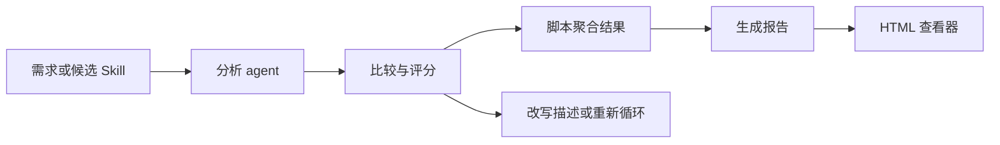

# 单元导读四：Skill Creator 与评测报告链

第四单元进入 Part L 最像“工程工具”的部分：Skill Creator。这里的学习重点不是背每个 Python 脚本的名字，而是理解一条生成与验证链：需求怎样进入 Skill Creator，候选 Skill 怎样被分析、比较、评分，脚本怎样生成报告、改写描述、打包文件，HTML 查看器怎样展示评测结果。

这个单元必须特别注意证据边界。评测脚本存在，不等于某个 Skill 已经通过评测；HTML 查看器存在，不等于报告内容一定可信；`__pycache__` 被 Git 跟踪，也不应该被当成生产源码精读。

## 1. 本单元要解决的问题

| 问题 | 对应课程 |
| --- | --- |
| Project Skill Creator 的入口合同是什么？ | L25 |
| analyzer、comparator、grader 三个 agent 怎样分工？ | L26 |
| schemas 和 ontology-tools 怎样约束生成质量？ | L27 |
| 报告聚合脚本怎样读输入、写输出？ | L28 |
| 描述优化和打包脚本改变了什么，不改变什么？ | L29 |
| quick validate、eval、loop 三类运行脚本有什么区别？ | L30 |
| HTML 查看器怎样展示证据？ | L31 |
| `project-skill-creator` 与 `skill-creator-app` 的重复脚本怎样对照阅读？ | L32 |
| `__pycache__` 这类产物文件应该怎样教学处理？ | L33 |
| 怎样验收一个生成型 Skill 的质量链？ | L34 |

## 2. 本单元源码覆盖

| 文件组 | 本单元责任 |
| --- | --- |
| [templates/skills/project-skill-creator/SKILL.md](../../../../templates/skills/project-skill-creator/SKILL.md) 、 [templates/skills/project-skill-creator/LICENSE.txt](../../../../templates/skills/project-skill-creator/LICENSE.txt) 、 [templates/skills/project-skill-creator/evolution.json](../../../../templates/skills/project-skill-creator/evolution.json) | 解释入口说明、许可文本和演化配置的教学边界。 |
| [templates/skills/project-skill-creator/agents/analyzer.md](../../../../templates/skills/project-skill-creator/agents/analyzer.md) 、 [templates/skills/project-skill-creator/agents/comparator.md](../../../../templates/skills/project-skill-creator/agents/comparator.md) 、 [templates/skills/project-skill-creator/agents/grader.md](../../../../templates/skills/project-skill-creator/agents/grader.md) | 解释评测 agent 的分工。 |
| [templates/skills/project-skill-creator/references/ontology-tools.md](../../../../templates/skills/project-skill-creator/references/ontology-tools.md) 、 [templates/skills/project-skill-creator/references/schemas.md](../../../../templates/skills/project-skill-creator/references/schemas.md) | 解释生成和评测的约束材料。 |
| [templates/skills/project-skill-creator/scripts/aggregate_benchmark.py](../../../../templates/skills/project-skill-creator/scripts/aggregate_benchmark.py) 、 [templates/skills/project-skill-creator/scripts/generate_report.py](../../../../templates/skills/project-skill-creator/scripts/generate_report.py) 、 [templates/skills/project-skill-creator/scripts/improve_description.py](../../../../templates/skills/project-skill-creator/scripts/improve_description.py) | 精读报告聚合、报告生成和描述优化。 |
| [templates/skills/project-skill-creator/scripts/package_skill.py](../../../../templates/skills/project-skill-creator/scripts/package_skill.py) 、 [templates/skills/project-skill-creator/scripts/quick_validate.py](../../../../templates/skills/project-skill-creator/scripts/quick_validate.py) 、 [templates/skills/project-skill-creator/scripts/run_eval.py](../../../../templates/skills/project-skill-creator/scripts/run_eval.py) 、 [templates/skills/project-skill-creator/scripts/run_loop.py](../../../../templates/skills/project-skill-creator/scripts/run_loop.py) 、 [templates/skills/project-skill-creator/scripts/utils.py](../../../../templates/skills/project-skill-creator/scripts/utils.py) | 精读打包、验证、评测循环和公共函数。 |
| [templates/skills/project-skill-creator/assets/eval_review.html](../../../../templates/skills/project-skill-creator/assets/eval_review.html) 、 [templates/skills/project-skill-creator/eval-viewer/viewer.html](../../../../templates/skills/project-skill-creator/eval-viewer/viewer.html) 、 [templates/skills/project-skill-creator/eval-viewer/generate_review.py](../../../../templates/skills/project-skill-creator/eval-viewer/generate_review.py) | 解释报告展示页面和生成脚本。 |
| [templates/skills/skill-creator-app/SKILL.md](../../../../templates/skills/skill-creator-app/SKILL.md) 、 [templates/skills/skill-creator-app/references/schemas.md](../../../../templates/skills/skill-creator-app/references/schemas.md) 、 [templates/skills/skill-creator-app/scripts/utils.py](../../../../templates/skills/skill-creator-app/scripts/utils.py) | 对照 Skill Creator App 的入口、约束和公共函数。 |

## 3. 评测链的阅读图

这张图回答的是“证据从哪里来”。分析、比较和评分负责形成判断；脚本负责整理和输出；HTML 只负责展示。读者不能倒过来理解成“页面显示了分数，所以质量已经被证明”。质量是否被证明，要看输入样本、断言标准和运行结果。

## 4. 学习终点

读完 L25-L34 后，读者应该能做到：

1. 从 `SKILL.md` 判断 Skill Creator 接受什么输入、期望什么输出。
2. 追踪一次评测结果从 agent 提示、脚本处理到 HTML 展示的路径。
3. 说清每个 Python 脚本的入口、主要参数、文件副作用和失败边界。
4. 判断 `__pycache__` 这类文件为什么只登记为产物，不作为源码能力教学。
5. 设计一个最小验证：给一个候选 Skill，说明需要哪些样本、怎样运行、怎样判定是否通过。
