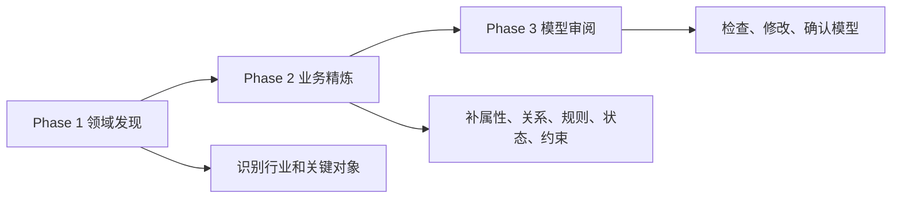

# L03：最小 Skill 定义怎样表达任务边界

上一课的 Project Interview 模板包含六个文件，信息密度较高。本课故意回到三个更轻的 Skill：`business-refinement`、`domain-discovery` 和 `model-review`。它们的共同点是都以 `SKILL.md` 为主体，通过说明文字、输入上下文、输出格式和术语指南表达任务边界。

本课的问题是：没有额外脚本时，一份 `SKILL.md` 怎样仍然成为可教学、可执行的能力说明？

## 1. 三个 Skill 是同一条访谈链的三个阶段

`domain-discovery`、`business-refinement`、`model-review` 不是三个随意并列的提示词。它们组成项目访谈的阶段链。

这张图回答的是三者关系。`domain-discovery` 先识别业务背景和核心对象；`business-refinement` 在已有对象上深挖细节；`model-review` 对已有模型做检查、展示和修改。

## 2. `domain-discovery`：从真实工作经验进入模型

[templates/skills/domain-discovery/SKILL.md 第 1 行](../../../../templates/skills/domain-discovery/SKILL.md#L1) 的 frontmatter 说明它通过渐进式对话识别行业领域、业务场景和核心业务概念。正文在 [templates/skills/domain-discovery/SKILL.md 第 9 行](../../../../templates/skills/domain-discovery/SKILL.md#L9) 给出 Mission：理解用户实际工作方式，识别行业背景、关键业务对象、业务流程、协作关系和痛点。

真正值得精读的是 [templates/skills/domain-discovery/SKILL.md 第 81 行](../../../../templates/skills/domain-discovery/SKILL.md#L81) 的 Output Format。它规定每确认一个业务事实，就先 `list_files` 检查 `output` 目录，只有存在 `business-model.json` 时才读取；不存在时使用初始 JSON 结构。这说明文件不存在不是错误，而是 Phase 1 早期的正常状态。

这个设计和初学者直觉不同。很多人会先读文件，读不到就当失败；但这个 Skill 明确要求先检查、再读取或初始化。这样可以避免把全新项目误报为工具失败。

## 3. `business-refinement`：在已有对象上深挖细节

[templates/skills/business-refinement/SKILL.md 第 20 行](../../../../templates/skills/business-refinement/SKILL.md#L20) 写明输入通常包含已识别行业背景、关键业务对象列表、初步流程和痛点。如果这些信息不完整，先简要确认再继续。这说明 `business-refinement` 不是第一步入口，它依赖 Phase 1 的上下文。

正文在 [templates/skills/business-refinement/SKILL.md 第 47 行](../../../../templates/skills/business-refinement/SKILL.md#L47) 把探索维度拆成对象信息、对象关联、处理逻辑、状态流转和约束条件。这里的教学重点不是背五个词，而是注意每个技术概念都被转译成业务语言：不要问“有哪些属性”，要问“一张订单上通常会显示什么内容”；不要问“状态机怎么设计”，要问“从创建到交付经历哪些阶段”。

[templates/skills/business-refinement/SKILL.md 第 122 行](../../../../templates/skills/business-refinement/SKILL.md#L122) 之后规定写入流程：读取现有模型，合并新细节，写回完整 JSON，同步 `output/interview-progress.md` 和 `MEMORY.md`，再用业务语言告知用户。这说明业务精炼不是只聊天，它要求增量写入。

## 4. `model-review`：审阅不是重新开始

[templates/skills/model-review/SKILL.md 第 20 行](../../../../templates/skills/model-review/SKILL.md#L20) 说明触发条件：用户明确要求审阅，或 `output/business-model.json` 已存在且包含 entities，或 Phase 2 后想回顾修改。它的输入来源是读取当前完整业务模型。

审阅阶段的关键不是“再问一遍所有问题”，而是 [templates/skills/model-review/SKILL.md 第 31 行](../../../../templates/skills/model-review/SKILL.md#L31) 写到的主动审阅加被动响应。主动审阅检查完整性、一致性、合理性；被动响应根据用户意图查看、修改、补充或重新梳理。

因此，如果小林已经确认了旅行预算和成员，却发现“交通方式”遗漏，`model-review` 不应该清空模型重来；它应该定位缺失项、确认修改、读当前 JSON、写回完整 JSON，并同步进度和记忆。

## 5. 最小 Skill 的四个边界

| 边界 | `domain-discovery` | `business-refinement` | `model-review` |
| --- | --- | --- | --- |
| 输入前提 | 用户开始描述真实工作。 | 已有行业、对象和初步流程。 | 已有业务模型或用户要求审阅。 |
| 对话方式 | 探索式，识别背景和对象。 | 深度追问，逐个对象补细节。 | 检查、展示、修改和确认。 |
| 文件动作 | 初始化或更新 `business-model.json`。 | 读取并完整写回模型。 | 读取、修改、写回模型。 |
| 失败边界 | 不存在文件是正常初始状态。 | 上下文不足时先确认。 | 模型不完整时按实际内容灵活处理。 |

这个表说明，一个没有脚本的 Skill 仍然可以通过任务说明和文件动作形成强约束。它的执行依赖 Agent 按说明调用工具，而不是依赖本目录里额外存在一个 handler。

## 6. 测试证据与缺口

本课精读的是模板定义文件。当前三个文件自身不是自动化测试，也没有在同目录配套测试文件。它们能作为任务说明证据，不能作为运行成功证据。

如果要验证这三个 Skill 的行为，至少需要三个层次：

1. 静态检查：frontmatter 可解析，正文没有缺少关键段落。
2. 纸面检查：给定一段用户业务描述，能判断应该进入哪个阶段。
3. 运行检查：在真实或模拟 Agent 会话中观察是否按说明读取、写入和更新文件。

本课只完成前两层教学。第三层需要结合 Part E/F/G 的运行时和文件工具证据，不能在这里直接承诺。

## 7. 小实验与口头验收

给出一句用户输入：“我负责安排毕业旅行，先确定人数和预算，再选城市、订酒店、排每天路线。”请完成：

1. 判断它应该先进入哪个 Skill，并说明原因。
2. 写出初始 `business-model.json` 至少应包含哪些根字段。
3. 指出何时从 `domain-discovery` 进入 `business-refinement`。
4. 说明 `model-review` 为什么不是重新访谈。
5. 解释没有 handler 时，这些 Skill 为什么仍然不是“空文件”。
6. 写出当前测试缺口：哪些行为需要运行时验证。

合上本课后，应能准确判断：最小 Skill 通过 frontmatter、Mission、输入上下文、输出格式和失败边界表达能力；没有脚本不等于没有合同，有合同也不等于运行已经被证明。
