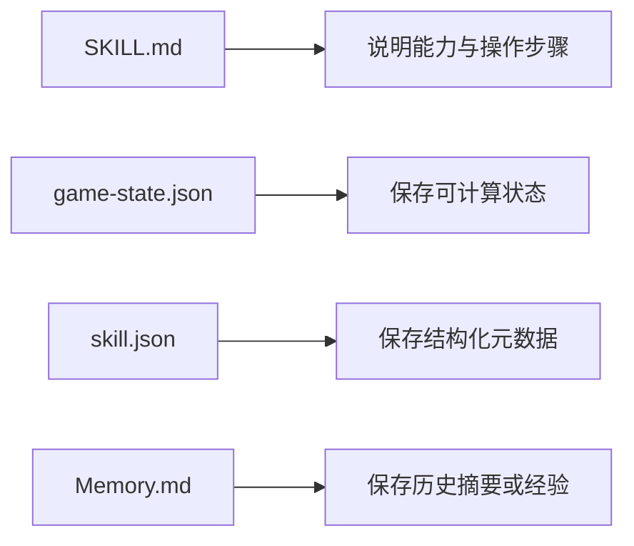

# L04：有状态 Skill 与静态说明 Skill 的区别

上一课的三个访谈 Skill 主要通过文本说明任务流程。本课看两个不同对象：`mahjong-scorer` 和 `search-and-install-skill`。它们都包含结构化状态或描述文件，因此适合用来解释“有状态 Skill”和“静态说明 Skill”的差别。

本课的问题是：当 Skill 目录里除了 `SKILL.md` 还有 JSON 或 Memory 文件时，读者怎样判断这些文件是初始状态、运行状态、元数据，还是历史记忆？

## 1. 静态说明和结构化状态



这张图说明四类文件的责任。`SKILL.md` 说明“应该怎么做”；`game-state.json` 保存“当前分数是什么”；`skill.json` 保存“这个 Skill 在市场或系统中怎样被描述”；`Memory.md` 保存“过去会话留下了什么摘要”。它们都在 Skill 目录中，却不是同一种数据。

## 2. `mahjong-scorer`：状态文件支撑连续计算

[templates/skills/mahjong-scorer/SKILL.md 第 23 行](../../../../templates/skills/mahjong-scorer/SKILL.md#L23) 说明三人麻将玩家 GJ、CL、LL 初始各 500 分。执行步骤在 [templates/skills/mahjong-scorer/SKILL.md 第 35 行](../../../../templates/skills/mahjong-scorer/SKILL.md#L35) 开始，要求首次使用时创建初始分数记录和对局记录文件。

同目录的 [templates/skills/mahjong-scorer/game-state.json 第 1 行](../../../../templates/skills/mahjong-scorer/game-state.json#L1) 给出结构：

```json
{
  "players": {
    "GJ": 500,
    "CL": 500,
    "LL": 500
  },
  "rounds": [],
  "startedAt": "2026-06-16T17:20:00+08:00"
}
```

这份文件让 Skill 从“每次只回答一句话”变成“能延续上一把结果”。如果 GJ 胡 8 分，下一次再问当前排名，系统需要知道上一把已经改变了分数。没有状态文件，只靠 `SKILL.md` 的文字，无法保存连续对局。

但这里仍要保持证据克制。当前能证明的是模板目录中存在初始状态样例；不能证明生产运行一定写回这个文件，也不能证明所有分数计算已有自动化测试。

## 3. `search-and-install-skill`：元数据与记忆不是同一回事

[templates/skills/search-and-install-skill/skill.json 第 1 行](../../../../templates/skills/search-and-install-skill/skill.json#L1) 是结构化元数据：

```json
{
  "name": "search-and-install-skill",
  "displayName": "搜索并安装市场技能",
  "description": "自动根据用户输入的技能关键词，从技能市场搜索匹配项，分析来源平台，下载并安装。",
  "version": "1.1.0",
  "type": "SIMPLE"
}
```

它适合被 UI、市场列表或索引系统读取，回答“这个技能怎样展示、输入是什么、输出是什么”。它不保存某次搜索结果，也不保存已安装文件列表。

[templates/skills/search-and-install-skill/Memory.md 第 1 行](../../../../templates/skills/search-and-install-skill/Memory.md#L1) 则是会话摘要列表。它记录若干时间点的“主要内容、关键决策、待跟进、上下文”。这些内容看起来像样例或历史记录，但它们仍不是安装结果本身。安装结果应落在 `${OUTPUT_DIR}/skills/{skill-id}/` 这样的目标目录中，而不是 Memory 文件里。

## 4. `outputDir` 和 `${OUTPUT_DIR}` 的风险

[templates/skills/search-and-install-skill/SKILL.md 第 9 行](../../../../templates/skills/search-and-install-skill/SKILL.md#L9) 声明 `outputDir: data/`。正文在 [templates/skills/search-and-install-skill/SKILL.md 第 24 行](../../../../templates/skills/search-and-install-skill/SKILL.md#L24) 写到安装到 `${OUTPUT_DIR}/skills/`，又在 [templates/skills/search-and-install-skill/SKILL.md 第 308 行](../../../../templates/skills/search-and-install-skill/SKILL.md#L308) 要求创建 `${OUTPUT_DIR}/skills/{skill-id}/` 下的 `Memory.md`、`Patterns.md` 和 `evolution.json`。

这说明该 Skill 的输出目录不是一句展示文案，而会影响文件副作用。读者要追问三件事：

| 问题 | 为什么重要 |
| --- | --- |
| `${OUTPUT_DIR}` 由谁替换？ | 如果没有替换，路径可能以字面量形式出现。 |
| 目标目录是否可写？ | 安装会创建文件，必须确认写入边界。 |
| 下载来源是否可信？ | 外部 ZIP 下载和解压有安全风险，不能只看成功路径。 |

本课不运行这些下载命令。它们包含外部网络请求、解压和覆盖写入，应在受控验证环境中单独检查。

## 5. 有状态不等于可随意写

`mahjong-scorer` 的状态写入是对局内部数据；`search-and-install-skill` 的安装写入是技能文件和认知文件。两者都有文件副作用，但风险不同。

| Skill | 写入对象 | 主要风险 |
| --- | --- | --- |
| `mahjong-scorer` | `game-state.json` | 分数计算错误、状态覆盖、历史丢失。 |
| `search-and-install-skill` | `${OUTPUT_DIR}/skills/{skill-id}/` | 下载来源、解压路径、元数据改写、凭证泄露。 |

因此，看到 `writes` 或 `outputDir` 时，不能笼统写“这个 Skill 会保存结果”。教材必须说明保存什么、保存到哪里、由谁触发、失败时会怎样。

## 6. 测试证据与缺口

本课没有运行麻将计分或市场安装流程。当前证据只证明模板目录里存在 `game-state.json` 初始结构、`skill.json` 元数据结构和 `Memory.md` 会话摘要样例。它不能证明计分算法在真实会话中正确，也不能证明外部技能市场下载、解压和元数据改写能够成功。

若要补自动化验证，麻将计分至少需要点炮、自摸、缺少放炮者、重新开局四类用例；安装型 Skill 至少需要模拟搜索响应、下载失败、ZIP 路径穿越、frontmatter 改写和输出目录隔离。

## 7. 小实验与口头验收

请比较 `mahjong-scorer` 与 `search-and-install-skill`：

1. 哪个文件保存麻将当前分数？
2. 哪个文件保存安装型 Skill 的展示元数据？
3. 哪个文件保存会话摘要？
4. 为什么 `outputDir: data/` 不能单独证明安装结果已经存在？
5. 为什么本课不直接运行下载命令？
6. 如果用户说“当前排名不对”，应该优先检查 `SKILL.md` 还是 `game-state.json`？

合上本课后，应能准确区分：说明文件讲规则，状态文件存当前值，元数据文件服务展示和索引，记忆文件记录历史摘要。下一课会看报告文件，学习“证据”与“源码入口”的边界。
