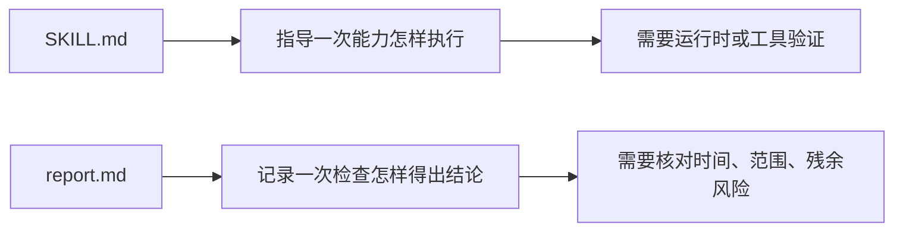

# L05：Skill report 为什么是证据，不是源码

前四课都在看定义、模板和状态。本课看一个容易被误读的文件：`skills/reports/architecture-guard/architecture-guard-20260729-120736.md`。它不是 Skill 定义，也不是运行脚本，而是一份架构围栏检查报告。

本课的问题是：报告文件能证明什么，不能证明什么？

## 1. 报告是一次检查的记录

[skills/reports/architecture-guard/architecture-guard-20260729-120736.md 第 3 行](../../../../skills/reports/architecture-guard/architecture-guard-20260729-120736.md#L3) 的检查概况给出时间、范围、规约和技术范围：

```markdown
- 时间：2026-07-29 12:07:36（Asia/Shanghai）
- 范围：`dev...proposal/validate-pi-tasks-runtime-boundary` 与当前未提交 Proposal 文档
- 规约：根目录 `AGENTS.md`、OpenSpec change `validate-pi-tasks-runtime-boundary`
```

这些字段说明它是一份带时间和范围的检查记录。报告不是“永远成立的结论”，也不是“所有 OriginOS 架构都已验证”的证明。

## 2. 结论必须连同范围一起读

[skills/reports/architecture-guard/architecture-guard-20260729-120736.md 第 12 行](../../../../skills/reports/architecture-guard/architecture-guard-20260729-120736.md#L12) 写出结论：未发现 blocker/high/medium/low 架构违规。初学者容易只摘这句话，然后写成“架构没有问题”。这是过度承诺。

正确读法要连同范围一起读：这份报告在指定 Proposal、指定规约、指定技术范围下，没有发现对应级别的问题。它不能证明未检查的目录、后续提交、其他平台打包、用户实际运行都没有风险。

## 3. 报告里的证据类型

报告从 [skills/reports/architecture-guard/architecture-guard-20260729-120736.md 第 20 行](../../../../skills/reports/architecture-guard/architecture-guard-20260729-120736.md#L20) 开始列检查项：

| 检查项 | 报告中的证据 | 教材应怎样表述 |
| --- | --- | --- |
| 依赖方向 | Core 新增内容仅位于测试目录，未发现 Core 依赖 Web/Desktop。 | 这是一次依赖扫描结论，不是未来依赖永远正确。 |
| 公共边界 | 未发现 `pi-tasks` 私有路径导入。 | 这是对当前变更范围的边界证据。 |
| OpenSpec 与文档 | Proposal、design、tasks、capability spec 齐全，严格校验通过。 | 这是文档完整性和 OpenSpec 校验证据。 |
| 产物与敏感信息 | 未发现产物和敏感信息。 | 这是当前报告范围内的检查结果。 |
| 测试 | 若干测试通过，Web lint 有既有 warnings。 | 测试只能证明它实际运行和断言的内容。 |

报告能作为证据，是因为它列出了检查范围和检查结果；报告不能替代源码，是因为它不包含被检查代码的完整调用链。

## 4. 残余风险是报告的一部分

最值得教学的部分在 [skills/reports/architecture-guard/architecture-guard-20260729-120736.md 第 64 行](../../../../skills/reports/architecture-guard/architecture-guard-20260729-120736.md#L64)。报告明确列出残余风险：真实 package artifact smoke 尚未执行，`pi-tasks@0.2.0` 的后续路线需要治理，`agents:check` 不能覆盖 monorepo package 目录，`pnpm docs:index` 指向不存在脚本。

这说明一份合格报告不只是写“通过”。它还告诉读者哪些事情没有被证明。教材引用报告时必须保留这一层，否则会把谨慎证据改写成绝对保证。

## 5. 报告文件和 Skill 文件的区别



这张图回答的是两类 Markdown 的阅读差异。`SKILL.md` 是面向未来执行的说明；report 是面向过去检查的记录。一个写“应该怎么做”，另一个写“检查过什么、结果如何、还缺什么”。

## 6. 测试证据与缺口

报告中的测试证据来自报告作者记录的命令结果，例如 runtime contract、package verification contract、Web TypeScript 和 Web lint。教材引用这些证据时只能说“报告记录了这些检查结果”，不能替代当前重新运行。

当前缺口同样来自报告自身：真实 package artifact smoke 尚未执行，`agents:check` 对 monorepo package 目录覆盖不足，文档索引自动化脚本缺失。报告把这些缺口写出来，正是它可以被当作严谨证据阅读的原因。

## 7. 小实验与口头验收

打开报告文件，回答：

1. 这份报告的检查时间是什么？
2. 检查范围是什么，哪些目录或变更没有被它自然覆盖？
3. 报告中的 PASS 能证明什么？
4. 第 64 行之后的残余风险为什么必须保留在教材里？
5. 为什么报告不能替代源码精读？
6. 如果后续代码又改了，为什么不能继续引用这份报告证明当前状态？

合上本课后，应能准确复述：报告是证据，不是源码；结论必须绑定时间、范围、命令、检查项和残余风险。下一课会把前五课的误读集中起来，专门分析目录和产物边界的失败路径。
