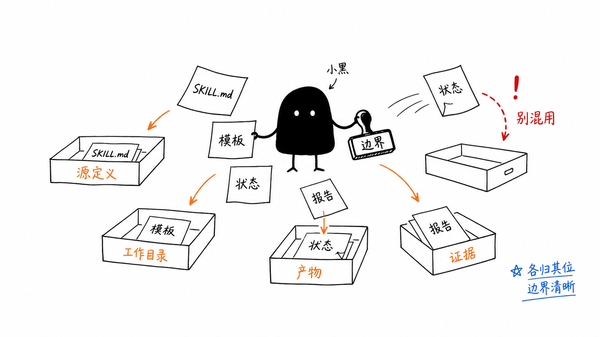
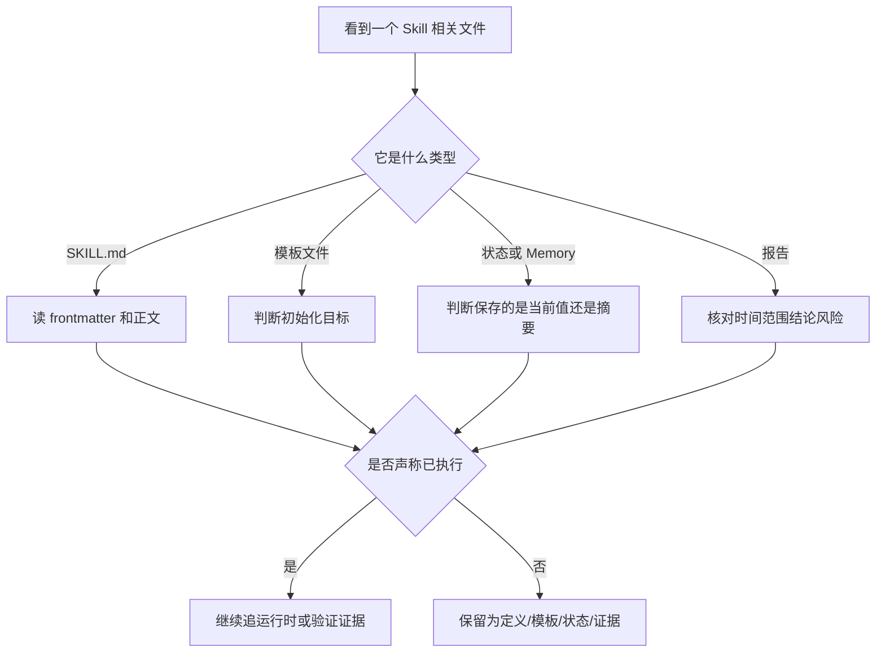

# L07：Skill 定义与产物边界工作坊



第一单元已经读过四类材料：Skill 定义、Project Interview 模板、状态文件和报告文件。现在要把它们重新压成一个可操作判断：先分清文件类型，再判断它能证明什么，最后决定是否需要追运行时。

上图中的小黑正在给不同纸张盖“边界”章。`SKILL.md` 进入源定义，模板文件进入工作目录初始化材料，状态文件进入产物或状态抽屉，报告进入证据抽屉。右侧红色“别混用”提醒的是本单元最常见错误：把这些文件混成同一种东西。

## 1. 一句话核心判断

Part L 第一单元的核心判断是：

```text
Skill 文件负责定义能力，模板负责准备结构，状态文件保存某类当前值，报告保存一次检查证据；它们都不能单独证明生产运行已经发生。
```

这句话可以拆成四层：

| 层 | 判断 |
| --- | --- |
| 定义层 | `SKILL.md` 说明能力、触发场景、输入输出和约束。 |
| 模板层 | `templates/**` 说明初始化后文件可能长什么样。 |
| 状态层 | JSON 或 Memory 文件保存结构化状态、会话摘要或初始样例。 |
| 证据层 | report 记录一次检查的时间、范围、结论和残余风险。 |

## 2. 本单元因果链

| 课程 | 补上的判断能力 |
| --- | --- |
| L01 | 能从 frontmatter 和正文区分 Skill 身份、说明和未证明行为。 |
| L02 | 能把 Project Interview 的六个模板文件按身份、工具、记忆、知识、经验和风格分类。 |
| L03 | 能判断没有脚本的 Skill 仍然怎样通过文本合同表达任务边界。 |
| L04 | 能区分 `game-state.json`、`skill.json`、`Memory.md` 的状态、元数据和记忆责任。 |
| L05 | 能把 report 当成证据，而不是当前生产源码。 |
| L06 | 能从目录错位、读文件失败、工具不一致、报告过度承诺等症状反推边界。 |

这个因果链不是目录摘要。它说明每节课都在修正一个常见误判。

## 3. 源码覆盖复盘

| 文件组 | 学到的责任 | 当前证据状态 |
| --- | --- | --- |
| `templates/project-interview/Agent.md` | 身份、职责、阶段判断和不可妥协规则。 | 已精读模板内容；运行时加载需回到 Part F。 |
| `templates/project-interview/MEMORY.md` | 访谈阶段、已识别对象、关系、决策和待确认问题。 | 已精读初始结构。 |
| `templates/project-interview/Knowledge.md`、`Patterns.md` | 知识索引和经验模式预留位置。 | 当前为空，不能写成已有知识或经验。 |
| `templates/project-interview/Taste.md` | 表达风格、协作风格和业务建模品味。 | 已精读风格边界。 |
| `templates/project-interview/Tool.md` | 工具授权说明和工具使用原则。 | 已发现疑似残留字符；实际工具注册需另查。 |
| `business-refinement`、`domain-discovery`、`model-review` | 三阶段访谈 Skill 的文本合同。 | 已精读任务、输入、输出和失败边界。 |
| `mahjong-scorer` | 有状态 Skill 的初始状态和计分说明。 | 已精读 `SKILL.md` 与 `game-state.json`；未证明生产写回。 |
| `search-and-install-skill` | 安装型 Skill 的输出目录、元数据、记忆和外部下载风险。 | 已精读定义、Memory 和 `skill.json`；未运行网络命令。 |
| `skills/reports/architecture-guard/**` | 检查报告的时间、范围、结论和残余风险。 | 已精读证据边界。 |

## 4. 排查地图



这张图回答的是排查顺序。先分类，再判断证据强度，最后决定是否继续追运行时。不要一上来就把所有 Markdown 当 prompt，也不要把所有 JSON 当运行状态。

## 5. 综合实验

选择 `templates/skills/search-and-install-skill/`，完成一次完整纸面审查：

1. 在 `SKILL.md` 中标出 `name`、`code`、`outputDir`、`reads`、`writes`。
2. 找到正文中所有会产生文件副作用的段落。
3. 判断 `skill.json` 是展示元数据、运行状态还是安装结果。
4. 判断 `Memory.md` 中的会话摘要能否证明某个技能已经安装。
5. 写出三个运行前必须确认的风险：外部 API、下载来源、解压目录。
6. 写出一句克制结论：当前源码能证明什么，不能证明什么。

合格答案不需要运行网络命令，但必须能准确画出“定义文件 -> 输出目录声明 -> 下载/解压步骤 -> 元数据改写 -> 认知文件创建 -> 安装提示”的证据链。

## 6. 测试证据与缺口

第一单元以模板和文档精读为主，当前没有运行自动化测试。原因很明确：多数文件是模板、说明或报告，不是直接可执行的单元测试对象；`search-and-install-skill` 还包含外部网络、下载、解压和写文件行为，不能在教材写作阶段随意执行。

已有证据：

| 证据 | 证明范围 |
| --- | --- |
| 文件存在并可读取 | 证明这些模板、状态和报告进入 Git 跟踪范围。 |
| 行号级源码精读 | 证明教材论点可回到具体文件复查。 |
| 报告文件自身 | 证明某次架构检查记录了范围、结论和残余风险。 |

缺口：

| 缺口 | 后续怎样补 |
| --- | --- |
| Skill 是否被生产入口加载 | 回到 Part E/F/G 的 loader、launcher 和 service 测试。 |
| 文件工具是否按期望写入目录 | 回到工具运行时和工作目录解析测试。 |
| 安装型 Skill 的外部下载是否安全可靠 | 需要受控网络、临时目录和解压路径测试。 |
| report 结论是否仍适用于当前代码 | 需要重新运行对应检查命令或审查最新 diff。 |

## 7. 口头验收

不看正文，回答以下问题：

1. `SKILL.md` 的 frontmatter 和正文分别负责什么？
2. 为什么 `templates/project-interview/Knowledge.md` 为空是一件重要事实？
3. 为什么 `Tool.md` 的 `allowedTools` 不能证明工具实现已经注册？
4. `game-state.json` 和 `skill.json` 的用途有什么区别？
5. 为什么报告的 PASS 必须连同时间、范围和残余风险一起引用？
6. 当产物写进模板目录时，应按什么顺序排查？
7. 第一单元哪些结论已经有源码证据，哪些仍需要运行时验证？

完成这些问题后，读者已经具备 Part L 的第一项能力：不被文件名带偏，先判断文件类型和证据强度。下一单元会进入业务 Skill 模板，继续精读说明文件、references、脚本和 handler 之间的关系。
