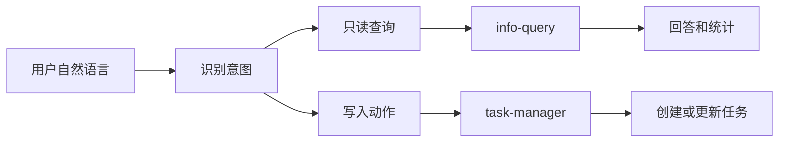

# L08：业务 Skill 的说明文件怎样约束任务

## 学习目标

读完本节，你要能解释三件事：

1. 为什么业务型 Skill 的 `SKILL.md` 不是普通说明书，而是运行时可读取的能力合同。
2. `reads`、`writes`、`dependencies`、`features` 和执行步骤分别约束什么。
3. 为什么同样是项目管理能力，查询型 Skill 和修改型 Skill 的边界不能混在一起。

本节精读两个模板入口： [info-query/SKILL.md](../../../../templates/skills/info-query/SKILL.md#L1) 和 [task-manager/SKILL.md](../../../../templates/skills/task-manager/SKILL.md#L1) 。

## 一个业务 Skill 先声明“能做什么”，再声明“怎么做”

`info-query` 的 frontmatter 把自己命名为 `info-query`，类型是 `SIMPLE`，读取 `ontology`、`project`、`task`，写入为空数组，依赖为空数组。这个组合说明它是一类只读查询能力：它可以回答项目详情、任务状态、团队成员、目标、关系统计，但不应该创建或修改项目数据。对应源码见 [info-query/SKILL.md](../../../../templates/skills/info-query/SKILL.md#L1) 。

`task-manager` 的 frontmatter 则不同。它是 `COMPOSITE`，读取 `task`、`project`，写入 `task`、`project`，依赖 `ontology-editor`。这说明它不只是看数据，还会创建任务、修改状态、分配负责人、更新优先级，并且需要借助本体编辑能力完成写入。对应源码见 [task-manager/SKILL.md](../../../../templates/skills/task-manager/SKILL.md#L1) 。

这两个文件放在一起读，最重要的不是背字段，而是看边界：

| 字段 | 在 `info-query` 中的含义 | 在 `task-manager` 中的含义 |
| --- | --- | --- |
| `type` | `SIMPLE`，单一查询入口 | `COMPOSITE`，组合多个管理动作 |
| `reads` | 读取本体、项目、任务 | 读取任务与项目 |
| `writes` | 空数组，原则上不改数据 | 写入任务与项目 |
| `dependencies` | 无依赖 | 依赖 `ontology-editor` |
| 主要动词 | 查询、统计、列出、回答 | 创建、更新、分配、查询、统计 |

如果读者只看“它们都能查任务”，就会误以为两者可以互换。实际上，`info-query` 的价值是只读解释，`task-manager` 的价值是带副作用的任务操作。查询可以很宽，写入必须很窄；查询回答错了可以修正话术，写入动作错了会污染项目数据。

## `features` 是能力菜单，不是自由发挥许可

两个 `SKILL.md` 都有功能清单。`info-query` 的功能包括项目详情查询、任务查询、团队成员查询、目标查询、关系查询、统计查询。`task-manager` 的功能包括创建任务、更新状态、分配负责人、设置优先级、查询任务、任务统计。

初学者容易把功能清单当成“只要相关都能做”。正确读法是：功能清单只是 Skill 可以覆盖的意图类别，具体执行还要受后面的流程、参数和数据约束限制。例如 `task-manager` 可以“分配任务”，但这不等于它能自动创建不存在的负责人；实际 handler 里只是更新任务的 `assignee` 字段，并没有先验证或创建 Person 实体。这个差异会在 L09 继续展开。

## 执行指导把自然语言压成有限动作

`info-query` 的执行指导要求先理解查询意图，再识别查询类型：数量、状态、人员、关系、项目概况。随后再抽取实体类型、人员姓名、状态等参数，并用本体查询工具取数。这说明它的工作是把用户自然语言压缩成“查询类型 + 过滤条件”。

`task-manager` 的执行指导也先理解操作类型，但它的动作空间更危险：创建、更新、分配、查询、统计。因为有写入，所以它更依赖参数完整性，例如任务标题、任务 ID、负责人、状态和优先级。

可以把两者理解成两台不同的门禁：

这张图不是运行时完整架构，只是帮助你建立读源码的入口判断。真实执行仍要看 `handler.ts`、工具实现和 API 调用链。

## 以“小林的毕业旅行策划”为例

假设小林正在用 OriginOS 管理毕业旅行项目。他问：“现在有多少个未完成任务？”这句话应该进入 `info-query` 的只读查询路径。它不需要改变任务，只需要统计 `Task` 中未完成状态的数量。

如果小林说：“创建一个任务：确认青旅预订，优先级高。”这句话应该进入 `task-manager` 的创建路径。因为它会新增任务实体，`writes` 中必须允许写任务数据。

如果小林说：“把 T-12 分配给阿杰。”这句话仍然属于 `task-manager`，不是 `info-query`。虽然句子里出现人员名，但动作是分配，结果是更新任务字段。

这个例子说明，Skill 选择不能只看关键词，还要看动词带不带副作用。

## 边界与风险

`SKILL.md` 能约束能力边界，但它本身不保证实现完全符合说明。比如 `task-manager` 声明可以更新优先级，但具体 handler 是否覆盖所有自然语言表达，要继续读代码。`info-query` 声明支持关系查询，但 handler 中是否真的实现关系路径，也要看实现细节。

因此，读业务 Skill 说明文件时要保留两个判断：

1. 说明文件给出“应该做什么”。
2. handler、脚本和测试证据说明“现在实际上能做到什么”。

## 测试证据与缺口

本节完成的是静态源码阅读：已核对两个 `SKILL.md` 的 frontmatter、功能清单和执行步骤。尚未运行 Skill，也没有证明运行时工具注册、权限、项目数据和本体查询链一定可用。

如果要验证本节结论，最小测试应包含：

1. 对 `info-query` 输入“有几个任务”，确认它只读查询并返回统计。
2. 对 `task-manager` 输入“创建一个任务”，确认它调用写入工具。
3. 对 `info-query` 输入“创建任务”，确认它不应执行写入。
4. 对 `task-manager` 输入缺少任务 ID 的更新指令，确认返回明确错误。

## 本节小结

业务 Skill 的 `SKILL.md` 是能力边界，而不是实现本体。`info-query` 和 `task-manager` 最适合一起读：一个展示只读查询边界，一个展示写入管理边界。读懂这组差异，后面再看 `handler.ts` 时就不会把自然语言关键词、工具调用和数据副作用混成一件事。

## 口头验收

请用自己的话回答：为什么 `info-query` 的 `writes: []` 是一个重要信号？为什么 `task-manager` 即使也能查询任务，也不能被当成普通查询 Skill？
