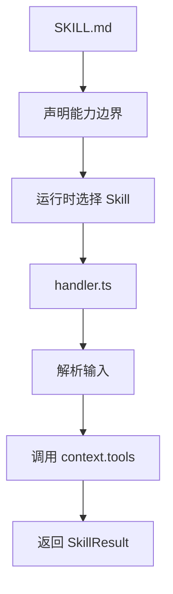

# L09：TypeScript handler 和说明文件的分工

## 学习目标

读完本节，你要能说清楚：

1. `SKILL.md` 与 `handler.ts` 在职责上有什么不同。
2. `info-query/handler.ts` 如何把自然语言分流成数量、人员、状态和概况查询。
3. `task-manager/handler.ts` 如何把自然语言分流成创建、更新、分配、列表和统计。
4. 为什么模板 handler 中的简化解析和 `any` 是教学时必须指出的实现风险。

本节精读 [info-query/handler.ts](../../../../templates/skills/info-query/handler.ts#L1) 与 [task-manager/handler.ts](../../../../templates/skills/task-manager/handler.ts#L1) 。

## `SKILL.md` 是合同，`handler.ts` 是执行器

`SKILL.md` 说明一个 Skill 应该在什么场景触发、读写哪些对象、按什么步骤工作。`handler.ts` 则接收 `SkillContext`，从 `context.input?.data` 中拿到用户输入，再调用 `context.tools` 执行查询或写入。

这个分工很关键。说明文件可以写“支持任务状态查询”，但真正决定“哪些话会被识别为状态查询”的，是 handler 里的字符串判断、正则表达式和分支顺序。

如果只读 `SKILL.md`，你知道系统意图；如果只读 `handler.ts`，你知道实际路径；两者合起来，才能判断模板是否可信。

## `info-query` 的分流逻辑

`info-query/handler.ts` 先定义几个抽取函数。`extractEntityType` 根据项目、任务、人员、团队、目标等关键词返回 `Project`、`Task`、`Person`、`Goal` 或 `null`。`extractPersonName` 用中文姓氏正则抽取人员名。主 `handle` 函数先检查输入为空，再按顺序判断数量查询、人员查询、状态查询，最后进入通用查询。对应代码见 [info-query/handler.ts](../../../../templates/skills/info-query/handler.ts#L15) 和 [info-query/handler.ts](../../../../templates/skills/info-query/handler.ts#L49) 。

它的核心路径可以这样读：

| 分支 | 触发信号 | 工具动作 | 返回重点 |
| --- | --- | --- | --- |
| 数量查询 | `多少`、`几个`、`count` 等 | `queryEntities` | `count`、`entityType` |
| 人员查询 | 抽到人员名 | 查询 Person，再过滤任务 | 人员信息与相关任务 |
| 状态查询 | 完成、进行、阻塞等状态词 | `queryEntities('Task', { status })` | 指定状态任务 |
| 通用查询 | 无明确分支 | 查询概况或指定实体 | 概况统计或实体列表 |

这个实现有两个教学重点。

第一，分支顺序会影响结果。例如一句话同时包含“张三”和“有几个任务”，会先命中数量查询，因为数量分支在人员分支之前。第二，人员抽取只覆盖部分中文姓氏模式；英文名、少数姓氏、昵称和团队角色很可能抽不出来。

## `task-manager` 的分流逻辑

`task-manager/handler.ts` 先定义任务状态和优先级枚举，再提供 `parseTaskStatus`、`parseTaskPriority`、`extractTaskId`、`extractTaskTitle` 等函数。主 `handle` 函数同样先检查空输入，然后按创建、更新状态、分配、列表、统计、默认列出全部的顺序分流。对应代码见 [task-manager/handler.ts](../../../../templates/skills/task-manager/handler.ts#L1) 和 [task-manager/handler.ts](../../../../templates/skills/task-manager/handler.ts#L78) 。

创建任务路径调用 `tools.createEntity('Task', ...)`，默认状态为 `open`，默认描述为“待更新描述”，优先级来自自然语言解析。更新状态路径要求能抽到任务 ID 和状态，然后调用 `tools.updateEntity`。分配任务路径要求任务 ID 和人员名称，然后把 `assignee` 字段写入任务。列表和统计路径都通过 `queryEntities` 读取任务。

这说明一个 `COMPOSITE` Skill 内部也会同时包含读操作和写操作。区别不在于“有没有查询”，而在于这个 Skill 是否允许产生副作用。

## 模板实现中的风险不是教程要修掉的 bug

两个 handler 都出现了 `any`，例如把实体数组映射成返回对象时使用 `(e: any)` 或 `(t: any)`。在 OriginOS 根规约中，TypeScript 严格模式禁止 `any` 类型；因此这在教学中应标为模板质量风险。它说明该模板更像能力样例，不应直接等同于最终生产实现。

此外，`task-manager` 的自然语言解析非常朴素：任务标题依赖“创建/新增/添加/任务”等关键词后的文本；任务 ID 依赖 `T-123`、`TASK-123` 或 `task_123` 一类格式；负责人抽取依赖“给/assign/to”后的短语。这些规则足以演示 handler 分流，但不能证明它能覆盖真实用户表达。

## 以“小林的毕业旅行策划”为例

小林说：“创建一个任务：确认青旅预订，优先级高。”`task-manager` 会先命中创建分支，抽取标题和优先级，然后创建 Task。

小林说：“把 T-12 改成已完成。”它会命中状态更新分支，抽取任务 ID 和 `done` 状态，再更新实体。

小林说：“阿杰负责哪些任务？”`info-query` 可能抽出中文姓名并走人员查询路径；但如果小林说“AJ 负责哪些任务”，当前中文姓名正则可能无法识别。这不是 `SKILL.md` 能看出来的问题，必须读 handler。

## 测试证据与缺口

本节完成的是静态 handler 级阅读：已核对输入解析、分支顺序、工具调用和错误返回结构。尚未运行 TypeScript 测试，也没有构造真实 `SkillContext` 来证明 `tools.queryEntities`、`tools.createEntity`、`tools.updateEntity` 在模板环境中可用。

如果要补自动化验证，建议至少覆盖：

1. 空输入返回 `INVALID_INPUT`。
2. 数量查询默认实体类型为 Task。
3. 分配任务缺少任务 ID 时返回 `INVALID_TASK_ID`。
4. 更新状态缺少状态或任务 ID 时返回明确错误。
5. 英文昵称或非常见中文姓名不会被误判为已可靠识别。

## 本节小结

`SKILL.md` 决定能力边界，`handler.ts` 决定实际执行路径。读 handler 时要特别看输入来源、分支顺序、工具调用、副作用和错误结构。模板代码能帮助我们理解系统意图，但其中的简化解析和 `any` 也提醒我们：教学必须区分“模板样例”与“生产质量实现”。

## 口头验收

请解释：为什么一句“张三有几个任务？”可能受分支顺序影响？为什么 `task-manager` 里出现查询逻辑，并不改变它是带写入副作用的业务 Skill？
