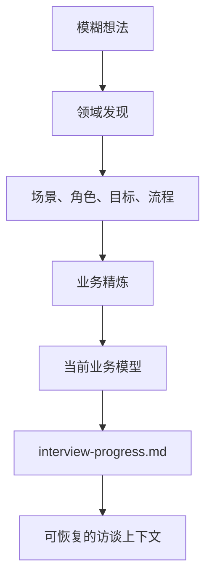

# L10：项目初始化 Skill 如何引导访谈

## 学习目标

读完本节，你要能解释：

1. `project-initialization/SKILL.md` 为什么更像访谈协议，而不是普通工具说明。
2. 两阶段访谈怎样从模糊想法推进到业务模型。
3. 进度 Markdown、文件分析和会话恢复为什么属于同一个访谈闭环。
4. references 目录怎样给访谈提供提示词和使用示例。

本节精读 [project-initialization/SKILL.md](../../../../templates/skills/project-initialization/SKILL.md#L1) 、 [agent-prompts.md](../../../../templates/skills/project-initialization/references/agent-prompts.md#L1) 和 [examples.md](../../../../templates/skills/project-initialization/references/examples.md#L1) 。

## 这是一个对话型业务 Skill

`project-initialization/SKILL.md` 的 description 明确说，它通过对话式引导完成项目业务建模，并采用“领域发现”和“业务精炼”两阶段模式。这里的 Skill 不只是执行一个命令，而是在多轮对话中持续收集、确认、补全和沉淀信息。

它先给角色命名为 OriginOS 项目访谈助手，也就是 Oracle。Oracle 的职责包括开放式提问、识别行业、使用 `AskUserQuestion`、记录业务概念、发现矛盾、提供建议。对应源码见 [project-initialization/SKILL.md](../../../../templates/skills/project-initialization/SKILL.md#L11) 和 [project-initialization/SKILL.md](../../../../templates/skills/project-initialization/SKILL.md#L16) 。

这类 Skill 的难点不在单次命令，而在“每一轮都不要丢上下文”。所以它很早就规定访谈进度 Markdown：每次回复后都要更新 `output/interview-progress.md`，而且写完整 Markdown，不是只追加一点片段。对应源码见 [project-initialization/SKILL.md](../../../../templates/skills/project-initialization/SKILL.md#L38) 。

## 进度文件不是装饰，而是会话恢复基础

进度文件包含项目 ID、访谈时间、当前阶段、项目信息、对话记录、当前业务模型和最后更新时间。它的实际保存位置依赖项目工作目录：写入相对路径 `output/interview-progress.md`，工具会映射到 `data/projects/{projectId}/output/interview-progress.md`。

这体现了 Part L 的一个核心边界：Skill 源目录只提供说明，产物必须落在项目工作目录。访谈进度是项目上下文中的产物，不应写回 `templates/skills/project-initialization/`。

会话恢复协议也依赖这个文件。当检测到已有进度时，Oracle 应先读取进度，向用户说明看到了之前的对话，并询问是继续还是重新开始。这样用户不会因为刷新、重开窗口或中断访谈而丢掉上下文。

## 文件分析扩展了信息来源

项目访谈不只靠用户现场输入。`SKILL.md` 规定，当用户提到上传文件、发文档、帮忙看看附件时，必须先用 `read_file` 读取内容，再判断文件是否与业务建模相关。相关文件包括需求调研、业务说明、产品规划、功能列表、用户故事、运营方案等；不相关文件包括纯代码、日志、配置或个人无关文档。对应源码见 [project-initialization/SKILL.md](../../../../templates/skills/project-initialization/SKILL.md#L162) 。

这一步有一个容易忽略的教学点：文件分析不替代对话。源码明确要求，文件信息可能不完整或有偏差，仍需通过对话确认，并把文件内容作为对话记录的一部分写入进度 Markdown。也就是说，文档是证据来源之一，不是最终业务模型本身。

## 两阶段访谈怎样推进

Phase 1 是领域发现。它从开放问题开始，让用户选择从具体场景、行业领域或示例启发进入。然后根据用户描述追问涉及的人、目标、关键步骤、易出错环节和系统改善方式。最后进行行业识别、领域知识挖掘和阶段完成确认。对应源码见 [project-initialization/SKILL.md](../../../../templates/skills/project-initialization/SKILL.md#L275) 。

Phase 2 是业务精炼。它围绕实体生命周期、关系与数量、业务规则细节、数据约束继续追问，目标是填补缺口、发现矛盾、明确规则。对应源码见 [project-initialization/SKILL.md](../../../../templates/skills/project-initialization/SKILL.md#L465) 。

可以把访谈看成一个收敛过程：

## references 的作用

`references/agent-prompts.md` 把访谈提示词拆成 Foundation、Team、Goals、Tasks、Review 等阶段，并说明创建实体时要宣布动作、展示创建内容、解释上下文、自然推进下一话题。对应源码见 [agent-prompts.md](../../../../templates/skills/project-initialization/references/agent-prompts.md#L15) 。

`references/examples.md` 则提供 React Hook、API 直接调用、发送消息、获取上下文、完成和取消访谈的示例。它还给出一个从 “My Website” 到团队、目标、任务、Review、Complete 的完整对话流。对应源码见 [examples.md](../../../../templates/skills/project-initialization/references/examples.md#L3) 和 [examples.md](../../../../templates/skills/project-initialization/references/examples.md#L250) 。

references 不是运行时业务数据。它们是 Skill 执行时可以读取的参考材料，帮助 Agent 遵守访谈风格、阶段顺序和接入方式。

## 以“小林的毕业旅行策划”为例

小林最开始只说：“我想做一个毕业旅行策划项目。”Oracle 不应立刻生成完整方案，而应先追问场景：谁参与旅行、预算谁决定、目的地如何选择、住宿和交通谁负责、最怕出什么问题。

如果小林上传了一份“毕业旅行预算表.md”，Oracle 应先读文件，提取预算、成员、目的地候选、时间限制等信息，再请小林确认，而不是直接把表格内容当成最终模型。

当 Phase 1 足够清晰后，Phase 2 才进入规则细化：一个成员能否参加多个目的地投票，预算超支如何处理，住宿确认后还能不能改，谁有最终审批权。

## 测试证据与缺口

本节完成的是静态阅读：已核对访谈阶段、进度 Markdown、文件分析、会话恢复和 references 示例。尚未运行项目初始化 API，也未证明 `AskUserQuestion`、`read_file`、`write_file` 在实际会话中全部可用。

后续验证应覆盖：

1. 每轮回复后确实写入 `output/interview-progress.md`。
2. 检测已有进度文件时能恢复并询问继续或重开。
3. 上传业务文档时先读取再建模。
4. 文件信息进入进度记录，但仍要求用户确认。

## 本节小结

`project-initialization` 是一个访谈协议型 Skill。它把模糊项目想法变成业务模型，靠的不是一次性生成，而是阶段提问、文件证据、进度持久化和会话恢复。references 负责补充提示词和接入示例，不能被误读成项目数据或最终实现。

## 口头验收

请说明：为什么 `interview-progress.md` 必须保存在项目工作目录中？为什么读取上传文件后仍然要继续追问用户确认？
