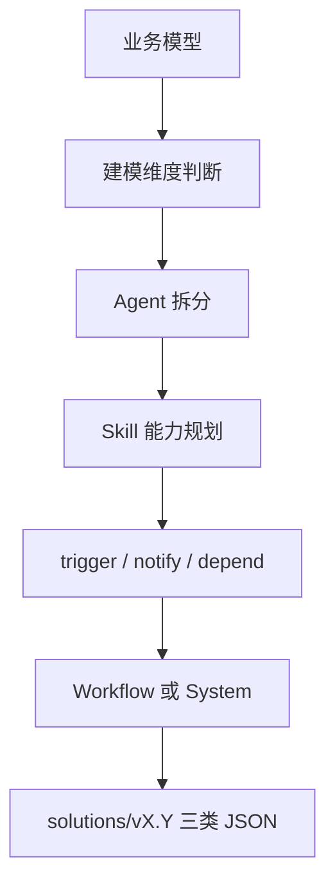

# L12：solution-design 为什么引用 collaboration types

## 学习目标

读完本节，你要能解释：

1. `solution-design` Skill 的输入前提、阶段流程和输出产物。
2. 为什么它必须引用 `collaboration-types.md`。
3. `trigger`、`notify`、`depend` 如何影响 Workflow 和 System 两类运行模式判断。
4. 为什么方案设计模板不能越过业务模型凭空生成 Agent 和 Skill。

本节精读 [solution-design/SKILL.md](../../../../templates/skills/solution-design/SKILL.md#L1) 与 [references/collaboration-types.md](../../../../templates/skills/solution-design/references/collaboration-types.md#L1) 。

## 方案设计接在业务建模之后

`solution-design` 的 description 写明，它把业务本体转化为 Agent 协作架构，推荐建模维度，规划 Agent 职责与协作关系。它的核心产物不是一句建议，而是经过验证的 Agent 架构方案，包括建模维度、Agent 职责、Agent 与 Skill 清单，以及后续实施清单。对应源码见 [solution-design/SKILL.md](../../../../templates/skills/solution-design/SKILL.md#L9) 。

它在激活时先读取配置、加载 Agent/Skill 模板、确保 `solutions/` 和 `agents/` 目录存在，并检查 `output/business-model.json` 是否存在且包含业务对象、流程或规则。缺少业务模型时，应提示用户先完成业务建模。对应源码见 [solution-design/SKILL.md](../../../../templates/skills/solution-design/SKILL.md#L21) 。

这个前提非常重要：方案设计不能凭空生成架构。每个 Agent 和 Skill 都必须能追溯到业务模型中的实体、关系、规则或约束。

## 状态模型防止方案版本混乱

`solution-design` 定义了 `draft`、`reviewing`、`confirmed` 三种方案状态。没有历史方案时从 Stage 1 开始；存在 draft 或 reviewing 时加载最新方案继续；只有 confirmed 时则让用户选择新版本、调整旧版本或重新开始。版本号使用 `v{major}.{minor}`，初始为 `v1.0`。

这说明 `solutions/` 里的文件不是一次性草稿，而是带状态和版本的方案资产。每次生成方案时都要包含 `status`、`solutionVersion`、`changesFromPrevious` 等字段。对应源码见 [solution-design/SKILL.md](../../../../templates/skills/solution-design/SKILL.md#L45) 。

## Stage 1 和 Stage 2：先判断建模维度，再拆 Agent

Stage 1 读取 `output/business-model.json`，提取业务对象、业务流程、业务规则和领域边界。随后判断建模维度：如果规则可枚举、执行确定、流程相对固定，就推荐事的维度，也就是 Agentic Workflow；否则推荐人的维度，也就是 Agentic System。对应源码见 [solution-design/SKILL.md](../../../../templates/skills/solution-design/SKILL.md#L111) 。

Stage 2 根据业务边界拆 Agent。源码明确反对“为了拆分而拆分”，只有上下文上限、专业 prompt 需求、需要并行、自然业务边界等条件成立时才必须拆分；否则应保持单 Agent。这个原则能防止读者把 Agent 数量当作先进程度。对应源码见 [solution-design/SKILL.md](../../../../templates/skills/solution-design/SKILL.md#L145) 。

## collaboration types 是协作语义，不是装饰字段

`references/collaboration-types.md` 只有一张表，但很关键：`trigger` 表示触发执行，`notify` 表示通知结果，`depend` 表示依赖数据。对应源码见 [collaboration-types.md](../../../../templates/skills/solution-design/references/collaboration-types.md#L1) 。

在 `solution-design/SKILL.md` 中，协作类型会影响运行时模式判断：

| 协作类型 | 含义 | 对架构判断的影响 |
| --- | --- | --- |
| `trigger` | A 完成后触发 B | 更接近固定 DAG 的 Workflow |
| `notify` | A 把结果通知 B | 可能需要广播或共享状态 |
| `depend` | B 依赖 A 的数据 | 可能形成更重的 System 协作 |

源码规定，如果所有协作关系都是 `trigger`，且没有循环依赖，可以判为轻量 Workflow。若存在 `notify` 或 `depend`，执行顺序不固定，并可能需要共享黑板、事件溯源、ACL 消息路由和冲突处理，则判为 System。对应源码见 [solution-design/SKILL.md](../../../../templates/skills/solution-design/SKILL.md#L167) 。

## Stage 2.5 与 Stage 2.6：Skill 要有 I/O 契约

Stage 2.5 要为每个 Agent 识别 Skills，并生成完整 I/O 契约。`inputContract.requires` 声明 Skill 需要读取哪些对象和字段，`outputContract.produces` 声明 Skill 会写出哪些对象和字段。字段必须精确，只列实际读写字段，不列对象上的所有字段。对应源码见 [solution-design/SKILL.md](../../../../templates/skills/solution-design/SKILL.md#L227) 。

Stage 2.6 要验证 SOP 数据流：上游产出是否满足下游输入，字段是否足够，是否存在不合法循环。断流、字段不足和循环依赖都会被标为问题。对应源码见 [solution-design/SKILL.md](../../../../templates/skills/solution-design/SKILL.md#L298) 。

这一步把“方案好看”变成“数据能流动”。没有 I/O 契约的 Skill 清单，很容易只是一组名字。

## 最终产物与边界

确认方案后，Stage 4 要生成 `solutions/{version}/manifest.json`、`agents.json`、`skills.json` 三个文件，而不是旧式单文件。随后通过 creator skills 创建 Agent 和 Skill 文件，不能直接绕过 creator。对应源码见 [solution-design/SKILL.md](../../../../templates/skills/solution-design/SKILL.md#L358) 。

注意：Part L 在这里讲模板与规划协议，不证明 creator skills 的内部实现，也不展开运行时协作引擎。Workflow/System 的执行机制属于其他部分；这里的重点是方案模板怎样把业务模型转为可审查的工程清单。

## 以“小林的毕业旅行策划”为例

小林的业务模型中有成员、目的地、预算、住宿、交通、任务和审批规则。如果交通预订必须在预算确认后执行，预算 Skill 输出预算结果，交通 Skill 读取预算字段，这就是 I/O 依赖。

如果交通预订完成后只是通知行程 Agent 更新摘要，可能是 `notify`。如果预算确认直接触发住宿和交通两个固定步骤，可能是 `trigger`。如果住宿和交通都要依赖共享预算并反复协调，架构可能从轻量 Workflow 变成更重的 System。

## 测试证据与缺口

本节完成的是静态模板阅读：已核对激活前提、状态模型、建模维度、协作关系、I/O 契约、数据流验证和最终产物路径。尚未执行 `solution-design`，也未生成真实 `solutions/v1.0/` 文件。

后续验证应覆盖：

1. 缺少 `output/business-model.json` 时不进入方案生成。
2. Agent 和 Skill 均包含 `derivedFrom`。
3. `trigger`-only 方案可被判为 Workflow。
4. 包含 `notify` 或 `depend` 的方案被标记为 System 或触发解释。
5. 断流和字段不足能在 Stage 2.6 被发现。

## 本节小结

`solution-design` 是业务模型到 Agent 工程方案的规划 Skill。`collaboration-types.md` 虽短，却决定了协作语义和运行模式判断。读这个模板时，要抓住三个硬边界：所有内容来自业务模型，所有 Skill 必须有 I/O 契约，最终方案必须进入版本化的 `solutions/{version}/` 产物。

## 口头验收

请说明：为什么 `trigger` 更容易形成 Workflow？为什么只写“交通 Agent 依赖预算 Agent”还不够，必须写清楚依赖哪些对象和字段？
