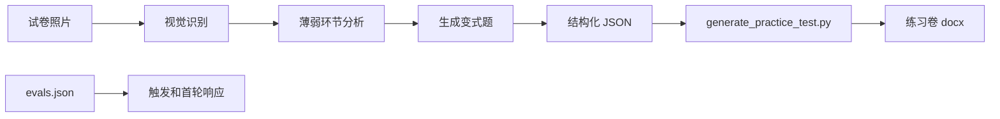

# L13：wrong-answer-review 如何把 evals 转成练习

## 学习目标

读完本节，你要能解释：

1. `wrong-answer-review/SKILL.md` 定义了怎样的教育业务流程。
2. `evals.json` 验证的是触发与初始响应，不是完整 Word 生成。
3. `generate_practice_test.py` 只负责把结构化 JSON 渲染成 `.docx`。
4. 为什么视觉识别、变式题质量和脚本排版必须分开验证。

本节精读 [wrong-answer-review/SKILL.md](../../../../templates/skills/wrong-answer-review/SKILL.md#L1) 、 [evals/evals.json](../../../../templates/skills/wrong-answer-review/evals/evals.json#L1) 和 [scripts/generate_practice_test.py](../../../../templates/skills/wrong-answer-review/scripts/generate_practice_test.py#L1) 。

## 一个教育业务 Skill 的完整意图

`wrong-answer-review` 的 frontmatter 把名称写成“错题梳理与强化练习”，code 为 `wrong-answer-review`，type 为 `SIMPLE`。它读取试卷图片，写出 Word 文档，前置依赖是 `python-docx`。对应源码见 [wrong-answer-review/SKILL.md](../../../../templates/skills/wrong-answer-review/SKILL.md#L1) 。

它的业务目标不是“识别图片”这么窄，而是从试卷照片中识别错题，分析薄弱环节，生成包含原错题和同类型变式题的练习卷。触发场景包括错题整理、考试复习、薄弱环节分析、错题卷、练习卷等。

这说明它是一个端到端业务 Skill：输入是照片和学生信息，中间经过视觉分析、分类、薄弱点分析、变式题生成，最后才交给脚本排版。

## `SKILL.md` 的六步流程

源码把流程拆成六步：

| 步骤 | 职责 | 输出 |
| --- | --- | --- |
| Step 1 | 确认年级、学科、教材版本 | 学生信息 |
| Step 2 | 识别试卷内容和红色批改标记 | 题目列表与错题标注 |
| Step 3 | 按题型分类 | 题型统计 |
| Step 4 | 分析薄弱环节 | weakness_analysis |
| Step 5 | 生成变式练习题 | variant_questions |
| Step 6 | 调用脚本生成 Word | `.docx` 文档 |

对应源码见 [wrong-answer-review/SKILL.md](../../../../templates/skills/wrong-answer-review/SKILL.md#L37) 。

这里最容易误读的是 Step 6。脚本生成 Word 之前，Agent 必须先整理 JSON 数据，包括 `student_info`、`weakness_analysis`、`wrong_questions`、`variant_questions`。脚本并不会自动从照片里找红叉，也不会自动创造高质量变式题；这些都在脚本调用之前完成。

## evals 验证触发，不验证全链路

`evals.json` 包含 3 个评测用例，prompt 分别覆盖高一数学、初二物理、初三英语错题整理场景。每个用例的 expectations 都集中在技能是否正确触发、是否询问或确认年级学科、是否说明会识别错题、生成 Word、包含变式练习题。对应源码见 [evals.json](../../../../templates/skills/wrong-answer-review/evals/evals.json#L1) 。

这类 eval 的价值是验证“用户说到错题整理时，系统应该进入这个 Skill，并给出合理初始响应”。它不能证明：

1. 视觉识别真的读出了每道题。
2. 红色批改标记识别准确。
3. 知识点分析没有学科错误。
4. 变式题答案正确。
5. Word 文档排版实际可打开、可打印。

因此，evals 是入口证据，不是完整质量证据。

## 脚本只做文档渲染

`generate_practice_test.py` 导入 `python-docx`，如果缺少依赖就提示安装并退出。它定义标题页、薄弱环节分析、原试卷错题、变式练习、参考答案与解析等渲染函数。最终 `create_practice_test` 从 JSON 中读取对应字段，依次添加到 Word 文档，再保存输出路径。对应源码见 [generate_practice_test.py](../../../../templates/skills/wrong-answer-review/scripts/generate_practice_test.py#L20) 和 [generate_practice_test.py](../../../../templates/skills/wrong-answer-review/scripts/generate_practice_test.py#L426) 。

脚本的 CLI 参数只有 `--data` 和 `--output`。它处理两类错误：找不到数据文件和 JSON 格式不正确。对应源码见 [generate_practice_test.py](../../../../templates/skills/wrong-answer-review/scripts/generate_practice_test.py#L482) 。

这个边界非常清楚：脚本是“结构化数据到 Word”的渲染器，不是“照片到练习卷”的完整智能系统。

## 以“小林的数学错题”为例

小林上传高一数学期中试卷照片，说希望整理错题。正确流程是先确认年级和学科，读取照片，识别红色批改标记，再把错题按题型和知识点分类。如果发现函数求值和等差数列求和错误较多，再生成同类型变式题。

只有当这些结构化数据准备好后，才调用 `generate_practice_test.py --data wrong_answer_data.json --output 练习卷.docx`。如果 JSON 里没有 `variant_questions`，脚本不会神奇补题；它只会生成“未生成变式练习题”或空答案部分。

## 测试证据与缺口

本节完成的是静态阅读：已核对 Skill 流程、evals 期望、脚本导入、文档结构、CLI 参数和错误处理。尚未执行脚本，也未验证生成的 `.docx` 在 Word 中打开效果。

后续验证应分层进行：

1. 触发层：用 evals 的 3 个 prompt 验证 Skill 被正确选择。
2. 数据层：构造最小 JSON，包含学生信息、错题和变式题。
3. 脚本层：运行 `generate_practice_test.py` 生成 `.docx`。
4. 视觉层：实际打开或渲染 Word，检查分页、表格和答案区。
5. 学科层：人工或题库规则校验变式题答案正确性。

## 本节小结

`wrong-answer-review` 展示了业务 Skill 中“智能分析”和“文件生成”的分工。`SKILL.md` 定义完整教育流程，`evals.json` 验证触发与首轮响应，`generate_practice_test.py` 渲染结构化 JSON。读懂这个分工，才能避免把脚本能力夸大成全链路能力。

## 口头验收

请回答：为什么 `evals.json` 里的通过不能证明 Word 练习卷已经正确生成？为什么 `generate_practice_test.py` 不能单独完成错题识别？
