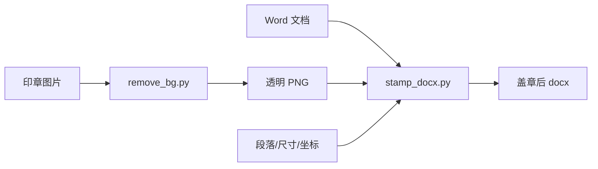

# L14：seal-stamper 这类工具型 Skill 的文件副作用

## 学习目标

读完本节，你要能解释：

1. `seal-stamper` 为什么是典型的文件副作用 Skill。
2. 去背景脚本和盖章脚本分别改变什么文件。
3. OOXML 浮动图片的关键参数如何影响盖章结果。
4. 为什么参数类型、依赖安装和输出文件验证在工具型 Skill 中特别重要。

本节精读 [seal-stamper/SKILL.md](../../../../templates/skills/seal-stamper/SKILL.md#L1) 、 [remove_bg.py](../../../../templates/skills/seal-stamper/scripts/remove_bg.py#L1) 和 [stamp_docx.py](../../../../templates/skills/seal-stamper/scripts/stamp_docx.py#L1) 。

## 文件副作用 Skill 的入口信号

`seal-stamper` 的 frontmatter 声明 code 为 `seal-stamper`，type 为 `SIMPLE`，读取图片文件和 Word 文档，写出 Word 文档，前置依赖包括 `python-docx`、`Pillow`、`lxml`、`rembg`。对应源码见 [seal-stamper/SKILL.md](../../../../templates/skills/seal-stamper/SKILL.md#L1) 。

它的目标是把公司印章图片去除背景后，以“浮于文字上方”的布局嵌入到 Word 文档指定位置。这里的副作用非常明确：它会生成透明 PNG，也会生成新的 `.docx`。因此，这类 Skill 的教程必须特别强调输入文件、输出文件、参数类型和失败后的文件状态。

## 去背景是两步法

`SKILL.md` 说明去背景分两步：先用 `rembg` 基于 U2-Net 去除外围背景，再用像素颜色分析清除印章内部白色或灰色残留。对应源码见 [seal-stamper/SKILL.md](../../../../templates/skills/seal-stamper/SKILL.md#L39) 。

`remove_bg.py` 中，`remove_bg_rembg` 先尝试导入 `rembg` 和 `PIL.Image`，调用 `remove(input_image)`，然后转成 RGBA 并调用 `clean_inner_white`。如果 `rembg` 未安装或处理失败，会返回 False，auto 模式再回退到 Pillow 阈值分割。对应源码见 [remove_bg.py](../../../../templates/skills/seal-stamper/scripts/remove_bg.py#L61) 。

`clean_inner_white` 会把白色或偏灰像素改成透明。判断函数 `_is_whiteish` 使用 `white_threshold` 和 `gray_threshold`。阈值越低，清理越激进；阈值越高，越保守。对应源码见 [remove_bg.py](../../../../templates/skills/seal-stamper/scripts/remove_bg.py#L17) 。

## 盖章不是普通插图，而是 OOXML anchor

`python-docx` 默认插入的是内联图片。`stamp_docx.py` 为了实现浮动盖章，先临时插入内联图片注册资源，再从 XML 中取出 `r:embed` 关系 ID，删除临时 run，然后构造 `<wp:anchor>` 插入段落。对应源码见 [stamp_docx.py](../../../../templates/skills/seal-stamper/scripts/stamp_docx.py#L119) 。

`_build_anchor_xml` 中的关键字段包括：

| 字段 | 作用 |
| --- | --- |
| `behindDoc` | 是否衬于文字下方，`0` 表示浮于上方 |
| `relativeHeight` | 层叠顺序 |
| `allowOverlap` | 允许与文字重叠 |
| `positionH` | 水平方向相对页面定位 |
| `positionV` | 垂直方向相对段落定位 |
| `extent` | 图片宽高 |

对应源码见 [stamp_docx.py](../../../../templates/skills/seal-stamper/scripts/stamp_docx.py#L60) 。

## 自动检测与手动参数

盖章脚本会扫描段落，寻找“（盖章）”、“盖章处”、“甲方盖章”、“乙方盖章”等关键词。找到后，默认把印章放在右侧，距离右边距约 20mm，垂直偏移 5mm。对应源码见 [stamp_docx.py](../../../../templates/skills/seal-stamper/scripts/stamp_docx.py#L23) 和 [stamp_docx.py](../../../../templates/skills/seal-stamper/scripts/stamp_docx.py#L208) 。

如果禁用自动检测或指定段落，则可以通过 `--paragraph`、`--size`、`--pos-x`、`--pos-y` 控制位置与尺寸。`SKILL.md` 特别强调参数类型：`--paragraph` 必须是整数，`--size`、`--pos-x`、`--pos-y` 必须是浮点数，不能把文字传给数字参数。对应源码见 [seal-stamper/SKILL.md](../../../../templates/skills/seal-stamper/SKILL.md#L198) 。

这就是工具型 Skill 的典型风险：自然语言意图必须被转成严格 CLI 参数；参数错了，脚本会失败，或者更糟糕的是盖在错误位置。

## 以“小林的合同盖章”为例

小林上传 `合同.docx` 和 `公司章.jpg`，要求盖在“甲方（盖章）”附近。正确流程是先确认两个文件存在，再调用去背景脚本生成透明 PNG，然后让盖章脚本自动检测包含“盖章”的段落。如果自动检测不到，应提示小林指定段落或坐标，而不是随机盖在文档末尾。

如果小林说“章大一点，放到右下角”，Agent 必须把这句话转成数值参数，例如尺寸毫米、页面水平位置、段落垂直偏移。没有明确数值时，应先确认或采用可解释默认值，并在结果中说明。

## 测试证据与缺口

本节完成的是静态阅读：已核对输入输出、依赖、去背景两步法、OOXML anchor、自动检测关键词、CLI 参数和错误处理。尚未安装依赖，也未对真实图片和 Word 文件执行脚本。

后续验证应覆盖：

1. 输入图片不存在时 `remove_bg.py` 返回明确错误。
2. `rembg` 不可用时 auto 模式能回退 Pillow。
3. Word 中没有盖章关键词时 `stamp_docx.py` 退出并提示手动指定。
4. 指定 `--paragraph` 和 `--size` 后输出 `.docx` 可打开。
5. 渲染或人工检查印章是否浮于文字上方，而不是内联挤开排版。

## 本节小结

`seal-stamper` 展示了工具型业务 Skill 的典型结构：`SKILL.md` 说明业务流程和参数，脚本负责具体文件处理，输出文件必须验证。文件副作用越明显，越不能只看“脚本运行成功”，还要检查输出位置、透明效果、排版层级和参数是否来自可靠理解。

## 口头验收

请说明：为什么盖章 Skill 需要同时验证透明 PNG 和最终 `.docx`？为什么 `--paragraph` 这类参数不能让 Agent 随便从自然语言里猜？
