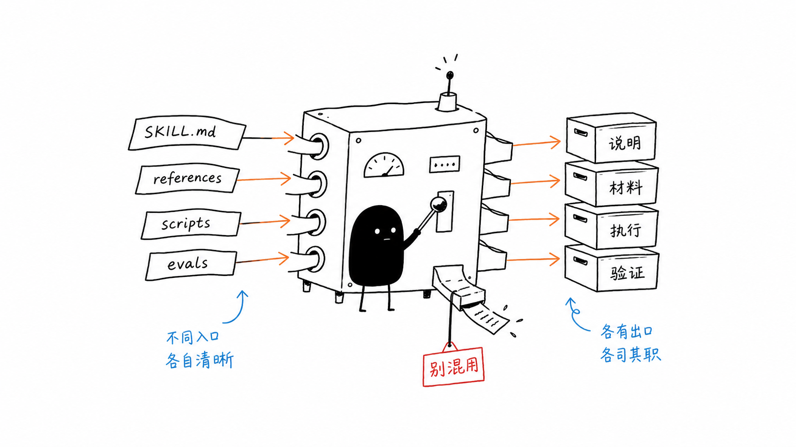
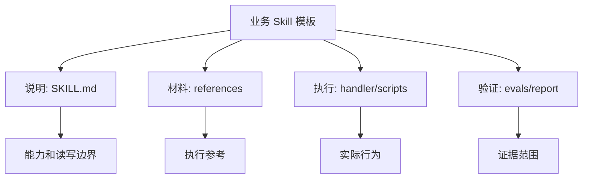

# L15：业务 Skill 模板工作坊

## 学习目标

这是第二单元的小结课。读完本节，你要能把业务 Skill 模板拆成四类材料，并能判断每类材料能证明什么、不能证明什么。

本单元覆盖的主要源码包括：

| 课号 | 主要对象 | 学到的边界 |
| --- | --- | --- |
| L08 | `info-query/SKILL.md`、`task-manager/SKILL.md` | 说明文件声明读写边界和触发意图 |
| L09 | 两个 `handler.ts` | handler 决定实际解析、分支和工具调用 |
| L10 | `project-initialization/SKILL.md` 与 references | 对话型 Skill 需要阶段、进度和恢复协议 |
| L11 | `interview.py` | 脚本能表达状态机，但抽取逻辑可能很简化 |
| L12 | `solution-design/SKILL.md` 与 collaboration types | 方案必须来自业务模型，并有协作语义和 I/O 契约 |
| L13 | `wrong-answer-review` 的 evals 与脚本 | evals 验证触发，脚本渲染结构化数据 |
| L14 | `seal-stamper` 的文件处理脚本 | 文件副作用需要检查输入、输出、参数和视觉结果 |

## 四类材料的统一读法

业务 Skill 模板常见四类材料：

| 材料 | 典型文件 | 负责回答的问题 | 不能证明的事情 |
| --- | --- | --- | --- |
| 说明 | `SKILL.md` | 什么时候触发、读什么、写什么、按什么步骤执行 | 实现一定正确 |
| 材料 | `references/*.md` | 执行时可读取哪些提示、示例、枚举或规则 | 运行时一定使用了这些材料 |
| 执行 | `handler.ts`、`scripts/*.py` | 输入如何解析、工具如何调用、文件如何生成 | 上游智能分析一定可靠 |
| 验证 | `evals.json`、报告、人工检查 | 哪些行为已有证据 | 没覆盖的路径也可靠 |

这四类材料像四个出口。把 `evals.json` 当成执行脚本，会误判验证范围；把 `scripts/*.py` 当成完整智能系统，会夸大脚本能力；把 references 当成业务数据，会污染项目模型；把 `SKILL.md` 当成运行证据，则会忽略实现缺口。

## 一张排查表

当你拿到一个新的业务 Skill 模板，不要从“它看起来能做什么”开始，而要按下面顺序排查：

1. 读 frontmatter：确认 `name`、`code`、`type`、`reads`、`writes`、`dependencies`。
2. 读触发场景：确认哪些用户表达应该进入这个 Skill。
3. 读执行步骤：确认它是单步工具、对话流程、方案规划，还是文件处理。
4. 读 references：确认它使用哪些外部材料、枚举表、示例或提示词。
5. 读 handler/scripts：确认自然语言怎样被转成工具调用或 CLI 参数。
6. 读 evals/report：确认已有证据覆盖了入口、分支、错误还是输出。
7. 写剩余风险：明确哪些能力只是声明，哪些能力已经有执行证据。

## 本单元的关键误区

第一，把 `SKILL.md` 当成代码。它定义能力边界，但不保证 handler 覆盖全部自然语言。

第二，把 handler 当成全部业务。handler 能执行分支和工具调用，但不一定包含所有业务规则；许多规则可能在 references、业务模型或下层工具里。

第三，把脚本当成端到端智能。`generate_practice_test.py` 只渲染 Word，`remove_bg.py` 只处理图片，`stamp_docx.py` 只操作文档 XML。它们不能替代上游的视觉识别、题目生成或位置确认。

第四，把 evals 当成完整验收。`wrong-answer-review/evals.json` 主要验证触发与首轮响应，不证明照片识别和 Word 排版。

第五，忽略副作用。只读查询型 Skill 的风险和写文件、改任务、盖章生成文档的风险不同。写入越多，验证越要落到真实数据或真实文件。

## 综合练习：给小林设计一次业务 Skill 审查

背景：小林要做“毕业旅行策划”项目。他有三个 Skill 候选：

1. 查询预算、成员和任务状态。
2. 创建和分配旅行筹备任务。
3. 根据行程表生成 Word 版出行通知。

请按本单元方法审查：

| 审查问题 | 查询 Skill | 任务 Skill | 文档生成 Skill |
| --- | --- | --- | --- |
| `reads` 应该有什么 | 预算、成员、任务 | 项目、任务、成员 | 行程、成员、模板 |
| `writes` 应该有什么 | 空数组 | 任务、项目状态 | Word 文档 |
| 是否需要 handler | 需要，解析查询条件 | 需要，解析创建和分配动作 | 可选，也可能主要靠脚本 |
| 是否需要脚本 | 不一定 | 不一定 | 通常需要 |
| 最关键验证 | 不改数据 | 写入正确任务 | 输出文件可打开、排版正确 |

完成后，再为每个 Skill 写一句剩余风险。例如：查询 Skill 可能无法识别昵称；任务 Skill 可能把负责人当成任务标题；文档生成 Skill 可能排版成功但内容事实错误。

## 测试证据与缺口

本单元完成的是源码级静态阅读和教程整理。已覆盖 `info-query`、`task-manager`、`project-initialization`、`solution-design`、`wrong-answer-review`、`seal-stamper` 的说明文件、部分 references、handler、evals 和脚本。

尚未完成的运行时证据包括：

1. 未执行 TypeScript handler 单元测试。
2. 未启动 OriginOS 会话验证 Skill 选择。
3. 未运行 `interview.py` 到完整 Review/Complete。
4. 未生成真实错题练习卷 `.docx`。
5. 未用真实印章和合同验证透明效果、浮动层级和坐标。

这些缺口不影响本单元作为源码阅读教程成立，但会影响“模板已经生产可用”的结论。因此教程中只能说“源码显示它应当如何工作”，不能说“运行时已经全部通过”。

## 单元小结

业务 Skill 模板的核心不是某一个文件，而是一组材料的配合：`SKILL.md` 给边界，references 给上下文，handler/scripts 给执行路径，evals/report 给证据范围。读者只要能稳定地区分这四类材料，就能避免大多数误读：不把说明当实现，不把脚本当智能，不把评测当全链路验收，也不把带副作用的 Skill 当普通问答。

## 口头验收

请用两分钟讲清楚：

1. `info-query` 和 `task-manager` 的读写边界有什么不同。
2. `project-initialization` 为什么要维护进度文件。
3. `solution-design` 为什么必须从业务模型推导 Agent 和 Skill。
4. `wrong-answer-review` 的 evals 能证明什么、不能证明什么。
5. `seal-stamper` 为什么必须检查最终 Word 文件，而不只是脚本退出码。
