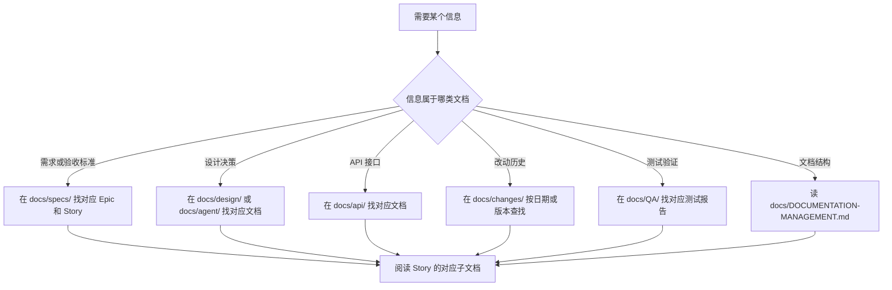

# 单元总览与复盘一：782 个非源码文件如何被读懂而非漏掉（M01—M07）

小林克隆仓库后运行 `find docs -type f | wc -l`，终端返回 674。她再数 `resources/`、`models/`、`scripts/`、`data/` 等目录，总共 782 个文件。这些文件没有 `.ts` 或 `.tsx` 后缀，IDE 不会帮着跳转定义，`git log` 里也很少出现它们的名字。

它们是"文档"。但这个词掩盖了太多差异：有的文档是架构规约，违反就要重构；有的是运行时数据的样本，改了会影响测试；有的是 Story 验收的测试报告，缺失意味着功能可能没有证据；有的是发布脚本的补丁，位置不对会破坏 CI 链路。

本单元要解决一个问题：读者如何把 782 个非源码文件按其责任和阅读方式分类，并在需要某个信息时知道该去哪里找、怎么读、读完能证明什么。


## 0. 本页先读什么

如果只记住一句话，记住这一句：

> 非源码文件不是"杂项"；每种文档都有其责任边界、修改约束和可证明范围，读错就等于没读。

这句话拆开看，有三层含义：

1. 一份文档的存在不等于它描述的功能已经实现。
2. 一份测试报告的通过不等于它覆盖了全部失败路径。
3. 一个数据样本的格式不等于运行时真实写入的格式——它可能是模板、历史遗留或手动构造的。

阅读本页可以按下面的顺序：

| 阅读阶段 | 重点问题 | 对应章节 |
| --- | --- | --- |
| 建立总图 | 782 个文件按什么维度分类？ | 第 1、2 节 |
| 分清责任 | 不同文档类型的责任边界和阅读方式有何不同？ | 第 3 节 |
| 对回课程 | 七节课分别解决哪类文档的阅读问题？ | 第 4 节 |
| 查证源码 | 哪些文档已经在本单元直接精读，哪些留到后面？ | 第 5 节 |
| 练习定位 | 需要某个信息时，按什么路径找到正确的文档？ | 第 6—9 节 |

## 1. 782 个文件不是一类东西

Part M 覆盖的 782 个文件分布在以下目录：

| 目录 | 文件数 | 主要内容 | 阅读目的 |
| --- | --- | --- | --- |
| `docs/specs/` | 524 | Epic 和 Story 规格文档 | 理解需求定义、架构决策和验收标准 |
| `docs/changes/` | 34 | 变更日志（含 32 个版本归档） | 追踪系统何时做了什么改动 |
| `docs/QA/` | 29 | 测试报告和质量保障文档 | 读取已验证的功能和测试覆盖范围 |
| `docs/test-cases/` | 8 | 测试用例 | 获取可执行测试步骤和预期结果 |
| `docs/index.md` | 1 | 文档导航索引 | 找到任何文档的入口 |
| `docs/DOCUMENTATION-MANAGEMENT.md` | 1 | 文档协作管理规范 | 理解文档如何被组织和管理 |
| `docs/templates/` | 6 | Story 文档模板 | 理解文档创建的约束和结构 |
| `docs/assets/` | 7 | 文档配套图片 | 可视化参考（架构图、流程图） |
| `docs/diagrams/` | 4 | HTML 架构图 | 交互式架构全景图 |
| `docs/` 其他子目录 | ~60 | 产品文档、设计文档、API 文档等 | 按领域查阅特定设计决策 |
| `resources/` | 7 | 静态资源（图标、模型配置等） | 理解应用运行所需的非代码资产 |
| `models/` | 2 | 本地模型文件 | 理解本地 AI 能力的来源 |
| `scripts/` | 10 | 构建和发布脚本 | 理解 CI/CD 和自动化流程 |
| `patches/` | 2 | 第三方包补丁 | 理解对依赖的定制修改 |
| `electron/` | 9 | Electron 根配置 | 桌面应用的构建和签名配置 |
| `.github/` | 1 | GitHub Actions 工作流 | CI/CD 发布流程 |
| `tests/` | 6 | 跨包测试 | 端到端集成验证 |
| `packages/web/data/` | 61 | Web 版运行时数据样本 | 理解运行时数据结构和默认值 |
| `packages/desktop/data/` | 10 | Desktop 版运行时数据样本 | 理解桌面版数据结构 |

这些数字来自对仓库的文件系统统计。它们的一个共同特点是：**大部分文件不参与 TypeScript 编译，也不被 IDE 的类型检查覆盖**。因此，它们的内容是否与代码同步、是否反映系统真实行为，只能靠阅读来确认。

## 2. 五条轨道与五种阅读方式

Part M 对应课程轨道 T19—T23，每条轨道代表一种不同的阅读方式：

| 轨道 | 主题 | 核心阅读动作 | 代表文件 |
| --- | --- | --- | --- |
| T19 | 文档 | 读结构、读模板约束、读文档间的引用关系 | `docs/index.md`、`docs/DOCUMENTATION-MANAGEMENT.md`、`docs/templates/` |
| T20 | 构建 | 读脚本入口、读 CI 链路、读构建产物映射 | `scripts/`、`.github/workflows/`、`electron/` |
| T21 | 数据 | 读数据格式约束、读字段含义、读数据与代码的写入/读取对齐 | `packages/web/data/`、`packages/desktop/data/` |
| T22 | 资源 | 读资源引用路径、读消费者、读资源的加载时机 | `resources/`、`models/`、`docs/assets/`、`docs/diagrams/` |
| T23 | 测试 | 读测试策略、读覆盖率声明、读测试与生产代码的对齐 | `docs/QA/`、`docs/test-cases/`、`tests/` |

本单元（Unit 1）覆盖 T19。它聚焦于文档的组织方式、责任边界和阅读方法。


每条轨道的阅读动作不同，但有一个共同原则：**只读文件名不等于读到了内容；只读到了标题不等于理解了约束**。

## 3. 五组最容易误读的文档边界

### 3.1 索引与规范：`index.md` 不是规范，`DOCUMENTATION-MANAGEMENT.md` 不是索引

| 文件 | 它做什么 | 它不能做什么 |
| --- | --- | --- |
| [docs/index.md](../../../../docs/index.md) | 列出所有 Epic 和文档的入口位置 | 替代阅读每份文档的正文 |
| [docs/DOCUMENTATION-MANAGEMENT.md](../../../../docs/DOCUMENTATION-MANAGEMENT.md) | 定义文档如何被组织、命名和协作 | 列出每一份具体文档的位置 |

初学者常犯的错误是：在 `index.md` 中看到某份文档的链接，就认为自己"已经知道"了那份文档的内容。索引只解决"在哪里"的问题，不解决"写什么"和"为什么这样写"的问题。

反过来，`DOCUMENTATION-MANAGEMENT.md` 定义了 Story 文档必须包含六份子文档（README、需求、交互、架构、开发、测试），但它不会告诉你 Story 9.1 的架构设计具体写了什么。

### 3.2 Story 概览与 Story 正文：README.md 不是需求

每个 Story 目录下都有一份 [README.md](../../../../docs/specs/epic-9/README.md)，它是 Story 的状态看板，包含标题、团队、时间线、进度和链接。但需求细节在 [requirements.md](../../../../docs/templates/story-spec-template/requirements.md)，架构决策在 [architecture.md](../../../../docs/templates/story-spec-template/architecture.md)，测试策略在 [testing.md](../../../../docs/templates/story-spec-template/testing.md)。

| 子文档 | 它负责什么 | 常见误读 |
| --- | --- | --- |
| `README.md` | 状态看板和导航 | 当成需求的全部 |
| `requirements.md` | 功能需求和验收标准 | 只看 AC 列表，忽略依赖和优先级 |
| `interaction.md` | 用户流程和 UI 规范 | 把流程图当成架构图 |
| `architecture.md` | 技术选型和模块设计 | 跳过 AGENTS.md 符合性声明 |
| `implementation.md` | 实施步骤和代码位置 | 当成可直接执行的脚本 |
| `testing.md` | 测试策略和覆盖率 | 把覆盖率目标当成实际覆盖率 |

### 3.3 变更记录与版本归档：changelog.md 不是实现文档

[docs/changes/changelog.md](../../../../docs/changes/changelog.md) 是一份按时间倒序排列的变更流水。每条记录包含日期、类型、影响模块和摘要。但它不是实现文档——它告诉你"改了什么"，不告诉你"为什么要这样改"和"改完之后系统行为有什么变化"。

| 阅读目标 | 应该读什么 | changelog 能提供什么 |
| --- | --- | --- |
| 理解某个功能的实现原因 | Story 的 requirements.md + architecture.md | 改动的时间点和影响模块 |
| 追踪某个 bug 的修复过程 | 对应版本的 changelog + git log | 修复提交的日期和模块 |
| 理解版本间的差异 | `docs/changes/releases/v{version}/changelog.md` | 同版本内所有变更的聚合 |

### 3.4 QA 报告与测试用例：通过 ≠ 全覆盖

[docs/QA/](../../../../docs/QA/) 中的测试报告记录了某次验证的结果：通过了几项、失败了几项、覆盖了哪些场景。但一份报告的"通过"只意味着**被测的那些场景**表现正确，不意味着所有场景都被测试了。

| 文档类型 | 它能证明什么 | 它不能证明什么 |
| --- | --- | --- |
| QA 测试报告 | 被列出的场景在报告时刻的行为 | 未被列出的场景不存在问题 |
| 测试计划 | 将要测试哪些场景 | 测试已经全部通过 |
| E2E 测试报告 | 关键用户路径的端到端验证 | 非关键路径和边界条件 |

### 3.5 模板与实际文档：模板是约束，不是内容

[docs/templates/story-spec-template/](../../../../docs/templates/story-spec-template/) 中的六份文件是 Story 文档的模板。它们定义了每个子文档必须包含哪些章节、字段和格式。但模板中的占位符（如 `{Story Title}`、`{Date}`）不是真实内容——阅读模板是为了理解文档结构，不是为了读取某个具体 Story 的信息。

| 阅读动作 | 应该读什么 | 不应该期望什么 |
| --- | --- | --- |
| 理解文档必须包含什么 | 模板文件 | 模板中有真实需求内容 |
| 读取某个 Story 的需求 | `docs/specs/epic-{N}/story-{N.M}/requirements.md` | 模板中的 `{Story Title}` |
| 判断一份文档是否完整 | 对照模板检查章节是否齐全 | 模板自动检查文档完整性 |

## 4. 七节课连成一条因果链

M01—M07 不是七个孤立的文档阅读指南。它们按"从索引到验证"的顺序，一层一层补上文档阅读的判断能力。

| 课次 | 本课解决的判断问题 | 核心文档锚点 | 学完后的判断能力 |
| --- | --- | --- | --- |
| M01 | 怎样从索引找到任何一份文档，文档管理规范又规定了什么 | [docs/index.md](../../../../docs/index.md)、[docs/DOCUMENTATION-MANAGEMENT.md](../../../../docs/DOCUMENTATION-MANAGEMENT.md) | 能用索引定位文档，能判断文档组织是否符合规范 |
| M02 | 一份 Story 由哪六份子文档组成，每份子文档必须包含什么 | [docs/templates/story-spec-template/](../../../../docs/templates/story-spec-template/) | 能判断一份 Story 文档是否完整，能区分概览、需求、设计、实现和测试 |
| M03 | 设计文档（产品、架构、API、Agent）如何阅读，每类文档的可信度如何 | `docs/product/`、`docs/design/`、`docs/api/`、`docs/agent/` | 能区分设计意图与实现现状，能识别过时设计文档 |
| M04 | 变更记录如何阅读，版本归档与流水日志的区别是什么 | [docs/changes/changelog.md](../../../../docs/changes/changelog.md)、`docs/changes/releases/` | 能用变更记录定位改动时间和模块，能区分版本间的差异 |
| M05 | QA 文档和测试报告如何阅读，通过和全覆盖有何不同 | [docs/QA/](../../../../docs/QA/)、[docs/test-cases/](../../../../docs/test-cases/) | 能判断测试覆盖范围，能区分测试计划和测试结果 |
| M06 | 524 份 Story 规格文档如何按 Epic 组织，状态标记意味着什么 | `docs/specs/epic-{N}/` 各目录 | 能按 Epic 定位 Story，能理解状态标记的可信度 |
| M07 | 把文档阅读能力汇总成可操作的定位和验证方法 | 综合以上所有文档 | 能在遇到问题时快速找到相关文档并判断其可信度 |

这条链的停止边界也要清楚。M01—M07 还没有详细讲构建脚本（T20）、数据格式（T21）、资源引用（T22）和测试对齐（T23）。那些问题进入后续单元再展开。

当前单元先把文档阅读的判断框架打牢。框架清楚以后，再读具体的设计文档、变更记录或测试报告，读者才不会把"文档写了"等同于"系统做到了"。

## 5. 文档覆盖台账

文档台账的作用，与源码覆盖台账一样：防止"文档提到了"被误写成"内容已经精读"。阅读这张表时，只看三件事：哪个文档已直接精读，证据来自哪里，还有哪些边界没有被证明。

| 课次 | 已直接精读的文档 | 配对验证 | 本单元只证明什么 |
| --- | --- | --- | --- |
| M01 | [docs/index.md](../../../../docs/index.md)、[docs/DOCUMENTATION-MANAGEMENT.md](../../../../docs/DOCUMENTATION-MANAGEMENT.md) | 对照目录结构确认索引完整性 | 索引覆盖范围、文档管理规范的六文档约束 |
| M02 | [docs/templates/story-spec-template/](../../../../docs/templates/story-spec-template/) 六份模板 | 对照 `docs/specs/epic-9/story-9.1/` 实际文档验证模板匹配 | Story 六文档结构、模板章节约束、占位符含义 |
| M03 | `docs/product/`、`docs/design/`、`docs/api/`、`docs/agent/` 中关键文档的章节结构 | 对照代码仓库当前实现验证设计一致性 | 设计文档的分类、章节责任、可信度判断 |
| M04 | [docs/changes/changelog.md](../../../../docs/changes/changelog.md) 前 100 行、`docs/changes/releases/` 目录结构 | 对照 git log 验证变更记录与提交的对应 | 变更记录格式、版本归档结构、日志与归档的关系 |
| M05 | [docs/QA/](../../../../docs/QA/) 中代表性测试报告 | 对照对应 Story 的 testing.md 验证测试计划与报告对齐 | QA 报告结构、覆盖率声明含义、通过≠全覆盖 |
| M06 | `docs/specs/` 的目录结构、各 Epic 的 README.md | 对照 index.md 中的 Epic 列表验证一致性 | Story 按 Epic 组织的结构、状态标记的可信度边界 |
| M07 | 综合以上所有文档 | 综合以上所有验证 | 文档定位和可信度判断的整体能力 |

本单元相邻但尚未精读的文档也要明说。`docs/guides/`（构建产物说明和运行时日志）属于 T20 构建轨道；`docs/diagrams/`（HTML 架构图）属于 T22 资源轨道；`packages/web/data/` 和 `packages/desktop/data/` 的字段级精读属于 T21 数据轨道；`tests/` 下的跨包测试属于 T23 测试轨道。`docs/cognitive/` 和 `docs/ux/` 中与认知系统和 UX 规范相关的设计文档，其内容分别在 Part F 和 Part J 中与对应源码一起精读，不在本单元单独展开。

这不是遗漏，而是边界管理。一个单元必须知道自己讲到哪里，也必须知道哪里还没有讲。

## 6. 信息定位：先确定文档类型，再打开具体文件

当小林想了解"多 Agent 协作运行时的会话事件存储是怎么设计的"时，她不能直接在 `docs/` 里全局搜索——那会返回大量不相关的结果。更稳的做法是先确定文档类型，再按类型找到具体文件。



这套定位流程可以变成口诀：

1. 先问"这是哪类信息"，再打开文件。
2. 需求找 `specs/`，设计找 `design/` 或 `agent/`，API 找 `api/`，改动找 `changes/`，验证找 `QA/`。
3. 找到文件后先看结构，再看内容，最后判断可信度。

## 7. 纸面定位实验

下面这个实验不需要打开编辑器。它的目标是让读者用一组信息需求，练习定位正确的文档。

```text
需求 1：了解 Pi Agent 会话持久化 API 的接口定义
需求 2：了解 Epic OS Story OS.7 的测试结果
需求 3：了解 v0.1.47 版本做了哪些改动
需求 4：了解创建一份新 Story 文档时需要包含哪些子文档
需求 5：了解 RoleAgent 的生命周期架构设计
```

合格定位应包含下面五个判断：

| 需求 | 应打开的文档 | 打开后先看什么 |
| --- | --- | --- |
| Pi Agent 会话持久化 API | [docs/api/agent-session-api.md](../../../../docs/api/agent-session-api.md) | API 端点列表和请求/响应格式 |
| Epic OS Story OS.7 测试结果 | [docs/QA/OS.7-AgentHost-Test-Report.md](../../../../docs/QA/OS.7-AgentHost-Test-Report.md) | 测试通过率和覆盖场景 |
| v0.1.47 改动 | [docs/changes/releases/v0.1.47/changelog.md](../../../../docs/changes/releases/v0.1.47/changelog.md) | 变更类型和影响模块 |
| 新 Story 文档结构 | [docs/DOCUMENTATION-MANAGEMENT.md](../../../../docs/DOCUMENTATION-MANAGEMENT.md) + [docs/templates/story-spec-template/](../../../../docs/templates/story-spec-template/) | 六文档约束和模板章节 |
| RoleAgent 生命周期 | [docs/agent/agent-lifecycle-design.md](../../../../docs/agent/agent-lifecycle-design.md) | 生命周期阶段和状态转换 |

如果能把每一行都说清楚，并且能补一句"这份文档不能告诉我什么"，就说明本单元的核心定位能力已经建立。

## 8. 文档可信度判断

读文档时必须区分三类信息：

| 可信度等级 | 含义 | 判断方法 |
| --- | --- | --- |
| 高可信 | 文档与代码当前实现一致 | 文档中有明确的源码引用，且引用的行号仍有效 |
| 中可信 | 文档描述的设计意图成立，但实现可能有差异 | 文档的日期较新、状态标记为已完成，但缺少代码级验证 |
| 低可信 | 文档可能过时或仅代表规划 | 文档状态为 Planning，或日期早于最近的重大重构 |

一个常见的误判是：把 Planning 状态的文档当成已实现的功能。`docs/index.md` 中标注为 📋 的 Epic 和 Story，意味着"计划做"，不意味着"已经做"。

另一个常见误判是：把 QA 报告的"通过"当成"没有 bug"。QA 报告只证明"被测场景通过"，不证明"所有场景都测试了"。

## 9. 口头验收

学完 M01—M07 后，不看正文也应能回答下面七个问题：

1. 为什么 `docs/index.md` 不能替代阅读具体文档的正文？
2. 一份 Story 文档由哪六份子文档组成，每份子文档分别负责什么？
3. `docs/changes/changelog.md` 和 `docs/changes/releases/v{version}/changelog.md` 的区别是什么？
4. 为什么 QA 报告的"通过"不等于"功能没有 bug"？
5. 如何从"需要某个信息"出发，定位到正确的文档？
6. 如何判断一份设计文档的可信度？
7. 为什么文档状态为 Planning 时不应该把其内容当成已实现的功能？

合格回答不要求背诵文档路径，但必须能说出文档类型、责任边界和可信度判断方法。能说清"这份文档不能告诉我什么"，比只说清"它在哪里"更重要。

## 10. 进入下一单元

M01—M07 建立的是文档阅读的基本地图。下一组课程会继续追踪非源码文件的另一类：构建脚本、CI 配置和发布工具链。那些文件的阅读方式与文档不同——它们的"正确性"不取决于内容是否描述了系统，而取决于它们是否在 CI 中成功执行。

因此，本单元的结论可以压缩成一句话：

> 先确定文档类型，再定位具体文件；先理解责任边界，再判断可信度。

这句话会在后续构建、数据、资源和测试单元里继续使用。
