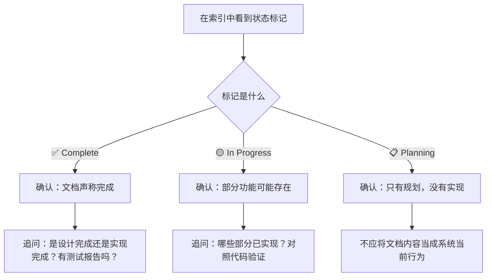
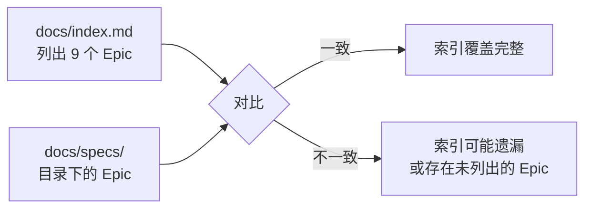

# M01 文档索引不是文档正文——从 `index.md` 到 `DOCUMENTATION-MANAGEMENT.md` 两条路怎么走

小林想了解 RoleAgent 的记忆维护机制。她在 `docs/index.md` 里看到一行：

```
| Persistent Agent 完整实现 | agent/persistent-agent-complete.md | 完整实现指南 |
```

她点了链接，跳到 [docs/agent/persistent-agent-complete.md](../../../../docs/agent/persistent-agent-complete.md)，读了两页，觉得"已经知道了"。

但小林不知道的是：RoleAgent 记忆维护的当前实现位于 [packages/core/src/lib/integrations/pi-agent/role-agent/memory-tracker.ts](../../../../packages/core/src/lib/integrations/pi-agent/role-agent/memory-tracker.ts)，而那份"完整实现指南"描述的是最初的设计意图，部分接口在后续迭代中已经改名。

索引帮她找到了一份文档，但没有帮她判断这份文档的可信度。

## 场景：从"我需要某个信息"到"我找到了正确的文档"

本课解决一个判断问题：当你在 782 个非源码文件中寻找某个信息时，怎样从索引出发，经过文档管理规范，最终找到正确的那份文档，并判断它是否可信。

## 1. `docs/index.md` 做了什么，没做什么

### 1.1 索引的两种组织方式

打开 [docs/index.md](../../../../docs/index.md)，你会看到两种组织方式交替出现：

**按文档类型组织**——前半部分：

| 区段 | 列出的文档类型 | 例子 |
| --- | --- | --- |
| 产品规划 | PRD、架构设计 | `product/PRD-Main.md`、`design/os-framework.md` |
| 规约文档 | AGENTS.md、文档管理规范 | `AGENTS.md`、`DOCUMENTATION-MANAGEMENT.md` |
| API 文档 | 各种 API 接口文档 | `api/agent-session-api.md`、`api/skills-api.md` |
| Agent 文档 | Agent 相关设计文档 | `agent/agent-lifecycle-design.md` 等 7 份 |
| 使用指南 | 构建产物、运行时日志 | `guides/build-artifacts.md` |
| 决策记录 | 技术决策总结 | `decisions/phase1-decision-summary.md` |
| QA 文档 | 测试报告 | `qa/` |

**按 Epic 组织**——后半部分：

| 区段 | 列出的内容 | 例子 |
| --- | --- | --- |
| 实施顺序 | Epic 的阶段和状态 | Phase 0（🟡）、Phase 1（✅）、Phase 2（🟡/📋） |
| Epic 文档 | 每个 Epic 的入口链接和状态 | `specs/epic-0/README.md` 至 `specs/epic-A2UI/README.md` |
| Story 详览 | 各 Epic 下的 Story 列表 | `story-R.1/README.md`、`story-OS.7/README.md` 等 |
| 文档状态统计 | 按 Epic 统计完成情况 | 9 个 Epic，4 个已完成，2 个进行中，3 个规划中 |

这两种组织方式分别解决不同问题。按类型组织回答"我需要某类信息"——比如"我要看 API 文档"。按 Epic 组织回答"某个功能的需求和设计在哪里"——比如"我要看 Epic R 的 RoleAgent 设计"。

### 1.2 索引的边界

索引的边界必须说清楚，因为初学者最容易犯的错就是"看了索引就以为自己知道了"。

| 索引能做到 | 索引做不到 |
| --- | --- |
| 告诉你某份文档的路径 | 告诉你这份文档的当前内容是否与代码一致 |
| 告诉你某个 Epic 有多少个 Story | 告诉你某个 Story 的需求细节 |
| 告诉你某个 Story 的状态（✅/🟡/📋） | 告诉你 ✅ 状态的 Story 是否经过端到端验证 |
| 列出所有文档类型和入口 | 列出每份文档内部有哪些章节 |

小林的错误在于：她从索引跳到了一份文档，就停下来了。她没有问两个后续问题：

1. 这份文档描述的是设计意图还是当前实现？
2. 实现是否在后续迭代中发生了变化？

索引不回答这两个问题。它的工作在"指路"这一步就结束了。

### 1.3 状态标记的可信度边界

索引中使用了三种状态标记：

| 标记 | 含义 | 可信度边界 |
| --- | --- | --- |
| ✅ Complete / Done | Story 声称已完成 | 可能只是文档标记了 Done，不等于端到端测试通过 |
| 🟡 In Progress / 部分实现 | Story 正在进行 | 可能大部分功能未实现，只是部分接口存在 |
| 📋 Planning | Story 在规划中 | 文档可能只有占位符，内容可能是空的 |

一个具体例子：Epic C（认知系统）在索引中标注为"✅ 设计完成"，但 C.2—C.7 的 Story 状态全是 📋 Planning。这意味着认知系统的**架构设计**已完成，但**大部分功能还没有实现**。如果读者把"设计完成"等同于"功能已实现"，就会在读代码时找不到对应的实现。



## 2. `DOCUMENTATION-MANAGEMENT.md` 做了什么，没做什么

### 2.1 六文档约束

[docs/DOCUMENTATION-MANAGEMENT.md](../../../../docs/DOCUMENTATION-MANAGEMENT.md) 定义了一个核心约束：**每个 Story 必须包含六份子文档**。

| 子文档 | 责任 | 必须包含的内容 |
| --- | --- | --- |
| `README.md` | Story 概览和状态看板 | 标题、描述、状态、负责人、里程碑、链接 |
| `requirements.md` | 功能需求和验收标准 | 功能需求、Given/When/Then AC、边界条件、依赖 |
| `interaction.md` | 交互设计 | 用户流程图、界面线框图、交互状态、错误处理 |
| `architecture.md` | 架构设计 | 技术选型（必须符合 AGENTS.md）、模块设计、数据结构、API、AGENTS.md 符合性证明 |
| `implementation.md` | 实施指南 | 实施步骤、关键代码片段、环境配置、已知问题 |
| `testing.md` | 测试策略 | 测试策略、用例列表、测试数据、覆盖率目标、测试结果 |

这个约束的实操含义是：当你打开一份 Story 目录（比如 `docs/specs/epic-R/story-R.1/`），如果里面缺少某份子文档，就意味着这份 Story 的文档不完整。

### 2.2 七阶段协作流程

文档管理规范还定义了文档从创建到完成的七个阶段：

| 阶段 | 负责人 | 核心动作 | README 状态应更新为 |
| --- | --- | --- | --- |
| 1. Story 启动 | PO / Tech Lead | 创建目录、从模板初始化、填写 README | Planning |
| 2. 需求分析 | PO | 编写 requirements.md、团队评审 | Requirements Review |
| 3. 交互设计 | UX Designer | 编写 interaction.md、上传设计资源 | — |
| 4. 架构设计 | Tech Lead | 编写 architecture.md、AGENTS.md 符合性检查 | Design Complete |
| 5. 开发实施 | Developer | 编写 implementation.md、持续更新 | In Progress |
| 6. 测试 | QA / Developer | 编写 testing.md、执行测试 | Testing |
| 7. 完成 | Tech Lead | 最终审查、确认完整 | Done |

这个流程的阅读意义在于：**当你在 README 中看到某个状态标记时，你能推断出哪些子文档应该已经写好**。

| 看到的状态 | 至少应存在哪些子文档 | 如果缺失意味着什么 |
| --- | --- | --- |
| Planning | README.md | 正常，其他文档尚未开始 |
| Requirements Review | README.md + requirements.md | 正常，需求和评审已完成 |
| Design Complete | README.md + requirements.md + interaction.md + architecture.md | 如果缺少 interaction.md 或 architecture.md，设计流程可能被跳过 |
| In Progress | 上述 + implementation.md | 正常，开发进行中 |
| Testing | 上述 + testing.md | 如果缺少 testing.md，测试文档可能未跟上开发 |
| Done | 全部六份 | 如果缺失任何一份，Story 的文档完整性有问题 |

### 2.3 规范的边界

文档管理规范也有它做不到的事情：

| 规范能做到 | 规范做不到 |
| --- | --- |
| 定义每个 Story 必须包含哪些子文档 | 检查每份子文档的内容是否正确 |
| 定义文档协作的七个阶段 | 保证每个阶段都按流程执行 |
| 定义命名规范（`epic-{N}`、`story-{N}.{M}`） | 防止有人跳过模板直接手写文档 |
| 定义文档变更流程 | 自动追踪文档与代码的同步状态 |

换句话说，规范是"必须做什么"的约束，不是"已经做了什么"的证明。

## 3. 两条路怎么走：信息定位的实操方法

### 3.1 需求类信息：先找 Epic，再找 Story 子文档

当你想了解某个功能的需求和验收标准时，走这条路：

```text
docs/index.md → 找到对应 Epic → 打开 Epic README → 找到对应 Story → 打开 Story 的 requirements.md
```

举例：你想了解 RoleAgent 状态机的设计需求。

1. 在 [docs/index.md 第 167—176 行](../../../../docs/index.md#L167) 找到 Epic R Stories 详览。
2. 看到 Story R.2 "State Machine 状态机" 状态为 ✅ Done。
3. 打开 [docs/specs/epic-R/story-R.2/README.md](../../../../docs/specs/epic-R/story-R.2/README.md)。
4. 从 README 中的快速导航链接跳到 `requirements.md`，读取 Given/When/Then 验收标准。

### 3.2 设计类信息：先看文档类型，再找具体文件

当你想了解某个技术方案的设计决策时，走这条路：

```text
docs/index.md → 按文档类型区段找到对应目录 → 打开具体文件
```

举例：你想了解 Agent 生命周期设计。

1. 在 [docs/index.md 第 35—43 行](../../../../docs/index.md#L35) 找到 Agent 文档区段。
2. 看到 `agent/agent-lifecycle-design.md`。
3. 打开 [docs/agent/agent-lifecycle-design.md](../../../../docs/agent/agent-lifecycle-design.md)。
4. 阅读时注意：这份文档描述的是设计意图，需要对照代码确认实现是否一致。

### 3.3 变更类信息：直接去 `docs/changes/`

当你想了解某个时间点做了什么改动时，走这条路：

```text
docs/changes/changelog.md → 按日期倒序浏览 → 或 docs/changes/releases/v{version}/changelog.md → 按版本查找
```

变更记录的阅读方法在 M04 中详细展开。这里只需要知道路径。

### 3.4 定位失败怎么办

当你走完上述路径，仍然找不到想要的信息时，有三种可能：

| 可能原因 | 判断方法 | 应对方式 |
| --- | --- | --- |
| 信息在 Story 子文档中，但 Story 不在索引中 | 检查 `docs/specs/` 目录是否有索引未列出的 Epic | 直接浏览 `docs/specs/` 目录 |
| 信息在代码注释或 AGENTS.md 中，不在独立文档中 | 搜索关键词在代码中的出现位置 | 读代码中的注释或 AGENTS.md 对应章节 |
| 信息根本不存在 | 在 `docs/` 和代码中都无法找到 | 承认"没有文档记录"，从代码和测试推断行为 |

第三种情况并不罕见。特别是对于较新的功能和内部重构，文档可能没有跟上。这时候必须明确说"没有文档记录"，而不是从其他文档中推测。

## 4. 一份索引的完整性验证

索引本身也可能不完整。怎样判断 `docs/index.md` 是否覆盖了所有 Epic？

一个简单的验证方法：对比索引中列出的 Epic 数与 `docs/specs/` 目录下的 Epic 数。



当前 [docs/index.md 第 229 行](../../../../docs/index.md#L229) 声明"总 Epic 数: 9"，列出了 0、1、OS、R、C、P2、M、T、A2UI 共 9 个。而 `docs/specs/` 目录下除了这 9 个之外，还有 `epic-9`（Multi-Agent 协作运行时）、`epic-10`（Monorepo 架构迁移）、`epic-1AG`（Agent 重构）、`epic-PERF`（性能优化）等。

这意味着索引中的 Epic 列表并不完整——有些 Epic（如 epic-9、epic-10）在索引的其他位置被提及（如 [docs/index.md 第 260 行](../../../../docs/index.md#L260) 的"相关链接"区段），但没有出现在 Epic 文档表格中。

这种不一致本身不是错误——索引可能只列出"主要" Epic，而将其他 Epic 放在补充链接中。但读者必须知道这个边界：**索引中的 Epic 列表不是 `docs/specs/` 下所有 Epic 的穷举**。

## 5. 文档覆盖台账

| 本课直接精读的文档 | 精读范围 | 配对验证 | 本课只证明什么 |
| --- | --- | --- | --- |
| [docs/index.md](../../../../docs/index.md) | 全文 278 行 | 对比 `docs/specs/` 目录验证 Epic 覆盖 | 索引的组织方式、状态标记含义、Epic 覆盖边界 |
| [docs/DOCUMENTATION-MANAGEMENT.md](../../../../docs/DOCUMENTATION-MANAGEMENT.md) | 全文 526 行 | 对照 `docs/specs/epic-R/story-R.1/` 验证六文档约束 | 六文档结构、七阶段流程、命名规范 |

本课没有精读的内容也要明说：

- Story 子文档（requirements.md、architecture.md 等）的具体内容在 M02 中精读
- 变更记录的阅读方法在 M04 中展开
- QA 文档的可信度判断在 M05 中展开
- 各 Epic 内部 Story 的状态标记在 M06 中按 Epic 逐一验证

## 6. 失败路径：索引误读的三种后果

### 6.1 把索引当成需求

后果：小林在索引中看到 `agent/persistent-agent-complete.md` 的"完整实现指南"标题，就以为 RoleAgent 的记忆维护完全按照这份文档实现。但实际代码中，`memory-tracker.ts` 的接口已经与文档中的设计不一致。

正确做法：从索引找到文档后，还要对照代码确认实现是否一致。

### 6.2 把状态标记当成功能状态

后果：小林看到 Epic C 标注为"✅ 设计完成"，就以为认知系统的知识库和实践日志功能已经可以运行。但实际只有 C.1（基础设施）的代码存在，C.2—C.7 全是 📋 Planning。

正确做法：区分"设计完成"和"实现完成"。✅ 只代表对应层面（设计或实现）的完成，不代表整个功能链路已通。

### 6.3 在索引找不到就放弃

后果：小林想了解 Epic 9（Multi-Agent 协作运行时）的 Story 细节，但在索引的"Epic 文档"表格中没有看到 Epic 9。她以为没有文档，就不再寻找。实际上 Epic 9 在索引的"相关链接"区段中有链接。

正确做法：如果索引的主表格没有找到，检查索引的其他区段，或者直接浏览 `docs/specs/` 目录。

## 7. 练习：信息定位

以下五个信息需求，请说出你应该打开哪个文件，以及打开后先看什么。

1. "我需要了解 Epic OS 中 Agent 托管服务的测试结果"
2. "我需要了解 Pi Agent 会话持久化 API 的请求格式"
3. "我需要了解 Story R.3 的架构设计是否符合 AGENTS.md"
4. "我需要了解 v0.1.47 版本做了哪些改动"
5. "我需要了解创建新 Story 时需要包含哪些子文档"

参考答案：

| 需求 | 应打开的文件 | 先看什么 |
| --- | --- | --- |
| 1 | [docs/specs/epic-OS/story-OS.7/README.md](../../../../docs/specs/epic-OS/story-OS.7/README.md) → testing.md | 测试结果区段，确认场景覆盖率 |
| 2 | [docs/api/agent-session-api.md](../../../../docs/api/agent-session-api.md) | API 端点列表和请求/响应格式 |
| 3 | [docs/specs/epic-R/story-R.3/architecture.md](../../../../docs/specs/epic-R/story-R.3/architecture.md) | AGENTS.md 符合性声明区段 |
| 4 | [docs/changes/releases/v0.1.47/changelog.md](../../../../docs/changes/releases/v0.1.47/changelog.md) | 变更类型和影响模块 |
| 5 | [docs/DOCUMENTATION-MANAGEMENT.md](../../../../docs/DOCUMENTATION-MANAGEMENT.md) 第 86—163 行 | 六文档类型说明和各自必须包含的内容 |

注意第 5 题：虽然模板文件 [docs/templates/story-spec-template/](../../../../docs/templates/story-spec-template/) 也有参考价值，但文档管理规范是定义"必须包含什么"的权威来源，模板是展示"格式长什么样"的参考。两个都读更完整，但如果只选一个先读，选规范。

## 8. 口头验收

学完本课后，不看正文也应能回答下面四个问题：

1. `docs/index.md` 按哪两种方式组织文档列表？每种方式分别适合什么场景？
2. 为什么在索引中看到 ✅ Complete 不能等同于"功能已经端到端验证"？
3. 一份 Story 的 README 状态为 Design Complete 时，至少应该存在哪些子文档？
4. 当你在索引中找不到某个 Epic 的信息时，应该怎么办？

合格回答不要求背诵行号，但必须能说出索引的组织方式、状态标记的可信度边界、六文档约束的含义、以及定位失败时的应对方法。
