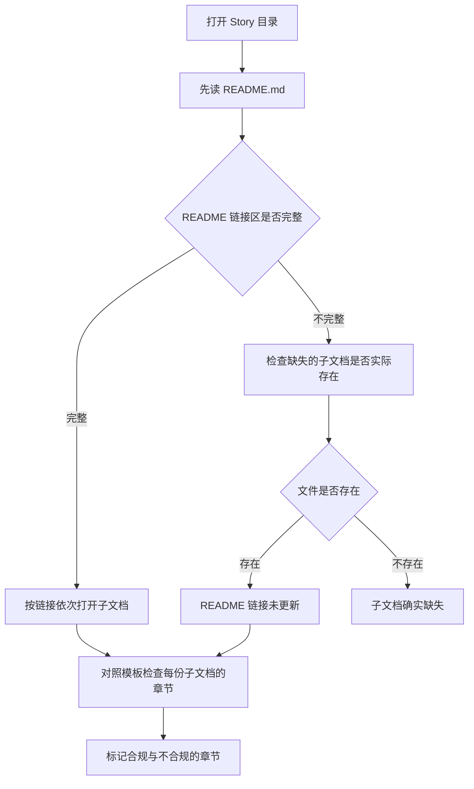

# M02 Story 六文档结构与模板约束——从 `story-spec-template/` 判断一份 Story 是否完整

小林接到一个任务：审查 Story R.3 的文档完整性。她打开 [docs/specs/epic-R/story-R.3/](../../../../docs/specs/epic-R/story-R.3/) 目录，看到 `README.md`、`requirements.md`、`architecture.md` 三个文件。她想起文档管理规范说每个 Story 必须有六份子文档，于是对照列表：

```
✅ README.md
✅ requirements.md
✅ architecture.md
❌ interaction.md  ——缺失
❌ implementation.md ——缺失
❌ testing.md     ——缺失
```

她写了一份报告："Story R.3 缺少三份子文档，文档不完整。"

但报告交上去后，技术负责人说：**"你的结论对，但你的审查深度不够。README 里的状态标记是 Design Complete，按规范 Design Complete 阶段至少应该存在四份子文档（README + requirements + interaction + architecture），你只确认了文件是否存在，没有确认 README 的状态与实际文档是否一致，也没有检查已有的三份文档内容是否符合模板约束。"**

小林的错误有两层：第一，她只做了"文件存在性检查"，没有做"内容完整性检查"；第二，她没有把 README 中的状态标记与七阶段协作流程交叉验证。

本课解决一个判断问题：当你拿到一份 Story 目录时，怎样从模板约束出发，判断这份 Story 的文档是否完整，以及已有文档的内容是否满足其子文档类型必须包含的章节。

## 场景：从"文件存在"到"内容合规"

M01 已经解决了"怎样从索引找到正确的文档"。M02 要解决的问题是：找到文档之后，怎样判断它是否完整、是否合规？

"完整"指的是六份子文档齐全；"合规"指的是每份子文档的内容满足模板定义的章节约束。两者缺一不可——六份文件都在但内容全是占位符，和只存在三份文件，都是"不完整"。

## 1. 六文档结构的权威来源

### 1.1 `DOCUMENTATION-MANAGEMENT.md` 定义"必须包含什么"

[docs/DOCUMENTATION-MANAGEMENT.md 第 84—163 行](../../../../docs/DOCUMENTATION-MANAGEMENT.md#L84) 是六文档约束的权威来源。它用一张表定义了每个子文档的名称、责任和必须包含的内容：

| 子文档 | 责任 | 必须包含的内容 |
| --- | --- | --- |
| `README.md` | Story 概览和状态看板 | 标题、描述、状态、负责人、里程碑、链接 |
| `requirements.md` | 功能需求和验收标准 | 功能需求、Given/When/Then AC、边界条件、依赖 |
| `interaction.md` | 交互设计 | 用户流程图、界面线框图、交互状态、错误处理 |
| `architecture.md` | 架构设计 | 技术选型（必须符合 AGENTS.md）、模块设计、数据结构、API、AGENTS.md 符合性证明 |
| `implementation.md` | 实施指南 | 实施步骤、关键代码片段、环境配置、已知问题 |
| `testing.md` | 测试策略 | 测试策略、用例列表、测试数据、覆盖率目标、测试结果 |

这张表的每一行都是一个"合规检查点"。当你说"Story X 的 requirements.md 已存在"时，还不够——你还要检查它是否包含功能需求、Given/When/Then AC、边界条件和依赖。

### 1.2 `story-spec-template/` 展示"格式长什么样"

[docs/templates/story-spec-template/](../../../../docs/templates/story-spec-template/) 中的六份文件是模板。它们在 DOCUMENTATION-MANAGEMENT.md 的"必须包含什么"之上，进一步展示了每个章节的格式、字段和占位符。

模板与规范的关系：

| 维度 | DOCUMENTATION-MANAGEMENT.md | story-spec-template/ |
| --- | --- | --- |
| 权威性 | 定义"必须包含什么" | 展示"格式长什么样" |
| 内容性质 | 约束性条文 | 参考性格式 |
| 检查方式 | 对照"必须包含"列表逐项验证 | 对照章节结构检查是否有遗漏段落 |
| 占位符 | 不涉及 | 有（如 `{Story Title}`、`{Date}`），占位符不是真实内容 |

**正确做法是先读规范，再读模板。** 规范告诉你"必须有"，模板告诉你"怎么写"。如果只读模板，你可能会把占位符当成真实内容；如果只读规范，你可能会知道需要什么但不知道格式长什么样。

## 2. 六份子文档的章节结构精读

以下按 DOCUMENTATION-MANAGEMENT.md 的顺序，逐份精读模板的章节结构。每一份都会标注：模板中有哪些章节、每个章节必须包含什么字段、以及实际文档中常见的缩减模式。

### 2.1 README.md——状态看板与导航枢纽

[docs/templates/story-spec-template/README.md](../../../../docs/templates/story-spec-template/README.md) 共 110 行，定义了 Story 概览的结构。

**章节结构：**

| 行号 | 章节 | 必须包含的内容 | 作用 |
| --- | --- | --- | --- |
| 1—8 | Story 头部 | Story 名称、Epic 归属、状态、负责人、创建/更新日期 | 一眼看清 Story 当前进展 |
| 11—17 | User Story | As a / I want / So that 格式 | 用一句话定义用户需求 |
| 19—23 | AC 摘要 | 验收标准的勾选列表 | 快速确认功能完成度 |
| 27—36 | 团队表 | PO、Tech Lead、UX、Dev、QA 五个角色 | 知道该找谁 |
| 39—49 | 时间线 | 规划、设计、开发、测试、验收、上线六阶段 | 追踪进度 |
| 52—69 | 链接区 | 规划文档链接 + 规约文档链接 + 5 份子文档链接 | **导航枢纽**——这是 README 最关键的功能 |
| 73—90 | 进度追踪 | 状态 + 完成清单（6 项） + 阻塞项 | 持续更新的进度看板 |
| 94—98 | 变更历史 | 日期 + 变更描述 | 追踪文档本身的修改 |
| 102—109 | 快速导航 | 重复列出子文档链接 | 确保链接在任何位置可访问 |

**README 的核心功能是"导航枢纽"。** 它的链接区必须包含指向其他五份子文档的链接。如果链接缺失，说明 README 的导航功能不完整。

**实际文档常见的缩减模式：**

以 [docs/specs/epic-9/story-9.1/README.md](../../../../docs/specs/epic-9/story-9.1/README.md) 为例，这份实际 Story 的 README 只有 22 行，仅包含头部和快速导航，而快速导航中只链接到 `requirements.md` 和 `architecture.md`——缺少 `interaction.md`、`implementation.md` 和 `testing.md` 的链接。

对照模板，Story 9.1 的 README 缺失了：

| 模板章节 | Story 9.1 是否存在 | 缺失的影响 |
| --- | --- | --- |
| User Story | ❌ | 无法一句话了解用户需求 |
| AC 摘要 | ❌ | 无法快速确认验收标准 |
| 团队表 | ❌ | 不知道负责人是谁 |
| 时间线 | ❌ | 无法追踪进度 |
| 进度追踪 | ❌ | 没有持续更新的状态看板 |
| 变更历史 | ❌ | 不知道文档修改过几次 |
| 链接区 | ⚠️ 部分存在 | 只链接了 2 份子文档，导航不完整 |

### 2.2 requirements.md——功能需求与验收标准

[docs/templates/story-spec-template/requirements.md](../../../../docs/templates/story-spec-template/requirements.md) 共 175 行，定义了需求的详细结构。

**章节结构：**

| 行号 | 章节 | 必须包含的内容 | 判断要点 |
| --- | --- | --- | --- |
| 9—30 | 功能需求 | 需求列表，每项带优先级标记（🔴 必须 / 🟡 应该 / 🟢 可选）和依赖关系 | 优先级标记是否齐全？是否遗漏了依赖？ |
| 32—57 | 验收标准（AC） | Given/When/Then 格式，每条 AC 附带测试数据 | 是否用了 Given/When/Then？是否有可执行的测试数据？ |
| 61—91 | 边界条件 | 正常路径、异常路径、边界值 | 是否覆盖了失败场景？ |
| 94—107 | 依赖关系 | 前置依赖表 + 后续依赖表 | 是否标注了被哪些 Story 依赖？ |
| 110—137 | 非功能需求 | 性能（对照 AGENTS.md Ch6）、安全、可用性、可维护性 | 性能指标是否有数字？ |
| 140—144 | 变更历史 | 日期 + 变更描述 | — |
| 148—165 | 审查清单 | 7 项审查条目 + 审查记录 | 是否经过审查？ |

**验收标准（AC）是 requirements.md 的核心。** Given/When/Then 格式确保每条 AC 都是可测试的。"Given"定义前置条件，"When"定义触发动作，"Then"定义预期结果。如果 AC 只写了"功能正常"而没有 Given/When/Then，就不满足模板约束。

**实际文档对比：**

[docs/specs/epic-9/story-9.1/requirements.md](../../../../docs/specs/epic-9/story-9.1/requirements.md) 共 41 行，包含用户故事、5 条功能需求、2 条边界条件、5 个 AC 勾选项、3 条依赖链接。对照模板：

| 模板章节 | Story 9.1 是否存在 | 差距 |
| --- | --- | --- |
| 功能需求 | ✅ 存在但简略 | 缺少优先级标记（🔴/🟡/🟢） |
| 验收标准 | ⚠️ 存在但格式不同 | 使用勾选列表而非 Given/When/Then 格式 |
| 边界条件 | ✅ 存在但简略 | 只有 2 条，模板建议正常/异常/边界值三类 |
| 依赖关系 | ✅ 存在 | 链接了 3 个设计文档段落 |
| 非功能需求 | ❌ 缺失 | 没有性能、安全、可用性指标 |
| 审查清单 | ❌ 缺失 | 没有审查条目和审查记录 |

这个对比揭示了一个重要判断：**文件存在 ≠ 内容合规**。Story 9.1 的 requirements.md 存在，但它缺少 Given/When/Then 格式的 AC、优先级标记、非功能需求和审查清单。

### 2.3 interaction.md——交互设计

[docs/templates/story-spec-template/interaction.md](../../../../docs/templates/story-spec-template/interaction.md) 共 300 行，是六份模板中最长的一份，因为交互设计涉及用户流程、界面状态、错误处理、可访问性和响应式等多个维度。

**章节结构：**

| 行号 | 章节 | 必须包含的内容 | 判断要点 |
| --- | --- | --- | --- |
| 9—19 | 设计概览 | 设计目标 + UX 规范引用 | — |
| 23—52 | 用户流程 | Mermaid 流程图 + 逐步说明 | 流程图是否覆盖了主路径和异常路径？ |
| 56—75 | 界面设计 | 线框图 + 视觉稿 + 设计规格 | 是否标注了组件和布局？ |
| 79—123 | 交互状态 | 4 种状态（初始/加载中/成功/错误）+ Mermaid 状态图 | 4 种状态是否齐全？状态图是否覆盖转换？ |
| 127—149 | 错误处理 | 触发条件、提示文案、位置、样式、用户操作 | 是否覆盖了每种错误的处理方式？ |
| 152—181 | 可访问性 | 键盘导航、屏幕阅读器、WCAG AA、触控目标 44×44px | 是否满足 WCAG AA 标准？ |
| 184—201 | 响应式 | 桌面 ≥1920px / 平板 768—1919px / 手机 <768px | 三种断点是否都有设计？ |
| 205—224 | 动画和过渡 | 过渡效果列表 | — |
| 227—254 | 设计规范 | 组件表 + 样式规格 | — |
| 257—275 | 设计审查 checklist | 审查条目 | — |

**交互状态（4 种状态）是 interaction.md 的核心判断点。** 一个 UI 只设计了"成功状态"而忽略了"加载中"和"错误状态"，是最常见的交互设计遗漏。模板要求 4 种状态齐全：初始（用户还没操作）、加载中（正在请求）、成功（操作完成）、错误（操作失败）。

**实际文档现状：** 在已验证的 Story 目录中（Story 9.1、Story R.1），`interaction.md` 均不存在。这意味着当前的 Story 文档实践中，交互设计是最常被跳过的子文档。

这个事实本身就是一个重要的判断依据：**当你看到一份 Story 缺少 interaction.md 时，你应该问"是交互设计还没做，还是交互设计被合并在了其他文档中？"** 有些团队把交互设计写在 architecture.md 或 implementation.md 里，虽然不规范，但内容可能存在。如果连其他文档中也没有交互设计内容，那就是真正的缺失。

### 2.4 architecture.md——架构设计与 AGENTS.md 符合性

[docs/templates/story-spec-template/architecture.md](../../../../docs/templates/story-spec-template/architecture.md) 共 511 行，是六份模板中内容最多的一份。它的特殊之处在于：**顶部必须包含 AGENTS.md 符合性声明**。

**章节结构：**

| 行号 | 章节 | 必须包含的内容 | 判断要点 |
| --- | --- | --- | --- |
| 9—22 | 架构概览 + **AGENTS.md 符合性声明** | 5 个勾选框（目录结构/依赖方向/数据存储/UI规约/性能） | **5 个勾选框是否都被填写？** |
| 26—45 | 技术栈 | 技术选型表，每项带 AGENTS.md 符合性列 | 是否标注了每项技术是否符合 AGENTS.md？ |
| 48—115 | 模块设计 | 文件树 + 模块职责（路径/依赖/导出） | 每个模块的路径、依赖和导出是否都写明了？ |
| 117—147 | 依赖关系 | Layer 5→4→2→1 图 + 合规检查 | 依赖方向是否遵循单向按序依赖？ |
| 149—197 | 数据结构 | TypeScript 接口 + JSON 存储格式 | 接口定义与存储格式是否一致？ |
| 200—259 | API 设计 | 内部 JSDoc + 外部集成 | 内部和外部 API 边界是否清楚？ |
| 262—318 | 状态管理 | Zustand store 代码 + Mermaid 状态图 | 是否使用了 Zustand？是否禁止了 Redux/MobX？ |
| 322—354 | 性能优化 | AGENTS.md 约束表 + 优化策略代码 | 性能指标是否有数字？ |
| 357—402 | 安全 | Zod 验证 + FeatureError + 加密 | 输入验证是否用了 Zod？ |
| 405—436 | 可测试性 | 依赖注入 + Mock 数据 | 是否支持单元测试？ |
| 439—478 | 监控和日志 | Logger + 性能监控代码 | — |
| 482—509 | 架构审查 checklist | 审查条目 | — |

**AGENTS.md 符合性声明是 architecture.md 最重要的判断点。** 模板要求在架构概览下方列出 5 个勾选框：

```markdown
- [ ] 目录结构符合 AGENTS.md 规约
- [ ] 依赖方向遵循单向按序依赖原则
- [ ] 数据存储符合文件系统规约
- [ ] UI/UX 符合设计系统约束
- [ ] 性能指标满足 AGENTS.md 要求
```

这 5 个勾选框的存在，强制架构设计者逐项检查是否符合 AGENTS.md。如果一份 architecture.md 没有这 5 个勾选框，就意味着架构设计跳过了 AGENTS.md 合规检查。

**实际文档对比：**

[docs/specs/epic-9/story-9.1/architecture.md](../../../../docs/specs/epic-9/story-9.1/architecture.md) 共 41 行，包含技术栈、数据结构（EventType 表 + ACLMessage performative）、模块设计和代码变更。对照模板：

| 模板章节 | Story 9.1 是否存在 | 差距 |
| --- | --- | --- |
| AGENTS.md 符合性声明 | ❌ 缺失 | 没有合规检查 |
| 技术栈 | ✅ 存在 | 缺少 AGENTS.md 符合性列 |
| 模块设计 | ✅ 存在但简略 | 缺少模块路径、依赖、导出 |
| 数据结构 | ✅ 存在 | 只有两个表，缺少 TypeScript 接口和 JSON 格式 |
| 依赖关系 | ❌ 缺失 | 没有 Layer 图和合规检查 |
| API 设计 | ❌ 缺失 | — |
| 状态管理 | ❌ 缺失 | — |
| 性能优化 | ❌ 缺失 | — |
| 安全 | ❌ 缺失 | — |
| 可测试性 | ❌ 缺失 | — |
| 监控和日志 | ❌ 缺失 | — |
| 架构审查 checklist | ❌ 缺失 | — |

Story 9.1 的 architecture.md 只覆盖了模板 12 个章节中的 3 个，且这 3 个都远比模板要求简略。这是一个典型的"骨架文档"——文件存在，但内容远未达到模板约束。

### 2.5 implementation.md——实施步骤与已知问题

[docs/templates/story-spec-template/implementation.md](../../../../docs/templates/story-spec-template/implementation.md) 共 395 行，定义了从环境准备到代码审查的完整实施路径。

**章节结构：**

| 行号 | 章节 | 必须包含的内容 | 判断要点 |
| --- | --- | --- | --- |
| 9 | 开发目标 | 一句话说明 | — |
| 15—151 | 8 个实施步骤 | 每步有任务勾选 + 命令 + 代码 | 步骤是否按顺序排列？是否有代码片段？ |
| 153—183 | 关键代码片段 | 核心逻辑的代码 | — |
| 185—206 | 第三方库使用 | 库名 + 用途 + 版本 | — |
| 209—242 | 环境配置 | Node.js ≥18、环境变量、VSCode 插件 | Node.js 版本是否满足？ |
| 245—264 | 开发注意事项 | AGENTS.md 合规 + 代码标准 + 性能 | — |
| 266—284 | 常见陷阱 | ❌ 错误做法 + ✅ 正确做法 | 陷阱是否有对比示例？ |
| 288—305 | 已知问题 | 问题描述 + 影响范围 + 临时方案 | — |
| 308—339 | 代码审查要点 | 5 类审查维度 | — |
| 342—360 | 开发日志 | 日期 + 内容 | — |
| 362—395 | 部署说明 | 部署步骤 | — |

**8 个实施步骤是 implementation.md 的核心结构。** 模板定义了固定顺序：环境准备 → 创建文件结构 → 定义类型 → 实现核心逻辑 → 实现状态管理 → 实现 UI 组件 → 集成测试 → 文档审查。每一步都有任务勾选框，方便追踪完成度。

**常见陷阱（❌/✅ 对比）是 implementation.md 的特色章节。** 它用错误示例和正确示例的对比，帮助开发者避免典型错误。例如：

```
❌ 错误：在 app/ 中定义业务逻辑
✅ 正确：业务逻辑放在 lib/features/ 中，app/ 只负责路由和页面组件
```

这种对比格式比单纯的规则说明更有教学价值。

**实际文档现状：** 在已验证的 Story 目录中（Story 9.1、Story R.1），`implementation.md` 均不存在。这意味着开发步骤、环境配置、常见陷阱和已知问题都没有在文档中记录——这些信息可能散落在开发者的本地环境或口头交流中。

### 2.6 testing.md——测试策略与验收证据

[docs/templates/story-spec-template/testing.md](../../../../docs/templates/story-spec-template/testing.md) 共 477 行，是六份模板中除 architecture.md 外最长的，因为测试需要覆盖策略、用例、数据、执行记录和回归验证。

**章节结构：**

| 行号 | 章节 | 必须包含的内容 | 判断要点 |
| --- | --- | --- | --- |
| 9—11 | 测试目标 | 一句话说明 | — |
| 15—31 | 测试策略 | 测试金字塔（E2E > 集成 > 单元） | 是否包含三层测试？ |
| 33—40 | 覆盖率目标 | 单元 >80%、集成 >60%、E2E 关键路径 100% | 目标是否有具体数字？ |
| 43—155 | 单元测试 | 3 个示例（Vitest 函数测试 + renderHook store 测试 + @testing-library/react 组件测试） | 是否包含三种类型的单元测试示例？ |
| 159—195 | 集成测试 | 跨模块测试示例 | — |
| 198—237 | E2E 测试 | Playwright 测试示例 | — |
| 240—273 | 性能测试 | 对照 AGENTS.md 约束表 | 性能指标是否与 AGENTS.md 一致？ |
| 276—314 | 测试数据 | JSON 样本 + 生成器函数 | 测试数据是否可复用？ |
| **317—354** | **验收标准测试** | **AC1/AC2/AC3 各附 Given/When/Then + 测试步骤 + ✅/❌ 结果 + 证据路径** | **这是最重要的章节——每条 AC 是否有测试证据？** |
| 357—377 | 缺陷记录 | 严重度 🔴/🟡/🟢 + 状态 🔴Open/🟡InProgress/✅Fixed | — |
| 380—398 | 回归测试 | 检查清单 + 结果表 | — |
| 400—429 | 测试执行记录 | 日期 + 环境 + 结果 | — |
| 431—468 | 测试命令 | 运行命令 | — |

**验收标准测试是 testing.md 的核心。** 它把 requirements.md 中定义的每条 AC，转化成可执行的测试步骤和可审计的测试结果。格式如下：

```markdown
### AC1: [验收标准描述]
- Given: [前置条件]
- When: [触发动作]
- Then: [预期结果]
- 测试步骤: 1. ... 2. ... 3. ...
- 结果: ✅ 通过 / ❌ 失败
- 证据: screenshots/AC1-test-result.png
```

这种格式确保了每条 AC 都有对应的测试证据。如果一份 testing.md 只列出了测试策略和覆盖率目标，但没有逐条 AC 的测试步骤和结果，那就只是"测试计划"而非"测试报告"——计划可以写得很漂亮，但不能证明功能已经验证。

**覆盖率目标 vs 实际覆盖率：** 模板定义的目标是单元测试 ≥80%、集成测试 ≥60%、E2E 关键路径 100%。但目标是"应该达到的数字"，不是"已经达到的数字"。判断测试充分性时，必须看测试执行记录中的实际覆盖率，而不是只看 testing.md 开头声明的目标数字。

**实际文档现状：** 在已验证的 Story 目录中（Story 9.1、Story R.1），`testing.md` 均不存在。这意味着这些 Story 的功能验证没有留下结构化的测试证据。

## 3. 模板约束与实际文档的差距图谱

### 3.1 文件存在性差距

基于对 Story 9.1 和 Story R.1 的目录验证，当前项目的 Story 文档实践与模板约束之间存在系统性差距：

| 子文档 | 模板要求 | Story 9.1 | Story R.1 | 差距性质 |
| --- | --- | --- | --- | --- |
| README.md | 必须存在 | ✅ 22 行 | ✅ 729 字节 | 存在但内容远少于模板 |
| requirements.md | 必须存在 | ✅ 41 行 | ✅ 1456 字节 | 存在但缺少 Given/When/Then 格式 |
| interaction.md | 必须存在 | ❌ | ❌ | **系统性缺失**——最常被跳过的子文档 |
| architecture.md | 必须存在 | ✅ 41 行 | ✅ 1413 字节 | 存在但缺少 AGENTS.md 符合性声明 |
| implementation.md | 必须存在 | ❌ | ❌ | **系统性缺失** |
| testing.md | 必须存在 | ❌ | ❌ | **系统性缺失** |

这个差距图谱揭示了一个重要事实：**当前项目中，大多数 Story 只有 3 份子文档（README + requirements + architecture），而模板要求 6 份。** 这不是个别 Story 的疏忽，而是一种系统性的文档实践模式。

### 3.2 内容合规性差距

即使已存在的 3 份子文档，其内容也远未达到模板约束。以下是 Story 9.1 的内容合规性汇总：

| 子文档 | 模板定义的章节数 | Story 9.1 实际覆盖的章节数 | 合规率 |
| --- | --- | --- | --- |
| README.md | 9 个章节 | 2 个章节（头部 + 快速导航） | 22% |
| requirements.md | 7 个章节 | 4 个章节（部分满足） | 57%（但格式不合规） |
| architecture.md | 12 个章节 | 3 个章节 | 25% |

**合规率不到 60% 是常态，不是例外。** 读者必须知道这个事实，才能避免一个常见误判：以为"Story 文档存在"等于"Story 文档完整"。

### 3.3 差距的阅读含义

这些差距对阅读者意味着什么？

| 差距类型 | 对阅读者的影响 | 应对方法 |
| --- | --- | --- |
| 子文档缺失 | 该子文档负责的信息无处可查 | 转向代码和测试寻找对应信息，明确标注"文档缺失" |
| 章节缺失 | 某类约束没有被文档化 | 从 AGENTS.md 和代码推断，但标注"未被文档确认" |
| 格式不合规（如 AC 没有 Given/When/Then） | 验收标准不可测试 | 用自己的判断将 AC 转化为可测试形式，标注"原始格式不合规" |
| 内容简略 | 信息不足以支撑判断 | 将文档视为"设计意图线索"而非"完整规格" |

核心原则：**文档的缺失和简略不等于功能的缺失和简略。** 很多功能已经实现了，但文档没有跟上。阅读者的任务是"用文档辅助理解代码"，不是"用文档替代阅读代码"。

## 4. 文档导航链：从 README 到其他五份子文档

README.md 的核心功能是导航枢纽。模板在两个位置放置了子文档链接：链接区（行 52—69）和快速导航（行 102—109）。阅读一份 Story 时，正确的入口是 README，而不是直接打开某份子文档。



这条导航链的关键判断点在于：**README 中的链接是否与实际文件一致。** 如果 README 链接了 `interaction.md` 但文件不存在，说明 README 没有及时更新。如果 README 没有链接但文件存在，说明 README 的导航功能不完整。两种情况都说明文档维护存在脱节。

以 Story 9.1 为例：它的 README 快速导航只链接了 `requirements.md` 和 `architecture.md`，与实际文件一致——说明 README 反映了"只有 2 份子文档"的现实，而不是"应该有 6 份"的规范。

## 5. 文档结构字段分析

本节对六份子文档中的关键字段做精确分析，帮助读者在审查文档时快速定位"必须有但经常缺失"的字段。

### 5.1 README.md 关键字段

| 字段 | 位置 | 作用 | 缺失的后果 |
| --- | --- | --- | --- |
| 状态标记 | 头部行 5 | 与七阶段协作流程交叉验证 | 无法判断哪些子文档应该存在 |
| 5 份子文档链接 | 链接区行 52—69 | 导航枢纽 | 无法快速跳转到其他子文档 |
| 完成清单 6 项 | 进度追踪行 79—85 | 逐项追踪完成度 | 不知道哪些步骤已完成 |

### 5.2 requirements.md 关键字段

| 字段 | 位置 | 作用 | 缺失的后果 |
| --- | --- | --- | --- |
| 优先级标记 🔴/🟡/🟢 | 功能需求行 9—30 | 区分必须/应该/可选 | 不知道哪些需求是核心 |
| Given/When/Then | 验收标准行 32—57 | 确保 AC 可测试 | AC 变成"功能正常"这种不可验证的描述 |
| 依赖关系 | 依赖行 94—107 | 追踪跨 Story 影响 | 不知道改动会影响哪些 Story |

### 5.3 interaction.md 关键字段

| 字段 | 位置 | 作用 | 缺失的后果 |
| --- | --- | --- | --- |
| 4 种交互状态 | 行 79—123 | 确保覆盖初始/加载中/成功/错误 | UI 只设计了"正常情况"，用户遇到错误时无指引 |
| 错误处理表 | 行 127—149 | 定义每种错误的处理方式 | 开发者自行决定错误提示，用户体验不一致 |
| WCAG AA 可访问性 | 行 152—181 | 确保残障用户可用 | 可能违反无障碍法规 |

### 5.4 architecture.md 关键字段

| 字段 | 位置 | 作用 | 缺失的后果 |
| --- | --- | --- | --- |
| AGENTS.md 符合性声明 5 个勾选框 | 行 9—22 | 强制逐项检查 AGENTS.md 合规 | 架构设计可能违反 AGENTS.md 而未被发现 |
| 依赖关系 Layer 图 | 行 117—147 | 验证依赖方向是否合规 | 可能存在循环依赖或反向依赖 |
| 数据结构 TypeScript 接口 + JSON 格式 | 行 149—197 | 确保代码与存储格式一致 | 运行时数据可能与文档描述不同 |

### 5.5 implementation.md 关键字段

| 字段 | 位置 | 作用 | 缺失的后果 |
| --- | --- | --- | --- |
| 8 个实施步骤 | 行 15—151 | 提供可追踪的开发路径 | 开发顺序混乱，步骤遗漏 |
| 常见陷阱 ❌/✅ | 行 266—284 | 避免典型错误 | 开发者重蹈覆辙 |
| 已知问题 | 行 288—305 | 记录尚未修复的问题 | 新开发者不知道已有问题 |

### 5.6 testing.md 关键字段

| 字段 | 位置 | 作用 | 缺失的后果 |
| --- | --- | --- | --- |
| 覆盖率目标（带数字） | 行 33—40 | 设定可量化的质量门槛 | 无法判断测试是否充分 |
| 验收标准测试（AC1/AC2/AC3 + 证据路径） | 行 317—354 | 每条 AC 有测试证据 | AC 声称通过但没有证据 |
| 缺陷记录（严重度 + 状态） | 行 357—377 | 追踪 bug 生命周期 | 不知道哪些 bug 仍然存在 |

## 6. 失败路径：六文档误读的四种后果

### 6.1 把文件存在当成内容合规

后果：小林看到 Story 9.1 目录下有 `requirements.md`，就以为需求已经完整定义。但打开后发现，验收标准只有勾选列表，没有 Given/When/Then 格式，无法直接转化为测试用例。她基于这份需求写的测试计划，在评审时被发现无法覆盖关键边界条件。

正确做法：文件存在后，还要对照模板检查内容是否合规。重点关注每份子文档的"必须包含"列表。

### 6.2 把模板占位符当成真实内容

后果：小林读到模板中 `architecture.md` 的 AGENTS.md 符合性声明，看到 5 个勾选框都是 `[ ]`（未勾选），就以为这份 Story 的架构设计不符合 AGENTS.md。但她读的是**模板**，不是实际 Story 文档。模板的勾选框是空的，因为模板是空白格式。

正确做法：区分模板和实际文档。读模板是为了理解"格式长什么样"，读实际文档才能判断"内容是否合规"。模板的占位符（如 `{Story Title}`）和空勾选框都不是判断依据。

### 6.3 跳过 README 直接读子文档

后果：小林想了解 Story R.1 的架构设计，直接打开 `architecture.md`。但她没有先读 README，所以不知道这个 Story 的状态标记。如果状态是"Planning"，architecture.md 可能只是占位符；如果状态是"Design Complete"，至少应该存在 requirements.md 和 interaction.md。

正确做法：先读 README 的状态标记，再用七阶段协作流程判断哪些子文档应该存在，最后才打开具体子文档检查内容。

### 6.4 把缺失的 interaction.md 当成"不需要交互设计"

后果：小林发现 Story R.1 没有 interaction.md，就在审查报告中写"无需交互设计"。但实际上，Story R.1 的功能涉及 RoleAgent 的配置界面，用户需要通过表单填写角色身份和状态机定义，交互设计是必要的。interaction.md 的缺失不是因为不需要，而是因为被跳过了。

正确做法：子文档缺失时，先判断该 Story 是否涉及用户交互。如果涉及，缺失就是真正的问题；如果不涉及（如纯后端重构），缺失可能是合理的。但即使在后端重构中，interaction.md 也应该标注"无用户界面变更"来明确说明跳过的原因，而不是直接省略。

## 7. 文档覆盖台账

| 本课直接精读的文档 | 精读范围 | 配对验证 | 本课只证明什么 |
| --- | --- | --- | --- |
| [docs/templates/story-spec-template/README.md](../../../../docs/templates/story-spec-template/README.md) | 全文 110 行 | 对照 [docs/specs/epic-9/story-9.1/README.md](../../../../docs/specs/epic-9/story-9.1/README.md) 22 行验证差距 | README 章节结构、链接枢纽功能 |
| [docs/templates/story-spec-template/requirements.md](../../../../docs/templates/story-spec-template/requirements.md) | 全文 175 行 | 对照 Story 9.1 的 requirements.md 41 行验证差距 | Given/When/Then AC 格式、优先级标记、边界条件 |
| [docs/templates/story-spec-template/interaction.md](../../../../docs/templates/story-spec-template/interaction.md) | 全文 300 行 | 对照 Story 9.1 和 Story R.1 均缺失的现状 | 4 种交互状态、错误处理、可访问性 |
| [docs/templates/story-spec-template/architecture.md](../../../../docs/templates/story-spec-template/architecture.md) | 全文 511 行 | 对照 Story 9.1 的 architecture.md 41 行验证差距 | AGENTS.md 符合性声明、依赖关系图、数据结构 |
| [docs/templates/story-spec-template/implementation.md](../../../../docs/templates/story-spec-template/implementation.md) | 全文 395 行 | 对照 Story 9.1 和 Story R.1 均缺失的现状 | 8 个实施步骤、常见陷阱❌/✅、已知问题 |
| [docs/templates/story-spec-template/testing.md](../../../../docs/templates/story-spec-template/testing.md) | 全文 477 行 | 对照 Story 9.1 和 Story R.1 均缺失的现状 | 测试金字塔、AC 验收证据、缺陷记录 |
| [docs/DOCUMENTATION-MANAGEMENT.md](../../../../docs/DOCUMENTATION-MANAGEMENT.md) 第 84—163 行 | 六文档约束定义区 | 与模板章节交叉验证 | "必须包含什么"的权威定义 |

本课没有精读的内容也要明说：

- 各 Epic 中其他 Story 的实际文档状况在 M06 中按 Epic 逐一验证
- `DOCUMENTATION-MANAGEMENT.md` 的七阶段协作流程细节在 M01 中已展开
- 模板中具体代码片段（如 Zustand store、Playwright 测试）属于实现参考，不是文档阅读的核心关注点

## 8. 练习：Story 文档完整性审查

以下三个审查任务，请分别判断：

1. **文件存在性**：哪些子文档缺失？
2. **内容合规性**：已存在的子文档是否满足模板约束？列出缺失的章节。
3. **状态交叉验证**：README 的状态标记与实际文档是否一致？

### 任务 A：审查 Story 9.1

目录：[docs/specs/epic-9/story-9.1/](../../../../docs/specs/epic-9/story-9.1/)

已知信息：README 22 行，requirements.md 41 行，architecture.md 41 行。

### 任务 B：审查 Story R.1

目录：[docs/specs/epic-R/story-R.1/](../../../../docs/specs/epic-R/story-R.1/)

已知信息：README 729 字节，requirements.md 1456 字节，architecture.md 1413 字节。

### 任务 C：假设一份 Story 处于"Design Complete"状态

已知信息：README 状态标记为 Design Complete。

根据七阶段协作流程，Design Complete 阶段至少应存在哪些子文档？如果实际只有 README + requirements + architecture，缺了什么？缺少的子文档意味着什么？

### 参考答案

**任务 A：**

| 维度 | 结果 |
| --- | --- |
| 文件存在性 | 缺少 interaction.md、implementation.md、testing.md |
| 内容合规性 | README 缺少 User Story、AC 摘要、团队表、时间线、进度追踪、变更历史；requirements.md 缺少 Given/When/Then 格式、优先级标记、非功能需求、审查清单；architecture.md 缺少 AGENTS.md 符合性声明、依赖关系图、API 设计、状态管理、性能优化、安全、可测试性、监控和日志、架构审查 checklist |
| 状态交叉验证 | Story 9.1 的 README 没有明确的状态标记，无法进行交叉验证 |

**任务 B：**

| 维度 | 结果 |
| --- | --- |
| 文件存在性 | 同任务 A，缺少 interaction.md、implementation.md、testing.md |
| 内容合规性 | 需要打开文件逐一对照模板检查（字节大小不能替代内容检查） |
| 状态交叉验证 | 需要打开 README 读取状态标记，再判断与实际文档是否一致 |

**任务 C：**

| 判断 | 依据 |
| --- | --- |
| 至少应存在的子文档 | README.md + requirements.md + interaction.md + architecture.md（共 4 份） |
| 缺少了什么 | interaction.md |
| 缺少意味着什么 | 按 [docs/DOCUMENTATION-MANAGEMENT.md](../../../../docs/DOCUMENTATION-MANAGEMENT.md) 的七阶段流程，Design Complete 阶段意味着交互设计和架构设计都已完成。缺少 interaction.md 说明"设计完成"的判断可能跳过了交互设计阶段 |

## 9. 口头验收

学完本课后，不看正文也应能回答下面五个问题：

1. Story 文档由哪六份子文档组成？每份子文档分别负责什么？
2. 为什么"文件存在"不等于"内容合规"？请用一个具体例子说明。
3. `architecture.md` 中的 AGENTS.md 符合性声明包含哪 5 个勾选框？缺少这个声明意味着什么？
4. `requirements.md` 中的验收标准为什么必须使用 Given/When/Then 格式？
5. 当你发现一份 Story 的 README 状态为 Design Complete 但实际只有 3 份子文档时，你应该做出什么判断？

合格回答不要求背诵模板行号，但必须能说出六份子文档的责任、每份子文档的"必须包含"列表、以及文件存在性与内容合规性的区别。能说清"这份子文档缺少了什么"比只说清"这份子文档存在"更重要。
