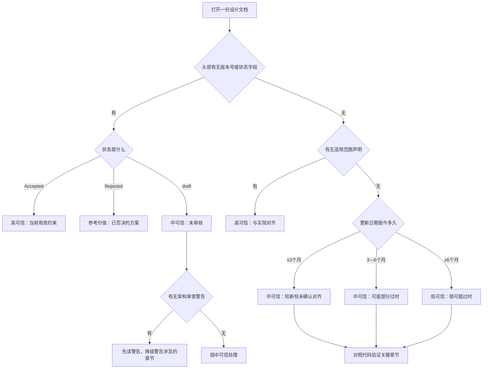

# M03 设计文档分类、章节结构与可信度判断——产品文档、架构决策、API 设计和 Agent 设计的可信度分等

小林想了解 OriginOS 的多 Agent 协作运行时架构。她在 `docs/design/` 目录下找到了 `multi-agent-runtime.md`，读完之后觉得自己已经理解了：Workflow 模式按 DAG 执行，System 模式靠黑板协作，Supervisor 是唯一前台 Agent。

但小林不知道的是：这份文档头部标注了 `v2.0 强约束`，而她读到的"Supervisor 是唯一前台 Agent"是 v1.1 新增的约束——v1.0 中 Worker 还能直连用户。如果她只读了正文，没有注意头部的版本和约束声明，就会把 v1.0 的旧设计当成当前约束。

更严重的是：小林后来又在 `docs/decisions/phase1-decision-summary.md` 中看到一段 SQL `CREATE TABLE taste_manifest`，就以为项目使用了数据库。但 AGENTS.md 明确禁止在 MVP 阶段使用任何数据库——那份决策文档中的 SQL 是早期提议，后来被否决了。如果小林把决策文档中的提议当成已实施方案，就会对整个项目的存储架构产生根本性的误判。

本课解决一个判断问题：当你打开一份设计文档时，怎样从文档的章节结构、版本标记和状态字段判断它的可信度，怎样区分"设计意图"与"实现现状"，怎样识别过时或被否决的设计。

## 场景：从"文档写了"到"系统真的这样实现了"

M01 解决了"怎样从索引找到正确的文档"，M02 解决了"怎样判断一份 Story 文档是否完整合规"。M03 要解决的问题是：找到设计文档之后，怎样判断它是否可信？

"可信"不是说文档在撒谎，而是说文档描述的内容可能与当前实现不一致。这种不一致有五种常见原因：

| 不一致原因 | 具体表现 | 例子 |
| --- | --- | --- |
| 文档描述的是设计意图，实现时做了调整 | 接口名变了、模块边界调整了 | `persistent-agent-architecture.md` 描述的 CWD 结构与实际代码不完全一致 |
| 文档描述的是早期提议，后来被否决 | 提案中的方案没有被实施 | `phase1-decision-summary.md` 中的 SQL 数据库方案 |
| 文档有版本演进，读者读的是旧版本 | 新版本约束取代了旧版本设计 | `multi-agent-runtime.md` v1.0 的 Worker 直连 vs v1.1 的 Supervisor 独占 |
| 文档描述的是理论框架，不是实现规格 | 概念模型无法直接映射到代码 | `originos-cognitive-framework.md` 的 ECO 三元张力理论 |
| API 文档的接口定义与代码路由不同步 | 端点路径或参数格式已变更 | `agent-session-api.md` v1.0.0 的请求格式可能与当前代码不同 |

## 1. 设计文档的八类分类与文件清单

`docs/` 下的非 Story、非 QA、非变更记录的设计文档，按其责任和读者群体可分为八类：

| 类别 | 目录 | 文件数 | 核心责任 | 典型读者 |
| --- | --- | --- | --- | --- |
| 产品文档 | `docs/product/` | 10 | 定义产品定位、目标用户、功能范围和版本规划 | 产品经理、新成员 |
| 运行时与协作设计 | `docs/design/` | 21 | 定义运行时架构、协作模式、内存模型、进程隔离等核心工程约束 | 技术负责人、架构师 |
| API 文档 | `docs/api/` | 4 | 定义 HTTP 端点、请求/响应格式、认证方式 | 前端开发者、集成方 |
| Agent 设计 | `docs/agent/` | 7 | 定义 Agent 生命周期、托管架构、持久化方案 | Agent 开发者 |
| 架构决策记录（ADR） | `docs/architecture/decisions/` | 2 | 记录重大技术决策的背景、选择和否决理由 | 架构师、新成员 |
| 认知系统文档 | `docs/cognitive/` | 7 | 定义认知框架理论、TASTE 层级、知识体系 | 认知系统开发者 |
| 决策摘要 | `docs/decisions/` | 4 | 记录阶段性技术决策和团队共识 | 技术负责人 |
| UX 设计 | `docs/ux/` | 1 | 定义交互模式和界面规范 | UX 设计师、前端开发者 |

八类不是八种可信度等级——同一类别内的不同文档也可能有不同的可信度。但每个类别有自己特有的章节结构和可信度信号，掌握这些结构信号，就能在打开文档的 30 秒内做出初步可信度判断。

## 2. 每类文档的章节结构特征

### 2.1 产品文档：高可信度信号——适用范围声明 + 近期更新日期

以 [docs/product/PRD-Main.md](../../../../docs/product/PRD-Main.md) 为例，它的头部结构：

```markdown
# OriginOS 产品需求文档
版本：3.0
日期：2026-07-15
适用范围：桌面端与Web端当前代码实现
```

这四行包含了三个可信度信号：

| 信号 | 含义 | 为什么提高可信度 |
| --- | --- | --- |
| 版本号 `3.0` | 经历过至少三次大版本修订 | 高版本号意味着文档经过多次更新 |
| 日期 `2026-07-15` | 距今不到两个月 | 近期更新减少了过时风险 |
| 适用范围 `桌面端与Web端当前代码实现` | 明确声明文档对齐的是当前代码 | 直接消除"设计意图 vs 实现现状"的歧义 |

产品文档的另一个特征是信息架构树。PRD-Main.md 用缩进列表定义了产品的功能树（Agent System → Skill System → System Capabilities → Desktop Runtime），每个节点对应一个产品模块。这种结构化的功能分解比自由文本段落更容易与代码目录对应。

**判断要点：** 如果一份产品文档没有"适用范围"声明，或者更新日期距今超过 6 个月，它的可信度应该下调。没有适用范围声明意味着文档作者没有确认文档内容是否与代码对齐。

### 2.2 架构决策记录（ADR）：最高可信度——内置否决机制

ADR 是所有设计文档类型中结构化程度最高的。以 [docs/architecture/decisions/ADR-010-controlled-pi-task-runtime-boundary.md](../../../../docs/architecture/decisions/ADR-010-controlled-pi-task-runtime-boundary.md) 为例：

```markdown
# ADR-010：受控 Pi Task Runtime 公共边界

- 状态：Accepted
- 日期：2026-08-01
- 关联：Epic 9 / Story 9.41 / A-02
- 取代：ADR-009
- 决策所有者：Agent Runtime
```

ADR 的头部字段本身就是可信度判断工具：

| 字段 | 含义 | 对可信度的影响 |
| --- | --- | --- |
| 状态 | `Accepted` / `Rejected` / `Superseded` | `Accepted` 的 ADR 是当前约束；`Rejected` 说明该方案被否决，不应当作当前设计 |
| 取代 | 指向前一个被取代的 ADR | 如果存在取代关系，只有最新的 ADR 是当前有效的 |
| 日期 | 决策做出的时间 | 可以与代码提交历史交叉验证 |
| 决策所有者 | 谁对这个决策负责 | 可以追问到具体的人 |

另一个例子：[docs/architecture/decisions/ADR-009-pi-tasks-runtime-boundary.md](../../../../docs/architecture/decisions/ADR-009-pi-tasks-runtime-boundary.md) 的状态是 **Rejected**。这意味着 ADR-009 中描述的方案被否决了——如果你读到 ADR-009 的内容并以为它反映了当前实现，就会产生误判。ADR-010 的"取代"字段明确指向 ADR-009，告诉你 ADR-010 才是当前约束。

**判断要点：** ADR 的状态字段是最强的可信度信号。`Accepted` 意味着当前有效，`Rejected` 意味着已否决，`Superseded` 意味着被后续 ADR 取代。读 ADR 时必须先看状态。

### 2.3 运行时与协作设计文档：中高可信度——版本约束头部

`docs/design/` 下的文档有一个显著的共同特征：它们经常在头部放置版本约束或强约束声明。这是其他目录下的文档很少做的。

[docs/design/multi-agent-runtime.md](../../../../docs/design/multi-agent-runtime.md) 的头部：

```markdown
# Multi-Agent Collaboration Runtime 架构设计 v2.0

日期：2026-05-22

v2.0 强约束：单前台 Agent 模型
```

[docs/design/supervisor-agent.md](../../../../docs/design/supervisor-agent.md) 的头部：

```yaml
---
title: Supervisor Agent 架构设计
date: 2026-05-21（v1.1 修订 2026-05-22）
status: draft
related:
  - docs/design/multi-agent-runtime.md
  - docs/specs/epic-9/PRD-collaboration-product.md
  - docs/specs/epic-9/story-9.29/README.md
  ...
---
```

这两份文档的可信度信号对比：

| 信号 | multi-agent-runtime.md | supervisor-agent.md |
| --- | --- | --- |
| 版本号 | v2.0 | v1.1 |
| 强约束声明 | 有（"单前台 Agent 模型"） | 有（"单前台 Agent 强约束"） |
| 版本对比表 | 无 | 有（v1.0 vs v1.1 六维度对比表） |
| 关联文档链接 | 无 | 有（YAML frontmatter 列出 9 份关联文档） |
| status 字段 | 无 | `draft` |

supervisor-agent.md 的 `status: draft` 是一个降级信号：即使有版本对比表和关联文档链接，`draft` 状态意味着文档尚未经过正式审核。multi-agent-runtime.md 没有 status 字段，但它的版本号 v2.0 暗示了至少一次重大修订。

**特别关注：架构审查警告**

[docs/design/memory-core.md](../../../../docs/design/memory-core.md) 在头部放置了一段架构审查更新：

```markdown
> ⚠️ 2026-05-20 架构审查更新：模块代码已先于 Epic M 的 Planning 状态合入主干并接线，
> 但存在 4 个 Critical / 6 个 High / 5 个 Medium 偏离（ARCH-MC-01..15），核心问题：
> - 模块围栏违规（4 处反向 import `@/lib/`）
> - 「语义检索」实际仍是 TF-IDF 词袋 + 关键词匹配
> - 新旧记忆链路双轨并行，存在 Memory.md 写入冲突
```

这段警告本身就是一份高价值信息：它告诉你这份文档描述的设计与实际代码存在 15 个偏离，并指向了具体的审查报告。读设计文档时，如果头部有架构审查警告，你必须先读警告，再读正文——警告可能直接否决正文中的某些章节。

**判断要点：** `docs/design/` 文档的可信度取决于三个信号：(1) 是否有版本号和版本约束；(2) 是否有架构审查警告；(3) status 是否为 draft。有版本约束且无审查警告的文档可信度较高；有审查警告的文档需要先处理警告再读正文；draft 状态的文档需要降低可信度。

### 2.4 API 文档：中可信度——结构化但需代码验证

[docs/api/agent-session-api.md](../../../../docs/api/agent-session-api.md) 的结构：

```markdown
# Agent Session API

版本：1.0.0
日期：2026-03-02

## API 端点
### POST /api/agent/sessions
请求参数：projectId, projectName, systemPrompt, agentType, projectContext
响应：sessionId, createdAt, updatedAt, status, messages, config
```

API 文档的可信度信号：

| 信号 | 含义 | 风险 |
| --- | --- | --- |
| 版本号 `1.0.0` | 初版定义 | 初版意味着后续可能有破坏性更新 |
| 日期 `2026-03-02` | 距今约 6 个月 | 6 个月内代码可能有大量变更 |
| 结构化端点列表 | 清晰的 HTTP 方法和参数定义 | 结构化不等于与代码同步 |
| 请求/响应示例 | 具体的 JSON 格式 | 示例可能简化了实际格式 |

API 文档的核心风险是"不同步"。HTTP 路由的定义在代码中（如 [packages/web/src/app/api/agent/sessions/route.ts](../../../../packages/web/src/app/api/agent/sessions/route.ts)），API 文档可能没有跟踪代码变更。特别是：

- 端点路径可能已变更（路由重构）
- 请求参数可能已增减（接口演进）
- 响应字段可能已扩展（新功能添加）

**验证方法：** 对于 API 文档中的每个端点，在代码中找到对应的 `route.ts` 文件，对比文档中的请求/响应格式与代码中的实际处理。如果 API 文档的日期早于 3 个月，建议务必做代码级验证。

### 2.5 Agent 设计文档：中可信度——问题+方案模式

`docs/agent/` 下的文档有一个共同模式：先描述"当前问题"，再提出"新设计"。这种模式的两部分可信度不同。

[docs/agent/persistent-agent-architecture.md](../../../../docs/agent/persistent-agent-architecture.md) 的结构：

```markdown
# Persistent Agent Architecture

## 当前问题
- SKILL.md 浪费：每次启动 Agent 都重读 SKILL.md...
- Agent 不自治：每次对话都需要人工介入...
- 无热重载：代码变更需要重启...
- 不符合 "Agent reads md" 理念

## 新架构设计
Agent 作为独立后端进程
CWD 结构：Agent.md, Tool.md, Skill.md, skills/, output/, sessions/
架构层：Frontend (InterviewWindow) → WebSocket/SSE → Agent Manager
```

在这种"问题+方案"模式中：

| 部分 | 可信度 | 原因 |
| --- | --- | --- |
| "当前问题" | 高 | 描述的是作者观察到的现实，通常在写作时是准确的 |
| "新设计" | 中或低 | 描述的是提案，可能与最终实现不同 |

具体到这份文档：它提出 Agent 作为独立后端进程，用 WebSocket/SSE 与前端通信。但实际实现中，Agent 运行在 Next.js 的 API Route 中，通过标准 HTTP + SSE 通信——通信协议变了，而且 Agent 不是独立进程。如果读者把"新设计"部分当成已实现的架构，就会对系统的实际运行方式产生误判。

[docs/agent/agent-lifecycle-design.md](../../../../docs/agent/agent-lifecycle-design.md) 的另一个风险：它引用了外部项目 OpenClaw 作为设计灵感来源。引用外部项目的设计文档，其实现方式可能与 OriginOS 的实际技术栈和架构约束不同——OpenClaw 的方案不能直接当作 OriginOS 的实现规格。

**判断要点：** Agent 设计文档的"问题"部分可信度高，"方案"部分需要代码验证。如果文档引用了外部项目作为设计来源，更需谨慎——外部项目的设计理念可能被借鉴，但实现细节通常不同。

### 2.6 认知系统文档：低实现可信度——理论框架而非实现规格

[docs/cognitive/originos-cognitive-framework.md](../../../../docs/cognitive/originos-cognitive-framework.md) 的结构：

```markdown
# OriginOS 认知系统架构

## 范式转换
从 Scaffolding → Harnessing

## ECO 三元张力
Explore (LLM概率生成) ←→ Conserve (确定性代码约束) ←→ Optimize (人类目标)

## TASTE 层级
[ASCII 架构图：Human Agent Interface → Cognitive Symbiosis Layer → Harness & Agent Orchestration → Enterprise Digital Twin]
```

[docs/cognitive/originos-cognitive-implementation.md](../../../../docs/cognitive/originos-cognitive-implementation.md) 的结构：

```markdown
# OriginOS 认知架构设计

## 总体架构概览
基于 ECO 三元张力理论和 Harness 模式
[ASCII 架构图：Human Agent Interface → Cognitive Symbiosis Layer → Harness & Agent Orchestration → Enterprise Digital Twin]
```

认知系统文档的一个显著特征是：它们大量使用理论概念（ECO 三元张力、TASTE 层级、范式转换）和 ASCII 架构图，但很少提供可直接映射到代码路径的技术规格。

这并不意味着这些文档没有价值——它们定义了认知系统的设计哲学和理论框架。但它们的价值在于"理解为什么要这样设计"，而不是"了解代码怎样实现"。

**判断要点：** 认知系统文档的可信度分两个维度：概念层面的可信度较高（理论框架定义了设计原则），实现层面的可信度较低（理论框架不能直接映射到代码路径）。当你需要理解"认知系统为什么采用 ECO 三元张力模型"时，读这些文档；当你需要了解"Knowledge.md 的字段格式是什么"时，应该去读代码和 AGENTS.md。

### 2.7 决策摘要：中可信度——记录共识但可能包含被否决的提议

[docs/decisions/phase1-decision-summary.md](../../../../docs/decisions/phase1-decision-summary.md) 的结构：

```markdown
# Phase 1 决策总结
日期：2026-03-05
决策者：Team Lead Final Decision

## 决策
Option B（渐进式 + 架构准备）被采纳为 Phase 1 策略

## 三个关键约束
[维护认知本质的三个条件]

## taste_manifest 表
CREATE TABLE taste_manifest (...)
```

这份文档的一个关键矛盾：它包含了 SQL `CREATE TABLE taste_manifest`，但 [AGENTS.md](../../../../AGENTS.md) 明确规定：

> ❌ **严格禁止：** 使用数据库（PostgreSQL、MongoDB 等）

这是一个典型的"决策文档中的提议被后续架构规约否决"的案例。决策文档记录的是 Phase 1 讨论时的提案，而 AGENTS.md 是后来确定的架构红线。两者冲突时，AGENTS.md 的约束优先。

**判断要点：** 决策摘要记录的是"讨论过程中考虑过什么方案"，不等于"最终采纳了什么方案"。当决策摘要中的具体技术方案与 AGENTS.md 冲突时，以 AGENTS.md 为准。决策摘要的最大价值在于理解"为什么选择了这个方案而不是那个方案"——即决策的背景和理由。

### 2.8 UX 设计文档：内容可信度取决于与代码 UI 的对齐度

`docs/ux/` 下只有一份文件：[docs/ux/os-interaction-redesign.md](../../../../docs/ux/os-interaction-redesign.md)，位于 `docs/ux/design/` 子目录中。

UX 设计文档的章节通常包含：设计目标、用户流程图、界面线框图、交互状态和设计规范。它的可信度判断与 API 文档类似——结构化程度高，但需要与代码中的实际 UI 对比验证。如果 UX 文档中定义的交互状态（如加载状态、错误状态）在代码中没有实现，就说明文档描述的是设计意图而非实现现状。

## 3. 可信度判断框架

综合以上八类文档的章节结构分析，可以建立一个三等级可信度判断框架：

### 3.1 三个等级的定义

| 可信度 | 含义 | 核心判断依据 |
| --- | --- | --- |
| **高可信** | 文档与当前实现一致，或文档有机制保证与实现对齐 | 有明确的适用范围声明 + 近期更新；ADR 状态为 Accepted；有代码级引用且行号仍有效 |
| **中可信** | 文档描述的设计意图成立，但实现可能有差异 | 有版本号但无适用范围声明；日期距今 3—6 个月；status 为 draft 或缺失 |
| **低可信** | 文档可能过时、仅代表规划或已被否决 | 无版本号和日期；状态为 Planning 或 Rejected；文档中的技术方案与 AGENTS.md 冲突 |

### 3.2 按文档类别的可信度典型值

| 类别 | 典型可信度 | 判断依据 | 需要的额外验证 |
| --- | --- | --- | --- |
| 产品文档（PRD-Main） | 高 | 适用范围声明 + 近期日期 + 高版本号 | 对照信息架构树验证模块是否存在 |
| ADR（Accepted） | 高 | 状态字段 + 取代关系 + 决策所有者 | 对照代码验证 ADR 中的约束是否被遵守 |
| ADR（Rejected） | 参考价值 | 状态字段明确否决 | 不应当作当前约束 |
| 设计文档（有版本约束） | 中高 | 版本号 + 强约束声明 | 对照代码验证约束是否被实施 |
| 设计文档（有审查警告） | 需先处理警告 | 审查警告列出具体偏离 | 先读审查报告，再判断正文哪些章节仍可信 |
| 设计文档（draft） | 中 | status 字段为 draft | 文档可能未经正式审核 |
| API 文档 | 中 | 结构化格式但可能有不同步 | 对照 route.ts 代码验证端点和参数 |
| Agent 设计（问题部分） | 高 | 描述观察到的现实 | — |
| Agent 设计（方案部分） | 中 | 提案可能被修改 | 对照代码验证实际架构 |
| 认知系统文档（概念层面） | 高 | 理论框架定义 | — |
| 认知系统文档（实现层面） | 低 | 理论不可直接映射到代码 | 对照代码验证具体实现 |
| 决策摘要 | 中 | 记录决策背景但可能包含否决方案 | 与 AGENTS.md 交叉验证 |

### 3.3 可信度判断的快速流程



## 4. 设计意图与实现现状的差距分析方法

可信度判断只是第一步。即使文档可信度为"中"，你也可能需要知道具体哪些部分与实现一致、哪些部分有差异。以下是三种实用的差距分析方法。

### 4.1 与 AGENTS.md 交叉验证

AGENTS.md 是项目的架构规约，定义了技术栈约束、目录结构规约、依赖方向和数据存储规约。任何设计文档中提到的技术方案，如果与 AGENTS.md 冲突，说明该方案在后续实施中被修改或否决。

**具体操作：**

1. 从设计文档中提取技术决策（如"使用 SQL 数据库"、"使用 Express 后端"）。
2. 对照 AGENTS.md 的"禁止事项清单"和"技术栈约束"检查是否冲突。
3. 冲突的决策 = 被否决或被修改的方案。

**实例：** `phase1-decision-summary.md` 中的 `CREATE TABLE taste_manifest` 与 AGENTS.md 的"禁止使用数据库"冲突 → SQL 方案被否决 → 实际使用 JSON 文件存储。

### 4.2 代码路径验证

对于 API 文档和架构设计文档，最直接的验证方法是找到对应的代码路径并对比。

| 文档中描述的内容 | 对应的代码路径 | 验证方法 |
| --- | --- | --- |
| API 端点 `POST /api/agent/sessions` | `packages/web/src/app/api/agent/sessions/route.ts` | 对比请求参数和响应格式 |
| 模块结构图 | `packages/core/src/lib/features/` 和 `modules/` | 对比模块是否存在、路径是否一致 |
| 数据结构定义 | `packages/core/src/types/` 和 `packages/core/src/lib/storage/` | 对比接口字段和存储格式 |
| 状态管理方案 | `packages/web/src/store/` 和 `packages/core/` 中搜索 `create` | 确认是否使用 Zustand |

**实例：** `agent-session-api.md` 定义了 `POST /api/agent/sessions` 的请求参数包含 `projectId, projectName, systemPrompt, agentType, projectContext`。验证方法是打开 `packages/web/src/app/api/agent/sessions/route.ts`，检查代码中实际读取的请求字段是否一致。

### 4.3 版本链追踪

当设计文档有版本演进（如 multi-agent-runtime.md 从 v1.0 到 v2.0，supervisor-agent.md 从 v1.0 到 v1.1），读者必须追踪版本链，只以最新版本为准。

**具体操作：**

1. 在文档头部找到版本号和修订日期。
2. 如果有版本对比表（如 supervisor-agent.md 的 v1.0 vs v1.1 表格），直接读对比表了解变更。
3. 如果没有版本对比表，用 git log 追踪文档的修改历史：`git log --follow docs/design/multi-agent-runtime.md`。
4. 对于 ADR，通过"取代"字段追踪链：ADR-010 取代 ADR-009 → ADR-010 是当前有效版本。

## 5. 四种失败路径

### 5.1 把设计意图当成实现现状

后果：小林读 `persistent-agent-architecture.md`，看到"Agent 作为独立后端进程，用 WebSocket/SSE 与前端通信"，就在代码中寻找 WebSocket 服务端。但她找不到——因为实际实现使用的是 Next.js API Route + 标准 HTTP + SSE。她浪费了两个小时排查一个不存在的问题。

正确做法：先确认文档是否有"适用范围"或"状态"字段。如果没有，把文档视为"设计意图线索"而非"实现规格"。然后用代码路径验证方法确认实际实现。

### 5.2 忽略版本约束导致用过时设计指导工作

后果：小林读 `multi-agent-runtime.md` 的旧版本（v1.0），认为 Worker 可以直连用户，于是在新功能中让 Worker 直接调用 `ask_user_question`。但 v1.1 的强约束已经移除了 Worker 的用户直连权限——她的代码在集成测试时被协作引擎拒绝。

正确做法：读设计文档时先看头部是否有版本号和约束声明。如果有，只以最新版本的约束为准。如果文档有版本对比表，先读对比表。

### 5.3 把 Rejected ADR 当成当前约束

后果：小林读 ADR-009，看到其中描述的 Pi Task Runtime 边界方案，就在新代码中按照 ADR-009 的方案实现。但 ADR-009 的状态是 Rejected——该方案已经被否决。她实现的功能与 ADR-010（Accepted）定义的受控边界不一致，导致代码审查时被驳回。

正确做法：读 ADR 时，第一步必须检查状态字段。只有 `Accepted` 状态的 ADR 才是当前约束。`Rejected` 的 ADR 只用于理解"为什么没有选择那个方案"。

### 5.4 把理论框架当成实现规格

后果：小林读 `originos-cognitive-framework.md`，看到 ECO 三元张力和 TASTE 层级的 ASCII 架构图，就以为代码中存在对应的"Explore 模块"和"Conserve 模块"。她在代码中搜索这些概念名，找不到匹配的文件，就以为认知系统还没实现。但实际上，认知系统的实现使用的是完全不同的代码组织方式（`knowledge/`、`patterns/`、`practice/` 目录），理论框架中的概念是通过这些代码结构间接体现的，而非直接命名。

正确做法：区分文档的两个价值维度——概念层面的设计哲学和实现层面的技术规格。理论框架文档的价值在概念层面，不要在代码中寻找理论概念的直接映射。要了解实现层面的细节，应该读代码和 AGENTS.md 中关于认知系统的章节。

## 6. 文档覆盖台账

| 本课直接精读的文档 | 精读范围 | 配对验证 | 本课只证明什么 |
| --- | --- | --- | --- |
| [docs/product/PRD-Main.md](../../../../docs/product/PRD-Main.md) | 前 89 行（头部 + 产品定位 + 目标用户 + 信息架构树） | 对照 AGENTS.md 的产品概览验证定位一致性 | 产品文档的头部结构和可信度信号 |
| [docs/design/multi-agent-runtime.md](../../../../docs/design/multi-agent-runtime.md) | 前 50 行（头部 + v2.0 强约束 + 核心定位 + 术语表） | 对照 supervisor-agent.md v1.1 验证约束一致性 | 版本约束头部、术语表、执行模式定义 |
| [docs/design/supervisor-agent.md](../../../../docs/design/supervisor-agent.md) | 前 40 行（YAML frontmatter + v1.1 强约束 + 版本对比表） | 对照 multi-agent-runtime.md 验证关联文档一致性 | YAML frontmatter 结构、版本对比表、强约束声明 |
| [docs/design/memory-core.md](../../../../docs/design/memory-core.md) | 前 40 行（架构审查警告 + 现状分析） | 对照审查报告验证偏离列表 | 架构审查警告格式、偏离编号、新旧链路双轨问题 |
| [docs/api/agent-session-api.md](../../../../docs/api/agent-session-api.md) | 前 99 行（版本 + 端点列表 + 请求/响应格式） | 对照 `packages/web/src/app/api/agent/sessions/route.ts` 验证 | API 文档的结构化格式、版本信号、不同步风险 |
| [docs/agent/agent-lifecycle-design.md](../../../../docs/agent/agent-lifecycle-design.md) | 前 60 行（生命周期阶段 + 状态转换 + 外部引用） | 对照 AGENTS.md 中 Pi Agent 架构章节验证 | 生命周期设计结构、外部引用风险 |
| [docs/agent/persistent-agent-architecture.md](../../../../docs/agent/persistent-agent-architecture.md) | 前 50 行（问题列表 + 新架构提案） | 对照代码中 Agent 实际运行方式验证 | "问题+方案"模式、提案与实现的差异 |
| [docs/architecture/decisions/ADR-009-pi-tasks-runtime-boundary.md](../../../../docs/architecture/decisions/ADR-009-pi-tasks-runtime-boundary.md) | 前 60 行（状态 Rejected + 背景 + 决策 + 否决理由） | 对照 ADR-010 验证取代关系 | ADR 状态字段、否决理由格式、取代链 |
| [docs/architecture/decisions/ADR-010-controlled-pi-task-runtime-boundary.md](../../../../docs/architecture/decisions/ADR-010-controlled-pi-task-runtime-boundary.md) | 前 40 行（状态 Accepted + 背景 + 决策 + 精确版本表） | 对照 ADR-009 验证取代关系 | ADR 的 Accepted 格式、精确组件版本表 |
| [docs/cognitive/originos-cognitive-framework.md](../../../../docs/cognitive/originos-cognitive-framework.md) | 前 60 行（范式转换 + ECO 三元张力 + 架构图） | 对照代码中认知系统实现验证映射关系 | 理论框架结构、概念与实现的映射难度 |
| [docs/cognitive/originos-cognitive-implementation.md](../../../../docs/cognitive/originos-cognitive-implementation.md) | 前 40 行（架构概览 + ECO 三元 + ASCII 架构图） | 对照 originos-cognitive-framework.md 验证概念一致性 | 实现文档的结构、与理论框架的重复和差异 |
| [docs/decisions/phase1-decision-summary.md](../../../../docs/decisions/phase1-decision-summary.md) | 前 50 行（日期 + 决策者 + 决策 + SQL 方案） | 对照 AGENTS.md "禁止数据库"条款验证冲突 | 决策摘要格式、与架构规约的冲突案例 |
| [docs/architecture/story-1.3-technical-design.md](../../../../docs/architecture/story-1.3-technical-design.md) | 前 50 行（Story ID + 版本 + 状态 待审核 + 设计目标） | 对照 Story 模板验证结构相似性 | Story 技术设计文档的头部结构、状态信号 |

本课没有精读的内容也要明说：

- `docs/product/` 中其余 9 份产品文档（CE-Website-PR、CE-Whitepaper、concept 等）只做了目录级分类，未逐份精读
- `docs/design/` 中其余 17 份设计文档只做了目录级分类，未逐份精读
- `docs/agent/` 中其余 5 份 Agent 设计文档只做了目录级分类
- `docs/cognitive/` 中其余 5 份认知文档只做了目录级分类
- `docs/api/` 中其余 3 份 API 文档只做了目录级分类
- `docs/decisions/` 中其余 3 份决策文档只做了目录级分类
- 代码路径验证的具体对比结果（如 agent-session-api.md vs route.ts）留给读者练习

本课的可信度判断框架是"基于结构信号的快速判断"，不是"穷举所有文件后的精确评级"。框架的价值在于：在打开文档的 30 秒内做出初步判断，避免把 Rejected ADR 或 6 个月前的 draft 当成当前约束。

## 7. 练习：设计文档可信度判断

以下四个判断任务，请分别给出可信度等级、判断依据和需要的额外验证。

### 任务 A：判断 `docs/design/memory-core.md` 的可信度

已知信息：文档头部有架构审查警告，列出 15 个偏离（4 Critical / 6 High / 5 Medium）。警告日期 2026-05-20。文档正文描述 Memory Core 的设计。

### 任务 B：判断 `docs/agent/persistent-agent-architecture.md` 的可信度

已知信息：文档使用"问题+方案"模式。问题部分描述 4 个当前痛点。方案部分提出 Agent 作为独立后端进程，用 WebSocket/SSE 通信。

### 任务 C：判断 ADR-010 的可信度

已知信息：ADR-010 状态为 Accepted，日期 2026-08-01，取代 ADR-009。精确版本表列出了 `@originos/pi-agent-adapter@0.80.10`、`@earendil-works/pi-coding-agent@0.80.10` + 受控最小 patch、`@originos/pi-tasks@0.2.0-originos.1` 等组件。

### 任务 D：判断 `docs/cognitive/originos-cognitive-implementation.md` 的可信度

已知信息：文档基于 ECO 三元张力理论，用 ASCII 架构图描述认知共生层。没有版本号、没有状态字段、没有更新日期。

### 参考答案

**任务 A：**

| 维度 | 判断 |
| --- | --- |
| 可信度 | 分区段：审查警告之前的正文可信度低（已被警告否决的部分章节）；审查警告本身可信度高（是具体的偏离编号和描述） |
| 判断依据 | 架构审查警告直接列出了 15 个偏离，包括模块围栏违规和语义检索假实现——这些偏离说明文档的某些章节与代码不一致 |
| 额外验证 | 先读审查报告 `memory-core-architecture-review-2026-05-20.md`，确认 15 个偏离的具体内容，再判断正文哪些章节仍可信 |

**任务 B：**

| 维度 | 判断 |
| --- | --- |
| 可信度 | 问题部分高可信，方案部分中可信 |
| 判断依据 | 问题部分描述观察到的现实（SKILL.md 浪费、Agent 不自治等），通常是准确的；方案部分提出 Agent 独立进程 + WebSocket，但实际实现是 Next.js API Route + HTTP + SSE |
| 额外验证 | 对照代码中 Agent 的实际运行方式（`packages/core/src/lib/integrations/pi-agent/` 和 `packages/web/src/app/api/agent/`）验证方案部分 |

**任务 C：**

| 维度 | 判断 |
| --- | --- |
| 可信度 | 高 |
| 判断依据 | ADR 状态为 Accepted；有精确版本表（组件名+版本号）；取代了 ADR-009（Rejected）；日期为 2026-08-01（近期） |
| 额外验证 | 对照代码中 `packages/agent/` 和 `packages/pi-tasks/` 的 package.json 验证版本号是否与 ADR 中的版本表一致 |

**任务 D：**

| 维度 | 判断 |
| --- | --- |
| 可信度 | 概念层面高可信，实现层面低可信 |
| 判断依据 | ECO 三元张力和 TASTE 层级是认知系统的设计哲学，概念定义是清晰的；但 ASCII 架构图中的"Human Agent Interface"、"Cognitive Symbiosis Layer"等概念在代码中没有直接对应的模块名 |
| 额外验证 | 如果需要了解实现层面的细节，应读代码中 `packages/core/src/lib/shared/cognitive/` 和 AGENTS.md 中认知系统章节，而非试图从理论框架图直接映射到代码路径 |

## 8. 口头验收

学完本课后，不看正文也应能回答下面五个问题：

1. 设计文档的八类分类分别是什么？每类的核心责任是什么？
2. ADR 的状态字段有哪三种值？每种值对可信度的影响是什么？
3. 为什么 `phase1-decision-summary.md` 中的 SQL 方案不能当作已实施方案？
4. `docs/design/memory-core.md` 头部的架构审查警告对阅读这份文档有什么影响？
5. 认知系统文档在概念层面和实现层面的可信度为什么不同？

合格回答不要求背诵所有文件名，但必须能说清三类可信度等级的定义、每类文档特有的可信度信号、以及"设计意图与实现现状的差距"的三种验证方法。能说清"这份文档描述的内容可能在哪里与代码不一致"，比只说清"这份文档在哪个目录下"更重要。
